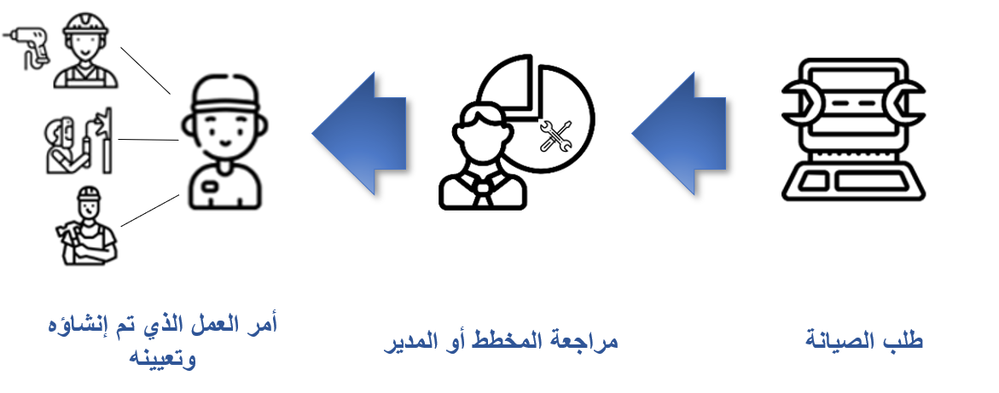
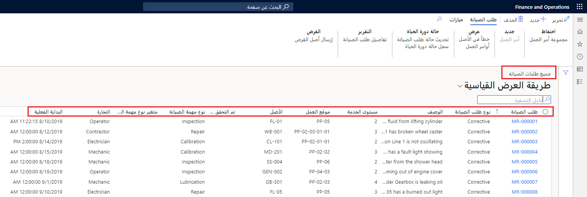

يتم إنشاء طلبات الصيانة في إدارة الأصول في Dynamics 365 Supply Chain Management لطلب أمر عمل لخدمة أو إصلاح أو فحص على أحد الأصول أو مواقع العمل. على سبيل المثال، قد تحتاج لإنشاء طلب صيانة لميكانيكي لخدمة سيارة أو لإجراء صيانة وقائية لسيارة.

## إنشاء طلبات صيانة

يمكن إنشاء طلبات الصيانة بواسطة المستخدمين الذين لديهم حق الوصول إلى الوحدة النمطية لإدارة الأصول كما هو محدد بواسطة مؤسستك. عند إرسال طلب، يمكن مراجعته بواسطة مخطط أو مدير يحدد ضرورة إنشاء أمر عمل أو رفضه أو اتخاذ إجراء آخر. إذا كان سيتم إنشاء أمر عمل، سينشئ المدير أو المخطط أمر عمل وتعيينه للأفراد المسؤولين عن إكمال العمل. 

تظهر الصورة التالية الخطوات عالية المستوي المتضمنة في عملية إنشاء طلب صيانة. 

 
ستوضح هذه الوحدة النمطية الخطوات اللازمة لإنشاء طلبات الصيانة. ستتضمن هذه الخطوات استخدام حالات دورات الحياة وإنشاء أنواع طلبات الصيانة وتأسيس عمال الصيانة المسؤولين لتعيين طلبات الصيانة.

## عرض طلبات الصيانة
يتم توضيح ملخص للنظرة العامة على جميع طلبات الصيانة في صفحه قائمة جميع طلبات الصيانة، بغض النظر عن حالة دورة الحياة (بمعني آخر، نشطة، منتهية، وما إلى ذلك).

تتضمن صفحة **جميع طلبات الصيانة** المعلومات التالية:

- **رقم طلب الصيانة** – الرقم الذي تم تعيينه إلى طلب الصيانة. يمكن استخدام هذا الرقم لتحديد الهوية والتعقب. 
- **نوع طلب الصيانة** – يحدد نوع الصيانة المطلوبة، مثل الإصلاح أو الصيانة الوقائية. 
- **الوصف** – شرح مختصر لطلب الصيانة، على سبيل المثال، "يلزم استبدال صمام الجهاز."
- **مستوي الخدمة (الأولوية)** – وفقا لاحتياجاتك، يمكنك تحديد الأولويات من منخفضة إلى عالية. في هذا الحقل، يمكنك تحديد أولوية الطلب. 
- **موقع العمل** – يحدد هذا الحقل موقع عمل الأصل الذي يحتاج إلى الصيانة. 
- **الأصل** – يحدد هذا الحقل معرف الأصل للصنف الذي يحتاج إلى الصيانة. 
- **نوع مهمة الصيانة** - يحدد هذا الحقل نوع المهمة. ستساعد هذه المواصفات عندما يتعلق الأمر بتعيين الطلب. على سبيل المثال، قد تكون لديك أنواع مهام "الفحص" أو "الإصلاح".
- **تاريخ البدء الفعلي** – يحدد تاريخ بدء الطلب. 

**إدارة الأصول > عام > طلبات الصيانة > جميع طلبات الصيانة**
 

يمكنك استخدام صفحة **قوائم طلبات الصيانة النشطة** لعرض الطلبات النشطة فقط في النظام الذي لم يتم إكماله. لعرض صفحة **قوائم طلبات الصيانة النشطة**، انتقل إلى **إدارة الأصول > عام > طلبات الصيانة > طلبات الصيانة النشطة**.

