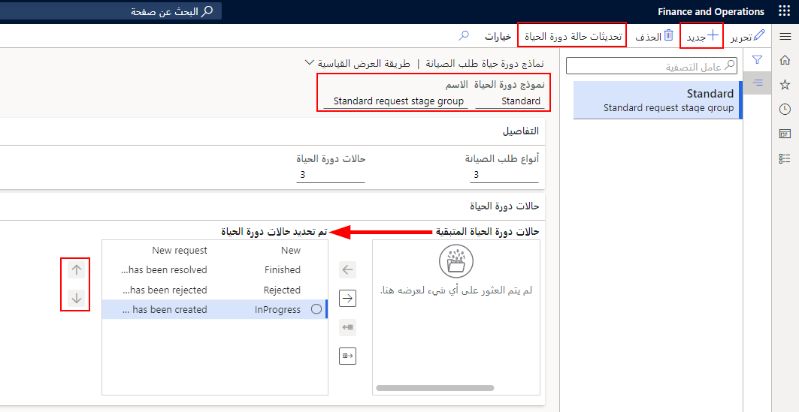
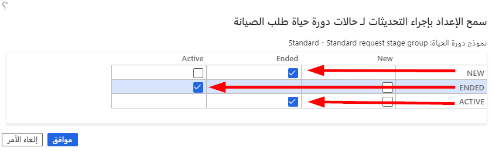

عندما تقوم بإنشاء حالات دورة حياة طلب الصيانة اللازمة، يمكنك تجميعها معاً لإنشاء نموذج دورة حياة طلب الصيانة. يحدد نموذج دورة الحياة العملية أو التدفق لطلب الصيانة. يمكنك إنشاء أكبر عدد من نماذج دورة الحياة المختلفة التي تحتاج إليها، على سبيل المثال، قد يكون لتدفق العطل/الإصلاح سير عمل مختلف عن طلب أمر التغيير. 

> [!Important]
> يتعين عليك إنشاء نموذج دورة حياة طلب صيانة واحد على الأقل لاستخدام طلبات الصيانة. 

لإنشاء نموذج دورة حياة طلب الصيانة، اتبع الخطوات التالية:

1.  انتقل إلى **إدارة الأصول > الإعداد > طلبات الصيانة > نماذج دورة الحياة**.
2.  حدد **جديد** لإنشاء نموذج جديد لدورة حياة طلب الصيانة.
3.  في الحقل **نموذج دورة الحياة**، أدخل معرفاً لنموذج دورة الحياة مثل **قياسي**.
4.  في الحقل **الاسم**، أدخل اسماً وصفياً مثل **نموذج طلب قياسي**. 
    
    في علامة التبويب السريعة **التفاصيل**، تعرض حالات دورة الحياة تلقائياً عدد حالات دورة الحياة المحددة في نموذج دورة الحياة هذا. 
    > [!NOTE]
    > عند تكوين نماذج دورة حياة طلب صيانة جديدة بشكل أولي، سيكون هذا الحقل فارغاً حتى يتم تحديد حالات دورة الحياة وحفظها في علامة التبويب السريعة حالات دورة الحياة. 
    
    يعرض الحقل **أنواع طلبات الصيانة** عدد أنواع طلبات الصيانة التي تستخدم نموذج دورة الحياة هذا.
    
    > [!NOTE]
    > عندما تقوم بتكوين نماذج دورة حياة طلب صيانة جديدة بشكل أولي، سيكون هذا الحقل فارغاً حتى يتم ربط نموذج دورة حياة طلب الصيانة هذا بأنواع طلبات الصيانة.
5.  **احفظ** السجل.
6.  ضمن علامة التبويب السريعة **حالات دورة الحياة**، تظهر حالات دورة الحياة النشطة في قسم **حالات دورة الحياة المتبقية** ناحية اليسار. هذه هي الحالات التي يمكن تضمينها في مجموعة نماذج دورة حياة طلب الصيانة الجديدة.
7.  لنقل حالة دورة حياة معيّنة إلى قسم **حالات دورة الحياة المحددة**، حدد الحالة المراد نقلها في قسم حالات دورة الحياة المتبقية، ثم حدد زر سهم إلى اليمين. 
8.  لتحديد جميع حالات دورة الحياة لتضمينها في النموذج، حدد زر سهم نقل الكل إلى اليمين لنقل التحديد بالكامل من قسم **حالات دورة الحياة المتبقية** إلى قسم **حالات دورة الحياة المحددة**.
9.  لإزالة حالة دورة حياة محددة من النموذج، حدد حالة دورة الحياة المراد إزالتها من القسم **حالات دورة الحياة المحددة**، ثم حدد زر السهم الأيسر لنقلها مرة أخرى إلى القسم **حالات دورة الحياة المتبقية**.
10. لإزالة التحديد بالكامل من النموذج، حدد زر سهم نقل الكل إلى اليسار. وبعد ذلك يتمّ إرجاع جميع حالات دورة الحياة في قسم **حالات دورة الحياة المحددة** إلى قسم **حالات دورة الحياة المتبقية**.
11. حدد **حفظ**.

    **إدارة الأصول > الإعداد > طلبات الصيانة > نماذج دورة الحياة**.

    
 
> [!NOTE]
> يمكنك تغيير ترتيب قسم **حالات دورة الحياة المحددة** من خلال تحديد الحالة واستخدام السهمين لأعلى ولأسفل على يمين القسم لنقل الحالة.

## تحديثات حالة دورة الحياة
عند إنشاء نموذج دورة حياة طلب الصيانة، يتعين عليك تحديد كيفية سير الحالات في النظام. يتم تحديد هذا التعريف من خلال سير إجراءات العمل بالشركة وتصميمها. يحدد هذا الإجراء خطوة بخطوة التحديثات المسموح بها لحالات دورة الحياة التي أنشأتها. 

1.  في الصفحة **نماذج دورة الحياة لطلب الصيانة**، حدد **تحديثات حالة دورة الحياة** في جزء الإجراء. 
2.  بجوار كل حالة دورة حياة، حدد الحالة التي يمكن تغيير الحالة إليها. 
    
 
    على سبيل المثال: 
    - يمكن تغيير **جديد** إلى **نشط**. 
    - يمكن تغيير **نشط** إلى **انتهى**. 
    - يمكن تغيير **منتهي** إلى **نشط**.

3.  حدد **موافق** لحفظ التحديثات.

شاهد الفيديو التالي لمعرفة المزيد حول إنشاء نماذج دورة حياة طلب الصيانة. 

 > [!VIDEO https://www.microsoft.com/videoplayer/embed/RE4oErv]