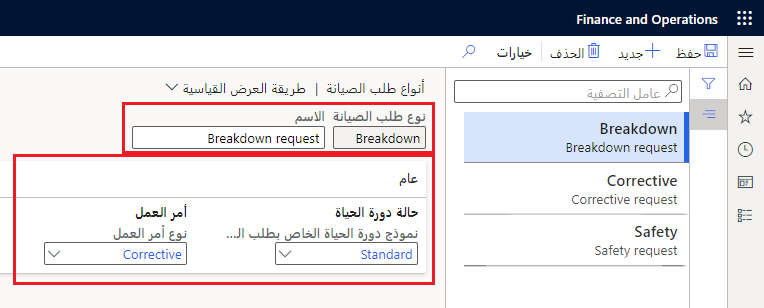

تساعد أنواع طلب الصيانة في تحديد طلبات الصيانة وتصنيفها وتصفيتها. يمكنك إعداد نوع طلب لتحديد طلب الصيانة الوقائية، مثل تغيير الحزام المجدول بانتظام مقابل طلب تصحيحي، مثل عطل أو إصلاح عطل. يمكن بعد ذلك إقران نوع طلب الصيانة بنموذج دورة حياة طلب الصيانة، والذي بدوره يحدد تدفق حالات دورة الحياة التي يمر بها الطلب. 

## مثال
قررت مزرعة مونسون للمخللات والمعلبات أنها بحاجة إلى إعداد أنواع الطلبات التالية لمؤسستها: التصنيف، والتفتيش، والصيانة الوقائية، والطلب المرفوض، والملاحظات. يبدأ هذا الإجراء بإنشاء نوع طلب "تصنيف".

1.  انتقل إلى  **إدارة الأصول > الإعداد > طلبات الصيانة > أنواع طلبات الصيانة**. 
2.  حدد **جديد** لإنشاء نوع طلب صيانة جديد.
3.  في الحقل **نوع طلب الصيانة** أدخل معرفاً لنوع طلب الصيانة. في هذا المثال، أدخل **تصنيف**. 
4.  في الحقل  **الاسم** ، أدخل اسماً وصفياً، مثل **طلب إصلاح الصيانة**. 
5.  في علامة التبويب السريعة **عام**، في القائمة المنسدلة **نموذج دورة حياة طلب الصيانة**، حدد نموذج دورة حياة طلب الصيانة. حدد **قيد التقدم**.
6.  في الحقل **نوع أمر العمل** حدد نوع أمر العمل. عند تحويل طلب صيانة إلى أمر عمل، يحصل أمر العمل تلقائياً على نوع أمر العمل المرتبط بنوع طلب الصيانة. 

    **إدارة الأصول > الإعداد > طلبات الصيانة > أنواع طلبات الصيانة**

    

> [!NOTE]
> لا يمكن تغيير نوع طلب الصيانة في حالة إنشاء الطلب.