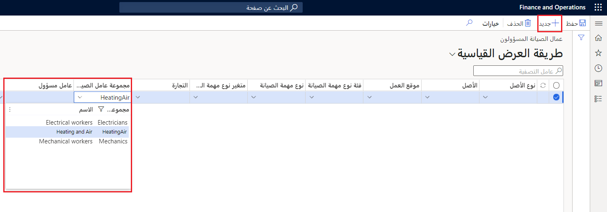

عمال الصيانة المسؤولين هم أشخاص يحظون بمهارات في صيانة الأصول داخل مؤسستك. يمكن تعيين طلبات الصيانة إلى عمال الصيانة حسب أنواع الأصول والأصول ومواقع العمل وفئات أنواع مهام الصيانة وأنواع مهام الصيانة ومتغيرات أنواع مهام الصيانة وأعمالها. كما يمكن تعيينها لأوامر العمل وطلبات الصيانة لتوضيح تفضيل الشخص المسؤول عن إكمال الأمر. 

وتُستخدم مسؤوليات عامل الصيانة لتوفير وتعيين العمال المسؤولين المرتبطين بالأصل والموقع و/ أو نوع الإصلاح حسب الحاجة. وكمثال، يلزم توفير كهربائي معين لإصلاح ‏‫الأسلاك الكهربائية‬ في أحد السيور الناقلة. 

يتم إعداد الكهربائيين في **مجموعة عمال الصيانة المسؤولين** الخاصة بـ "الكهربائيين" ويتم إعداد الكهربائي المحدد كـ **عامل مسؤول** يرتبط بـ **مجموعة عمال الصيانة المسؤولين** الخاصة بـ "الكهربائيين". لذلك، عند إنشاء طلب صيانة، يتم ملء العامل المسؤول تلقائياً في الصفحة **طلب الصيانة**.

> [!NOTE]
> وإذا لم يكن لديك أي تفضيلات، فيمكنك ترك حقل **عمال الصيانة المسؤولين** فارغاً. هذا الحقل اختياري

عند تعيين عامل لأمر العمل أو طلب صيانة، يمكنك إجراء تحديثات لعمال الصيانة المسؤولين في حالة حدوث تغيير في الطلب أو الجدول.

قبل أن تتمكن من إعداد عمال الصيانة المسؤولين، يجب إعداد مجموعات مختلفة من العمال وعمال الصيانة. تتم مراجعة هذه العملية بالتفصيل في وحدة [إعداد الأصول في إدارة الأصول من أجل Dynamics 365 Supply Chain Management](https://docs.microsoft.com/learn/modules/setup-assets-asset-management//?azure-portal=true). 

في إدارة الأصول، يمكنك أيضاً إعداد عمال الصيانة المفضلين الذين ترغب في تعيينهم لأوامر العمل أثناء جدولة أوامر العمل.

لا يتم استخدام الإعداد في الصفحة **عمال الصيانة المسؤولين** في أثناء جدولة أوامر العمل.

## مثال - إعداد عمال الصيانة المسؤولين
لقد اختارت مزرعة مونسون للمخللات والمعلبات استخدام هذه الوظيفة. تتعرف خلال الإجراء الآتي على خطوات إعداد ميزة "عمال الصيانة المسؤولين" في إدارة الأصول.

1.  انتقل إلى **إدارة الأصول > الإعداد > العاملون > عمال الصيانة المسؤولين**.
2.  حدد **جديد** لإنشاء سجل جديد. يظهر صف يمكنك من خلاله التحديد من القوائم المنسدلة المرغوبة.
3.  وفي هذه الصفحة، يمكنك تعيين عمال الصيانة المسؤولين عن طريق: 
    - نوع الأصل
    - الأصل
    - موقع العمل
    - فئة نوع مهمة الصيانة
    - نوع مهمة الصيانة
    - متغير نوع مهمة الصيانة
    - التجارة

    كمثال، يمكنك تعيين **عامل** (صيانة) **مسؤول** من أجل **نوع الأصل** مثل "رافعة شوكية" أو يمكنك تعيين **عامل مسؤول** إلى موقع عمل، مثل خط الإنتاج الذي يتم استخدامه لتصنيع سلطة السالسا. 

ونوصي بالبدء بإنشاء *عامل صيانة مسؤول* **افتراضي** أو إعداد **مجموعة عمال صيانة مسؤولين**. 

1. حدد **مجموعة عمال الصيانة المسؤولين** و/ أو **العامل المسؤول** من القائمة المنسدلة. 
    
    
2. اترك الحقول المتبقية فارغة. 
    سيتم استخدام هذا الإعداد في أثناء جدولة أمر العمل في حالة عدم وجود مجموعة أخرى غير محدده تتوافق مع محتويات أمر العمل.

    
عند إنشاء طلب صيانة، تحاول إدارة الأصول العثور على أفضل مطابقة ممكنة باستخدام المعيار الذي تم إنشاؤه عن طريق الخطوات الآتية:

1.  إنه يبدأ من الحقل **أعمال الصيانة**. وفي حالة عدم العثور على أي تطابق، ينتقل إلى الحقل التالي في الجانب الأيسر.
2.  وينتقل إلى الحقل **متغير نوع مهمة الصيانة**. وفي حالة عدم العثور على أي تطابق، ينتقل إلى الجانب الأيسر مرة أخرى.
3.  ينتقل النظام إلى الحقل **نوع مهمة الصيانة** ويستمر في العمل إلى اليسار حتى يصل إلى الحقل **نوع الأصل**. 

    إذا وصل إلى الحقل **نوع الأصل** ولم يتم العثور على أي مطابقة، فيتم استخدام السجل الافتراضي في هذه الحقول السبعة.

