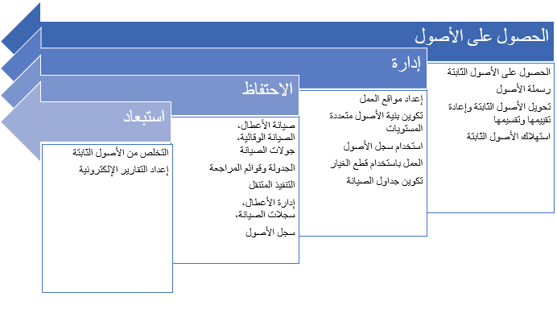

يتم تنفيذ أوامر العمل على الأصول. ويكون لكل أصل نوع أصل يحدد أنواع مهام الصيانة التي يمكن إجراؤها عليه. ويمكن أن يتضمن كل نوع من أنواع مهام الصيانة عناصر إضافية مرتبطة به، مثل:

- متغيرات نوع مهمة الصيانة
- العمليات التجارية المرتبطة بنوع مهمة الصيانة
- قوائم فحص الصيانة

بالإضافة إلى ذلك، يمكن أن تشتمل أنواع الأصول على مستويات خدمة وعمليات تطبيق مجدولة وإدارة الأخطاء المرتبطة بها. 

لبدء العمل مع الوظيفة، يجب عليك إعداد التطبيق. ترشدك هذه الوحدة خلال الإعداد والتكوين المطلوبين لبدء استخدام إدارة الأصول.

يوضح الرسم البياني التالي العمليات المتضمنة في إدارة الأصول؛ الحصول على الأصول وإدارة الأصول والحفاظ على الأصول واستبعاد الأصول.

> [!div class="mx-imgBorder"]
> 
 