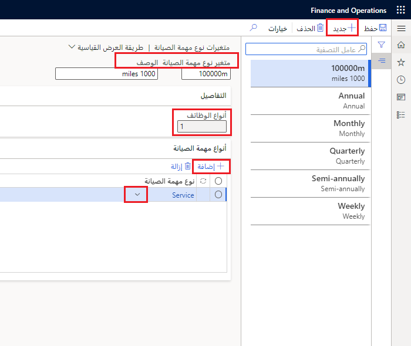

تحدد متغيرات نوع مهمة الصيانة التنويعات المرتبطة بنوع الوظيفة. يمكن أن تشمل هذه المتغيرات الأحجام (صغيرة أو متوسطة أو كبيرة)، والفترات (شهرية، وربع سنوية، وسنوية)، والمسافة المقطوعة (10000 ميل). عندما تقوم بإنشاء متغير نوع مهمة صيانة، يمكنك ربطها بأنواع مهام الصيانة. 

على سبيل المثال، إذا كان لديك نوع مهمة صيانة يسمى **الخدمة**، يمكنك إنشاء التباين التالي لنوع مهمة الصيانة هذه: **10000 ميل**. 

توضح الخطوات التالية كيفية إنشاء متغيرات أنواع المهام.

1.  انتقل إلى **إدارة الأصول > الإعداد > المهام > متغيرات أنواع مهام الصيانة**.
2.  حدد **جديد**.
3.  في حقل **متغير نوع مهمة الصيانة**، أدخل معرفاً لفئة نوع مهمة الصيانة. على سبيل المثال، يمكنك إدخال **سنوي** أو **10000 ميل**.
4.  في الحقل **الوصف**، أدخل وصفاً للمتغير.
ستعرض لك علامة التبويب السريعة **التفاصيل** عدد أنواع المهام التي تستخدم هذا المتغير لنوع مهمة الصيانة.
5.  انتقل إلى علامة التبويب السريعة **أنواع مهام الصيانة**.
6.  حدد **إضافة**.
7.  حدد نوع الوظيفة التي ترغب في إضافتها من القائمة المنسدلة **نوع مهمة الصيانة**، مثل **الخدمة** أو **الصيانة الوقائية**.
8.  استمر في إضافة العديد من أنواع مهام الصيانة الأخرى المرتبطة بهذا المتغير لنوع مهمة الصيانة.

> [!NOTE]
> تعد إضافة متغير نوع مهمة الصيانة إلى أمر العمل أمراً اختيارياً.

**إدارة الأصول > الإعداد > المهام > متغيرات أنواع مهام الصيانة**

