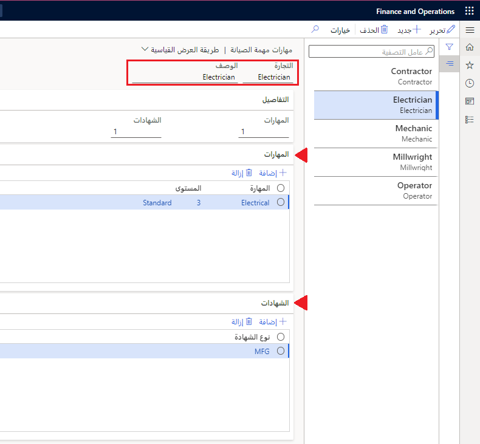

يمكنك إنشاء مهن مهام الصيانة، مثل المهن الميكانيكية أو الكهربائية، لتحديد المهنة المرتبطة بنوع مهمة الصيانة. يمكن أن تتضمن مهن مهام الصيانة أيضاً متطلبات الاختصاص.  

## إنشاء تجارة وظيفة صيانة
الآن بعد أن أنشأت بعض أنواع مهام الصيانة، يمكنك إقران مهن مهام الصيانة بها، مثل ميكانيكي أو كهربائي.

1.  انتقل إلى **إدارة الأصول > الإعداد > المهام > تجارة مهمة الصيانة**.
2.  حدد **جديد**.
3.  في حقل **المهنة**، أدخل عنواناً يساعد في تحديد مهنة مهمة الصيانة، مثل **كهربائي**.
4.  في حقل **الوصف**، أدخل وصف المهنة، على سبيل المثال، **كهربائي**.
تعرض لك علامة التبويب السريعة **التفاصيل** عدد **‎المهارات** و **الشهادات** التي تمت إضافتها إلى مهنة مهمة الصيانة هذه. نظراً لأن هذه مهنة مهمة صيانة جديدة، فلن ترى أية بيانات على علامة التبويب السريعة هذه حتى الآن.
5.  في علامة التبويب السريعة **المهارات**، حدد **إضافة**. حدد المهارات التي يجب أن تحتوي عليها مهنة مهمة الصيانة. يتم إنشاء المهارات وتحديثها في صفحة **المهارات**: **الموارد البشرية > الاختصاصات > إعداد > المهارات**. 
6.  في حقل **المهارة**، انتقل إلى القائمة المنسدلة لتحديد المهارة التي تريد إضافتها إلى مهنة مهمة الصيانة هذه. يمكنك أيضاً إدخال اسم المهارة يدوياً. إذا كانت المهارة موجودة، فسيتم ملؤها.
7.  في حقل **المستوى**، حدد مستوى المهارة من القائمة المنسدلة.
8.  استمر في إضافة العديد من المهارات الأخرى حسب الحاجة.
9.  في علامة التبويب السريعة **الشهادات**، حدد **إضافة** إذا كنت تريد إضافة شهادة إلى مهنة مهمة الصيانة. في حقل **نوع الشهادة**، حدد الشهادة من القائمة المنسدلة. تتم إضافة الشهادات في حقل **الموارد البشرية > الاختصاصات > إعداد > أنواع الشهادات > نوع الشهادة**.
10. استمر في إضافة العديد من الشهادات حسب الحاجة.
11. حدد **حفظ**.

**إدارة الأصول > إعداد > المهام > مهنة مهمة الصيانة**

