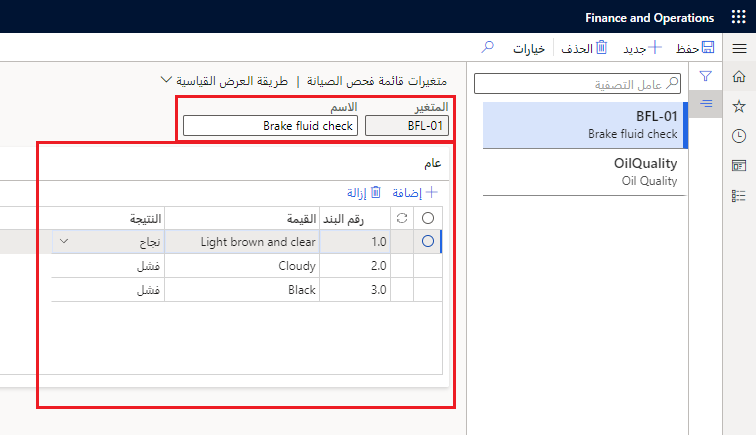

قبل أن تتمكن من إنشاء قائمة فحص الصيانة، يجب أن تحدد المتغيرات التي ستظهر في قائمة الفحص. يحتوي كل متغير على نطاق من النتائج ومجموعة من النتائج المحددة سابقاً.

**مثال**، يمكنك فحص سائل الفرامل من خلال تحديد ثلاث قيم: 
- بني فاتح وشفاف
- غائم
- أسود

لكل قيمة، تقوم بتحديد النتيجة (**النجاح** أو **الفشل** أو **لا شيء**).

## إنشاء متغير لقائمة فحص الصيانة
اتبع الخطوات الآتية لإنشاء متغيرات لقائمة الفحص الخاصة بك:

1.  انتقل إلى **إدارة الأصول > الإعداد > قوائم فحص الصيانة > متغيرات قائمة فحص الصيانة**.
2.  حدد **جديد‏‎**. 
3.  في الحقل **المتغير**، أدخِل عنواناً يحدد متغير قائمة فحص الصيانة، مثل **BF-01**.
4.  في الحقل **الاسم**، أدخِل اسماً وصفياً، على سبيل المثال، **فحص سائل الفرامل**.
5.  في علامة التبويب السريعة **عام**، حدد **إضافة**. تقوم إدارة الأصول بإدخال رقم سطر تسلسلي تلقائياً. 
6.  في الحقل **القيمة**، أدخِل وصفاً للقيمة التي تحاول تقييمها، على سبيل المثال: 
    - **بني فاتح وشفاف**
    - **غائم**            
    - **أسود**     
7.  في الحقل **النتيجة**، حدد النتيجة من القائمة المنسدلة.
8.  تابع إضافة متغيرات قائمة فحص الصيانة حسب الحاجة.
9.  حدد **حفظ**.

**إدارة الأصول > الإعداد > قوائم فحص الصيانة > متغيرات قائمة فحص الصيانة**.
 

