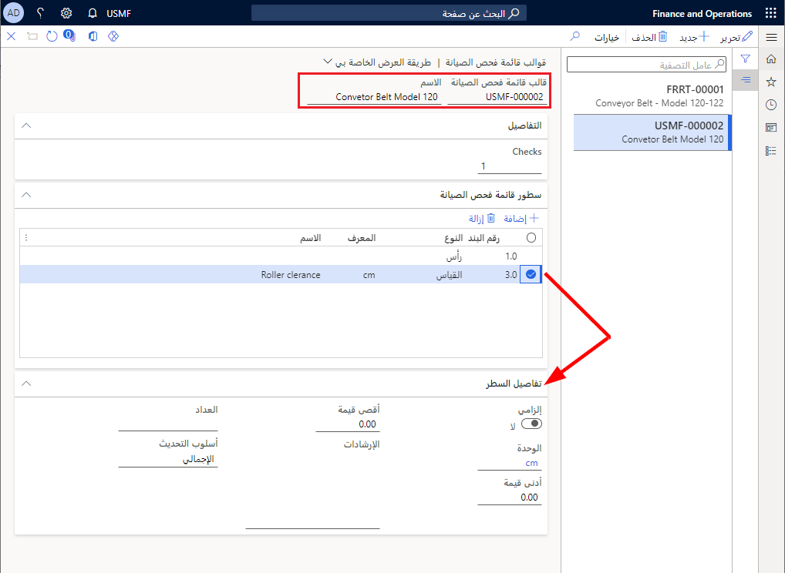

يمكنك إنشاء قالب قائمة فحص الصيانة مع مجموعة من المهام العامة التي يجب أن ينفذها العامل لإكمال أمر العمل بشكلٍ صحيح. قد تكون أمثلة قوالب قائمة فحص الصيانة قائمة بالأصناف والشروط التي يجب فحصها في أثناء فحص السير الناقل.

1.  انتقل إلى **إدارة الأصول > الإعداد > قوائم فحص الصيانة > قوالب قائمة فحص الصيانة**.
2.  حدد **جديد‎**. في الحقل **قالب قائمة فحص الصيانة**، تقوم إدارة الأصول تلقائياً بتعيين رقم القالب.
3.  في الحقل **الاسم**، أدخل اسماً وصفياً لقالب قائمة فحص الصيانة، مثل **السير الناقل - الطراز 120**. 
4.  حدد **حفظ**. في علامة التبويب السريعة **التفاصيل**، يقوم الحقل **عمليات الفحص** تلقائياً بملء العدد الإجمالي لبنود قائمة الفحص في القالب. إذا قمت بالرجوع إلى قالب آخر، فسيتضمن الإجمالي بنود قائمة الفحص من هذا القالب أيضاً.
5.  حدد **حفظ**، الذي سيؤدي إلى تمكين الأصناف الموجودة ضمن علامة التبويب السريعة **بنود قائمة فحص الصيانة**.
6.  في علامة التبويب السريعة **بنود قائمة فحص الصيانة**، حدد **إضافة**.   تقوم إدارة الأصول تلقائياً بإدخال رقم بند تسلسلي في الحقل **رقم البند**.
7.  في الحقل **النوع**، حدد نوع قائمة الفحص من القائمة المنسدلة. تتوفر القيم الآتية:
    - **النص** – يسمح لك بإدخال وصف نصي لما تود أن ينفذه العامل. تُستخدم هذه القيمة بصفة عامة في حالة عدم وجود نتيجة معينة أو قابلة للقياس.  
    - **الرأس** – يستخدم البند لتجميع قائمة فحص الصيانة. يكون "الرأس" مفيداً عندما يكون لديك العديد من بنود قائمة فحص الصيانة التي يمكن تقسيمها إلى نقاط معينه. توفر "الرؤوس" نظرة عامة حول العامل الذي سيقوم بإكمال قائمة فحص الصيانة التي تشمل العديد من بنود قائمة فحص الصيانة. 
    - **القالب** - استخدم هذه القيمة عندما تود الرجوع إلى نموذج آخر. 
    - **متغير** -يتم استخدام هذه القيمة لتحديد نتيجة محتمله. 
    - **القياس** – تستخدم هذه القيمة لتسجيل قياس مثل "سم".
9.  يتم استخدام حقل **المعرِّف** لتحديد معرِّف **النوع**. على سبيل المثال، بالنسبة إلى القياس، قد تستخدم **"سم"**. ووفقاً لنوع قائمة الفحص المحدد، تتغير الحقول الموجودة في علامة التبويب السريعة **تفاصيل البنود**.
10. في الحقل **الاسم**، أدخل اسماً وصفياً مثل **إزالة الأسطوانة**.
11. في علامة التبويب السريعة **تفاصيل البنود**، قم بتبديل زر التبديل إلى **نعم**، إذا كانت الخطوة إلزامية.

تعرض الصورة الآتية مثالاً على الصفحة **قوالب قائمة فحص الصيانة** في **إدارة الأصول > الإعداد > قوائم فحص الصيانة > قوالب قوائم فحص الصيانة**.

 

تجب مراعاة العوامل الآتية عند التعامل مع قالب قائمة فحص الصيانة:

- إذا لم تستخدم العداد كجزء من نوع **القياس**، فسيتم عرض القياس كتسجيل قياس مستقل دون متابعة تلقائية في إدارة الأصول. 
- إذا لم يكن نوع العداد المحدد مرتبطاً بالأصل في أمر العمل، فسيتم التعامل مع مهمة قائمة فحص الصيانة على أنها قياس مستقل. 
- يمكن تغيير قيمة العداد حتى يتم تغيير **حالة دورة حياة أمر العمل** إلى الحالة التي يتم خلالها تعيين الخيار **قائمة فحص الصيانة** إلى **نعم**.

شاهد الفيديو الآتي للاطلاع على عرض توضيحي حول كيفية إعداد قالب قائمة فحص الصيانة.

 > [!VIDEO https://www.microsoft.com/videoplayer/embed/RE4oHp0]

