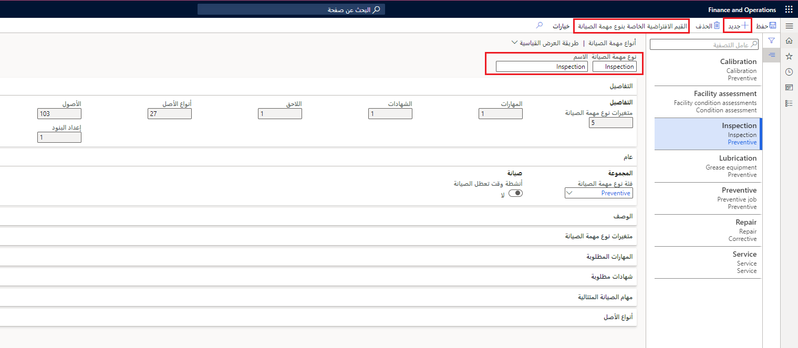

تستخدم أنواع مهام الصيانة لإنشاء أمر عمل. بعد إنشاء فئات نوع مهمة الصيانة والمتغيرات والعمليات التجارية، يمكنك إنشاء نوع مهمة صيانة.

## إنشاء نوع مهمة الصيانة

لإنشاء أنواع مهام الصيانة في إدارة الأصول، اتبع الخطوات الآتية:

1.  انتقل إلى **إدارة الأصول > الإعداد > المهام > أنواع مهام الصيانة**.
2.  حدد **جديد‎**.
3.  في حقل **نوع مهمة الصيانة**، أدخل عنواناً لتحديد نوع مهمة الصيانة مثل **فحص**
4.  في حقل **الاسم**، أدخل اسماً وصفياً لنوع مهمة الصيانة مثل **مهمة فحص**.
توفر علامة التبويب السريعة **تفاصيل** العدد التلقائي للحقول التي لها نوع الصيانة هذا. 
    > [!NOTE]
    > يتضمن هذا العدد عدد متغيرات نوع مهمة الصيانة والمهارات والشهادات والمهام التالية وأنواع الأصول والأصول التي تستخدم حالياً نوع مهمة الصيانة هذا وسطور الإعداد التي تعرض لك عدد السطور الافتراضية لنوع مهمة الصيانة المرتبطة بنوع مهمة الصيانة هذا. 
5.  في علامة التبويب السريعة **عام**، نفذ المهام الآتية:
    - في حقل **فئة نوع مهمة الصيانة**، حدد فئة نوع مهمة الصيانة من القائمة المنسدلة مثل **تقييم الحالة**.
    - في حقل **أنشطة وقت تعطل الصيانة**، قم بتبديل زر التبديل إلى **نعم** إذا كان نوع مهمة الصيانة يتطلب إيقاف الجهاز لأداء المهمة.
6.  في علامة التبويب السريعة **الوصف**، أدخل وصفاً يتيح للأشخاص معرفة المزيد حول نوع وظيفة الصيانة.
7.  في علامة التبويب السريعة **متغيرات نوع مهمة الصيانة**، حدد المتغيرات من القائمة المنسدلة **متغير نوع مهمة الصيانة**.
8.  في علامة التبويب السريعة **المهارات المطلوبة**، أضف المهارات المطلوبة للعمل على نوع مهمة الصيانة.
9.  في علامة التبويب السريعة **الشهادات المطلوبة**، أضف متطلبات الشهادات المطلوبة للعمل على نوع مهمة الصيانة.
10. في علامة التبويب السريعة **مهام الصيانة التالية**، حدد نوع مهمة الصيانة التي يجب إجراؤها فيما بعد. 
    - حدد المتغير والعمل التجاري لنوع مهمة الصيانة المرتبطيْن به. 
    - في حقل **تأخير حسب الأيام**، حدد عدد الأيام التي يجب أن تبدأ فيها المهمة التالية قبل أو بعد نوع مهمة الصيانة هذا. تمثل الأرقام الموجبة عدد الأيام التي تلي نوع مهمة الصيانة هذا والأرقام السالبة تمثل عدد الأيام التي تسبق نوع مهمة الصيانة هذا. 

    على سبيل المثال، إذا قمت بإدخال **5**، فستبدأ المهمة التالية بعد خمسة أيام من بداية المهمة المرتبطة بنوع مهمة الصيانة. إذا قمت بإدخال **-3**، فستبدأ المهمة التالية بعد ثلاثة أيام من البداية المجدولة للمهمة المرتبطة بنوع مهمة الصيانة. 

    > [!NOTE]
    > إذا قمت بإضافة أكثر من مهمة صيانة تالية، فإن تسلسل السطور يحدد الترتيب الذي سيتم تنفيذها به بداية من أول القائمة.
11. في علامة التبويب السريعة **أنواع الأصول**، حدد أنواع الأصول التي تريد ربطها بنوع مهمة الصيانة هذا.
12. حدد **حفظ**.

توضح الصورة الآتية مثالاً لصفحة **أنواع مهام الصيانة** في **إدارة الأصول > الإعداد المهام >**.

 
