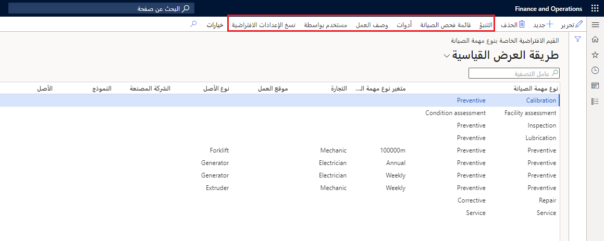
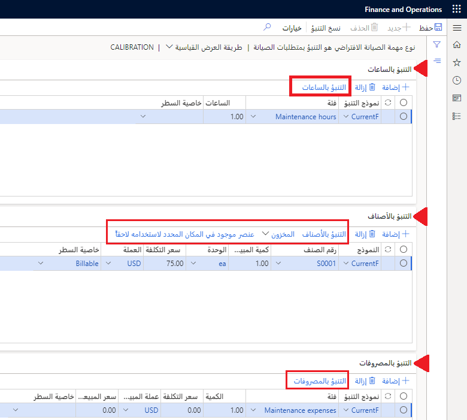
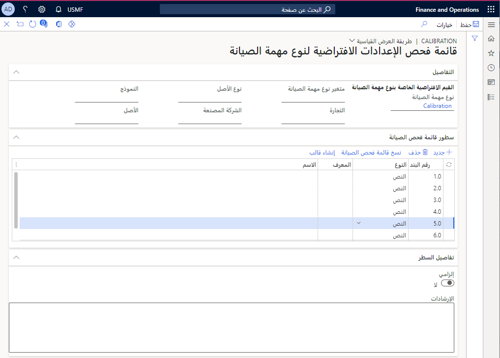
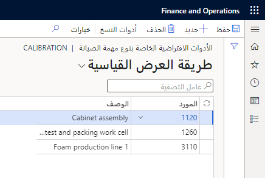
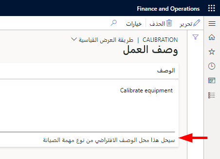

لقد تعلمت كيفية إنشاء فئات أنواع مهام الصيانة ومتغيرات أنواع مهام الصيانة والمهن المرتبطة بمهام الصيانة. وباستخدام هذه الميزات، يمكنك إنشاء الإعدادات الافتراضية لأنواع مهام الصيانة التي ستسمح لك بإنشاء أشكال متنوعة من أنواع مهام الصيانة هذه. 

## إنشاء إعداد افتراضي لنوع مهمة الصيانة
مهمتك الأولى هي إنشاء إعداد افتراضي لنوع مهمة الصيانة، حيث ستقوم بتحديد كافة الاختلافات بين أنواع مهام الصيانة المطلوبة لأصولك.

1.  لإنشاء إعداد افتراضي لنوع مهمة الصيانة، لديك خياران:
    - انتقل إلى **إدارة الأصول > الإعداد > المهام > الإعدادات الافتراضية لنوع مهمة الصيانة**.
    - انتقل إلى **إدارة الأصول > الإعداد > المهام > أنواع مهام الصيانة**.
2.  حدد نوع مهمة صيانة، ثم حدد **الإعدادات الافتراضية لنوع مهمة الصيانة**.
3.  حدد **جديد**.
4.  حدد **نوع مهمة الصيانة** من القائمة المنسدلة، على سبيل المثال، **وقائية**. 
5.  في علامة التبويب السريعة **التفاصيل** في القائمة المنسدلة **متغير نوع مهمة الصيانة**، حدد متغير نوع مهمة صيانة مثل ‏‫**ربع سنوي**‬.
6.  في حقل **المهنة**، حدد المهنة من القائمة المنسدلة، مثل **ميكانيكي**.
7.  تابع العمل مع حقول **موقع العمل** و **نوع الأصل** و **الشركة المصنعة** و **الطراز** و **الأصل** مُحدداً القيم المناسبة من القوائم المنسدلة. وكلما زاد عدد القيم التي قمت بتحديدها، زادت الإعدادات الافتراضية لنوع مهمة الصيانة.
يتم تحديث حقل **الساعات** تلقائياً استناداً إلى المعلومات التي توفرها عند إنشاء التنبؤ.
8.  حدد **حفظ**.

**إدارة الأصول > الإعداد > المهام > الإعدادات الافتراضية لنوع مهمة الصيانة**.
 

## التنبؤات
عندما تقوم بإنشاء إعداد افتراضي لنوع مهمة صيانة، يمكنك إنشاء تنبؤات للساعات والأصناف والمصروفات المرتبطة بنوع مهمة الصيانة.

1.  من قائمة **الإعدادات الافتراضية لنوع مهمة الصيانة**، حدد نوع مهمة صيانة لتمييزها.
2.  في جزء الإجراء، حدد **التنبؤ**.
3.  تظهر صفحة **التنبؤ بمتطلبات الصيانة الافتراضية لنوع مهمة الصيانة**، حيث يمكنك إنشاء تنبؤات استناداً إلى الساعات والأصناف والمصروفات. 
4.  في علامة التبويب السريعة **التنبؤ بالساعات**، حدد **إضافة**.
    - في حقل **التنبؤ بالطراز**، حدد النموذج المناسب من القائمة المنسدلة، مثل **CurrentF‎**.
    - في حقل **الفئة**، حدد حقل الفئة المناسب من القائمة المنسدلة، مثل **ساعات الصيانة**.
    - يمكن تحديث حقل **الساعات** ليعكس ساعات الصيانة المتوقعة، مثل **50.00**.
    - في حقل **خاصية البند**، حدد الصنف المناسب من القائمة المنسدلة (**قابل للفوترة** أو **غير قابل للفوترة**).
5.  في علامة التبويب السريعة **التنبؤ بالأصناف**، حدد **إضافة** لتحديث المعلمات الآتية:
    - **الطراز** - **CurrentF** 
    - **رقم الصنف** - **S0001** 
    - **كمية المبيعات** - **100.00**
    - **الواحدة** - **ea**
    - **سعر التكلفة** - **75.00**
    - **العملة** - **دولار أمريكي** 
    - حقول **خاصية البند** - **قابل للفوترة** عند إكمال المهمة، حدد مكان استخدام الصنف لمعرفة مكان استخدام الصنف فيما يتعلق بالأصول والإعدادات الافتراضية لنوع مهمة الصيانة والأجزاء الاحتياطية وأوامر العمل.
6.  علامة التبويب السريعة **التنبؤ بالمصروفات** هي المكان الذي يمكنك إضافة المعلومات المرتبطة بالمصروفات إليه. 
    - حدد **CurrentF‎** من القائمة المنسدلة **التنبؤ بالطراز**.
    - حدد **مصروفات الصيانة** من القائمة المنسدلة **الفئة**.
    - أدخل **125.00** باعتباره **مقدار** المصروفات.
    - أدخل **50.00** لتحديد **سعر التكلفة**.
    - حدد **دولار أمريكي** من القائمة المنسدلة **عملة المبيعات**.
    - حدد **قابل للفوترة** من القائمة المنسدلة **خاصية البند**.

7. تعرض لك علامة التبويب السريعة **إجماليات التنبؤ بمتطلبات الصيانة** نظرة عامة على إجماليات التنبؤات المتنوعة. تشتمل هذه الإجماليات على إجمالي عدد **مقدار الساعات** و **بند الساعات** و **بنود الأصناف** و **بنود المصروفات**. 
8. تعرض لك علامة التبويب السريعة **الإعدادات الافتراضية لنوع مهمة الصيانة** المعلومات المتعلقة بالحقول الآتية: **نوع الأصل** و **الشركة المصنعة** و **الطراز** و **الأصل** و **نوع مهمة الصيانة** و **ومتغير نوع مهنة الصيانة** و **المهنة**.
7.  حدد **حفظ**. يعد هذا مثالاً لما يمكن أن يبدو عليه إعداد آخر.

    **إدارة الأصول > الإعداد > المهام > الإعدادات الافتراضية لنوع مهمة الصيانة > التنبؤ > ‬‏‫التنبؤ بمتطلبات الصيانة الافتراضية لنوع مهمة الصيانة**

    
 

8.  أغلق صفحة **ا‬لتنبؤ بمتطلبات الصيانة الافتراضية لنوع مهمة الصيانة** للعودة إلى صفحة **الإعدادات الافتراضية لنوع مهمة الصيانة**.
9.  من صفحة **الإعدادات الافتراضية لنوع مهمة الصيانة**، حدد **قائمة فحص الصيانة**.
تعرض صفحة **قائمة فحص الإعدادات الافتراضية لنوع مهمة الصيانة** التفاصيل الآتية، عند إدخالها في النظام، ضمن علامة التبويب السريعة **التفاصيل**:
    - **نوع مهمة الصيانة**
    - **متغير نوع مهمة الصيانة**
    - **التجارة**
    - **نوع الأصل**
    - **الشركة المصنعة**
    - **النموذج**
    - **الأصل**
10. في علامة التبويب السريعة **بنود قائمة فحص الصيانة**، حدد **جديد** لإنشاء بند جديد لقائمة فحص الصيانة.
    - في حقل **رقم البند**، يتم إدخال رقم البند تلقائياً للإشارة إلى تسلسل بنود قائمة فحص الصيانة. 
    - في حقل **النوع**، حدد النوع من القائمة المنسدلة مثل **نص**.
    - في حقل **الاسم**، أدخل اسماً وصفياً لبند قائمة فحص الصيانة، على سبيل المثال **مولد تشحيم**.
11. عند التعامل مع التنبؤات المرتبطة بنوع مهمة الصيانة، تذكر الآتي: 

    - إذا لزم الأمر، يمكنك نسخ إعداد قائمة فحص الصيانة من نوع مهمة صيانة إلى آخر. 
        - حدد **نسخ قائمة فحص الصيانة** في علامة التبويب السريعة **بنود قائمة فحص الصيانة**. 
        - حدد نوع مهمة الصيانة لنسخ الإعداد.  
    
    - يمكن إنشاء قالب من قائمة فحص صيانة حالية ثم إعادة استخدام القالب في قوائم فحص صيانة متعددة. وسيكون القالب الجديد نسخة دقيقة من قائمة فحص الصيانة النشطة. 

        - حدد "إنشاء قالب" ثم أدخل اسماً للقالب. 
        - استبدل قائمة فحص الصيانة الحالية ببند واحد يشير إلى القالب الجديد بتعيين خيار **استبدال** إلى **نعم**. 
        - اعرض محتويات القالب في صفحة **تفاصيل قوالب قائمة فحص الصيانة**.
11. ضمن علامة التبويب السريعة **تفاصيل البند**، يمكنك جعل بنود قائمة الفحص إلزامية من خلال تغيير شريط التبديل" إلزامي" إلى "نعم". 
12. حدد **حفظ** لحفظ التغييرات.

    **إدارة الأصول > الإعداد > المهام > الإعدادات الافتراضية لنوع مهمة الصيانة > قائمة فحص الصيانة > قائمة فحص الإعدادات الافتراضية لنوع مهمة الصيانة**
 
    
13. ارجع إلى صفحة **الإعدادات الافتراضية لنوع مهمة الصيانة**.
14. حدد **الأدوات**.
15. في صفحة **الأدوات الافتراضية لنوع مهمة الصيانة**، أضف الأدوات (الموارد) التي ترغب في استخدامها إلى نوع مهمة الصيانة. 
16. حدد **جديد** ثم حدد الأداة في حقل **المَورد**.
    > [!NOTE]
    > إذا كنت ترغب في نسخ إعداد الأداة من نوع مهمة صيانة أخرى، انتقل إلى **نسخ الأدوات** وحدد نوع مهمة الصيانة لنسخ الإعداد منها.
16. حدد **حفظ** لحفظ التغييرات.
    **إدارة الأصول > الإعداد > المهام > الإعدادات الافتراضية لنوع مهمة الصيانة**
    
17. ارجع إلى صفحة **الإعدادات الافتراضية لنوع مهمة الصيانة**.
18. حدد **وصف العمل**.
19. في صفحة **وصف العمل**، حدد **تحرير** ثم أضف وصفاً مرتبطاً بإعداد افتراضي محدد لنوع مهمة الصيانة المحدد، حسب الحاجة.
20. حدد **حفظ** لحفظ الوصف.
    > [!NOTE]
    > إذا قمت بإضافة وصف في صفحة **وصف العمل**، فإنه يُلغي أي وصف تم إعداده لنوع مهمة الصيانة في صفحة **أنواع مهام الصيانة**. إذا لم تقم بإضافة وصف عمل، فسيتم استخدام أي وصف تم إعداده لنوع مهمة الصيانة. يتم تحويل الأوصاف تلقائياً إلى أوامر العمل التي تستخدم نوع مهمة الصيانة أو الإعداد الافتراضي لنوع مهمة الصيانة.

    **إدارة الأصول > الإعداد > المهام > الإعدادات الافتراضية لنوع مهمة الصيانة**.
    
    

21. ارجع إلى صفحة **الإعدادات الافتراضية لنوع مهمة الصيانة**.
22. لنسخ إعداد افتراضي لنوع مهمة صيانة إلى نوع مهمة صيانة آخر، حدد بند الإعداد الافتراضي لنوع مهمة الصيانة لنسخ إعداد آخر إليه، وحدد **نسخ إعداد** ثم حدد الإعداد الافتراضي لنوع مهمة الصيانة لنسخه.
23. لعرض قائمة الأصول أو خطط الصيانة أو دورات الصيانة التي تستخدم حالياً بند الإعداد الافتراضي لنوع مهمة الصيانة، حدد البند ثم حدد **مستخدم بواسطة**.

عندما يقوم النظام بتحديد الإعداد الافتراضي المتوفر لنوع مهمة الصيانة الذي ينبغي استخدامه في بند أمر العمل، يستند التحديد إلى الأصل وإعداد نوع الأصل ذي الصلة. 

- تعمل إدارة الأصول على مراجعة جميع سجلات الإعدادات الافتراضية لنوع مهمة الصيانة المرتبطة بنوع مهمة الصيانة ونوع الأصل المرتبط للتحقق من وجود تطابق محتمل. 
- تقوم إدارة الأصول دائماً بفحص المجموعة الأكثر تحديداً.
- للعثور على المجموعة الأكثر تحديداً، تقوم إدارة الأصول أولاً بالتحقق من وجود تطابق محتمل لحقل "المهنة". 
- في حالة عدم العثور على أي تطابق، يقوم النظام بالتحقق من وجود تطابق لحقل متغير نوع مهمة الصيانة. 
- في حالة عدم العثور على أي تطابق، يقوم النظام بالتحقق من تطابق لحقل نوع مهمة الصيانة وما إلى ذلك (المهنة، ثم متغير نوع مهمة الصيانة، ثم نوع مهمة الصيانة، ثم الأصل، ثم الطراز، ثم الشركة المصنعة، ثم نوع الأصل). 
- في حالة عدم العثور على أي تطابق، تستخدم إدارة الأصول سجل الإعدادات الافتراضية حيث يتم تحديد نوع مهمة الصيانة فقط.

يتم ربط **معرف نشاط المشروع** تلقائياً بكل بند إعداد افتراضي لنوع مهمة صيانة الذي تقوم بإنشائه. يتم إنشاء نشاط المشروع في مشروع التنبؤ الذي تم تحديده في حقل **مشروع التنبؤ بالصيانة** في علامة التبويب **الأصول** في صفحة **معلمات إدارة الأصول**. 

الغرض من نشاط المشروع هو إدارة التنبؤات في الساعات والأصناف والمصروفات المرتبطة بأوامر العمل. يتم نقل تنبؤات أنواع مهام الصيانة تلقائياً إلى بند أمر العمل، ويتم نسخها من مشروع التنبؤ إلى مشروع أمر العمل الذي تم إنشاؤه لبند أمر العمل. 

يمكنك إعداد مهمة الدفعة لتحديث مراجع الإعدادات الافتراضية لنوع مهمة الصيانة في فواصل زمنية منتظمة أو يمكنك إجراء المهمة يدوياً. لإنشاء مهمة الدفعة أو إجراء تحديث يدوي، حدد **إدارة الأصول > دورية > الصيانة الوقائية > تحديث مراجع الإعدادات الافتراضية لنوع مهمة الصيانة**.

