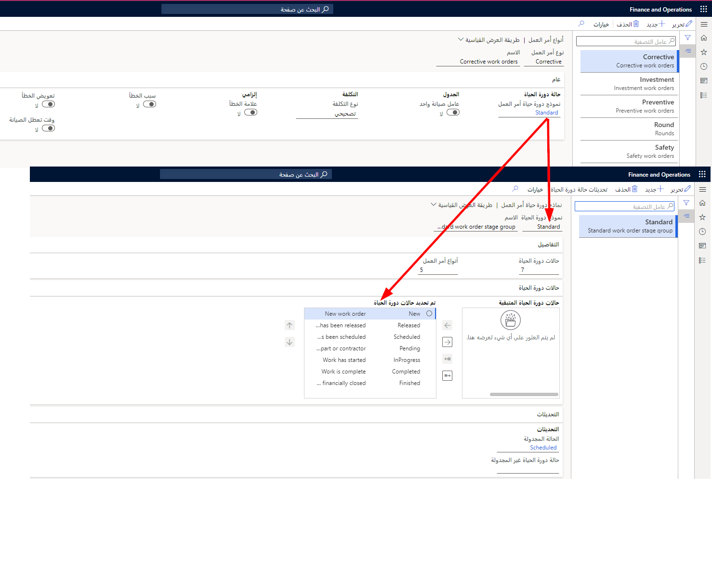

تشير نماذج دورة الحياة إلى مهام سير العمل، ويتم تحديد حالات دورة الحياة في نموذج دورة الحياة بترتيب تسلسلي. يتم إعداد نماذج الحياة في أنواع أوامر العمل، والتي تحدد حجم أو حدود مهام سير العمل وعمليات العمل. 

علي سبيل المثال، فان **الصيانة**، والتي هي عبارة عن نوع أمر عمل قياسي، قد ترتبط بنموذج دورة حياة أمر عمل يحتوي على العديد من حالات دورة الحياة. وعلي النقيض، قد يكون لديك نوع أمر عمل **تصحيحي** يتم استخدامه لأوامر العمل التي لم تتم جدولتها أو لأوامر العمل حيث تكتمل الوظيفة قبل إجراء أمر العمل بسبب الموقف العاجل. قد يرتبط نوع أمر العمل هذا بنموذج دوره حياه أمر عمل يحتوي على حالات دورة حياة قليله فقط. 

والسبب في استخدام الأنواع هو أنه عندما يتم تحديد نوع ما، على سبيل المثال، في أمر عمل أو أصل، يتم تحديد عمليات العمل المرتبطة (حالات دوره الحياة) تلقائياً.

تنطبق حالات الحياة ونماذج دورة الحياة والأنواع على المواقع الوظيفية والأصول وطلبات الصيانة وأوامر العمل. يبين الرسم التوضيحي التالي العلاقة بين أنواع أوامر العمل ونماذج دورة الحياة وحالات دورة الحياة.

 

