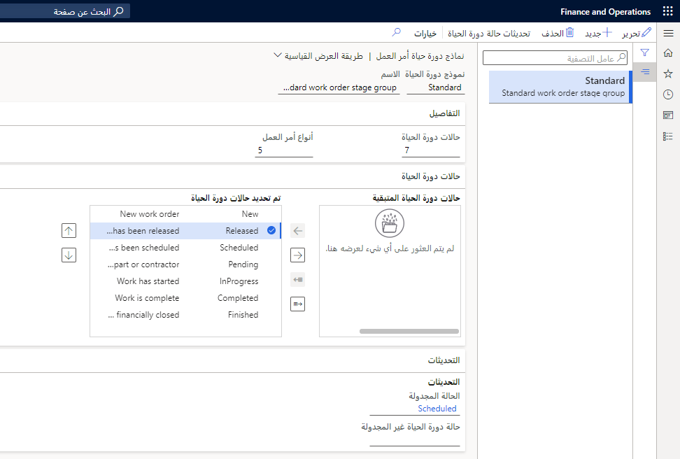

بعد إنشاء حالات دورة حياة أمر العمل المطلوبة لأوامر العمل الخاصة بك، يمكن تقسيمها إلى نماذج دوره الحياة لأمر العمل. كحد أدنى، يجب إنشاء نموذج دورة حياة قياسي واحد.

1.  حدد **‎إدارة الأصول > الإعداد > أوامر العمل > نماذج دورة الحياة**.
2.  حدد **جديد** لإنشاء نموذج دورة حياة أمر العمل.
3.  في حقل **نموذج دورة الحياة**، أدخل معرفاً لنموذج دورة الحياة.
4.  أدخل اسماً في حقل **الاسم**.
في علامة التبويب السريعة **التفاصيل**، تعرض **حالات دورة الحياة** عدد حالات دورة الحياة المحددة في نموذج دورة الحياة هذا. يعرض الحقل **أنواع أوامر العمل** عدد أنواع أوامر العمل التي تستخدم نموذج دورة الحياة هذا.
5.  في علامة التبويب السريعة **حالات دورة الحياة**، حدد حالات دورة الحياة التي يجب تضمينها في نموذج دورة الحياة:
    - لتضمين حالة دورة الحياة في نموذج دورة الحياة، قم بتحديدها في القسم **المتبقي من حالات دورة الحياة**، ثم حدد زر السهم الأيمن لنقلها إلى القسم **حالات دورة الحياة المحددة**.
    - لتضمين كافة حالات الحياة المتاحة في نموذج دورة الحياة، حدد زر **تحديد كل المراحل المتاحة**. يتم نقل كافة حالات الدورات الحياة إلى القسم **حالات دورة الحياة المحددة**.
    - لإزالة حالة دورة الحياة في نموذج دورة الحياة، قم بتحديدها في القسم **حالات دورة الحياة المحددة**، ثم حدد زر السهم الأيمن لنقلها إلى القسم **المتبقي من دورات الحياة**.
6.  حدد **تحديثات حالة دورة الحياة** لتحديد حالات دورة الحياة التي يمكن أن تتبع حالة دورة الحياة المحددة.
7.  في علامة التبويب السريعة **التحديثات**، في الحقل **الحالة المجدولة**، حدد حالة دورة الحياة التي يجب تحديدها دائماً لأمر العمل الذي قمت بإكمال جدولة أمر العمل له، بغض النظر عن حالة دورة الحياة السابقة لأمر العمل.
8.  في الحقل **حالة دورة الحياة** غير المجدولة، حدد حالة دورة الحياة التي يجب تحديدها دائما لأمر العمل إذا تم حذف جدولة أمر العمل.
9.  **احفظ** نموذج دورة حياة أمر العمل.

**‎إدارة الأصول > الإعداد > أوامر العمل > نماذج دورة الحياة**.

