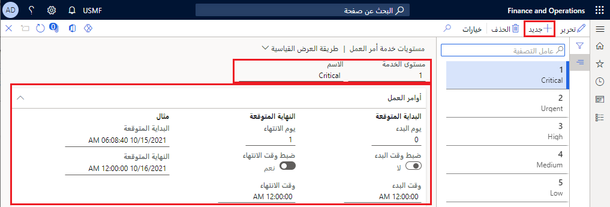
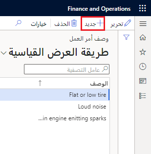
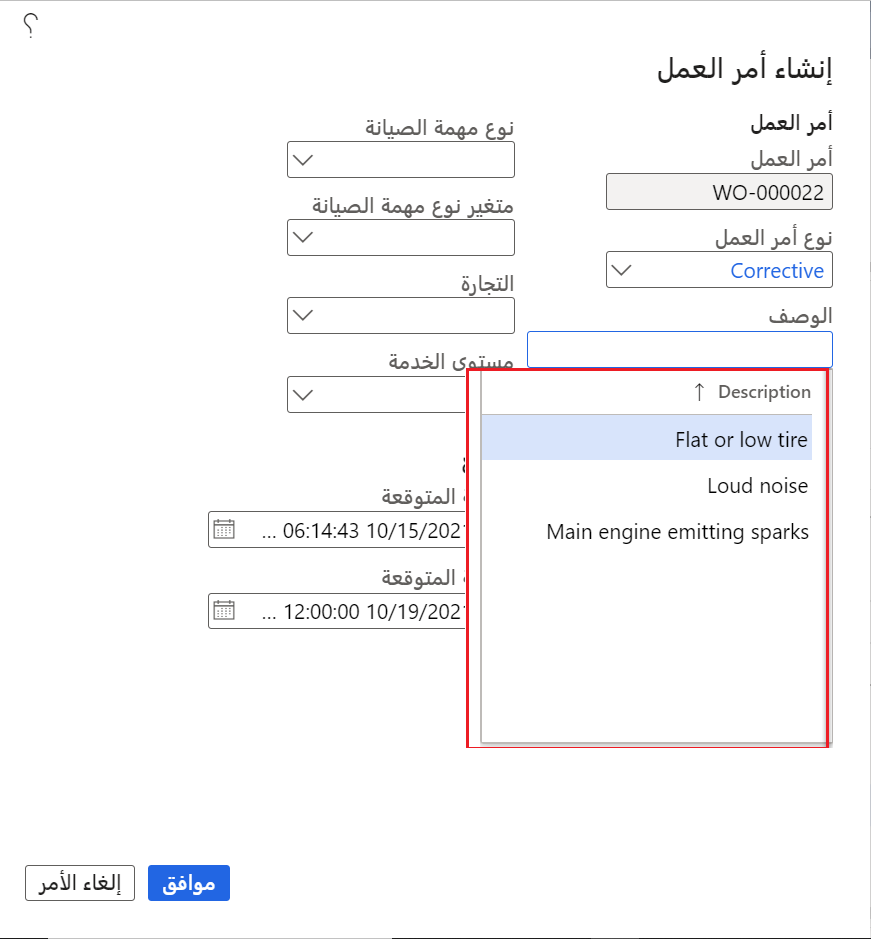

يمكن تعيين مستويات الخدمة لأوامر العمل، والتي تحدد أولوية أمر العمل. 

## إنشاء مستوى خدمة
توضح الخطوات التالية كيفية إنشاء مستويات الخدمة:

1.  انتقل إلى **إدارة الأصول > الإعداد > أوامر العمل > مستوى الخدمة**.
2.  حدد **جديد‏‎**.
3.  في الحقل **مستوى الخدمة**، أدخل قيمة لمستوى الخدمة (عادة تكون رقماً).
4.  في حقل **الاسم**، أدخل اسماً وصفياً.
5.  في علامة التبويب السريعة **أوامر العمل**، قم بتحديد الوقت الذي يجب أن يتم فيه بدء أوامر العمل وإنهاؤها. ويتم استخدام هذه المعلومات لأوامر العمل التي يتم إنشاؤها يدويا أو التي يتم إنشاؤها بناء على طلب الصيانة.
6.  في الحقل **يوم البدء**، أدخل عدد الأيام التي يجب أن يبدأ فيها أمر العمل عند إنشاء أمر العمل. على سبيل المثال، إذا كان يجب بدء أمر العمل على الفور، أدخل **0**. على سبيل المثال، إذا كان يجب بدء أمر العمل في اليوم التالي، أدخل **1**.
7.  قم بتعيين الخيار **تعيين وقت البدء** إلى **نعم** إذا أردت تعيين الوقت الذي يجب أن يبدأ فيه العمل؛ وإلا فاترك مجموعة الخيارات بالقيمة **لا**.
8.  في الحقل **يوم الانتهاء**، أدخل عدد الأيام التي يجب أن يستغرقها إكمال العمل. على سبيل المثال، إذا كان العمل يجب أن ينتهي بعد ثلاثة أيام من تاريخ البدء، أدخل **3**.
9.  قم بتعيين الخيار **تعيين وقت الانتهاء** إلى **نعم** إذا أردت تعيين الوقت الذي يجب أن ينتهي فيه العمل؛ وإلا فاترك مجموعة الخيارات بالقيمة **لا**.
10. حدد **حفظ**.

    **إدارة الأصول > الإعداد > أوامر العمل > مستوى الخدمة**.

    

## إنشاء وصف
إضافة أوصاف قياسية لأمر العمل يمكن أن تكون مفيدة، خاصة إذا كان لديك عدة أنواع مختلفة من أوامر العمل. 

1.  انتقل إلى **إدارة الأصول > الإعداد > أوامر العمل > الأوصاف**.
2.  حدد **جديد‎**.
3.  أدخل وصفاً مختصراً في حقل **الوصف**.
4.  حدد **حفظ**.

    

بعد إنشاء أوصاف أمر العمل، ستشاهد الخيارات المتاحة للتحديد في الصفحة **إنشاء أمر عمل**.

**إدارة الأصول > إدارة أمر العمل > إنشاء أمر العمل**

 

## التنفيذ المجدول
يمكن ربط مستويات الخدمة لأوامر العمل بتنفيذ مجدول. عند إعداد تنفيذ مجدول، سيتم توفير المتطلبات المفصلة للوقت الذي ينبغي فيه إكمال أمر العمل. وتتيح هذه الطريقة مزيداً من المرونة في تخطيط العمل لعمال الصيانة. 

على سبيل المثال، قام عامل صيانة بإكمال وظيفة أسرع من المتوقع. نظرا لأن العامل لا يزال في منشأة الإنتاج، يمكنك تعيينها لوظيفة أخرى تم تخطيطها في وقت لاحق في الأسبوع، التالي تحسين كل من تخطيط العامل واكتمال المهمة.

التنفيذ المجدول مرتبط بأوامر العمل؛ ويمكن أن تكون هذه الأكواد عامة أو معينه كما تريد.

1.  انتقل إلى **إدارة الأصول > الإعداد > أوامر العمل > التنفيذ المجدول**.
2.  حدد **جديد‎**.
3.  في حقول **موقع العمل** و **نوع أمر العمل** و **نوع الأصل** و **الشركة المصنعة** و **النموذج** و **فئة نوع مهمة الصيانة** و **نوع مهمة الصيانة** و **متغير نوع مهمة الصيانة** و **التجارة**، حدد القيم كما تتطلب.
4.  في الحقل **مستوى الخدمة**، حدد مستوى خدمة أمر العمل من القائمة المنسدلة. في حاله ترك المساحة فارغة، يقوم هذا الحقل بإنشاء أكثر الأنواع العامة لبند التنفيذ المجدول والذي يسمح بجدولة كافة أوامر العمل التي ليس لها مستوى خدمة طلب عمل لكي تتم جدولتها لتاريخ ووقت محددين.
5.  في الحقل **التنفيذ المجدول**، حدد الفاصل الزمني من القائمة المنسدلة.
6.  حدد **حفظ**.