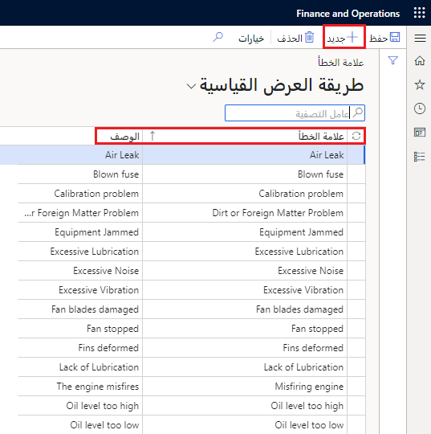
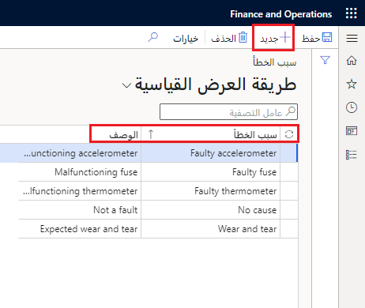
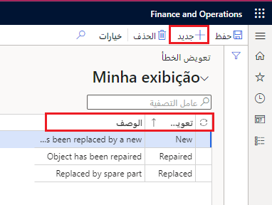

في إدارة الأصول، يمكنك استخدام مصمم الخطأ لإنشاء أعراض الأخطاء ومناطق الأخطاء وأنواع الأخطاء لإدارة الأخطاء المختلفة التي يمكن ان تحدث في أنواع الأصول. بالإضافة إلى الكشف عن الأخطاء، يمكنك أيضاً تحديد الأسباب الخاطئة وعرض اقتراحات لإصلاحها في أمر العمل.  

لتحديد أسباب الخطأ وتقديم اقتراحات لحلها، اتبع الخطوات التالية:

1.  إنشاء قائمة بأعراض الأخطاء ومناطق الأخطاء وأنواع الأخطاء التي يمكن أن تحدث في أنواع الأصول.
2.  إعداد الأعراض، ومناطق الخطأ، وأنواع الأخطاء في مصمم الخطأ.

تسرد المقاطع التالية أمثلة لأعراض الأخطاء ومناطق الخطأ وأنواع الأخطاء.

**أعراض الخطأ:**

- قيم الجهد الكهربي غير المتوازنة
- الدائرة الكهربائية الصغيرة
- الضوضاء
- تسرب
- الاهتزازات

**مناطق الخطأ:**

- كهربائي
- ميكانيكي
- هايدروليكي
- هوائي

**أنواع الخطأ:**

- لفائف الجزء الثابت الرئيسي المعطلة
- الصمام الثنائي المعطل
- لفائف غير نظيفة
- مولد معيب
- أداة الاستشعار المعيبة

## إنشاء عرض الخطأ
لإنشاء عرض خطأ، اتبع الخطوات التالية:

1.  انتقل إلى **إدارة الأصول > الإعداد > الخطأ > أعراض الأخطاء**.
2.  حدد **جديد**.
3.  في الحقل **عرض الخطأ**، أدخل اسماً. 
4.  في الحقل **الوصف**، أدخل وصفاً حول الخطأ.
5.  حدد **حفظ**.

     

## إنشاء منطقة خطأ
اتبع الخطوات التالية لإنشاء منطقة خطأ لتحديد المكان الذي يوجد فيه الخطأ:

1.  انتقل إلى **إدارة الأصول > الإعداد > الخطأ > مناطق الأخطاء**.
2.  حدد **جديد**.
3.  في الحقل **منطقة الخطأ**، أدخل اسماً.
4.  في الحقل **الوصف**، أدخل وصفاً لمنطقة الخطأ.
5.  حدد **حفظ**.

## إنشاء نوع خطأ
اتبع الخطوات التالية لإنشاء نوع الخطأ لتحديد خطورة الخطأ:

1.  انتقل إلى **إدارة الأصول > الإعداد > الخطأ > أنواع الأخطاء**.
2.  حدد **جديد**.
3.  في منطقة **نوع الخطأ**، أدخل اسماً.
4.  في الحقل **الوصف**، أدخل وصفاً لنوع الخطأ.
5.  حدد **حفظ**.

## اعداد مصمم الأخطاء
اتبع الخطوات التالية لإضافة أعراض الأخطاء ومناطق الخطأ وأنواع الأخطاء إلى نوع الأصل:

1.  انتقل إلى **إدارة الأصول > الإعداد > الخطأ > مصمم الخطأ**.
2.  في الجزء الأيمن، حدد نوع الأصل الذي ترغب في إنشاء سجل الخطأ له.
3.  في علامة التبويب السريعة **عرض الخطأ**، حدد **إضافة بند**.
4.  في الحقل **أعراض الأخطاء**، حدد عرض خطأ من القائمة المنسدلة.
5.  في علامة التبويب السريعة **منطقة الخطأ**، حدد **إضافة بند**.
6.  في الحقل **منطقة الخطأ**، حدد منطقة خطأ من القائمة المنسدلة.
7.  في علامة التبويب السريعة **نوع الخطأ**، حدد **إضافة بند**.
8.  في الحقل **نوع الخطأ**، حدد نوع خطأ من القائمة المنسدلة.
9.  في القائمة العلوية، حدد **إنشاء مجموعات الأخطاء** إذا كنت ترغب في إنشاء مجموعات من كافة أعراض الخطأ والمناطق والأنواع الموجودة لنوع الأصل المحدد. يفيد هذا الأسلوب في حالة وجود أعراض ومناطق وأنواع متعددة للخطأ لأنه من الأسرع حذف البنود غير الضرورية من إضافة البنود الضرورية يدوياً.
    > [!NOTE]
    > في القائمة العلوية، تتيح لك علامة التبويب **النسخ من نوع الأصل** نسخ إعداد أعراض الأخطاء والمناطق والأنواع من نوع أصل إلى نوع أصل آخر.
10. حدد **حفظ** لحفظ التغييرات.

## إنشاء سبب خطأ
اتبع الخطوات التالية لإنشاء سبب خطأ حتى تتمكن من فهم طريقة أداء الأصل بشكل أفضل. 

1.  انتقل إلى **إدارة الأصول > الإعداد > الخطأ > أسباب الأخطاء**.
2.  حدد **جديد‎**.
3.  في منطقة **سبب الخطأ**، أدخل اسماً.
4.  في الحقل **الوصف**، أدخل وصفاً يحدد سبب الخطأ.
5.  حدد **حفظ**.

     
 
## إنشاء حلول الخطأ
اتبع الخطوات التالية لإنشاء قائمة بالحلول التي يمكن إضافتها إلى أمر العمل أو طلب الصيانة.

1.  انتقل إلى **إدارة الأصول > الإعداد > الخطأ > حلول الأخطاء**.
2.  حدد **جديد‎**.
3.  في الحقل **حل الخطأ**، أدخل اسم حل الخطأ.
4.  في الحقل **الوصف**، أدخل وصفاً يحدد طريقة الحل.
5.  حدد **حفظ**.

     
 

> [!NOTE]
> عند الحاجة، يمكنك تغيير أسماء أعراض الخطأ والمناطق والأنواع والأسباب والعلاجات الخاصة بك. عند إجراء التغيير، يتم تحديث الاسم الجديد تلقائياً في أي تسجيلات خاطئة. 

