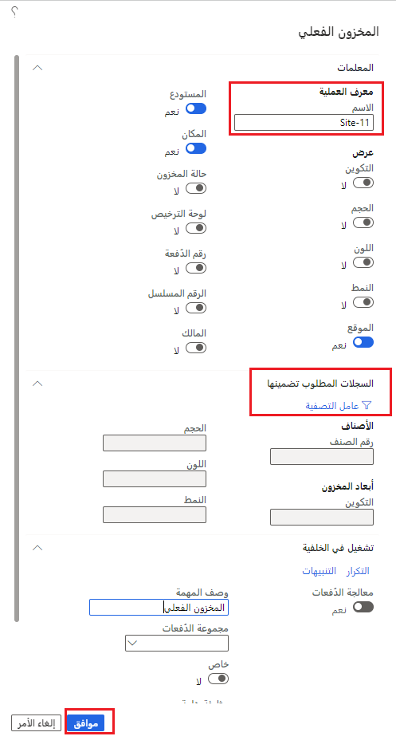
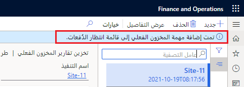

يُعد خيار إنشاء تقرير المخزون المتاح مفيداً في الحالات التي تحتوي فيها المخرجات على عدد كبير من بنود المخزون. 

على سبيل المثال، قد يؤدي طلب المخزون المتاح حسب الصنف والموقع والمستودع في سيناريو يتضمن 50,000 صنف و300 متجر إلى الحصول على تقرير طويل، مما يجعل مراجعة البيانات صعبة. تؤدي القدرة على فرز النتائج وتصفيتها في التطبيق أو تصدير النتائج إلى نظام خارجي إلى جعل التنقل في تقرير المخزون المتاح أسرع وأسهل.

## تعريف معلمات التقرير
عندما تنشئ تقريراً باستخدام ميزة تخزين تقارير المخزون المتاح، ستتم مطالبتك بتحديد اسم فريد للتقرير، ثم يتم تخزين التقرير الذي أنشأته بهذا الاسم. يمكنك أيضاً تعريف الحقول التي ترغب في عرضها في التقرير.

لإنشاء تقرير حول تخزين تقارير المخزون المتاح، نفّذ الخطوات التالية.

1.  في **إدارة المخزون > الاستعلامات والتقارير > التقارير المتاحة > تخزين تقارير المخزون المتاح**، حدد **جديد**.
2.  على علامة التبويب السريعة **المعلمات**، في قسم **معرف العملية**، أدخل اسماً فريداً للتقرير في حقل **الاسم**.
3.  في القسم **عرض**، بدّل جميع الحقول التي تريد عرضها على التقرير إلى **نعم**.
4.  على علامة التبويب السريعة **السجلات المطلوب تضمينها**، يمكنك إضافة المزيد من معايير البحث عن طريق تحديد أيقونة **عامل التصفية**.
5.  حدد **موافق**.

    
 
6.  تظهر رسالة تشير إلى إضافة التقرير إلى قائمة انتظار الدُفعات، مما يعني أن التقرير يعمل في الخلفية.
 
    

7.  عند انتهاء الوظيفة الدفعية، سترى التقرير في صفحة **تخزين تقارير المخزون المتاح**، مع خيار تحديد **عرض تفاصيل التقرير**.

تساعد ميزة تخزين تقارير المخزون المتاح على إزالة الحاجة إلى تشغيل تقارير متعددة للمخزون المتاح للفترة نفسها. يتم تخزين التقارير حول تخزين تقارير المخزون المتاح في كيان بيانات جديد، مما يسمح لك بتصدير مخرجات أي تقرير مخزون متاح معين مسمى إلى أي تنسيق تدعمه إدارة البيانات.

