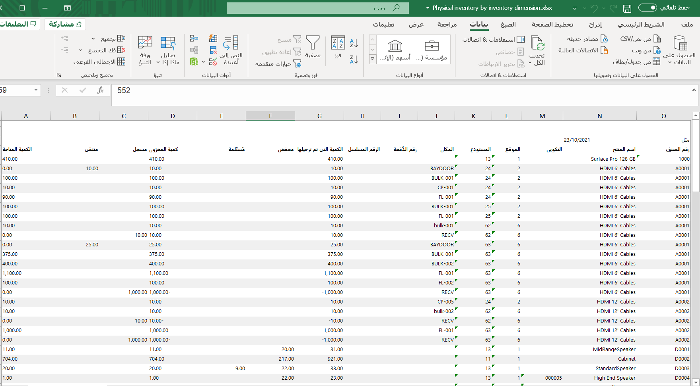

ستقوم في هذا التمرين بتصدير تقرير، وتصفيته للتحقق من صحة المعلومات مقابل الوثائق الداعمة. ستستخدم تقرير **الجرد المادي حسب أبعاد المخزون** لهذا المثال.

1.  انتقل إلى **إدارة المخزون > الاستعلامات والتقارير > تقارير المخزون الفعلي > المخزون الفعلي حسب بُعد المخزون**.
2.  في حقل **كما في**، أدخل تاريخ اليوم.
3.  حدد **نعم** في حقل **التكوين**.
4.  حدد **نعم** في حقل **الموقع**.
5.  حدد **نعم** في حقل **المستودع**.
6.  حدد **نعم** في حقل **الموقع**.
7.  حدد **نعم** في حقل **الرقم التسلسلي**.
8.  حدد **نعم** في حقل **رقم الدُفعة**.
9.  حدد **موافق**. ستتم معالجة تقريرك.
10. حدد القائمة المنسدلة **تصدير**. 
12. حدد **Excel**.
13. افتح ملف Excel. من هنا، يمكنك تصفية البيانات حسب الأعمدة والصفوف والمزيد.
     

14. احفظ حسب الحاجة.
16. أغلق الصفحة.

 

