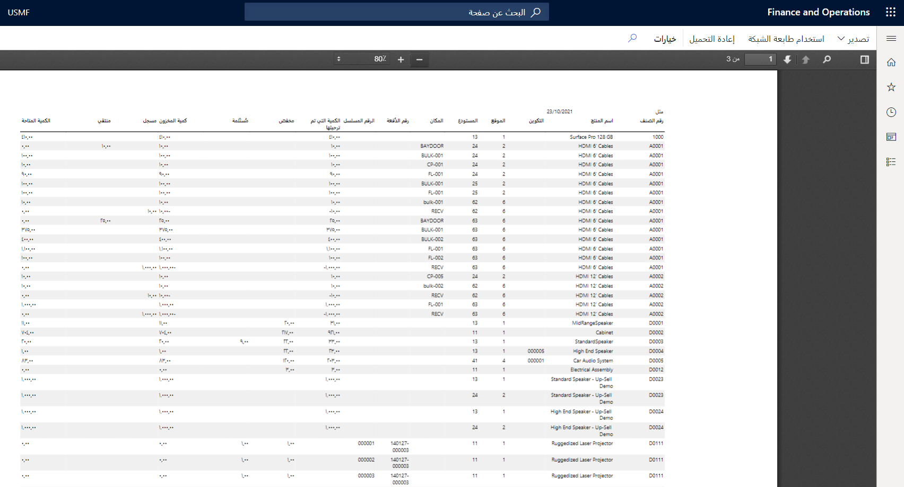

في هذا التمرين، ستقوم بتشغيل تقرير **الجرد المادي حسب أبعاد المخزون**.

1.  انتقل إلى **إدارة المخزون > الاستعلامات والتقارير > تقارير المخزون الفعلي > المخزون الفعلي حسب بُعد المخزون**.
2.  في حقل **كما في**، أدخل تاريخ اليوم.
3.  حدد **نعم** في حقل **التكوين**.
4.  حدد **نعم** في حقل **الموقع**.
5.  حدد **نعم** في حقل **المستودع**.
6.  حدد **نعم** في حقل **الموقع**.
7.  حدد **نعم** في حقل **الرقم التسلسلي**.
8.  حدد **نعم** في حقل **رقم الدُفعة**.
9.  حدد **موافق**. يجب أن يبدو التقرير الخاص بك مثل الصورة التالية.

    
 
11. أغلق الصفحة.

