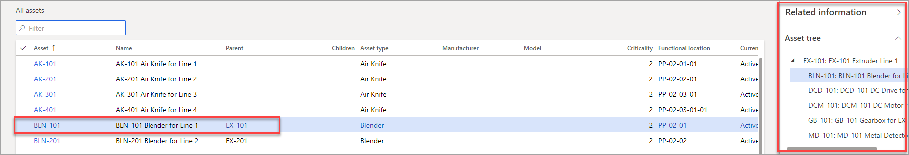

تسمح لك الأصول متعددة المستويات بإنشاء الأصول والأصول الفرعية ذات الصلة في بنية شجرة هرمية تعرض العلاقات والتبعيات بين الأصول. بالإضافة إلى ذلك، يمكن أن ترتبط مهام الصيانة بجميع مستويات بنية الشجرة، ويمكن إنشاء الإحصائيات لمستوى فردي أو كمجموعة لجميع مستويات الأصول الفرعية.

لعرض بنية أصل، انتقل إلى **إدارة الأصول > عام > الأصول > كافة الأصول**. حدد أحد الأصول، وافتح جزء **المعلومات ذات الصلة**، حيث يمكنك عرض كافة الأصول والأصول الفرعية ذات الصلة في القسم شجرة الأصول.

تعد لقطة الشاشة التالية مثالاً على أصل متعدد المستويات.

