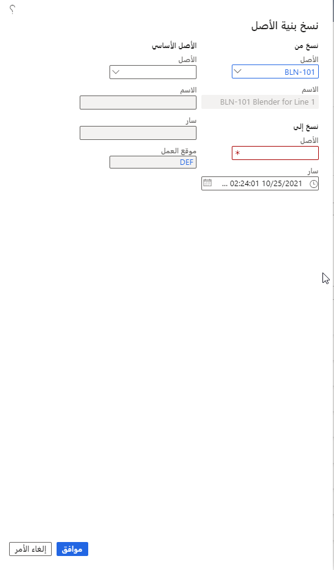

إذا كان لدى شركتك بالفعل هياكل أصول متنوعة تم إنشاؤها، فيمكنك استخدام وظيفة النسخ في "إدارة الأصول" لإنشاء أصل أو هيكل أصل مشابه بشكل سريع.

1.  انتقل إلى **إدارة الأصول > شائعة > الأصول > جميع الأصول** وحدد الأصل الذي تريد نسخه.
2.  حدد الأصل الأساسي إذا كنت تريد نسخ هيكل الأصل بالكامل، بما في ذلك جميع الأصول الفرعية.
3.  بعد تحديد الأصل، من القائمة **الأصل**، انتقل إلى القسم **جديد**، ثم حدد **نسخ الأصل**. وسوف يظهر مربع الحوار **نسخ هيكل الأصل**.
يظهر الأصل الذي قمت بتحديده تلقائياً في القسم **نسخ من**. 
4.  في القسم **نسخ إلى**، أدخِل اسم الأصل الجديد للأصل المنسوخ في الحقل **الأصل**.
5.  يتم تعيين الحقل **"ساري المفعول"** على تاريخ اليوم تلقائياً. ومع ذلك، يمكنك تحديد تاريخ جديد باستخدام أيقونة "التقويم".
6.  إذا كان يجب أن يكون الأصل الذي تقوم بإنشائه جزءاً من هيكل أصل موجود، فانتقل إلى القسم **الأصل الأساسي** وحدد المعرّف الأساسي في الحقل **الأصل**.
بعد تحديد أصل أساسي، ستظهر المعلومات المرتبطة بالأصل الأساسي تلقائياً في الحقول **الاسم** و **ساري المفعول** و **موقع العمل**.
7.  حدد **موافق**. 

تمثل الصورة الآتية مثالاً على مربع الحوار **نسخ هيكل الأصل**.

 
سيظهر الآن هيكل الأصل الجديد في صفحة القائمة **جميع الأصول"**. يتم تحويل جميع سمات الأصول وخطط الصيانة ودورات الصيانة المرتبطة بالأصل المنسوخ إلى الأصل أو هيكل الأصل الجديد.

عندما تقوم بنسخ هيكل أصل، تكون الأصول الفرعية الموجودة في الهيكل الجديد بالاسم نفسه للأصول الفرعية التي قمت بنسخها. 

لتغيير الاسم والإعدادات الأخرى لأحد الأصول الفرعية:

1.  حدد الأصل في صفحة القائمة **جميع الأصول**. 
2.  حدد الزر **تعديل**.

> [!NOTE]
> عندما تقوم بنسخ أصل أو هيكل أصل، تتم إعادة تعيين حالة دورة الحياة الخاصة بالأصول الجديدة إلى الحالة التي قمت بتحديدها كحالة دورة الحياة الأولية للأصول. تتم إعادة تعيين موقع العمل إلى موقع العمل الافتراضي.

## حذف الأصل أو هيكل الأصل
لحذف أصل أو هيكل أصل، اتبع هذه الخطوات:

1.  في صفحة القائمة **جميع الأصول**، حدد الأصل الذي تريد حذفه. 
2.  حدد **حذف**.

يمكنك حذف أحد الأصول فقط إذا لم تكن الأصول الفرعية المرتبطة لها أي طلبات صيانة أو وظائف أوامر عمل أو تسجيلات أخطاء أو تقييمات حالة تم تسجيلها على أي منها.

> [!NOTE]
> وهناك طريقة أخرى لحذف أحد الأصول تتمثل في إعداد حالة دورة حياة الأصل لهذا الغرض. لإكمال هذه المهمة، قم بإعداد حالة دورة الحياة **تم تخريدها** أو **تم حذفها** في الصفحة **حالات دورة حياة الأصول** وإضافتها إلى نموذج دورة حياة الأصل.

