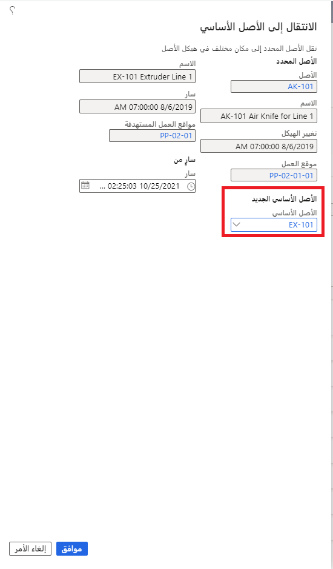
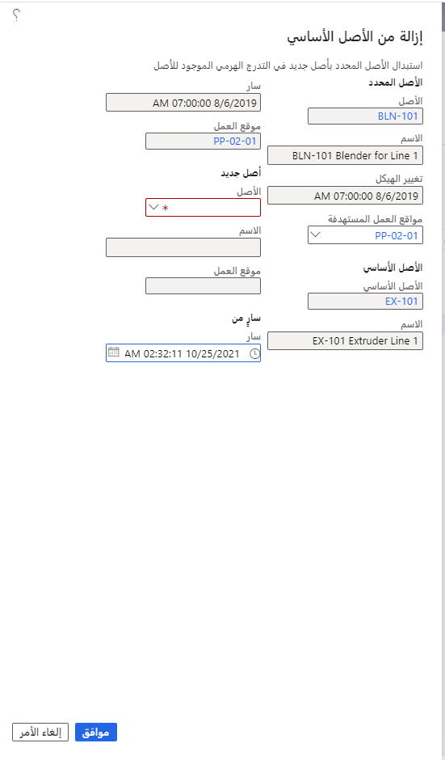

يمكنك إنشاء أصول فردية ليس لها علاقات بأصول أخرى أو يمكنك إنشاء أصل متعدد المستويات يتضمن أصلاً أساسياً (أصل المستوى الأعلى) والأصول الفرعية ذات الصلة (الأصول الفرعية). والآن بعد أن عرفت كيفية إنشاء الأصول، يشرح هذا الموضوع كيفية نقلها وإزالتها وتثبيتها في "إدارة الأصول". 

- **نقل إلى الأصل الأساسي** - ينقل أحد الأصول إما إلى هيكل أصل آخر أو إلى موقع آخر في هيكل الأصل نفسه.
- **إزالة من الأصل الأساسي** – تزيل الأصل من هيكل الأصل الأساسي.
- **تثبيت الأصل في الموقع** – يثبت الأصل الأساسي وأي أصول فرعية مرتبطة في موقع العمل.

> [!NOTE]
> قد يكون الأصل الذي تقوم بنقله أو استبداله أو تثبيته مرتبطاً بموقع عمل آخر. وفي هذه الحالة، قد يستخدم الأصل الأبعاد المالية لموقع العمل. في الصفحة **أنواع مواقع العمل**، يمكنك إعداد معالجة الأبعاد المالية في مواقع العمل.

## نقل إلى الأصل الأساسي
استخدم الوظيفة **نقل إلى الأصل الأساسي** لنقل الأصل إلى بنية الأصل الأساسي. 

1.  انتقل إلى **إدارة الأصول > شائعة > الأصول > جميع الأصول** أو **الأصول النشطة** وحدد الأصل الذي تريد نقله. وإذا كان للأصل أصولاً فرعية مرتبطة به، فستقوم أيضاً بنقل تلك الأصول.
2.  حدد **نقل إلى الأصل الأساسي**. يظهر مربع الحوار **الانتقال إلى الأصل الأساسي**. ولأنك قمت بالفعل بتحديد الأصل الذي ترغب في نقله، يتم تلقائياً ملء الحقول **الأصل** و **الاسم** و **تغيير الهيكل** و **موقع العمل** بمعلومات ذلك الأصل.
3.  حدد **الأصل الأساسي الجديد** من القائمة المنسدلة. يتم تلقائياً ملء الحقول **الاسم** و **سارٍ** و **موقع العمل المستهدف** بالمعلومات المرتبطة بالأصل الأساسي. وإذا لزم الأمر، يمكنك تحديد موقع عمل آخر للهدف.
4.  افتراضيا، يتم تعيين الحقل **سارٍ** على التاريخ والوقت الحاليين. ومع ذلك، يمكنك تغيير التاريخ ليعكس بشكل دقيق وقت نقل الأصل أو تحديثه.
5.  حدد **موافق**.

تمثل الصورة الآتية مثالاً على مربع الحوار **نقل إلى الأصل الأساسي**.

## إزالة من الأصل الأساسي
تُستخدم الوظيفة **إزالة من الأصل الأساسي** لاستبدال الأصول الفرعية في هيكل الأصل الموجود. ويتم إجراء هذه العملية بالارتباط مع الإصلاحات أو عمليات التجديد أو الاستبدال الدائم لأصل مستهلك بأصل جديد. 

> [!NOTE]
> بالنسبة إلى الأصول الأساسية أو الأصول التي لا تحتوي حالياً على أصل أساسي معين، يتم إجراء عمليات الاستبدال على موقع العمل. للحصول على المزيد من المعلومات حول كيفية استبدال الأصول الأساسية على موقع العمل، راجع  [نقل الأصول واستبدالها وتثبيتها](https://docs.microsoft.com/dynamics365/supply-chain/asset-management/objects/move-replace-and-install-objects/?azure-portal=true).

لاستخدام الوظيفة **إزالة من الأصل الأساسي**، اتبع الخطوات الآتية.

1.  انتقل إلى **إدارة الأصول > شائعة > الأصول > جميع الأصول** أو **الأصول النشطة** وحدد الأصل الذي تريد إزالته. وإذا كان لهذا الأصل أصولاً فرعية، فستقوم أيضاً بإزالة تلك الأصول.

2.  حدد **إزالة من الأصل الأساسي** لفتح مربع الحوار. ولأنك حددت الأصل الفرعي بالفعل، تظهر تلقائياً المعلومات المرتبطة بالأصل في الحقول **الأصل** و **الاسم** و **تغيير الهيكل** و **موقع العمل المستهدف** و **الأصل الأساسي** و **الاسم** و **سارٍ** و **موقع العمل**. ويمكنك تحديد **موقع عمل مستهدف** آخر من القائمة المنسدلة. 

    يعرض الحقل **سارٍ** آخر تاريخ ووقت تم فيهما تثبيت الأصل الأساسي والأصول الفرعية المرتبطة أو نقلها في موقع العمل الحالي.

3.  في القسم **الأصل الجديد**، حدد الأصل الذي ترغب في نقل الأصل الحالي إليه من القائمة المنسدلة في الحقل **الأصل**. سيظهر **الاسم** و **موقع العمل** لذلك الأصل تلقائياً.
4.  وبشكل افتراضي، يظهر التاريخ والوقت الحاليين تلقائياً في القسم **سارٍ**. ومع ذلك، يمكنك تحديد التاريخ والوقت بالضبط عندما يحدث استبدال الأصل.
5.  حدد **موافق**.

**‎إدارة الأصول > عام > الأصول > كل الأصول** 
 

## تثبيت الأصل في الموقع
يتم استخدام الوظيفة **تثبيت الأصل في الموقع** لتثبيت هيكل الأصل على موقع العمل.

> [!NOTE]
> وتنطبق هذه الوظيفة فقط على الأصول الأساسية أو الأصول التي لا تحتوي حالياً على أصل أساسي معين؛ وسيتم نقل الأصل الأساسي والأصول الفرعية المرتبطة إلى موقع العمل المحدد.

لاستخدام الوظيفة **تثبيت الأصل في الموقع**، اتبع الخطوات الآتية.

1.  حدد **إدارة الأصول > شائعة > الأصول > جميع الأصول** أو **الأصول النشطة**، وحدد الأصل الذي تريد تثبيته في موقع العمل.
2.  حدد **تثبيت الأصل في الموقع**. يظهر مربع الحوار **تثبيت في الموقع**.
3.  ولأنك حددت أحد الأصول بالفعل، فإن المعلومات المرتبطة بهذا الأصل تظهر تلقائياً في الحقول **الأصل** و **موقع العمل** و **التثبيت/النقل الأخير**.
4.  في الحقل **موقع العمل**، حدد الموقع الجديد.
5.  وبشكل افتراضي، يظهر التاريخ والوقت الحاليين تلقائياً في القسم **سارٍ**. ومع ذلك، يمكنك تحديد تاريخ ووقت مختلفين يكون التثبيت في هيكل الأصل صالحاً منهما.
6.  يعرض القسم **السمات** سمات الأصول التي يتم إعدادها في الأصل الأساسي.
7.  حدد **موافق**.
