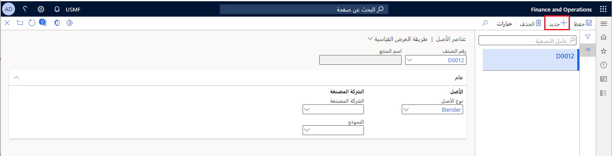
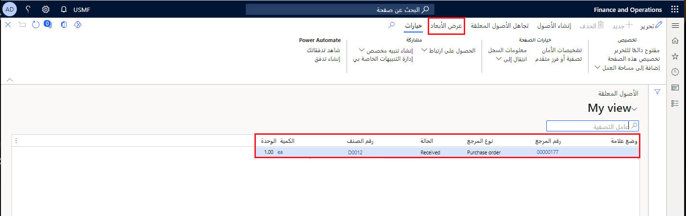

هذه الوحدة توضح كيفية إنشاء أصول استناداً إلى أوامر الشراء. ومع ذلك، لإكمال هذه العملية، تحتاج أولاً إلى قائمة بأصناف الأصول التي يمكن استخدامها كأساس لإنشاء أصول لمهام الصيانة في إدارة الأصول. 

تتيح لك أصناف الأصول إمكانية عرض قائمة بكافة بنود أمر الشراء التي تم إنشاؤها في هذه الأصناف. والغرض من هذه الوظيفة هو مساعدتك على إنشاء أصل في إدارة الأصول استناداً إلى أمر شراء.

المهمة الأولي هي إعداد الأصناف التي سيتم استخدامها لإنشاء أصول من أمر شراء في **أصناف الأصول**. بعد إنشاء بند أمر شراء، ستقوم بعد ذلك بإنشاء الأصول في "الأصول قيد الانتظار". ومن الممكن تحديد مرحلة أمر الشراء التي يجب فيها إنشاء الأصل.

> [!NOTE]
> يجب إعداد كافة المنتجات في وحدة إدارة معلومات المنتجات في Supply Chain Management، قبل أن تتمكن من إنشاء هذه الأصناف.

## إنشاء أصناف الأصول
اتبع الخطوات الآتية لإنشاء أصناف الأصول:

1.  انتقل إلى **إدارة الأصول > الإعداد > الأصول > الأصناف** ثم حدد **جديد**.
2.  في حقل **رقم الصنف**، حدد رقم الصنف من القائمة المنسدلة. 
3.  في علامة التبويب السريعة **عام** في حقل **نوع الأصل**، حدد نوع الأصل من القائمة المنسدلة.
4.  وإذا لزم الأمر، يمكنك تحديد **الشركة المصنعة** و **والطراز** للصنف.
5.  حدد **حفظ**. وبعد حفظ صنف الأصل، يظهر اسم المنتج تلقائياً.

الصورة الآتية مثال لصفحة **أصناف الأصول** في **إدارة الأصول > الإعداد > الأصول > الأصناف**.

 

شاهد الفيديو الآتي لمعرفة كيفية إنشاء الأصول استناداً إلى أوامر الشراء.

 > [!VIDEO https://www.microsoft.com/videoplayer/embed/RE4oXeq]

## إنشاء أصول من أصول قيد الانتظار
لإنشاء أصول من أصول قيد الانتظار، اتبع الخطوات الآتية:

1.  انتقل إلى **إدارة الأصول > عام > الأصول > أصول قيد الانتظار**، حيث ستشاهد قائمة بكافة أوامر الشراء التي تستند إلى الأصناف المحددة في **أصناف الأصول**.

    

2.  إذا كنت ترغب في معرفة المزيد عن صنف أصل محدد، فحدد الرقم المرجعي في بند أمر الشراء، حيث ستشاهد علامات التبويب السريعة **نظرة عامة** و **الأصل** و **أبعاد المخزون**.
3.  يمكنك تعديل البُعد الذي يجب عرضه في علامة التبويب السريعة **أبعاد المخزون**. حدد **أبعاد العرض** من القائمة الرئيسية في أعلى الصفحة. سيتم فتح مربع حوار **أبعاد العرض**، وستتمكن من إجراء التحديدات. 
1. بعد مراجعة المعلومات فيما يتعلق بهذا الأصل، ستقوم بإنشاء أصل استناداً إلى بند أمر الشراء. قم بالرجوع إلى صفحة قائمة **الأصول قيد الانتظار** وحدد **تحرير**.
6.  عندما تكون في وضع **تحرير**، حدد خانة الاختيار في عمود **وضع علامة** لهذا البند وحدد **إنشاء أصول** من شريط القوائم. سيتم عرض رسالة تخبرك بمعرِّف الأصل.
7.  إذا كنت ترغب في إضافة مزيد من المعلومات، فيمكنك الانتقال إلى قائمة **جميع الأصول** وتحديد الأصل ثم تحديد **تحرير**.

وإذا لم تعد هناك حاجة إليه، فيمكنك أيضاً حذف أصل قيد الانتظار. 

1. حدد **تحرير** وحدد مربع علامة الاختيار أمام البند، ثم حدد **تجاهل الأصول قيد الانتظار** من شريط القوائم. 
1. سيتم عرض رسالة تخبرك بمعرِّف الأصل. لا تؤدي هذه العملية إلى حذف أمر الشراء أو أمر المبيعات.

> [!NOTE]
> يتم تحويل كافة أبعاد المنتجات (الحجم واللون والتكوين وما إلى ذلك) تلقائياً إلى سمات الأصول. ويتم تخزين أبعاد التعقب (رقم تسلسلي) مباشرةً إلى الأصل عند إنشاء الأصل.

## البحث عن الأصول قيد الانتظار
للمساعدة على تنظيم إنشاء أصول من عملية الأصول قيد الانتظار، ويمكنك استلام إخطار في كل مرة يكون الأصل قيد الانتظار جاهزاً للإنشاء كأصل. 

1.  انتقل إلى **إدارة الأصول > دوري > الأصل > عدد الأصول قيد الانتظار**.
2.  في علامة التبويب السريعة **إجراء في الخلفية**، يمكنك إعداد هذه المهمة لإجرائها كمهمة دُفعات، مرة يومياً مثلاً. 
3.  حدد **تكرار** لفتح مربع حوار **تحديد التكرار**. من مربع الحوار، يمكنك تحديد **تاريخ البدء** و **المنطقة الزمنية** و **تاريخ الانتهاء** و **نمط التكرار**.
4.  عند الانتهاء، حدد **موافق** لإجراء المهمة وتحديث القائمة في **الأصول قيد الانتظار**.

> [!CAUTION]
> إذا تغيرت البيانات في أمر شراء بعد إنشاء الأصل استناداً إلى صنف محدد، فلن يتم تطبيق هذه التغييرات على الأصل.

