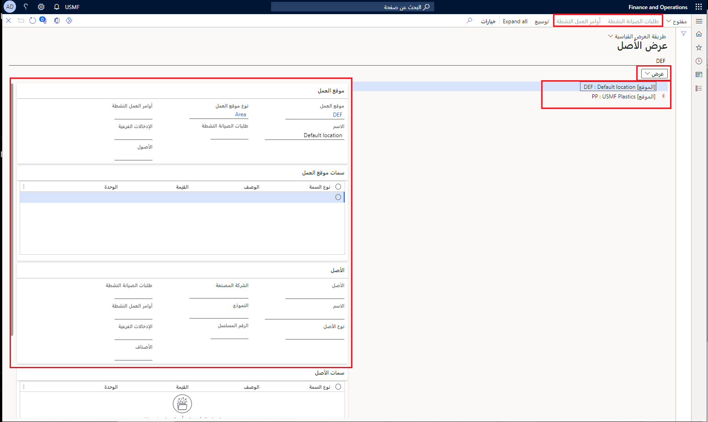

تعرض الصفحة **طريقة عرض الأصول** الأصول النشطة ومواقع العمل في طريقة عرض الشجرة. ومن هذه الصفحة، يمكنك الحصول على نظرة عامة حول الميزات الآتية:

- علاقات الأصول
- مواقع العمل 
- معلومات تفصيلية حول مواقع العمل والأصول وقوائم مكونات الصنف (BOM) ذات الصلة. 
- طلبات الصيانة النشطة وأوامر العمل المرتبطة بأحد الأصول

**‎إدارة الأصول > عام > الأصول > طريقة عرض الأصول**

 

توضح القائمة الآتية بعض العوامل التي تجب مراعاتها بشأن الصفحة **طريقة عرض الأصول**:

- لتغيير طريقة العرض المعروضة في الصفحة، حدد قيمة جديدة من القائمة المنسدلة في الحقل **طريقة العرض**.
- في الجانب الأيسر من الصفحة، يمكنك العثور على تفاصيل متعلقة بـ **موقع العمل** و **الأصل** و **قوائم BOM للأصل**.
- يعرض مسار التنقل الذي يظهر فوق طريقة عرض الشجرة التحديد الحالي في طريقة عرض الشجرة. ويستخدم مسار التنقل هذا التنسيق الآتي:
    - *معرّف موقع العمل / معرّف موقع العمل في حالة وجود أكثر من موقع عمل واحد > معرّف الأصل / معرّف الأصل (في حالة وجود أكثر من معرّف أصل واحد) رقم الصنف*
- في القائمة الرئيسية، تقوم القائمة المنسدلة **فتح** بفتح الصفحات **موقع العمل** أو **الأصل** أو **قوائم BOM للأصل** المرتبطة بالأصل.
- كما يمكنك تحديد **طلبات الصيانة النشطة** أو **أوامر العمل النشطة** لعرض طلبات الصيانة أو أوامر العمل المرتبطة بالأصل. 

