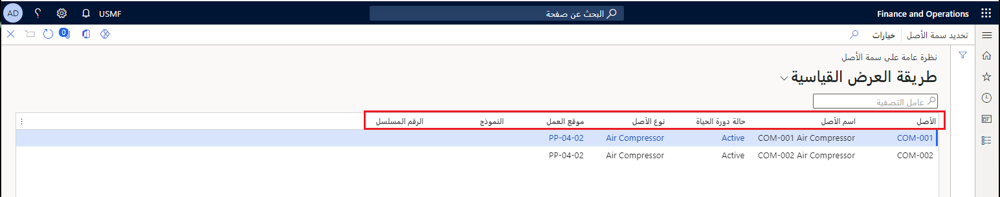
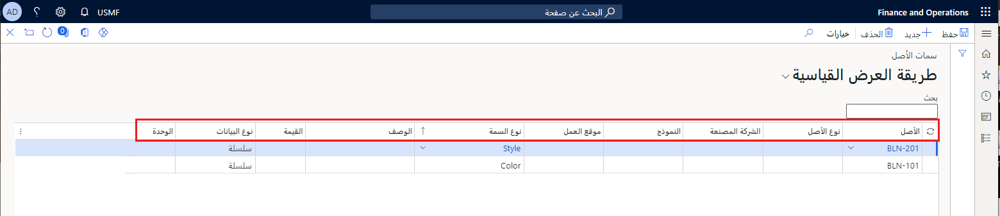

تعتبر سمات الأصول هي الخصائص المرتبطة بنوع الأصل أو الأصل. إذا قمت بإعداد أنواع السمات واستخدامها في الأصول، فيمكنك الحصول على نظرة عامة على قيم السمات التي تم إعدادها في الأصول. 

يمكنك عرض هذه المعلومات بإحدى طريقتين: من **نظرة عامة على سمة الأصل** أو **سمة الأصل**.

**تعرض الصفحة نظرة عامة حول سمة الأصل** بنداً منفصلاً لكل أصل. يعرض البند كافة أنواع السمات المرتبطة بهذا الأصل. 

1.  انتقل إلى **إدارة الأصول > الاستعلامات > الأصول > نظرة عامة على سمة الأصل**. يظهر مربع الحوار نظرة عامة على سمة الأصل.

2.  في الحقل **نوع الأصل** حدد نوع أصل من القائمة المنسدلة، ثم حدد **موافق**.  تظهر الصفحة **نظرة عامة حول سمة الأصل**، وتعرض بنداً منفصلاً لكل نوع سمة يتم استخدامه على أحد الأصول. 

    

3.  انتقل إلى **إدارة الأصول > الاستعلامات > الأصول > سمات الأصول**. تعرض صفحة **سمات الأصول** كافة أنواع السمات.

    

