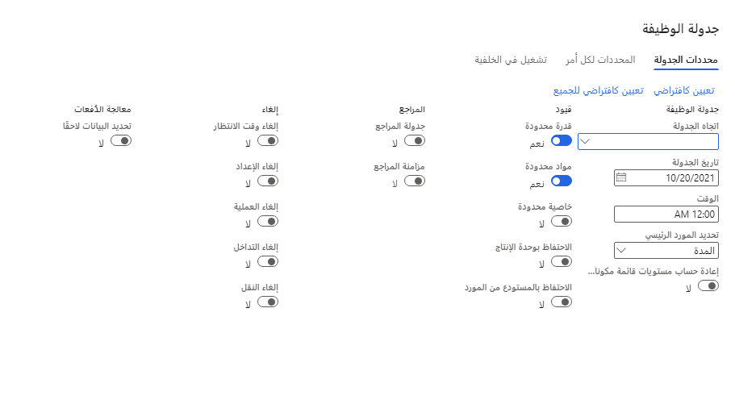
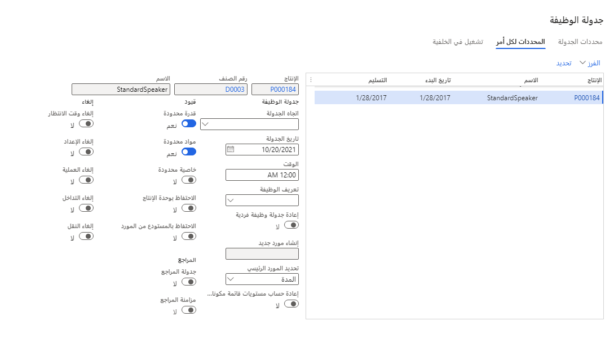

يمكنك استخدام جدولة المهام لإنتاج جدول عام للمهام التي سيتم إجراؤها في الموارد في منشأة التصنيع أو في صالة الإنتاج.

تحدد جدولة المهام إجمالي المكونات المطلوبة لكل العمليات في الموارد حسب المهام المحددة ثم تحدد تواريخها وجداولها الزمنية حسب الترتيب الذي يحدده مسار الإنتاج.

يمكنك تشغيل جدولة المهام بمفردها أو بعد جدولة العمليات.

علامة التبويب **التحكم بالإنتاج > أوامر الإنتاج > كافة أوامر الإنتاج > الجدول** **> جدولة المهام**

تلخص القائمة التالية كيفية وضع معلمات الجدولة وخيارات الجدولة المختلفة في الاعتبار من جانب Supply Chain Management عند تشغيل جدولة المهام:

-   **مراجع الجدولة** - تسمح جدولة المهام بمزامنة المهام الأخرى لأمر الإنتاج وأي مراجع مقترنة بالمهمة الحالية. يتم تحديد وقت بدء ووقت انتهاء للمهمة ثم يتم تشغيل جدولة المهمة على هذا الأساس.

    ما إذا كان الوقت هو وقت البدء أو وقت الانتهاء يعتمد على خيار اتجاه الجدولة. يكون هذا الأسلوب مفيداً في حالة عدم إمكانية تشغيل المهمة المحددة إلا على آلة واحدة في وقت معيّن أو بالارتباط بعملية تحسين للمهمة التي يتم تشغيلها لكل مورد من الموارد.
-   **اتجاه الجدولة** - يجب تطبيق الجدولة للأمام لبدء الإنتاج في أول وقت ممكن والجدولة للخلف لبدء الإنتاج في أكثر وقت متأخر قدر الإمكان.
-   **قدرة إنتاجية محدودة** - عند تطبيق قدرة إنتاجية محدودة، تضع جدولة المهام في الاعتبار حقيقة أن حجوزات القدرة الإنتاجية المجدولة لا يمكن أن تزيد عن القدرة الإنتاجية المتاحة للمورد. يتم تعريف الوقت المتاح على أنه الفترة الزمنية التي يكون فيها المورد مفتوحاً ولا توجد حجوزات أخرى للقدرة الإنتاجية.
-   **مواد محدودة** - تضمن جدولة المهام بمواد محدودة توفّر المواد المطلوبة عندما تبدأ العملية.
    تضع قواعد التغطية العامة هذه الحدود لأن الجدولة تستخدم تحديد إجمالي المكونات المطلوبة للتأكّد من موعد توفّر أصناف المكونات. في حالة الجدولة بدون تعيين مواد محدودة، سيفترض النظام أن جميع الأصناف متوفرة عند الحاجة.

اعتبارات إضافية عند تشغيل جدولة المهام:

-   **خاصية محدودة** - تتطلب جدولة المهام بخصائص محدودة تحديد الخصائص لعمليات مسار الإنتاج. ويجب تنفيذ هذه الخصائص لحجز القدرة الإنتاجية.
-   **المراجع** - ستقوم ميزة جدولة المهام بجدولة جميع عمليات إنتاج المرجع المقترنة بعملية الإنتاج الحالية. في حالة وجود أمر إنتاج مثبت واحد أو أكثر لعملية إنتاج، يجب جدولتها مع عملية الإنتاج الرئيسية لأنه يتعذّر إطلاق عملية الإنتاج الرئيسية إلى أن يتم الانتهاء من أوامر الإنتاج المثبتة ذات الصلة.
-   **فعالية الموارد** - في جدولة المهام، يتم استخدام النسب المئوية للفعالية المحددة للموارد كذلك. يتم إعداد النسب المئوية للفعالية للمورد. يتمثل الغرض الأساسي من نسبة الكفاءة في ضبط القدرة الإنتاجية المتاحة للمورد. وهي أيضاً طريقة لخفض الوقت المحجوز للمورد أو زيادته. وبالتالي، يتم أيضاً رفع الحد الأدنى لوقت الإنتاج أو خفضه. قاعدة الحساب هي: وقت الجدولة = الوقت * 100 / النسبة المئوية للفعالية (حيث يكون الوقت هو وقت التشغيل والإعداد).
-   **موارد الجدولة** - تفحص جدولة المهام جميع الموارد المتاحة التي تطابق متطلبات الموارد وتحدد المورد الذي يتميز بأقل وقت لازم للإنتاج أو بأعلى أولوية، اعتماداً على إعدادات التكوين.
