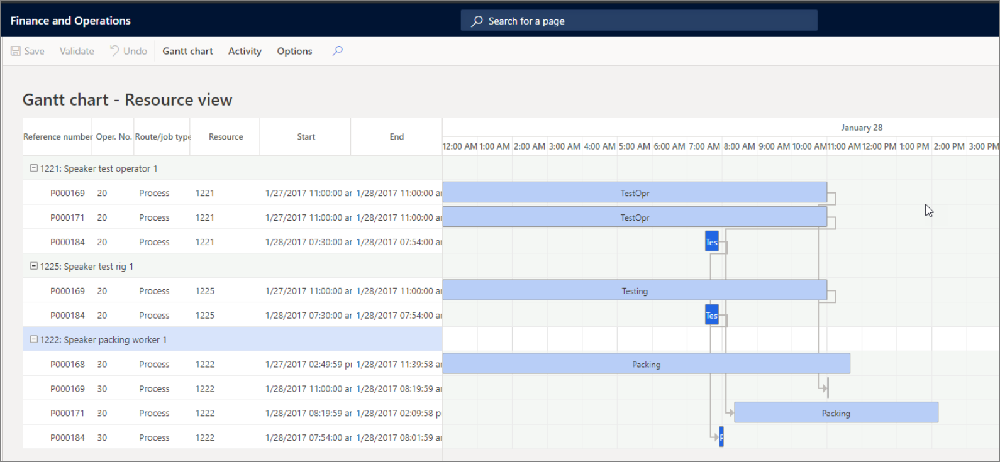

يمكنك تنفيذ أنشطة الجدولة التالية باستخدام مخطط Gantt:

-   إعادة جدولة مورد
-   إعادة جدولة وظيفة
-   إعادة جدولة أمر
-   إلغاء تغييرات الجدولة

يعرض مخطط Gantt نظرة عامة رسومية على خطة الإنتاج الحالية المجدولة للمورد أو أمر الإنتاج المحدد.
يمكنك أيضاً استخدام وظيفة مخطط Gantt لإعادة جدولة الإنتاج يدوياً.

علامة التبويب **التحكم بالإنتاج > أوامر الإنتاج > جميع أوامر الإنتاج > الجدولة** **> جدولة المهام > المعلمات لكل أمر**

عند تحديد وظيفة في الجدول، يتم أيضاً تحديد الوظائف الأخرى المرتبطة بالأمر. وبالمثل، عند تحديد مشروع، يتم أيضاً تحديد الأنشطة الأخرى المرتبطة بالمشروع. تنعكس العلاقة بين الوظائف أو الأنشطة أيضاً في الروابط التي تربط الوظائف والأنشطة. يمكنك استخدام الميزات المرئية التالية لتخصيص طريقة عرض المعلومات في مخطط Gantt.

**طريقة عرض الأمر وطريقة عرض المورد** - يمكنك عرض بيانات الوظائف المتاحة بطريقتين. يمكنك استخدام طريقة عرض الأمر لعرض الوظائف المجدولة لأمر إنتاج معين، أو يمكنك استخدام طريقة عرض المورد لعرض الوظائف المجدولة لمورد معين. عند استخدام المخطط، يمكنك التبديل بين طرق العرض المختلفة.

يمكنك تجميع جميع العمليات حسب الأمر، بغض النظر عن المورد، ثم فرز العمليات حسب وقت البدء. قد يكون هذا الأسلوب مفيداً إذا كنت تريد معرفة كيفية تدفق مجموعة من الأوامر عبر الموارد المختلفة قبل إعادة جدولة الطلبات بسبب تغيير تاريخ التسليم من العميل.
