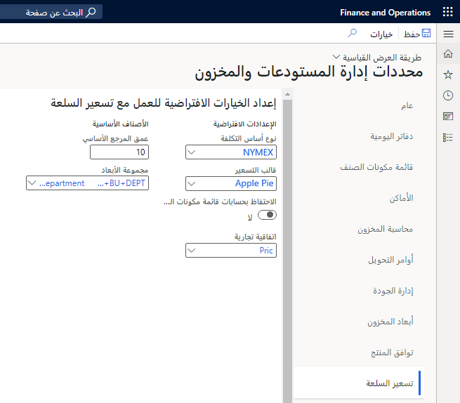
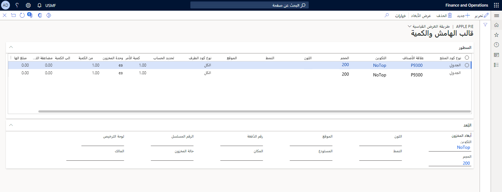

يستخدم تسعير السلعة عندما يتقلب سعر شراء المادة الخام بمرور الوقت بناءً على تبادل السلع. قد تكون مادة السلعة مادة زراعية مثل القمح أو الذرة، أو مورداً طبيعياً مثل الزيت، أو سلعة معدنية مثل النحاس. يتم تعيين تسعير الصنف على أساس يومي أو أسبوعي أو شهري بسبب التقلبات في قيمة السلع المتداولة في البورصة للمادة.

في التصنيع، تؤثر التقلبات في سعر الشراء للسلعة في التكلفة وسعر المبيعات الخاصين بالبضائع المنتهية التي تستخدم صنف السلعة كمكون رئيسي في عمليه الإنتاج. لكي تظل عملية بيع البضائع قابلة للتطبيق، يجب تعديل سعر المبيعات للمنتج المنتهي بشكل منتظم فيما يتعلق بتقلبات التسعير في سوق السلع.

يجب تعيين المحددات التالية في علامة التبويب **إدارة المخزون > إعداد > محددات المخزون والمستودعات > تسعير السلعة** لاستخدام تسعير السلعة في Dynamics 365 Supply Chain Management.

-   **نوع أساس التكلفة** - حدد أساس التكلفة المراد استخدامه كإعداد افتراضي لحسابات التسعير الجديدة.

-   **قالب التسعير** - يتيح تحديد قالب التسعير المراد استخدامه كإعداد افتراضي عند إنشاء تحديث الهامش والتسعير.

-   **الاحتفاظ بالعمليات الحسابية لقائمة مكونات الصنف (BOM)‬/المعادلة** - حدد خانة الاختيار لتخزين نتائج تسعير سلعة وحساب تحديث الهامش. يتم الاحتفاظ بالنتائج حتى يتم حذف حساب التحديث.

-   **اتفاقية السعر/الخصم** - حدد دفتر يومية الاتفاقية التجارية للتحديث بسعر المبيعات الجديد للسلعة.

-   **عمق المرجع الأساسي** - أدخل الحد الأقصى لعدد مراجع الأصناف الأساسية المسموح بها. يمكن أن يمثل صنف السطر في صفحة **تسعير السلعة** سطراً وصنفاً أساسياً يشير إلى صنف أساسي للتحكم في عدد أصناف السطور التي يمكن تحديدها في السلسلة.
    عند الوصول إلى الحد، يتم عرض رسالة خطأ.

-   **مجموعة الأبعاد** - أدخل الأبعاد المالية لاستخدامها كحساب افتراضي وقسم ومركز تكلفة وغرض لتسعير السلع. تشتمل مجموعات الأبعاد على الأبعاد المالية المحددة التي يتم تضمينها في بنيات الحساب والمرتبطة بمخطط الحسابات الخاص بالشركة. مع تحديد **مجموعة الأبعاد**، يمكنك تصفيه السجلات في صفحة **تحديث هامش السعر - السطور** باستخدام وظيفة معايير البعد التي تقع بواسطة قيم الأبعاد المالية. يتم تحديد هذه القيم بواسطة مجموعه الأبعاد المحددة. 

    

-   **نوع أساس التكلفة** - يمكنك إنشاء سجل نوع أساس التكلفة لكل سوق سلعة تؤثر في أسعار السلع. على سبيل المثال، يمكنك إنشاء نوع أساس تكلفه **NYMEX‎** للإشارة إلى بورصة نيويورك التجارية.

-   **قالب التسعير** صفحة - يمكنك إنشاء قالب تسعير لاستخدامه في صفحة **إنشاء حساب البيانات الخاصة بالسعر والهامش**. يقوم قالب التسعير، بالإضافة إلى قوالب الكمية والهامش، بتحديد معايير التسعير المستخدمة في عمليات حساب المعادلة وتحديد التسعير الجديد للصنف ومجموعة الأصناف والصنف حسب علاقات العملاء.

عند إنشاء قالب الكمية والهامش، تأكد من ملء الحقول التالية:

-   **علاقة الصنف** - يمكن تحديد العلاقة لكافة أصناف المعادلة أو مجموعه الأصناف الفردية أو صنف معادلة فردية.
    لا يمكن استخدام إلا الأصناف التي يكون نوع الإنتاج فيها هو المعادلة في قالب الكمية والهامش.

-   **علاقة العميل** - يمكن تحديد العلاقة لكافة العملاء أو مجموعة عملاء أو عميل فردي. سيتم ملء هذا التحديد على دفتر يومية الاتفاقية التجارية الذي تم إنشاؤه من الحساب.

-   **أبعاد المخزون** - يمكن ملء الموقع والمستودع، إذا لزم الأمر، لترحيل دفاتر يومية الاتفاقية التجارية.

-   **من وإلي الكمية** - كمية المبيعات الفعالة لسطر الحساب.

-   **مضاعف التكلفة** - مضاعف لتكلفة الإنتاج الاجمالية لصنف المعادلة. يتم تطبيق مضاعف التكلفة قبل الهامش الحسابي لتحديد التكلفة الأساسية للصنف.

-   **مبلغ الهامش أو النسبة المئوية** - إما هامش ثابت أو نسبة مئوية تستند إلى التكلفة المضروبة للصنف المصنع.

صفحة **حساب التسعير** في Supply Chain Management هي المكان الذي يمكنك فيه إدخال معلومات تسعير سلعه المادة الخام. يتم أيضا إدخال نطاق التاريخ القابل للتطبيق لسعر السلعة في صفحة **حساب التسعير**.

في مثال البرتقال، يتم تعيين التسعير لمدة شهر في بداية الشهر؛ بالتالي، سيتم إدخال نطاق التاريخ للشهر بأكمله في صفحة **حساب التسعير**.

إذا تم حساب عدة سلع باستخدام نفس أساس التكلفة الذي يحتوي على نطاقات التواريخ نفسها، فيجب القيام بحساب تسعير واحد فقط. في صفحة **التفاصيل** الخاصة بحساب التسعير، يتم تحديد السلعة الخام مع التكلفة كسطر فردي.

تسمح حسابات التسعير أيضاً بأن تستند تكلفة صنف تكلفة واحد إلى التكلفة المتغيرة لمنتج مختلف (يطلق عليه الصنف الأساسي) وعامل التكلفة. يمكن استخدام هذا الأسلوب عندما تستند تكلفة صنف واحد إلى تكلفة صنف آخر تم شراؤه مثل سعر حبوب البن المحمصة وغير المحمصة، حيث يعتمد سعر الحبوب المحمصة على سعر سلعة حبوب البن غير المحمصة.

بعد إدخال بيانات تسعير سلع المواد الخام، يمكنك حساب سعر التكلفة والمبيعات للأصناف المصنعة من خلال تشغيل الوظيفة لإنشاء بيانات السعر والهامش.

عند تشغيل الوظيفة، يتم تحديد حساب التسعير الذي يجب استخدامه بالفعل.

تقوم Supply Chain Management بعد ذلك بمراجعة حساب التسعير والبحث عن كافة أصناف المعادلة التي تستخدم صنف السلعة. بعد ذلك، يتم إكمال حساب قائمة مكونات الصنف (BOM)‬ لتحديد سعر تكلفه جديد استناداً إلى سعر السلعة الذي تم تحديثه. يستمر حساب السعر هذا في إنهاء شجرة قائمة مكونات الصنف (BOM)‬ حتى يتم العثور على بضائع منتهية.

بالنسبة لأي صنف ذي قالب كمية وهامش، يتم حساب سعر المبيعات والهامش بعد ذلك للمراجعة.

**إدارة المخزون > إعداد > تسعير السلع > قالب التسعير > قالب الهامش والكمية**

عند اكتمال حساب بيانات التسعير والهامش، يمكن مراجعة حساب التسعير في صفحة **تحديث التسعير**.

يمكن بعد ذلك تحديد هذا التسعير لإنشاء اتفاقية تجارية للعملاء المحددين أو لكافة العملاء، الذين تم إعدادهم في إعداد الكمية والهامش لقالب التسعير. يجب نشر الاتفاقية التجارية بواسطة مستخدم بعد إنشائها من صفحة **تحديث التسعير**.

تكون الاتفاقية التجارية التي تم إنشاؤها صالحة للتواريخ المحددة في حساب التسعير المستخدم.

شاهد الفيديو التالي للاطلاع على عرض توضيحي حول كيفية إنشاء أساس التكلفة وقالب التسعير، والحصول على توضيح للمحددات الأخرى التي يجب تعيينها بحيث يمكنك استخدام تسعير السلعة.

 > [!VIDEO https://www.microsoft.com/videoplayer/embed/RE489Xw]