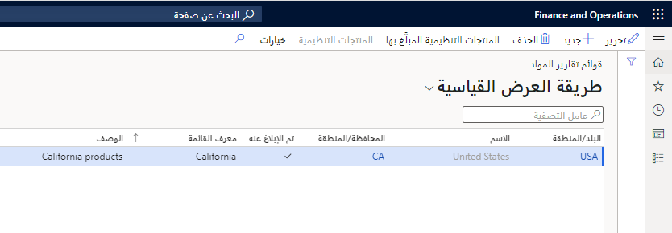
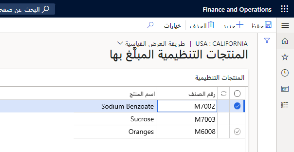

يتم استخدام توافق المنتج لتعقب المعلومات الكيميائية والمتعلقة بالسلامة للأصناف التي يتم شراؤها وبيعها داخل الشركة.
تتضمن أمثلة المنتجات التي قد تتطلب التعقب في Supply Chain Management المواد الكيميائية القابلة للاشتعال، لتشمل صفحات أمان المنتج مع كل شحن، والمواد المسرطنة، لتقييد الشحن إلى بلدان أو مناطق معينة وتنظيمه، ومواد كيميائية أخرى لتعقب رموز CAS أو OSHA أو EPA مثل التي تتطلبها اللوائح المحلية والفيدرالية .

يسمح توافق المنتج بتعقب المنتجات مثل المنتجات التالية:

-   منتج تنظيمي - منتج تنظمه هيئة حكومية في بلد أو منطقة أو ولاية.

-   منتج مقيد - منتج يكون التوزيع فيه محدوداً أو مقيداً من قبل سلطة حكومية.

-   منتج تنظيمي تم الإبلاغ عنه - منتج تنظمه هيئة حكومية في بلد أو منطقة أو ولاية ويتطلب إعداد تقارير التوافق والتدقيق.

يسمح توافق المنتج أيضاً بتعقب صفحة بيانات أمان المنتج، وهي عبارة عن مستند يحتوي على معلومات حول المنتج، والمعالجة، والطوارئ، وغيرها من المعلومات المتعلقة بالسلامة. تتضمن Supply Chain Management أيضاً تعقب تواريخ صلاحية صفحة بيانات الأمان.

لاستخدام توافق المنتج ضمن Supply Chain Management، عليك تعيين المحددات التالية في إدارة المخزون والمستودعات:

-   مستخدم الإدارة - المستخدم الذي سيتلقى إخطارات من النظام عند تعيين صفحة بيانات أمان المنتج (PSDS) على انتهاء الصلاحية.

-   أيام سريان PSDS

-   حركات فحص التوافق - الحركات المطلوبة لإصدار تحذيرات المستخدم عند انتهاء صلاحية صفحات بيانات أمان المنتج أو عدم إرسالها مطلقاً إلى العميل، بما في ذلك إدخال أمر الشراء وإدخال أمر المبيعات وترحيل إيصال التعبئة. تتيح لك هذه المحددة أيضاً طباعة صفحة بيانات أمان المنتج (PSDS) افتراضياً إلى عميل لم يتلق نسخة صالحة مطلقاً ومنع ترحيل إيصال التعبئة/الفاتورة عند انتهاء صلاحية PSDS.

-   حركات إخطار PSDS - خيارات لإصدار تنبيهات إلى المسؤول، بما في ذلك وقت انتهاء صلاحية PSDS في حركة مبيعات أو شراء.

-   نطاقات تواريخ التقارير السنوية

-   عنصر تحكم PSDS

تعتبر قوائم المنتجات التنظيمية إلزامية لأي صنف يخضع للتحكم.

**إدارة المخزون > إعداد > توافق المنتج > المنتجات التنظيمية**

لكي تتم طباعة صفحة بيانات أمان المنتج (PSDS) لأحد الأصناف بشكل صحيح، يجب إدراج الصنف في قائمة المنتج التنظيمي.

يمكن أيضاً وضع علامة على قوائم المنتجات التنظيمية على أنها تم الإبلاغ عنها، إذا كان استخدام الأصناف المدرجة في القائمة يحتاج إلى إبلاغ الوكالات التنظيمية المحلية.

قد يتم تعيين قائمة المنتج التنظيمي لبلد أو منطقة، اعتماداً على متطلبات إعداد التقارير، لأن بعض المناطق تتطلب متطلبات إعداد تقارير أكثر صرامة من متطلبات البلد، على سبيل المثال في كاليفورنيا.

عند إعداد قوائم المنتجات المقيدة، تستند القوائم إلى الأماكن التي يُسمح فيها ببيع المنتجات أو لا يُسمح ببيعها.

يتم تعيين كل قائمة لبلد أو منطقة و/أو ولاية أو مقاطعة، ويتم تعيينها للإشارة إلى ما إذا كانت المنتجات المدرجة في القوائم مسموحاً بها أو مستبعدة من البيع لتلك المنطقة.

إذا كان عدد الولايات أو المناطق في بلد يُسمح فيه ببيع منتج أكبر من الرقم الذي يُستبعد فيه من المبيعات، فيجب عليك إعداد قائمة تضمين للبلد أو المنطقة أولاً ثم إعداد قوائم الاستبعاد لكل ولاية أو مقاطعة أو منطقة لا يُسمح فيها ببيع الصنف.

يمكن أن يتواجد كل صنف فقط في نوع واحد من القائمة لبلد أو منطقة.

إذا كان المنتج مدرجاً في قوائم الاستبعاد، فمن المفترض أن يتم تضمين المنتج في جميع الولايات الأخرى في البلد أو المنطقة.

يجب أن يتم إدراج كل صنف يخضع للتحكم من قبل PSDS في قائمة المنتج المقيد.

تُستخدم صفحات بيانات أمان المنتج (PSDS) لتقديم معلومات الأمان لمستخدمي المواد. تم توحيد صفحة بيانات الأمان في أقسام متعددة تتضمن معلومات عن التعريف الكيميائي وتركيب المواد، وتحديد المخاطر، وتدابير الإسعافات الأولية، وبيانات الحرائق والانفجارات، والمعالجة والتخزين، والحماية، ومعلومات الخصائص الكيميائية.

في Supply Chain Management، ترتبط PSDS بصنف تنظيمي ومقيّد، وستتم طباعتها في وقت الشحن إلى العميل الموجود في البلدان التنظيمية والمقيدة. بدلاً من ذلك، ستتم طباعة PSDS للمساعدة على تعقب انتهاء صلاحية المنتج بحيث يمكنك طلب نسخة جديدة من مورد المواد في حالة انتهاء صلاحيتها.

لاستخدام إشعارات PSDS عند الشراء والشحن، يجب عليك إنشاء قائمة PSDS للبلد أو المنطقة و/أو مجموعة البلد/الولاية للعنوان المدرج في الأمر. يستند التحقق من تاريخ انتهاء الصلاحية والإشعار الخاص بـ PSDS إلى إعداد قائمة PSDS، والتي يمكن تعديلها من تواريخ المحددات الافتراضية.

تتطلب اللوائح المحلية أن تحافظ على PSDS صالحة في الموقع دائماً، مع فترة الصلاحية بناءً على موقع الشركة.

يمكن لـ Supply Chain Management تعقب تواريخ انتهاء صلاحية PSDS وإعلام المستخدم عند استلام نسخة جديدة أو إرسالها إلى العميل.

يمكن أن يحتوي المنتج الذي تم إصداره على معلومات أمان إضافية مضافة إلى الصنف للتعقب، بما في ذلك المعلومات المطلوبة من قبل الكيانات التالية:

-   **EPCRA** - حالات الطوارئ والتخطيط وحق المجتمع في معرفة القانون

-   **CERCLA** -   الاستجابة البيئية الشاملة والتعويض وقانون المسؤولية

-   **TSCA** - قانون مراقبة المواد السامة

-   **TRI** - مخزون الانبعاثات السمية من وكالة حماية البيئة في الولايات المتحدة

-   **OSHA** - السلامة المهنية والإدارة الصحية

-   **EHS** - المواد شديدة الخطورة

-   **CAS** - خدمة المستخلصات الكيميائية، سجل فريد للمركبات الكيميائية العضوية وغير العضوية

إلى جانب الإبلاغ عن أنواع المواد المخزنة في الشركة، تتطلب بعض الحكومات والوكالات الحكومية أن يتم الإبلاغ عن الاستخدام والمخزون الفعلي مع كل تقرير ربع سنوي أو سنوي. في Supply Chain Management، يمكن حساب الاستخدام وحالة المخزون الفعلي تلقائياً للصنف الخاضع للتحكم. تقوم الوظيفة بتحديث الاستخدام والمخزون الفعلي استناداً إلى حركات المخزون خلال نطاق تاريخ محدد تم إعداده في محددات توافق المنتج.

عندما تقوم بإنشاء أمر شراء لمنتج تنظيمي ومقيّد، تكمل Supply Chain Management عمليات الفحص التالية:

-   في حالة عدم وجود PSDS، يتم عرض رسالة تحذير لطلب PSDS جديدة من المورد.

-   إذا كانت PSDS موجودة ولكنها تجاوزت تاريخ الإشعار أو انتهت صلاحيتها، يتم عرض رسالة تحذير لطلب PSDS جديدة من المورد.

-   إذا كانت PSDS موجودة وصالحة، فلن يتم عرض أي رسالة.

أثناء إدخال أمر المبيعات، تقوم Supply Chain Management بإكمال عمليات الفحص التالية:

- تتحقق من أن الصنف غير مقيد للبيع في البلد أو المنطقة/الولاية في أمر المبيعات. إذا كان الصنف مقيداً، فسيتم تقديم رسالة خطأ ولا يُسمح بشحن الصنف إلى العميل.

-   تحدد آخر مرة تم فيها إرسال PSDS الحالية للمادة إلى العميل.

-   لا تصدر إخطاراً إذا تم إرسال إصدار PSDS الحالي وضمن فترة انتهاء الصلاحية.

-   تقدّم رسالة تحذير لإرسال أحدث PSDS إذا تم إرسال إصدار سابق من PSDS.

**إدارة المخزون > إعداد > توافق المنتج > صفحة بيانات أمان المنتج**

عند إكمال إيصال التعبئة لمنتج مقيد حيث ترتبط PSDS بالصنف، يمكن طباعة PSDS تلقائياً.

لطباعة PSDS تلقائياً، أكمل الإعداد التالي:

-   يجب أن تكون PSDS نشطة وضمن متطلبات تاريخ انتهاء الصلاحية (إما بناءً على تاريخ التسليم أو التاريخ الحالي في محددات توافق المنتج).

-   يجب تعيين الصنف كمنتج مقيد وتنظيمي.

-   في محددات إدارة المخزون، يجب تعيين كل من طباعة صفحة بيانات أمان المنتج وخيار منع إيصال تعبئة المبيعات/ترحيل الفواتير على **صحيح**.

-   بالنسبة إلى ملف PSDS المرتبط بسجل PSDS يجب تعيين الحقل **القيد** على **خارجي** في معالجه المستندات.

سيتم فتح PSDS بعد إنشاء إيصال التعبئة، وبناءً على إعداد الطباعة، يمكن تعيينها للطباعة على الطابعة الافتراضية أو تظل معروضة على الشاشة ليقوم المستخدم بطباعتها يدوياً. 