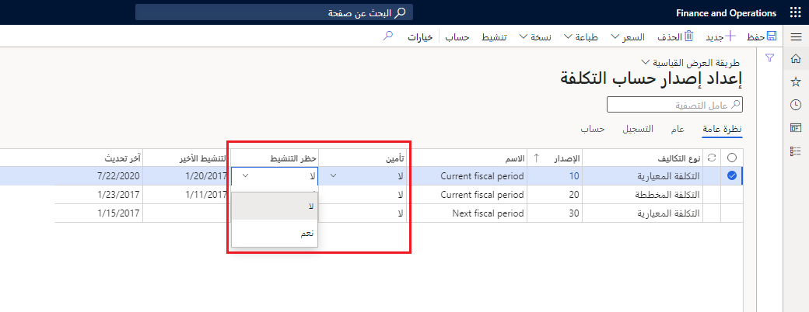

الغرض الأساسي لإصدار التكاليف هو احتواء سجلات التكلفة حول الأصناف وفئات التكلفة وأسعار التكلفة. يحدد إصدار التكاليف التكاليف النشطة الحالية والطريقة التي يتم بها إجراء حساب قائمة مكونات الصنف (BOM).

**إدارة التكلفة > إعداد سياسات التكلفة المحددة مسبقاً > إصدارات التكاليف**.

يمكن ان يخدم إصدار التكاليف واحداً أو أكثر من الأهداف، بناءً على البيانات التي يحتوي عليها إصدار التكاليف. يمكن أن يحتوي إصدار التكاليف على مجموعة من سجلات التكلفة المعيارية أو مجموعة من سجلات التكلفة المخططة التي تستند إلى نوع التكلفة الذي تم تعيينه لإصدار التكاليف.

## التكاليف القياسية

يمكن أن يدعم إصدار التكاليف نموذج مخزون التكلفة المعيارية للأصناف، حيث يحتوي إصدار التكاليف على مجموعة من سجلات التكلفة القياسية حول الأصناف وعمليات التصنيع.

يتم التعبير عن بيانات التكلفة حول عمليات التصنيع فيما يتعلق بفئات التكلفة لعمليات التوجيه والمعدلات والرسوم الإضافية والتكلفة العامة لعملية التصنيع.

## الأبعاد المالية لإعادة تقييم التكلفة القياسية
يتم إنشاء إيصال **إعادة تقييم التكلفة القياسية** عند تنشيط تكلفة قياسية جديدة. عادة، عندما يتم ترحيل حركات صنف ما، تأتي الأبعاد المالية للحركات من هذا الصنف. ومع ذلك، يمكنك التحكم في كيفية ترحيل الحركات والأبعاد المالية باستخدام ميزة **خيارات الأبعاد المالية الافتراضية لإعادة تقييم التكلفة القياسية للمخزون**. يجب تمكين هذه الميزة في مساحة العمل **إدارة الميزات** بواسطة المسؤول.

عند تمكين الميزة، يمكنك تحديد كيفية ترحيل الأبعاد المالية باتباع الخطوات التالية:

1.  انتقل إلى **إدارة التكلفة > إعداد سياسات محاسبة المخزون > المعلمات**. 
2.  قم بتعيين القائمة المنسدلة **أصل البعد المالي** إلى إحدى القيم التالية:
    - **بلا** – لم يتم ترحيل أبعاد مالية في حركات إعادة التقييم. 
    - **جدول** – يتم ترحيل الأبعاد المالية للصنف في حركات إعادة التقييم. هذا هو الإعداد الافتراضي ويتوافق مع سلوك النظام الأصلي دون تشغيل ميزة **خيارات الأبعاد المالية الافتراضية لإعادة تقييم التكلفة القياسية للمخزون**.
    - **الترحيل** – يتم ترحيل الأبعاد المالية للحركة التي تتم إعادة تقييمها في حركات إعادة التقييم. بشكل افتراضي، سيتم استخدام الأبعاد المالية من حساب مخزون الحركة الأصلية لكل من حساب المخزون وحساب إعادة التقييم.
 
    

## التكاليف المخططة

يمكن أن يحتوي إصدار التكاليف على مجموعة من سجلات التكاليف المخططة حول الأصناف وعمليات التصنيع. يتم في الغالب استخدام إصدار التكاليف الذي يحتوي على التكاليف المخططة لدعم عمليات محاكاة حساب التكلفة، مثل محاكاة التأثير الذي تتغير فيه التكلفة على المواد التي تم شراؤها أو عمليات التصنيع الموجودة في التكاليف المحسوبة للأصناف التي تم تصنيعها. يمكنك أيضاً استخدام سجلات تكاليف الأصناف بالنسبة للتكاليف المخططة لدعم نموذج مخزون التكلفة الفعلية، وذلك من خلال توفير القيم الأولية لتكاليف الأصناف. وتتضمن هذه القيم عملية حساب التكاليف المخططة للأصناف المصنعة.

من خلال الوصول إلى علامة تبويب **التسجيل** في صفحة **إصدارات التكاليف**، يمكنك تحديد موقع افتراضي وكذلك تشغيل القدرة لاستخدام إصدار التكاليف الخاص بسعر الشراء وسعر التكلفة وسعر المبيعات، أو إيقاف تشغيلها. في هذا المثال، سيتم استخدام إصدار التكاليف لتحديد التكلفة.

يعمل الخيار **وضع تحديد إجمالي المكونات** في إصدار التكاليف على تحديد مدى تأثير المستويات الموجودة في BOM على عملية حساب التكلفة.

يمكنك تحديد أي من أوضاع تحديد إجمالي المكونات التالية:

-   **المستوى المتعدد** - تعكس التكلفة المحتسبة عملية إعادة الحساب كاملة. يتم حساب كل BOM فرعية بدلاً من حساب تكلفتها الحالية فقط.

-   **إجراء أحد الأوامر** - يمثل **المستوى المتعدد** (عملية إعادة حساب كاملة)، فيما عدا أن الكمية المحددة يتم استخدامها لتسديد التكاليف الثابتة.

-   **المستوى الفردي** - يتم تقييد إصدار التكاليف القياسي إلى مستوى فردي، مما يضمن الحساب الدقيق والمتسق للتكاليف القياسية. بالنسبة لوضع تحديد إجمالي المكونات هذا، يتم تطبيق التكاليف المحسوبة للمكونات المصنعة على المستوى الأول.

-   **بناءً على نوع تشكيلة BOM** - تعتمد عملية الحساب على نوع تشكيلة BOM. على سبيل المثال، إذا كان النوع هو **الصنف**، يتم اعتبار التكلفة الحالية، وإذا كان النوع هو **الإنتاج**، فسيتم حساب التكلفة.

## إدخال التكاليف

تتضمن صيانة البيانات المتعلقة بسجلات التكلفة في إصدار التكاليف إدخال التكاليف للأصناف المشتراة والخاصة بالأصناف التي يتم نقلها بين المواقع. تتضمن صيانة البيانات الإضافية للشركات المصنعة إدخال تكاليف لفئات التكلفة المقترنة بعمليات التوجيه، وإدخال الأسعار والرسوم الإضافية للتكاليف غير المباشرة التي تعكس النفقات العامة للتصنيع، وحساب تكاليف الأصناف المصنعة.

تتكون بيانات تكلفة الصنف في إصدار التكاليف من سجل تكلفة واحد أو أكثر لكل صنف. عندما يتم إدخال سجل تكلفة لأول مرة، تكون حالته **معلق** ويكون لديه **تاريخ سريان** معد.

عند تنشيط سجل تكلفة الصنف، يتم تحديث الحالة إلى **نشط** ويتم تحديث تاريخ السريان إلى تاريخ التنشيط.
يمكن أن تعكس تكلفة الصنف مواقع مختلفة أو تواريخ السريان أو الحالات.

عند حساب تكاليف الأصناف المصنّعة لتاريخ مستقبلي، تستخدم عملية حساب قائمة مكونات الصنف (BOM) سجلات تكلفة تمتلك تاريخ السريان ذي الصلة، بغض النظر عن الحالة سواءً كانت **معلق** أو **نشط**.

يحاول برنامج Supply Chain Management العثور على الأسعار/التكاليف في الإصدار الحالي (المعلق أو النشط). إذا كنت قد قمت بإعداد إصدار احتياطي، فسيعود ذلك إلى الأسعار النشطة الحالية أو العودة إلى إصدار تكاليف محدد لحساب التكاليف.

يتم استخدام سجل التكلفة النشطة الحالي للصنف لتقدير تكاليف أمر الإنتاج ولتقييم حركات مخزون القيمة الموجودة في نموذج مخزون التكلفة القياسية. تمثل صيانة سجلات التكلفة لفئات التكلفة ومعادلات حساب التكلفة غير المباشرة صيانة سجلات تكلفة الصنف.

هناك سياستي حظر لإصدار التكلفة تعمل على تحديد ما إذا كانت التكاليف المعلقة يمكن صيانتها أم لا، وما إذا كانت التكلفة المعلقة يمكن تنشيطها أم لا.
استخدم سياستا الحظر للسماح بصيانة البيانات، ومن ثم استخدامها لمنع صيانة البيانات بالنسبة لسجلات التكلفة في إصدار التكلفة. بعد موافقتك على الأسعار والتكلفة مع مورديك، قم بتعيين الحقلين **الحظر** و **تنشيط الحظر** على **نعم** لتجنب التغييرات العارضة.

يمكن أيضاً أن يحتوي إصدار التكلفة على بيانات حول تكلفة الصنف أو أسعار المبيعات أو أسعار الشراء لأهداف استخدام ميزة حساب تكاليف الصنف. يحتاج الصنف الذي يتم شراؤه وتخزينه إلى تحديد سعر شراء بحيث تتمكن ميزة حساب تكاليف الصنف من حساب التكلفة.
