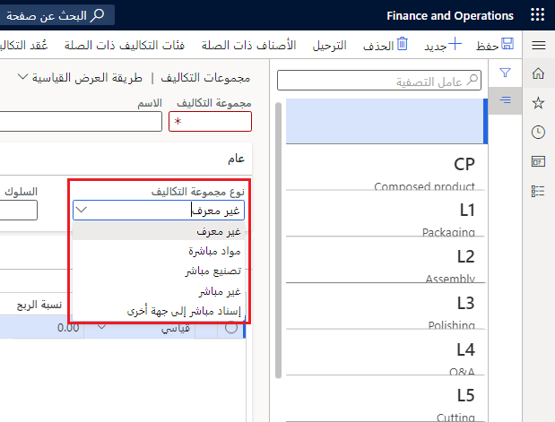
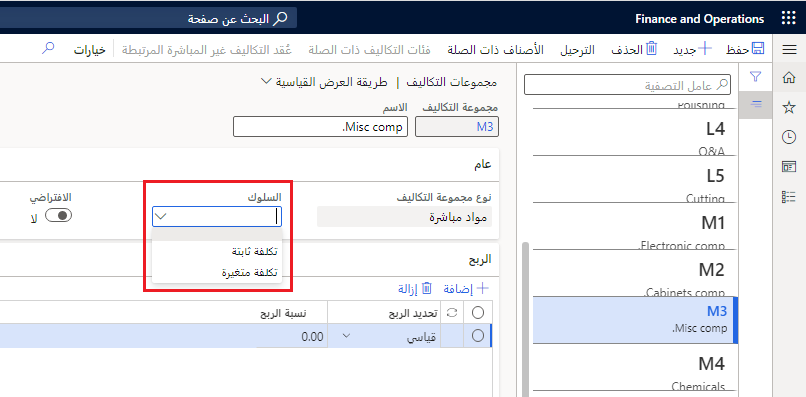
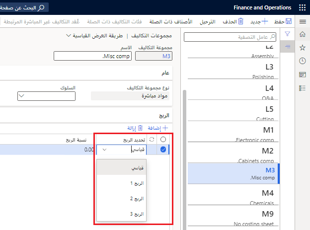

توفر مجموعة التكاليف الأساس لتجزئة وتحليل مساهمات التكلفة في التكلفة المحسوبة للصنف المصنع، مثل مساهمات التكلفة للمواد والعمالة والنفقات العامة.

تُستخدم مجموعات التكلفة لتصنيف التكلفة استناداً إلى الطبيعة المشتركة.
تعمل هذه الطريقة على تبسيط عملية إعداد التقارير لأنك لست بحاجة إلى رؤية كل مورد للحصول على نظرة عامة. بالإضافة إلى ذلك، تُستخدم مجموعات التكلفة في كشف التكاليف لإنشاء قواعد توزيع المصاريف الإضافية مثل الأسعار والرسوم الإضافية.

يمكن إنشاء مجموعات التكلفة وتجميع تكاليف BOM ذات الصلة التالية:

-   الموارد
-   الأجور
-   المواد
-   المصاريف الإضافية
-   وقت الإعداد والتشغيل في عمليات التوجيه

عند تشغيل حساب BOM، تحدد مجموعات التكلفة كيفية توزيع المصروفات بين مكونات BOM ومجموعات التكلفة المختلفة. بمعنى آخر، تحدد مجموعات التكلفة الكم الذي تم استهلاكه من حيث الموارد والأجور والمصروفات الإضافية والمواد.

باستخدام مجموعات التكلفة، يمكن حساب سعر المبيعات لقائمة BOM. يمكنك أيضاً تعيين واحد أو أكثر من إعدادات الربح لكل مجموعة تكلفة بحيث يتمكن Supply Chain Management من حساب سعر مقترح لصنف مُصنَّع يستند إلى نهج رفع السعر زائد التكلفة. تحدد النسبة المئوية لتحديد الربح النسبة المئوية التي سيضيفها النظام إلى سعر التكلفة عند حساب سعر المبيعات.

## تصنيف التكاليف

يمكنك إعداد تصنيفات التكاليف للأصناف المُصنّعة والمشتراة (مثل المواد والعمالة والمصروفات الإضافية) التي لا يتم ترحيلها إلى دفتر الأستاذ العام من خلال حركات المخزون. ومع ذلك، يمكن تحديدها اختيارياً في دفتر الأستاذ الفرعي للمخزون.

انتقل إلى **إدارة المخزون > الإعداد > محددات المخزون والمستودعات**، وفي الحقل **تصنيف التكلفة**، حدد ما إذا كنت تريد تحديد تصنيف التكلفة في دفتر الأستاذ الفرعي للمخزون عن طريق تحديد القيمة **دفتر الأستاذ الفرعي**. يتوفر تصنيف التكلفة للصنف المصنع، مثل المواد والعمالة والمصروفات الإضافية، في تقرير للتكلفة القياسية.

> [!Note] 
> ينطبق هذا النوع من تصنيف التكاليف على صنف يتم تقييمه بالتكلفة القياسية فقط. تُعد مجموعة التكلفة ميزة عامة، لكن الاحتفاظ بالمخزون مع تصنيف التكلفة في دفتر الأستاذ الفرعي هو فقط للأصناف التي تستند إلى تكلفة قياسية.

تمكّنك ميزة تصنيف التكلفة من تعقب تركيب التكلفة للأصناف الموجودة بالتكلفة القياسية على جميع مستويات الإنتاج للتكاليف المخططة والمقدرة والفعلية. يمكن تحليل تكلفة المنتج وتكاليف الإنتاج والمخزون والأعمال تحت التنفيذ (WIP) وتكلفة البضائع المبيعة وتركيب التكلفة وتجميعها في مجموعات التكلفة الأصلية الخاصة بها.

في التكلفة المخططة، يتيح تقدير الإنتاج وحسابات تكلفة الإنتاج ومجموعات التكلفة التي يحددها المستخدم والمرتبطة بالموارد جمع مساهمات التكلفة وتصنيفها. عند تقدير قيمة مساهمات التكلفة للمكونات المُصنّعة بالتكاليف القياسية، يدرج النظام تحليل التكلفة القياسية الملخص لكل مجموعة تكلفة. تتيح هذه العملية تجميع تحليل التكلفة المجمّعة متعددة المستويات لكل مجموعة تكاليف لتكلفة المنتج والإنتاج.

يحتوي تقسيم مجموعة التكلفة على العديد من المرادفات داخل بيئات التصنيع، مثل التصنيف التفصيلي للتكلفة أو تحليل التكلفة أو تصنيف التكلفة. يمكن لتقسيم مجموعة التكلفة خدمة أغراض متعددة:

-   تقسيم التكاليف لأنواع مختلفة من المواد، مثل المكونات ومواد التعبئة والتغليف لمنتج البضائع المعلبة، استناداً إلى مجموعات التكلفة التي تم تعيينها للأصناف.

-   تقسيم التكاليف لأنواع مختلفة من موارد العمليات، مثل أنواع مختلفة من العمالة أو الآلات، استناداً إلى مجموعات التكلفة التي تم تعيينها لفئات التكلفة المرتبطة بموارد العمليات وعمليات التوجيه.

-   تقسيم تكاليف وقت الإعداد ووقت التشغيل في عمليات التوجيه، استناداً إلى مجموعات التكلفة التي تم تعيينها لفئات التكلفة المرتبطة بعمليات التوجيه.

-   تقسيم التكاليف لأنواع مختلفة من المصاريف الإضافية، مثل المصاريف الإضافية المتعلقة بالعمالة والمرتبطة بالآلات، استناداً إلى مجموعات التكلفة التي تم تعيينها للتكاليف غير المباشرة في إعداد كشف التكاليف.

-   يعمل كأساس لحساب أنواع مختلفة من مصاريف التصنيع الإضافية في إعداد كشف التكاليف. يمكن أن تتضمن هذه المصاريف الإضافية أنواعاً مختلفة من المصاريف الإضافية المرتبطة بمعلومات التوجيه حول موارد العمليات أو معلومات حول وقت الإعداد ووقت التشغيل. يمكن أن ترتبط مصاريف التصنيع الإضافية أيضاً بمساهمات تكلفة مواد المكونات، مما يعكس فلسفة lean manufacturing التي تقضي على الحاجة إلى معلومات التوجيه.

ينطبق تقسيم مجموعة التكلفة على التكلفة المحسوبة لصنف مصنّع، بصرف النظر عما إذا كانت تلك التكلفة تستند إلى التكاليف القياسية أو التكاليف المخططة. كما يمكن تطبيق تقسيم مجموعة التكلفة على نسب الفرق الخاصة بصنف التكلفة القياسية. تحدد محددة المخزون الثانية ما إذا كان يتم تحديد الفروق بواسطة مجموعة التكلفة أو تم تلخيصها فقط.

**إدارة التكلفة > إعدادات سياسات محاسبة المخزون > مجموعات التكلفة**

 

يمكن تعيين نوع مجموعة تكلفة وسلوك لمجموعة تكلفة لأغراض التقسيم التكميلي.

-   **نوع مجموعة التكلفة** - يجب تعيين نوع مجموعة تكلفة لكل مجموعة تكلفة للإشارة إلى أن مجموعة التكلفة تنطبق على المواد المباشرة أو التصنيع المباشر أو الإسناد المباشر إلى جهة أخرى، أو لتعيينها على أنها غير مباشرة أو غير محددة:

    -   يمكن تعيين مجموعة تكلفة تم تعيينها على أنها **مواد مباشرة** للأصناف.

    -   ويمكن تعيين مجموعة تكلفة **التصنيع المباشر** لفئات التكلفة.

    -   يمكن تعيين مجموعة تكلفة **الإسناد المباشر إلى جهة أخرى** إلى نوع منتج من الخدمة بحيث يمكنك تصنيف التكاليف المرتبطة بشراء الخدمة من خلال أنشطة التعاقد من الباطن.

    -   يمكن تعيين مجموعة تكلفة **غير مباشرة** للتكاليف غير المباشرة للرسوم الإضافية أو الأسعار. يمكن تعيين مجموعة تكلفة تم تحديدها على أنها غير محددة للأصناف أو فئات التكلفة أو التكاليف غير المباشرة.

    -   ولا تختص الفئة **غير محددة** بأي شيء.

-   **السلوك** - يمكن تعيين سلوك لكل مجموعة تكلفة اختيارياً للإشارة إلى أن مجموعة التكلفة تنطبق على التكاليف الثابتة أو التكاليف المتغيرة. يتم التعامل مع مجموعة التكلفة التي تحتوي على قيمة فارغة للسلوك كتكلفة متغيرة. يخدم تعيين السلوك غرض إعداد التقارير فقط.

    يمكن تعريف مجموعة التكلفة على أنها **ثابتة** أو **متغيرة**، اعتماداً على الموارد التي تمثلها في تركيب التكلفة. يشار إلى هذه التعريفات على أنها سلوك مجموعة التكلفة. هذا التمييز مخصص فقط لأغراض إعداد التقارير، ولا ينطبق إلا عند استخدام التقرير **بيان قيمة المخزون مع تصنيفات التكلفة القياسية**.

     

يجب تعيين مجموعة تكلفة واحدة على الأقل من كل نوع مجموعة تكلفة كنوع افتراضي. إذا لم يتم تعيين مورد إلى مجموعة تكلفة، يقوم Finance and Operations تلقائياً بتعيين مجموعة التكلفة الافتراضية.

يمكنك أيضاً تحديد النسبة المئوية للحقل **إعدادات الربح** لجعل Supply Chain Management يحسب سعر المبيعات عندما يقوم مندوبو المبيعات بتشغيل حساب BOM/ المعادلة إما في عرض أسعار المبيعات أو أوامر المبيعات.

## تحديد الربح

يحدد الحقل **تحديد الربح** في صفحة **مجموعات التكلفة** في علامة التبويب **الربح** حجم النسبة المئوية للربح المرتبطة بأصناف التكلفة أو فئات التكلفة ضمن كل مجموعة تكلفة. يُستخدم الحقل أيضاً لتحديد سعر المبيعات استناداً إلى تكلفة الإنتاج المحسوبة عند حساب قوائم BOMs وفئات التكلفة للمسارات.

يمكن للكيانات القانونية تعيين إعدادات الربح التالية بحيث تتم مراعاتها في حسابات BOM:

-   **قياسي**

-   **الربح 1**

-   **الربح 2**

-   **الربح 3**

يجب تحديد إعدادات الربح عند تشغيل حساب سعر المبيعات لقائمة BOM. بالنسبة لكل إعداد ربح، يمكنك أيضاً تحديد نسب مئوية مختلفة لتحديد الربح.

