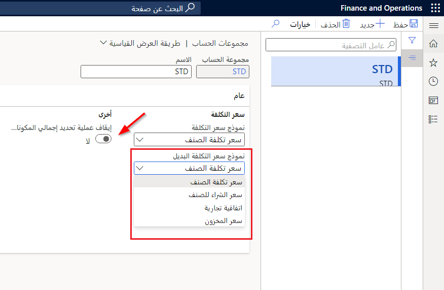

يمكنك تحديد مجموعات الحساب في **مجموعات الحساب > إعداد سياسات التكلفة المحددة مسبقاً> إدارة التكلفة**.

تتيح لك مجموعات الحساب التي تم تعيينها للأصناف تحديد كيفية الحصول على تكلفة أو سعر المبيعات للمكونات، كما هو موضح بواسطة مجموعة الحساب، من أجل الحساب. في صفحة  **مجموعات الحساب** ، يمكنك تحديد **نموذج سعر التكلفة**، **نموذج سعر التكلفة البديل**، **نموذج سعر المبيعات**، و **تحذيرات**.

من خلال تعيين مجموعات الحساب للأصناف، يمكنك تحديد كيفية حساب سعر التكلفة / المبيعات لمكون قائمة مكونات الصنف. يمكنك أيضاً تعيين مجموعة حساب قائمة مكونات الصنف للأصناف بحيث يُنشئ حساب قائمة مكونات الصنف رسائل تحذير حول المصادر المحتملة لأخطاء الحساب.

لإعداد مجموعات الحساب، حدد **إدارة المخزون والمستودعات > الإعداد > التكلفة >مجموعات الحساب**. تحتوي مجموعات الحساب على إعدادات تُستخدم في حسابات قائمة مكونات الصنف، بما في ذلك:

-   نموذج سعر التكلفة
-   نموذج سعر المبيعات
-   تحذيرات

تحدد هذه الإعدادات كيفية حساب أسعار التكلفة والمبيعات وما إذا كانت تظهر التحذيرات أثناء عملية الحساب أم لا. عند إعداد عناصر مجموعة حساب وتعيينها لقيمة افتراضية، يمكن إجراء حسابات قائمة مكونات الصنف.

## نموذج سعر التكلفة

من خلال تعيين الحقل **نموذج سعر التكلفة**، يمكنك الإشارة إلى مصدر بيانات مساهمة تكلفة المكون الذي تم شراؤه أثناء حساب التكلفة المخططة للصنف المصنّع. تحسب بعض الشركات المصنعة التكاليف المخططة باستخدام اتفاقيات تجارة سعر الشراء للمكونات المشتراة أو أساس آخر، مثل سجلات سعر الشراء في إصدار التكلفة.

الخيارات الأربعة **لنموذج سعر التكلفة** تكون:

-   **سعر تكلفة الصنف** - سعر التكلفة من جدول **المنتج الصادر** أو يتم استخدام مجموعة أبعاد الصنف كسعر التكلفة.

-   **سعر شراء الصنف** - سعر الشراء **سعر التكلفة** من الحقل **شراء** علامة التبويب **منتج صادر** من صفحة قائمة مستخدمة.

-   **اتفاقية التجارة** - يمكنك تكوين اتفاقيات التجارة لمجموعات محددة من الأصناف والموردين أو لمواقع محددة. بعد ذلك، عند تحديد الخيار **اتفاقية التجارة** ، سيتم استخدام اتفاقية التجارة التي أنشأتها لسعر الشراء، جنباً إلى جنب مع الصنف والموقع.

-   **سعر المخزون** - تُستخدم قيمة المخزون الحالية للصنف لحساب تكلفة الوحدة في حساب قائمة مكونات الصنف. يتم حساب سعر تكلفة الوحدة فقط إذا كانت الكمية المُرحلة والكمية الفعلية أكبر من 0 (صفر).

 

## نموذج سعر التكلفة البديل

الحقل **نموذج سعر التكلفة البديل** يحتوي على نفس الخيارات مثل **نموذج سعر التكلفة** . ومع ذلك، يتم استخدام هذا الحقل فقط عندما يتعذر العثور على السعر في نموذج سعر التكلفة الأساسي.

## نموذج سعر المبيعات

من خلال تعيين الحقل **نموذج سعر المبيعات** يمكنك الإشارة إلى كيفية استخدام بيانات الصنف لحساب سعر المبيعات المقترح. يمكنك تحديد سعر مبيعات الصنف أو مجموعة التكلفة.

ترغب بعض الشركات المصنعة في حساب سعر المبيعات المقترح للأصناف المصنعة. يمكن أن يعكس سعر المبيعات المحسوب نهج السعر المتداول الذي يستند إلى سجل سعر مبيعات المكون. وبدلاً من ذلك، يمكن أن يعكس سعر المبيعات المحسوب نهج التكلفة زائد القيمة المضافة التي تستند إلى تكلفة المكون ونسبة الربح المطبقة، والتي ترتبط بمجموعة تكاليف الصنف.

الخياران لحساب حقل **نموذج سعر المبيعات** هما:

-   **مجموعة التكلفة** - عند تحديد هذا الخيار، يتم حساب سعر المبيعات استناداً إلى سعر التكلفة ونسبة إعداد الربح من مجموعة التكلفة.

-   **سعر بيع الصنف** - عند تحديد هذا الخيار، يكون سعر المبيعات على  **بيع** ثم استخدام علامة التبويب السريعة من الجدول **المنتج الصادر**.

 

## إيقاف عملية تحديد إجمالي المكونات المطلوبة

باستخدام الحقل **إيقاف الانفجار** يمكنك الإشارة إلى أنه يجب معاملة الصنف المصنّع على أنه عنصر تم شراؤه لأغراض تجميع التكلفة أثناء حساب قائمة مكونات الصنف.

تتضمن السيناريوهات النموذجية صنفاً تم شراؤه يتم تصنيعه أحياناً أو عنصر مصنّع يتم شراؤه الآن. يتم أولاً تعيين الصنف على أنه صنف مصنّع لتحديد قائمة مكونات الصنف ومعلومات المسار ولدعم أوامر الإنتاج للصنف. ومع ذلك، تمنع علامة إيقاف الانفجار حسابات التكلفة من استخدام قائمة مكونات الصنف والمسار. بدلاً من ذلك، يستخدم حساب قائمة مكونات الصنف التكاليف المحددة للصنف.

عادة، ستترك قيمة **إيقاف الانفجار** بـ **لا**.

 

اعتماداً على الموقع، لا يزال من الممكن حساب تكلفة الصنف باستخدام حسابات قائمة مكونات الصنف. يتم إيقاف انفجار أوامر الشراء المخططة وأوامر الإنتاج في قائمة مكونات الصنف التي ترتبط مكوناتها بمجموعة الحساب التي تم تحديد خيار **إيقاف الانفجار** .

يُنشئ التخطيط الرئيسي الأوامر المخططة في قائمة مكونات الصنف، وليس على الأصناف المضمنة في قائمة مكونات الصنف. بشكل أساسي، من خلال تحديد هذا الخيار، فإنك تحدد عدم إضافة تكلفة إلى حساب قائمة مكونات الصنف للأصناف التي تحتوي على مجموعة الحساب هذه.

## تحذيرات

ضمن قسم **تحذيرات** ، يمكنك تحديد خيارات أي رسائل تحذير يجب أن يتلقاها المستخدمون عند إجراء حسابات قائمة مكونات الصنف.

 

على سبيل المثال، إذا حددت خانة الاختيار **No BOM** ، فسيتلقى المستخدم تحذيراً إذا لم يتم العثور على إصدار BOM نشط لأحد المكونات أو الصنف الأصل الذي يتم تشغيل حساب قائمة مكونات الصنف له.

إذا قمت بتحديد خانة الاختيار **عدم تحديد مسار** ، يتلقى المستخدم تحذيراً إذا لم يتم العثور على إصدار مسار نشط. إذا كنت تستخدم موارد على مساراتك وعملياتك، يمكنك توجيه النظام للتحقق من هذه الموارد. بعد ذلك، إذا لم يتم العثور على مورد في كل سطر في المسار النشط، فسيتلقى المستخدم تحذيراً.

يمكنك أيضاً التحقق من الاستهلاك والتحقق منه. الاستهلاك هو الكمية الموجودة في مسار معين. نموذجياً، يمثل مقدار الوقت المطلوب لتنفيذ عملية معينة لعملية إنتاج. يمكنك التحقق مما إذا كان عنصر ما ليس له سعر تكلفة. إذا لم يكن هناك سعر تكلفة نشط لأحد الأصناف، فلن تتم إضافة أي تكلفة إلى حساب قائمة مكونات الصنف.

يمكنك أيضاً التحقق من عمر سعر التكلفة والتحقق منه.

 

على سبيل المثال، لقد أدخلت  **60** في **ماكس. عمر سعر التكلفة** للإشارة إلى وجوب إعادة تقييم سعر تكلفة الوحدة بعد 60 يوماً. إذا تم الوصول إلى هذا الحد، فسيقوم النظام بإنشاء تحذير. على سبيل المثال، تم إدخال سعر التكلفة لأحد الأصناف في شهر يناير من هذا العام. إذا كان شهر أغسطس الآن، أي بعد أكثر من 60 يوماً من إدخال سعر التكلفة، يتلقى المستخدم تحذيراً عند تشغيل حساب قائمة مكونات الصنف.

 

يمكنك إدخال نسبة مئوية في الحقل **الحد الأدنى لهامش المساهمة** . تشير هذه القيمة إلى النقطة التي لا يتم عندها الوفاء بالحد الأدنى لهامش المساهمة. إذا لم يتم استيفاء هامش المساهمة لمكون معين، يتلقى المستخدم تحذيراً. لذلك، يساعد هذا الحقل على ضمان عدم تقليل التكاليف وتكاليف النقل الإضافية التي قد تكون مطلوبة للعناصر الخاصة بك.

## الإعداد الافتراضي في معلمات إدارة المخزون والمستودعات

لتشغيل حساب قائمة مكونات الصنف، يجب عليك إما إعداد مجموعات الحساب وتعيينها لعناصر فردية أو تعيين مجموعة حساب افتراضية. يتم بعد ذلك استخدام إعدادات الحساب من مجموعة الحساب كقيم افتراضية في صفحة **حساب قائمة مكونات الصنف** في وقت حساب قائمة مكونات الصنف. يمكنك إعداد المعايير الافتراضية في **إدارة المخزون > الإعداد >معايير المخزون والمستودعات > محاسبة المخزون > مجموعة الحساب**.

يمكن أيضاً إدراج مجموعة الحساب الافتراضية في **إدارة التكلفة >إعداد سياسات محاسبة المخزون > معايير** صفحة، أو مجموعة حساب خاصة بالمنتج مطلوبة في صفحة **تفاصيل المنتج الصادر**.

يبحث النظام أولاً عن إعداد مجموعة الحساب في صفحة **تفاصيل المنتج الصادر**. إذا لم يعثر النظام على مجموعة حساب هناك، فإنه يبحث في صفحة إعدادات **معايير**.

إذا لم يتمكن النظام من العثور على مجموعة حساب، يتلقى المستخدم رسالة خطأ أثناء الحساب. تحتوي مجموعة الحساب على سياسات لنموذج سعر التكلفة ونموذج سعر المبيعات وقائمة مراجعة التحذيرات. تُستخدم إعدادات الحساب من مجموعة الحساب كقيم افتراضية في صفحة **حساب قائمة مكونات الصنف** في وقت حساب قائمة مكونات الصنف.

من خلال إعداد مجموعة تكوين افتراضية، يمكنك أيضاً تكوين شروط التحذير التي تطالب المستخدمين أثناء عملية حساب قائمة مكونات الصنف، إذا كانت المكونات المحددة قد تسبب أخطاء في الحساب.

نظراً لأن مجموعات الحساب مطلوبة لتشغيل العمليات الحسابية، يجب عليك إعداد مجموعة حساب افتراضية في محددات إدارة المخزون. يمكّن هذا الإعداد الشركات من الحصول على مجموعة تكلفة قياسية وإعداد ربح لجميع الأصناف. بعد ذلك، إذا كان لعنصر معين متطلبات حساب خاصة، يمكن للمستخدم تعيين مجموعة حساب مختلفة لهذا الصنف.

عادةً، يمكنك تعيين مجموعات الحساب على أصناف مكونات قائمة مكونات الصنف بدلاً من أصناف قائمة مكونات الصنف. ومع ذلك، عند عرض رسائل التحذير، يمكن تطبيق مجموعات الحساب. تتجاوز مجموعة الحساب التي تم تعيينها للأصناف القيمة الافتراضية التي تم إعدادها في محددات إدارة المخزون.
