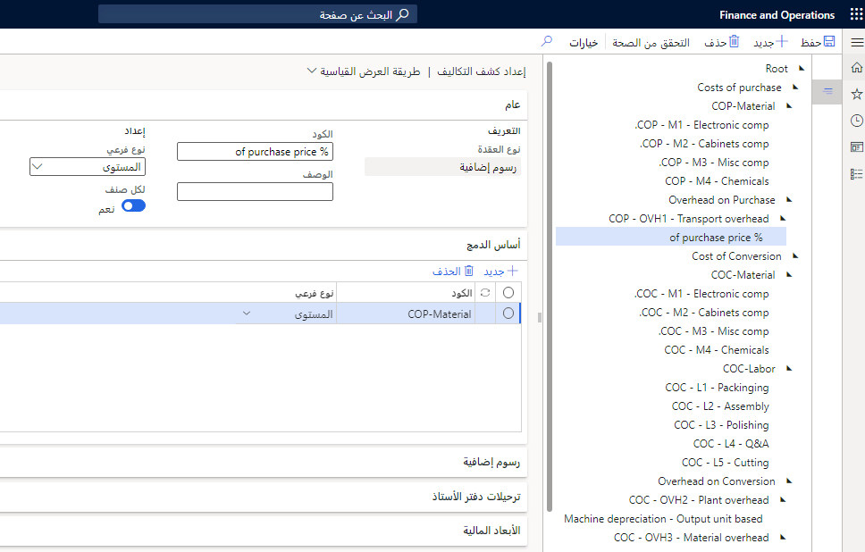
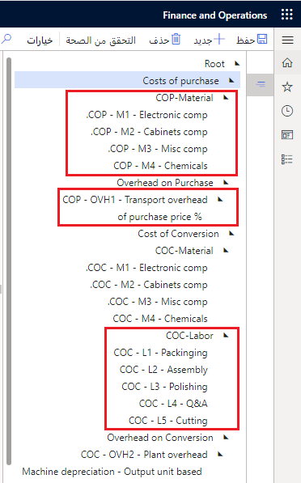
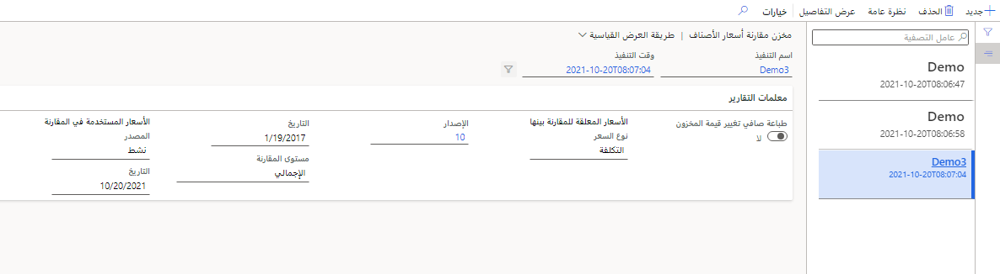
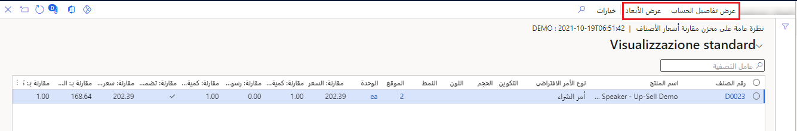

كشف التكلفة هو عرض منسق للمعلومات المتعلقة بتكلفة البضائع التي يتم بيعها لصنف مصنع أو أمر إنتاج.

يتضمن إعداد كشف التكلفة مهمتين:

- تحديد التنسيق المُستخدم لعرض معلومات تكلفة البضائع المبيعة حول صنف مصنّع أو أمر إنتاج. ويطلق على العرض المنسق مصطلح كشف التكلفة.

- تحديد أساس حساب التكاليف غير المباشرة. يعتمد إعداد كشف التكلفة على ميزة مجموعة التكلفة لعرض المعلومات ومعادلات حساب التكلفة غير المباشرة. ويتم وصف الهدفين الخاصين بإعداد كشف التكلفة في هذه المقالة.

**إدارة التكلفة > إعداد سياسات محاسبة التكاليف غير المباشرة > كشوف التكلفة**

 

عند إعداد كشف التكلفة، يمكنك تحديد تنسيق المعلومات وكذلك تحديد أساس حساب التكاليف غير المباشرة.
يعتمد إعداد كشف التكلفة على ميزات مجموعة التكلفة لعرض المعلومات والمعادلات التي يتم استخدامها لحساب التكلفة غير المباشرة.

## تحديد التنسيق الخاص بكشف التكلفة 

يقوم تنسيق كشف التكلفة الذي يعرّفه المستخدم بتحديد تقسيم التكاليف التي تحتوي على تكلفة البضائع المبيعة الخاصة بالصنف المصنّع.

على سبيل المثال، يمكن تقسيم المعلومات المتعلقة بتكلفة البضائع المبيعة لأحد الأصناف إلى المواد والعمالة والنفقات العامة، استناداً إلى مجموعات التكلفة.
يتم تعيين مجموعات التكلفة هذه للأصناف وفئات التكلفة لعمليات التوجيه ومعادلات حساب التكلفة غير المباشرة.

 

عاده ما يتطلب تنسيق كشف التكلفة إجماليات متوسطة عند تحديد مجموعات تكلفة متعددة. علي سبيل المثال، يمكن تجميع مجموعات التكلفة المتعددة المرتبطة بالمواد. يعد تعريف تنسيق كشف التكلفة اختيارياً، ولكن يجب تحديد تنسيق ورقة التكلفة إذا كان سيتم حساب تكلفة غير مباشرة.

يحدد كشف التكلفة التنسيق الخاص بعرض معلومات التكلفة الخاصة بالصنف المصنّع والعناصر التي سيتم تضمينها في حساب نفقات التصنيع العامة.

ويتكون كل مستوي في كشف التكلفة من عقدة تتكون من الإجماليات والإجماليات الفرعية. تستند الإجماليات والإجماليات الفرعية إلى قائمة مجموعة التكلفة. أنواع العُقد الثلاثة هي:

-   العُقد الجذر
-   العُقد الأصلية لنوع السعر
-   العُقد التابعة لمجموعة التكاليف والأنواع الإجمالية

يجب حساب العقدة من النوع التابع لمجموعة التكاليف المرتبطة بمجموعة تكاليف غير مباشرة. 

عند تحديد نوع مجموعة تكلفة كعقدة، يمكنك إضافة العقد الفرعية مثل السعر والمصاريف الزائدة ثم تحديد نسب المصاريف الزائدة ومبالغ الأسعار.

## حدد أساس حساب التكاليف غير المباشرة

تعكس التكلفة غير المباشرة نفقات التصنيع العامة المرتبطة بإنتاج الصنف المصنّع. يمكن التعبير عن معادلة حساب التكلفة غير مباشرة إما بصفتها مصاريف زائدة أو أسعار.

تمثل المصاريف الإضافية نسبة مئوية من القيمة، بينما يمثل السعر مبلغاً لكل ساعة في عملية التوجيه. تحدد مجموعة التكلفة أساس معادلة الحساب، مثل مصاريف زائدة بنسبة 100 في المائة لمجموعة تكلفة العمالة أو 50 دولاراً أمريكياً في الساعة لمجموعة تكلفة الجهاز‬.

إذا كنت تريد تحديد معادلة حساب وأساس مجموعة التكلفة الخاصة بها، فإن إعداد كشف التكلفة يتطلب منك تحديد مجموعة التكلفة التي تمثل النفقات العامة ثم تحديد ما إذا كان يتم استخدام نهج المصاريف الزائدة أو السعر.

يجب إدخال كل معادلة حساب كسجل تكلفة. يتكون سجل التكلفة من إصدار تكلفة محدد ونسبة مصاريف زائدة أو مبلغ السعر وأساس مجموعة التكلفة والحالة وتاريخ السريان.

عندما يتم إدخال سجل تكلفة لأول مرة، تكون حالته "معلق" ويكون لديه تاريخ سريان. عند تنشيط سجل التكلفة، يتم تحديث الحالة بحيث يكون السجل هو السجل النشط الحالي ويتم تحديث تاريخ السريان إلى تاريخ التنشيط. يمكن أن يحدد سجل التكلفة أيضاً موقعاً لمعادلة حساب خاصة بالموقع.

بدلاً من ذلك، يمكنك ترك حقل **الموقع** فارغاً للإشارة إلى أن معادلة الحساب هي معادلة تُستخدم على مستوى الشركة بأكملها. يمكن أن يتكون سجل التكلفة اختيارياً من صنف محدد أو مجموعة أصناف عند تحديد صيغة الحساب كمعادلة لكل صنف.

تُستخدم سجلات التكلفة النشطة الحالية لمعادلات حساب التكلفة غير المباشرة لتقدير تكاليف أمر الإنتاج. يتم استخدامها أيضاً لحساب التكاليف الفعلية المرتبطة بالاستهلاك الفعلي للوقت والمواد. تُستخدم سجلات التكلفة المعلقة في حسابات قائمة مكونات الصنف (BOM) لتاريخ مستقبلي.

تحدد سياستا حظر لإصدار التكلفة ما إذا كان يمكن الحفاظ على التكاليف المعلقة وما إذا كان يمكن بدء التكلفة المعلقة.
استخدم سياستا الحظر للسماح بصيانة البيانات ولمنع صيانة على البيانات فيما يتعلق ببيانات التكلفة في إصدار التكلفة.

بعد قيامك بتحديد تنسيق كشف التكلفة وحسابات التكاليف غير المباشرة، قم بتنفيذ خطوة منفصلة للتحقق من صحة المعلومات وحفظها. يمثل كشف التكلفة تنسيقاً على مستوى الشركة لعرض المعلومات حول تكاليف البضائع المبيعة باستمرار.

يتم عرض كشف التكلفة كجزء من صفحة **حساب تكلفة الصنف**. يمكن عرض كشف التكلفة لسجل التكلفة المحسوبة لصنف مصنّع على صفحة **صفحة سعر الصنف** أو لسجل حساب خاص بالأمر في صفحة **نتائج حسابات BOM**. كما يمكن عرضه كجزء من صفحة **حساب السعر** لأمر إنتاج.

شاهد العرض التوضيحي التالي حول كيفية التعامل مع كشف التكلفة في Supply Chain Management.

> [!VIDEO https://www.microsoft.com/videoplayer/embed/RE47UCW]

## مقارنة تخزين أسعار الأصناف

ستعمل وظيفة **مقارنة تخزين أسعار الأصناف**، على سبيل المثال، على مقارنة التكلفة القياسية النشطة الحالية بالتكلفة القياسية المعلقة للعام المقبل. يمكن أن يكون لأكثر من 50000 صنف ويمكن تصفية التفاصيل حسب المنتج والموقع ومجموعة التكلفة.

عند إنشاء التقرير، قم بتوفير اسم فريد لذلك التقرير، والذي يمكن إعادة عرضه في أي وقت. سيكون لكل تقرير تكوين، والذي يمكنك تعيينه في **إدارة التكلفة > الاستعلامات والتقارير > تقارير التكلفة المحددة مسبقاً > مقارنة وحدة تخزين أسعار الأصناف**:

يمكن لتقرير التفاصيل المعروض أدناه تصفية النتائج وفرزها. الحساب الرئيسي هو **صافي سعر وحدة التغيير**. ستقوم الصفحة بضبط الأعمدة ديناميكياً ويمكنك التنقل لأسفل إلى **تفاصيل الحساب**. بالإضافة إلى ذلك، يمكنك تضمين أبعاد المنتج المختلفة في النموذج.   
 

