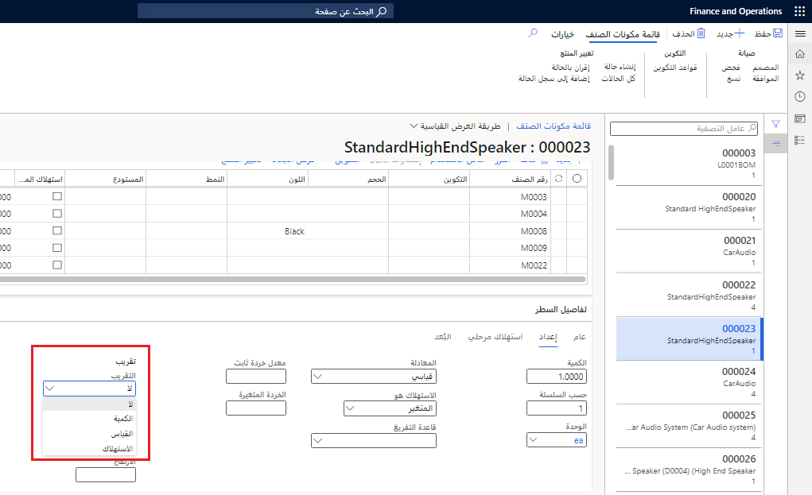

تُعد قياسات قائمة مكونات الصنف (BOM) نوعاً من التكوين. يمكن تحديد الأبعاد التالية كقياسات BOM:

-   الارتفاع
-   العرض
-   العمق
-   الكثافة

يمكنك استخدام تكوينات القياس لتقليل عدد إصدارات BOM. بعبارة أخرى، سيتعين عليك فقط إنشاء إصدار BOM واحد لمجموعة من الأصناف يكون الاختلاف الوحيد بينها في القياسات الخاصة بها.

على سبيل المثال، تصنع إحدى الشركات الطاولات المتداخلة في مجموعات من ثلاث طاولات.
وتكون جميع الطاولات متطابقة فيما يتعلق بعمليات الإنتاج والمواد. ولا تختلف الطاولات فيما بينها إلا فيما يتعلق بالارتفاع والعرض والعمق. وباستخدام تكوينات القياس، يمكن إنتاج هذه الطاولات المتداخلة باستخدام قائمة BOM واحدة.

يمكنك أيضاً استخدام أسلوب التقريب لأعلى لتوجيه كيفية تطبيق القياسات والاستهلاك.

## قياسات BOM المحددة في سطور BOM

نظراً لأن جميع مكونات BOM المطلوبة لعمل منتج نهائي واحد تكون معروضة في سطور BOM، ولأن كل سطر BOM يجب أن يحتوي على معلومات حول تخطيط المواد وحسابها واستهلاكها، يمكنك أيضاً تحديد المعلمات التالية:

-   ما إذا كان للصنف إيه تكوينات

-   ما تلك التكوينات

ويمكن بعد ذلك استخدام تكوينات القياس عند حساب استهلاك المادة الخام لكل سطر من سطور BOM.

### مثال - حساب الاستهلاك بناءً على الحجم

تقدم الشركة خزانة مكبر صوت بأحجام متنوعة، مثل 16x38 بوصة، و14x36 بوصة، و18x50 بوصة. تتطلب هذه الخزانة المكونات نفسها في أثناء الإنتاج، ولكن اعتماداً على الحجم المحدد للجزء النهائي، ستختلف كمية بعض المكونات.

في حالة استخدام وظيفة قياسات BOM، يتم إنشاء قائمة BOM واحدة فقط ويتم استخدامها لكل الأحجام المختلفة. وتوفر الخزانة النهائية الأبعاد المطلوبة، ويستخدم كل سطر من سطور BOM هذه الأبعاد لحساب الكمية المناسبة من أصناف المكونات التي يمكن استخدامها في أثناء الإنتاج.

## إعداد تكوينات القياس

يتم تحديد تكوينات القياس في علامة التبويب **إعداد** في الصفحة **سطر BOM**. حدد **معلومات المنتج وإدارته > قوائم مكونات الصنف والمعادلات > قوائم مكونات الصنف**. حدد BOM، ثم في السطور، حدد علامة التبويب **إعداد**، ثم أدخل المعلومات التالية:

-   معادلة بُعد القياس التي تُستخدم لحساب استهلاك المواد.

-   ما إذا كان سيتم تقريب الحساب. وإذا كان الأمر كذلك، فحدد الطريقة والعامل الذي يتم ذلك بواسطته.

-   أبعاد القياس ذات الصلة في مجموعة القياس.

عند اكتمال الإعداد، يمكنك حساب الاستهلاك من خلال تشغيل حساب BOM أو تقدير التكلفة.

وتتمثل خيارات حساب الاستهلاك فيما يلي:

-   **القياسي** - لا يتناسب الاستهلاك مع أي بُعد للمنتج النهائي، والقيمة التي تم إدخالها في حقل **الكمية** هي الرقم المستخدم للمنتج النهائي.

-   **الارتفاع*ثابت** - يتناسب الاستهلاك مع الارتفاع فقط.

-   **الارتفاع * العرض * ثابت** - يتناسب الاستهلاك مع الارتفاع والعرض.

-   **الارتفاع * العرض * العمق * ثابت** - يتناسب الاستهلاك مع الارتفاع والعرض والعمق.

-   **(الارتفاع * العرض * العمق/الكثافة) * ثابت** - يتناسب الاستهلاك مع الارتفاع والعرض والعمق/الكثافة.

تتمثل خيارات الاستهلاك المستخدمة للقياس فيما يلي:

-   **المتغير** - يتناسب عدد الوحدات في المنتج النهائي مع عدد الأصناف التي تم إنتاجها. يتم حساب الاستهلاك المتغير بالطريقة التالية: كمية الإنتاج x الكمية (في قائمة BOM) = الاستهلاك (المتغير). يتساوى استهلاك الوحدات مع الكمية الموجودة في قائمة BOM.
-   **ثابت** - هذا الخيار هو كمية ثابتة مطلوبة للإنتاج، بغض النظر عن الكمية التي يتم إنتاجها.

تحدد **قاعدة التفريغ** كيفية استهلاك المكون. في حالة ترك هذا الحقل فارغاً، يتم استخدام إعداد "قاعدة التفريغ" الخاص بالصنف. الخيارات الموجودة في هذا الحقل هي:

-   **البدء** - يتم تمكين الاستهلاك التلقائي عندما يقوم المستخدم بتحديث أمر إنتاج لمرحلة البدء.
-   **إنهاء** - يتم تمكين الاستهلاك التلقائي عندما يقوم المستخدم بتحديث أمر إنتاج للتقرير كمرحلة منتهية.
-   **يدوي** - لا يتم تسجيل الاستهلاك تلقائياً. ويجب إدخاله يدوياً في قائمة الانتقاء.

## خيارات التقريب لأعلى

تتمثل خيارات التقريب لأعلى فيما يلي:

-   **لا** - لا يتم استخدام التقريب لأعلى.

-   **الكمية** - عند التقريب لأعلى وفقاً للكمية، يجب أن تكون الكمية مضاعفاً للكمية المعطاة.

-   **القياس** - يتم استخدام التقريب لأعلى وفقاً للقياسات عندما تأتي مادة خام في أبعاد محددة.

-   **الاستهلاك** - عند التقريب لأعلى وفقاً للاستهلاك، يتم تقريب الاستهلاك المقدر لأعلى بحيث يكون قابلاً للقسمة على عدد الوحدات التي تأتي بها المادة الخام.

 

### مثال

يتم تخزين الطلاء في المخزون في عبوات سعة 25 لتراً وعندما يتم سحبه من المخزون، يتم السحب بزيادة عبوة سعة 25 لتراً وفي هذه الحالة، يحدد المستخدم التقريب للأعلى وفقاً للاستهلاك ويعين المضاعفات على 25. تكون كمية الإنتاج للمنتج النهائي 20 وحدة، ويتم استخدام 2 كوارت من الطلاء لكل وحدة. يتم حساب الاستهلاك بمعدل 20 وحدة x 2 كوارت = 40 لتراً

عند تقريبه إلى رقم يمثل أحد مضاعفات الرقم 25، يقرر المستخدم أن المطلوب هو 50 كوارت من الطلاء.
وعند التقريب لأعلى وفقاً للاستهلاك، يتم تلقائياً حساب 10 كوارت كاستهلاك زائد أو خردة.

## عامل تحويل القياس

عوامل التحويل هي عمليات حسابية تمثل الفرق بين قياسات المنتج القياسي وقياسات مكونات BOM.

لحساب استهلاك المواد الخام، حدد عوامل التحويل للارتفاع والعرض والعمق والكثافة، إذا كانت هذه القيم متناسبة مع تلك التي تم تحديدها. يمكن القيام بهذا التحديد في المواقع التالية:

-   في سطر BOM عند إجراء عملية حسابية
-   في أمر الإنتاج عند تشغيل تقدير التكلفة

تعرض الحقول الموجودة في علامة التبويب **البُعد** في الصفحة **سطر BOM** عوامل التحويل المضمنة في حساب القياس بالإضافة إلى بُعد المنتج النهائي.

### المثال 1

تخزن شركة ما المعادن في 3 صفائح بطول متر واحد. وعند إنشاء مصباح، تتطلب قائمة BOM صفائح معدنية مقاس 1 x 0.75 متر. عامل التحويل في هذا المثال هو 0.333 للارتفاع و0.75 للعرض (1/3 = 0.3333 و0.75/1 = 0.75).

تتم إضافة هذه المبالغ إلى سطور مكونات BOM. عند حساب الاستهلاك للصنف، يتم ضرب القياسات القياسية في عوامل التحويل. ينتج عن هذه العملية الحسابية استهلاك مكون BOM (الكمية).

### المثال 2

في شركة USMF، يتميز **حامل مكبر الصوت الأمامي المصبوغ** **لحامل مكبر الصوت الأمامي المرفق مقاس 18 X 50 بوصة** بأبعاد ارتفاع قياسية تبلغ **2** (قدم).
بعد مراقبة حامل مكبر الصوت، قرر فريق الإنتاج أنه بالنسبة لـ BOM 7037-1-1، فإن حامل السماعة الأمامية له بُعد ارتفاع **3** (قدم). ويكون عامل التحويل لمكون BOM هو 1.5 (3/2).

وطُلب من أوسكار، مهندس العمليات، تحديث الأبعاد التي اكتشفها فريق الإنتاج في الصنف وقائمة BOM، ثم إجراء العملية الحسابية لصنف واحد ثم لـ 50 صنفاً لتحديد الفرق في الاستهلاك.
