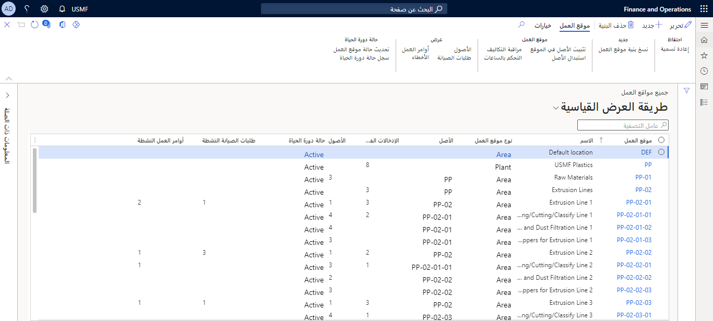

يمكنك استخدام مواقع العمل في إدارة الأصول بطرق عديدة. على سبيل المثال، يمكنك استخدام مواقع العمل للمساعدة في:
 
- إدارة العديد من الأصول المتشابهة والتي لها سلوك مشابه. 
- إدارة مواقع العمل المرتبطة بالعملية التي تعمل مع سير العمل. 
- تمثيل المواقع الجغرافية أو المواقع داخل شركتك. 

قبل إنشاء مواقع العمل، يجب عليك فهم المفاهيم والوظائف الأساسية الخاصة بها. وتتضمن المهام الرئيسية التي يمكنك تنفيذها باستخدام مواقع العمل ما يلي:

- تتبع الطلبات النشطة وأوامر العمل المرتبطة بالأصول المثبتة. 
- إعداد تسلسلات الصيانة للصيانة الوقائية والتفاعلية.
- إدارة الأصول المثبتة. 
- تعقب الأخطاء التي تم تسجيلها في أصول محددة. 
- تعقب التكاليف الخاصة بالصيانة في الأصول المرتبطة بموقع عمل في أي وقت محدد. 
- إعداد متطلبات مواصفات الأصول ومواقع العمل. 

عندما تقوم بإعداد مواقع العمل واستخدامها في التطبيق، فمن المهم معرفة أن كل موقع عمل يُدار بشكل مستقل في إدارة الأصول. لإعداد مواقع العمل، ستستخدم صفحة **كل مواقع العمل**. 

 
## إنشاء موقع عمل افتراضي
يجب عليك إعداد موقع يُستخدم باعتباره الافتراضي عند إنشاء أصل جديد. نظراً لأن هذا الموقع هو الافتراضي، يمكن تغيير موقع العمل بواسطة المستخدم إذا لزم الأمر. 

اتبع الخطوات التالية لإنشاء موقع عمل افتراضي:

1.  انتقل إلى **إدارة الأصول > شائع > مواقع العمل > كل مواقع العمل**. 
2.  في صفحة **كل مواقع العمل**، حدد **جديد** في جزء الإجراءات. 
3.  حدد **موقع العمل**، والذي يعد تعريف موقع العمل، ولذلك يجب أن يكون معرّفاً فريداً. يمكنك استخدام التسلسلات الرقمية في التطبيق لتعيين معرّف تلقائياً استناداً إلى نظام ترقيم تحدده مؤسستك. على سبيل المثال، قد يكون نظام معرّف موقع العمل هو **LOC-##-012**.

 > [!NOTE]
 > يتم إنشاء التسلسلات الرقمية وصيانتها في **إدارة المؤسسة > التسلسلات الرقمية > التسلسلات الرقمية**.

4.  أدخل اسماً في حقل **الاسم**. بالنسبة لهذا المثال، يمكن أن يكون الاسم هو **الموقع الافتراضي**. 
5.  حدد **الأصل** لموقع العمل. يمكنك تحديد أصل افتراضي في صفحة **معلمة إدارة الأصول** أو يمكنك تحديد موقع أصل من القائمة المنسدلة. ويمكن أيضاً اعتبار هذا الموقع موقعاً فرعياً في بنية. 
6.  حدد **نوع موقع العمل** من القائمة المنسدلة. يكون الحقل **نوع موقع العمل** مطلوباً. 
7.  حدد **موافق** لإنشاء موقع العمل الجديد. 

إذا كنت تقوم بإنشاء العديد من مواقع العمل المتشابهة، يمكنك استخدام ميزة نسخ بنية موقع العمل لنسخ الإعدادات الأساسية ثم تعديل موقع العمل حسب الحاجة. لنسخ بنية موقع العمل، اتبع الخطوات التالية:

1.  انتقل إلى **إدارة الأصول >شائع > مواقع العمل >كل مواقع العمل**.
2.  في صفحة قائمة **كل مواقع العمل**، حدد موقع العمل الذي ترغب في نسخه عن طريق تحديد خانة الاختيار الموجودة بجوار السجل، ثم حدد **نسخ بنية موقع العمل** في المجموعة **الجديدة** في جزء الإجراءات. سيتم عرض صفحة **نسخ بنية موقع العمل**.
3.  حدد اسم **موقع العمل الجديد** و **الأصل** المراد اللصق أسفله. 
4.  حدد **موافق**. 

