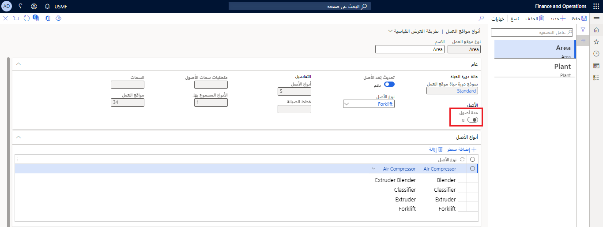
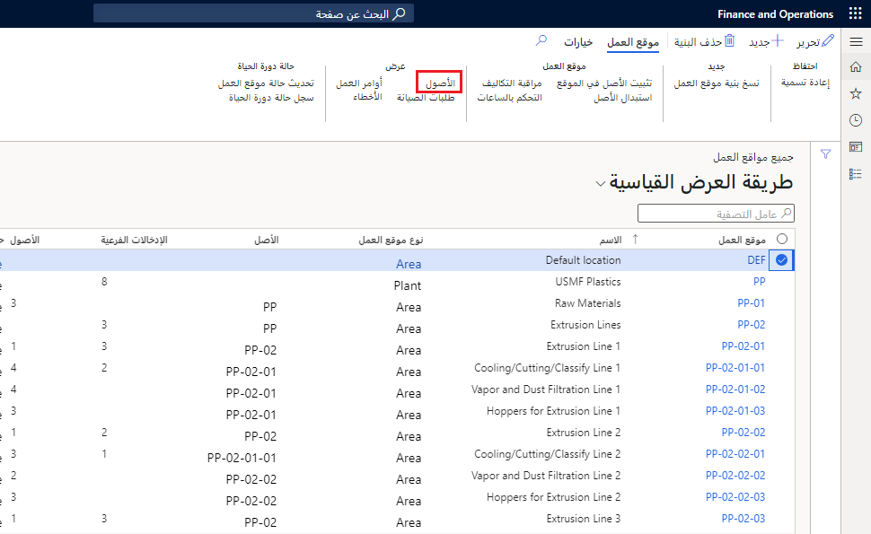

عندما تقوم بإعداد بُنى مواقع العمل، ستحتاج إلى تثبيت أصول في مواقع العمل الضرورية. ومن المهم أن تكون لديك أصول تم إعدادها في التطبيق قبل أن تبدأ هذه العملية. لمعرفة المزيد حول إعداد الأصول في Supply Chain Management، راجع [مقدمة حول الأصول](https://docs.microsoft.com/dynamics365/supply-chain/asset-management/objects/introduction-to-objects/?azure-portal=true). 

عند تثبيت الأصول في موقع العمل، يمكن تحويل الأبعاد المالية المحددة لموقع العمل إلى الأصول. يعتمد هذا السيناريو على إعداد نوع موقع العمل المحدد لموقع العمل هذا. 

إذا قمت بإنشاء بنية أصل، فيجب تثبيت البنية بأكملها في موقع العمل. وسيتم أيضاً تثبيت أي أصول تابعة (أصول فرعية) ذات صلة مرتبطة بالأصل في موقع العمل. في إدارة الأصول، يمكنك السماح بأصول أساسية متعددة أو عدم السماح بها في نوع موقع العمل. تتيح لك هذه الميزة تثبيت أصول متعددة في موقع العمل. يمكنك إكمال هذه المهمة في صفحة **‏‫أنواع مواقع العمل‬**.

 
بعد تثبيت الأصول في موقع العمل، يمكنك استبدال أصل أساسي أو بنية أصل إذا لزم الأمر. 

## تثبيت أصل في موقع العمل
اتبع الخطوات التالية لتثبيت أصل في موقع العمل:

1.  انتقل إلى **إدارة الأصول >شائع > مواقع العمل >كل مواقع العمل**.
2.  حدد موقع العمل الذي تريد تثبيت أصل فيه. 
3.  في علامة التبويب **موقع العمل** في جزء الإجراء، حدد **‬‏‫تثبيت أصل في الموقع**. سيتم عرض صفحة "‬‏‫تثبيت أصل في الموقع". 
4.  حدد الأصل الذي تقوم بتثبيته في موقع العمل هذا من القائمة المنسدلة **‏‏الأصل**. هذا الأصل هو **الأصل الأساسي** الذي تقوم بتثبيته. في حالة وجود أصول تابعة مرتبطة بالأصل الأساسي، فسيتم تضمينها تلقائياً في التثبيت.
5.  عند تحديد الأصل المراد تثبيته، سيتم عرض **السمات** المرتبطة بالأصل. يتم إعداد هذه السمات على الأصل. 
6.  في الحقل **‏‫سارٍ**، حدد التاريخ والوقت اللذين يكون فيهما تثبيت الأصل صالحاً. بعد تحديد التاريخ والوقت في الحقل، سيتم ربط تكاليف الأصول والأصول الفرعية بموقع العمل.
7.  حدد **موافق** لتثبيت الأصل. إذا كان الأصل مثبتاً بالفعل في موقع عمل آخر، فلن تتمكن من تثبيته في موقع غيره. 
8.  لعرض الأصول المثبتة في موقع عمل، حدد موقع عمل في صفحة قائمة **كل مواقع العمل** ثم في علامة التبويب **مواقع العمل** في جزء الإجراء، حدد **الأصول**. 

    
 
شاهد الفيديو التالي للحصول على عرض توضيحي حول كيفية إنشاء موقع عمل ثم تثبيت أصل في موقع العمل هذا.

 > [!VIDEO https://www.microsoft.com/videoplayer/embed/RE4ocwp]