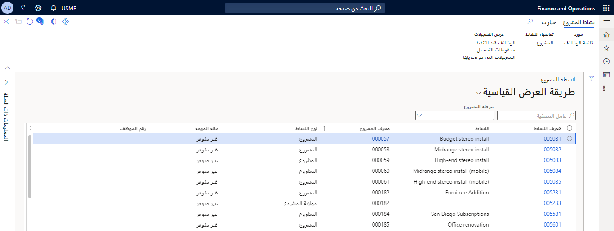
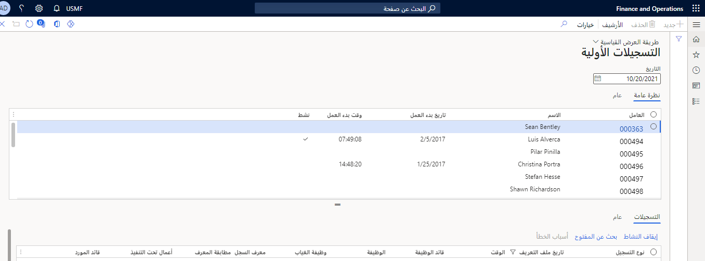
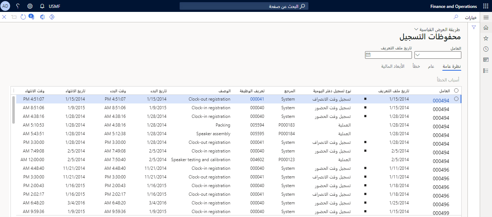
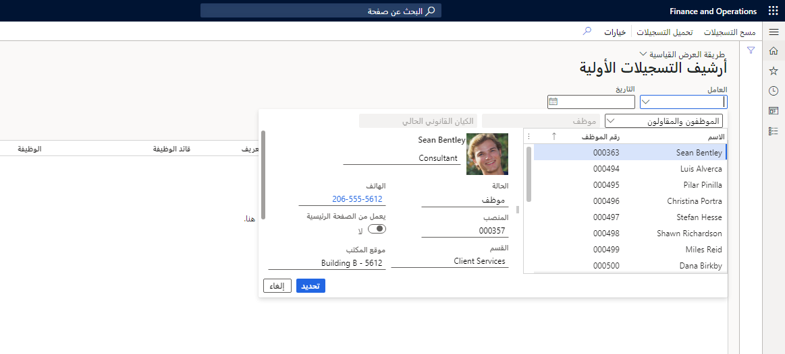
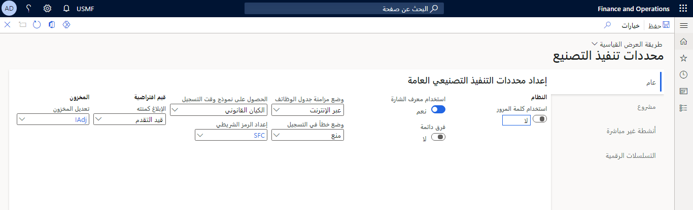
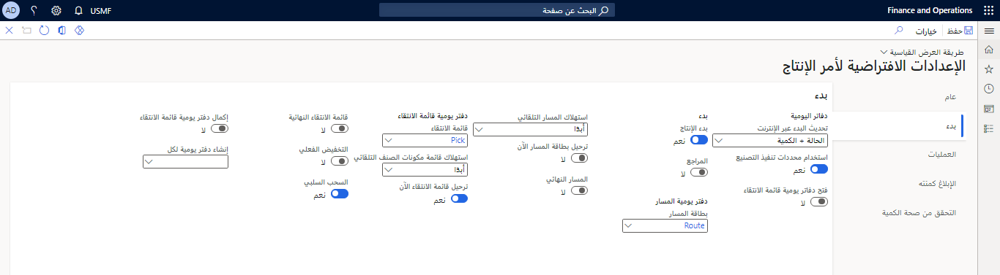
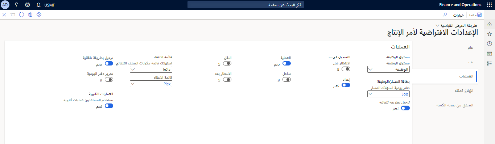
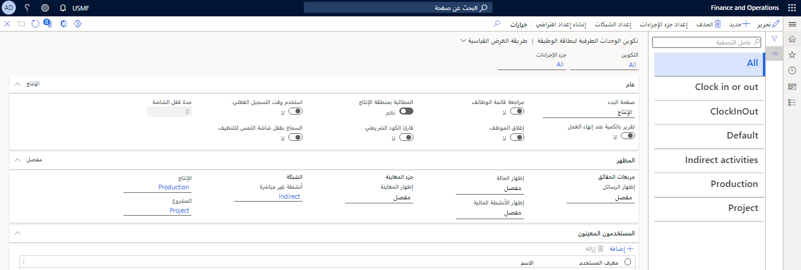
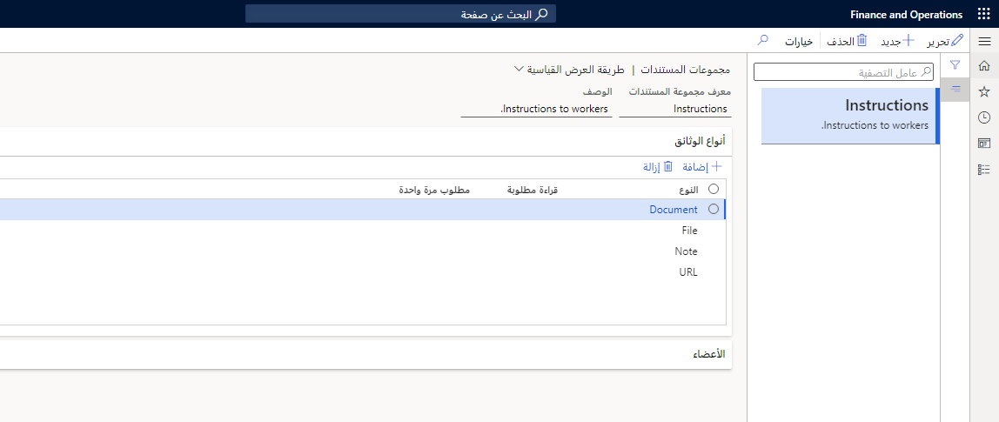

يتعلق تنفيذ التصنيع (ME) بإلقاء نظرة ثاقبة فورية على ما يحدث، مما يتيح للعاملين معرفة ما يجب القيام به، وبشأن توفير المعلومات المطلوبة لتوجيه العاملين وإرشادهم. بالإضافة إلى ذلك، يوفر تنفيذ التصنيع (ME) القدرة على تسجيل التكاليف ومراقبة الأداء وتتبع تاريخ الإنتاج، وهو أمر بالغ الأهمية لعملية تنفيذ التصنيع.

يهدف تنفيذ التصنيع في المقام الأول إلى الاستخدام من قبل شركات التصنيع. يمكن للعاملين تسجيل الوقت واستهلاك الأصناف في وظائف الإنتاج وأنشطة المشروع باستخدام صفحة **تسجيل الوظيفة**. 

تمت الموافقة على جميع التسجيلات ونقلها لاحقاً إلى وحدات Dynamics 365 Supply Chain Management النمطية ذات الصلة. الموافقة المستمرة على التسجيلات ونقلها المتواصل يمنح المديرين القدرة على تعقب التكاليف الفعلية بسهولة في أوامر الإنتاج.

يخدم تنفيذ التصنيع عدة أغراض في شركة تصنيع، بما في ذلك:

-   **إدارة الموارد** - تشمل المعلومات الأساسية حول الموارد (الأدوات، الأجهزة، العاملون، أو الموردون) وقدراتها ومتطلباتها. الهدف هو جدولة أوامر الإنتاج ومعالجتها باستخدام الموارد التي تتمتع بالإمكانيات والتوافر الصحيحين.

-   **جدولة الإنتاج** - تستخدم عملية الجدولة جميع المعلومات المتوفرة من الموارد والأنظمة الفرعية للتخطيط الرئيسي والمخزون لتحديد مقدار الإنتاج ثم كيفية الاستخدام الأمثل من الموارد المتاحة لتلبية متطلبات الطلب.

-   **معالجة أمر الإنتاج** - على الرغم من اكتمال التنفيذ الفعلي لأمر الإنتاج في الوحدة النمطية للتحكم بالإنتاج، يتكامل تنفيذ التصنيع (ME) مع الوحدة النمطية للتحكم بالإنتاج لتوفير تفاصيل حول الوقت والمواد التي يتم استهلاكها في وظائف أو عمليات محددة.

-   **تحليل الأداء وتتبعه** يتتبع تنفيذ التصنيع (ME) الحالة التفصيلية لأمر الإنتاج. هذا التحليل والتتبع مفيدان في توفير معلومات دقيقة عن أعمال تحت التنفيذ (WIP) أو إحصائيات أداء الموارد أو مؤشرات أداء أخرى. كما يوفر أيضاً القدرة على تتبع السجل الكامل للأوامر أو الدُفعات أو الأرقام التسلسلية التي تتم معالجتها.

يمكن العثور على العديد من الصفحات المرتبطة مباشرةً بتنفيذ التصنيع في الوحدة النمطية للتحكم بالإنتاج. تتضمن القائمة التالية العديد من هذه الصفحات.

**التحكم بالإنتاج > تنفيذ التصنيع > الوظائف والأنشطة > وظيفة الإنتاج**

-   **وظائف الإنتاج** - تعرض صفحة قائمة بجميع وظائف الإنتاج التي تم إصدارها لتنفيذ التصنيع.

-   **أنشطة المشروع** - تعرض صفحة قائمة بجميع أنشطة المشروع التي تم إصدارها لتنفيذ التصنيع.

    [ .](../media/project-activities.png#lightbox)

انتقل إلى **التحكم بالإنتاج > تنفيذ التصنيع > معالجه الرسائل** لإنشاء وإدارة الرسائل التي ستظهر في الصفحة **تسجيل الوظائف**.

**التحكم بالإنتاج > الاستعلامات والتقارير > تنفيذ التصنيع > التسجيلات الأولية**

-   **التسجيلات الأولية** - تعرض قائمة بكافة التسجيلات غير المؤرشفة.

    [ .](../media/raw-registrations.png#lightbox)

-   **محفوظات التسجيل** - تعرض قائمة بالتسجيلات التي تم تعديلها وتفاصيلها.

    [ .](../media/registration-history.png#lightbox)

-   **تسجيلات مرحَّلة** - تعرض قائمة مصفاة من التسجيلات التي تمت الموافقة عليها وترحيلها.

-   **أرشيف التسجيلات الأولية** - يعرض قائمة التسجيلات التي تمت أرشفتها.

    [ .](../media/raw-registrations-archive.png#lightbox)

**التحكم بالإنتاج > إعداد > تنفيذ التصنيع > محددات تنفيذ التصنيع**

-   **محددات تنفيذ التصنيع** - تقوم بإعداد محددات تنفيذ التصنيع في الوحدة النمطية للتحكم بالإنتاج.

    [ .](../media/manufacturing-execution-parameters.png#lightbox)

-   **الإعدادات الافتراضية لأمر الإنتاج** - تحدد المحددات التي تتكامل مع ميزات تنفيذ التصنيع بالوحدة النمطية للتحكم بالإنتاج.

    [.](../media/prod-order-default.png#lightbox)

-   **الإعدادات الافتراضية لأمر الإنتاج حسب الموقع** - تحدد المحددات الخاصة بالموقع التي تدمج ميزات تنفيذ التصنيع مع وحدة التحكم بالإنتاج.

    [.](../media/prod-order-default-by-site.png#lightbox)

-   **تكوين الوحدات الطرفية لبطاقة الوظيفة** - تقوم بتحرير صفحات التسجيل الحالية وتكوين صفحات التسجيل الجديدة.

    [.](../media/configure-job-card-terminal.png#lightbox)

-   **تكوين بطاقة وظيفة للأجهزة** - يعرض قائمة بالأجهزة الموجودة. يمكنك أيضاً استخدام هذه الصفحة لتغيير محددات الجهاز.

**التحكم بالإنتاج > إعداد > مجموعات المستندات** - تقوم بإعداد مجموعات المستندات.
تحدد المجموعات العاملين الذين يمكنهم قراءة أنواع المستندات المختلفة.

[.](../media/document-groups.png#lightbox)

**التحكم بالإنتاج> إعداد> الإنتاج> مفاتيح التخصيص** - يحدد مفتاح التخصيص الذي يجب تطبيقه على تسجيلات الوظائف المعبأة في منطقة معينة.
