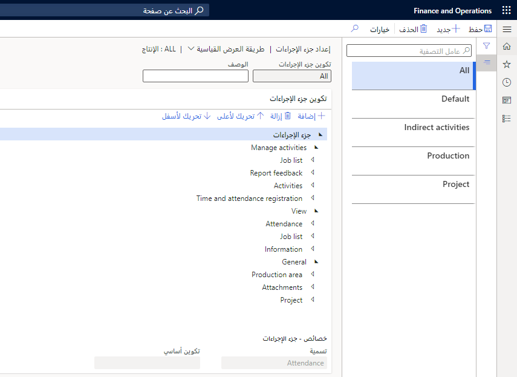
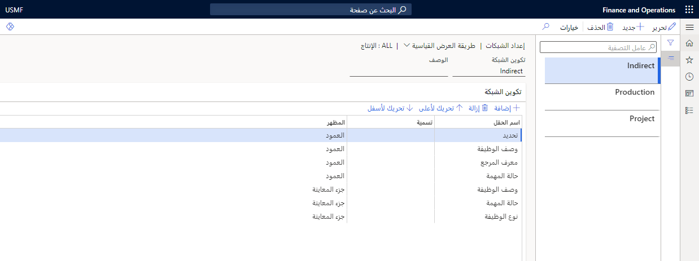
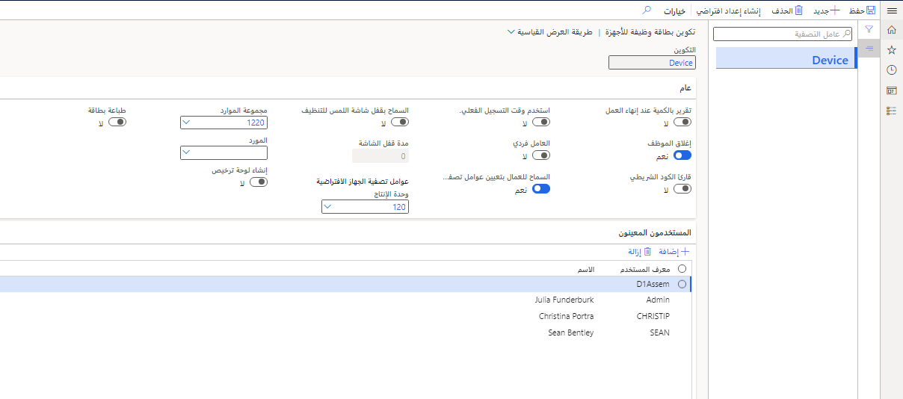
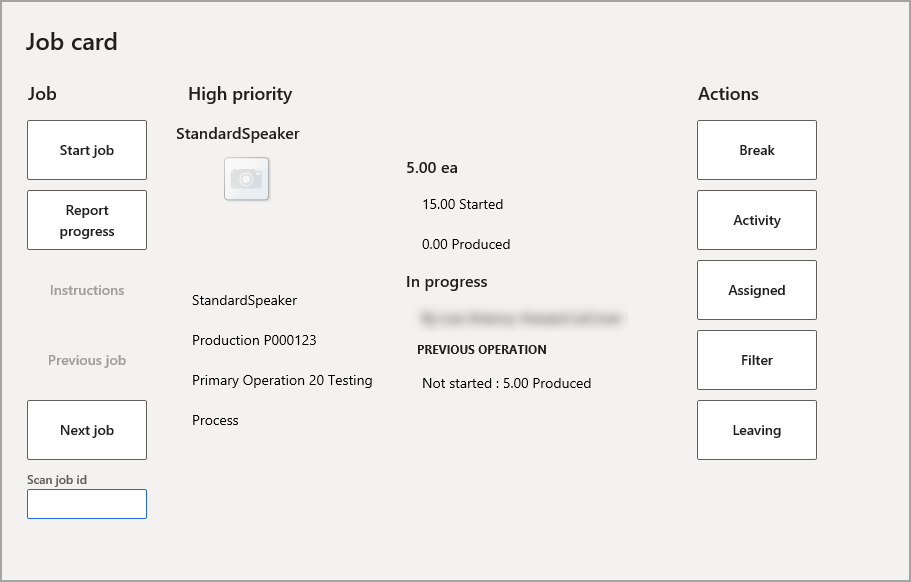
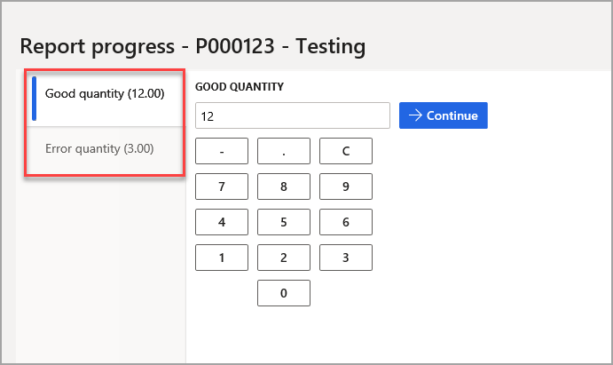
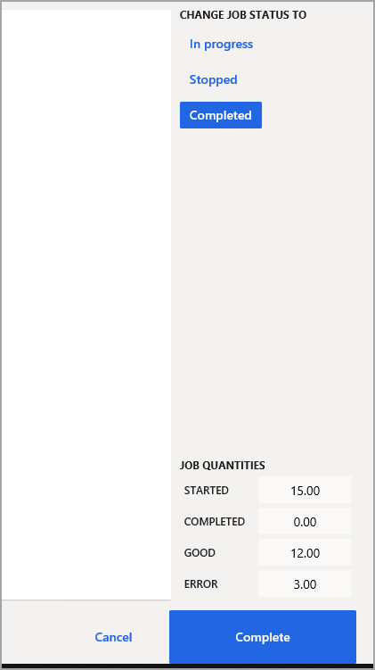

قبل إعداد المعلمات ذات الصلة بالإنتاج، عليك إعداد معلمات تنفيذ التصنيع المطلوبة لاستخدام ميزات الإنتاج.

يجب أن تعكس إعدادات معلمات الإنتاج بيئة التشغيل دائماً. تحدد معلمات الإنتاج وقت خصم المواد الخام من المخزون في عملية الإنتاج. تحدد هذه المعلمات أيضاً المعلومات التي يتم تسجيلها في مناطق أخرى من Supply Chain Management بشأن تنفيذ أوامر الإنتاج واستكمالها في تنفيذ التصنيع.

انتقل إلى **التحكم بالإنتاج > الإعداد > تنفيذ التصنيع > معلمات تنفيذ التصنيع** لإعداد معلمات تنفيذ التصنيع.

يجب وضع الحقول التالية في الاعتبار في علامة التبويب **عام**:

-   **استخدام كلمة المرور** - حدد خانة الاختيار إذا كان مطلوباً من العاملين استخدام رمز رقم المعرّف الشخصي (PIN) للوصول إلى الوحدة الطرفية بعد إدخال رقم التعريف. عندما تستخدم الوحدات الطرفية لتسجيل الوقت والمهمة، يجب تمكين أكواد PIN لمنع العاملين من التسجيل باستخدام معرّف العامل غير الصحيح. ويُذكر أنه يتم تنشيط أكواد PIN افتراضياً. تذكر إدراج رمز رقم المعرّف الشخصي (PIN) لكل عامل في صفحة **العاملون**.

-   **استخدام معرف الشارة** - استخدم **معرف شارة العامل** كمعرّف بدلاً من رقم الموظف.

-   **فرق دائمة** - حدد خانة الاختيار لحفظ علاقات القائد/المساعد بعد تسجيل إنهاء العمل للعاملين الذين سجّلوا كمساعدين لعاملين آخرين أو عاملين من قادة الفرق. يؤدي هذا الأسلوب إلى تمكين Supply Chain Management من إعادة إنشاء الفرق تلقائياً في يوم العمل التالي. ويصبح أول عامل في الفريق يسجل بدء العمل في يوم العمل التالي هو القائد، ويتم تسجيل أعضاء الفريق الآخرين تلقائياً كمساعدين عند تسجيلهم لبدء العمل. ويجري القائد جميع عمليات التسجيل للفريق خلال اليوم.

-   **مزامنة جدول المهام** - حدد كيفية مزامنة جدول مهام **الوقت والحضور** مع البيانات الأساسية. في حالة تحديد **عبر الإنترنت**، سيتم نقل كل مهمة جديدة أو تم تحريرها إلى جدول مهام **الوقت والحضور** أو مزامنتها معه على الفور. في حالة تحديد **غير متصل**، يجب تحديث جدول المهام بشكل دوري.

-   **وضع خطأ في التسجيل** - حدد ما إذا كان يجب أن يكون التسجيل **محظوراً** أو **تم التصحيح تلقائياً** في حالة اكتشاف خطأ في التسجيلات الأولية.

-   **الحصول على نموذج وقت التسجيل** - حدد الموضع المأخوذ منه وقت التسجيل عند إجراء عملية تسجيل. الخياران هما: **كيان قانوني** و **مستخدم**.

-   **إعداد الكود الشريطي** - حدد نوع الكود الشريطي المطلوب طباعته على الأصناف، مثل شارات العاملين وبطاقات المهام.

-   **الإبلاغ كمنته** - حدد الحالة التي سيتم عرضها على مهام الإنتاج عند تقديم العامل لتعليقات في نموذج **تسجيل المهمة**. الخيارات هي: **قيد التقدم** و **متوقفة** و **مكتملة**. من المهم تحديد التركيبة الصحيحة من المعلمات لتجنب تسجيل استهلاك غير صحيح لقائمة مكونات الصنف (BOM). على سبيل المثال، من خلال تحديد التركيبة الصحيحة، تتجنب خصم المواد مرتَين من المخزون أو عدم خصمها على الإطلاق.

-   **تعديل المخزون** - حدد دفتر يومية تعديل المخزون الافتراضي.

## تكوين الوحدات الطرفية لبطاقة المهمة

انتقل إلى **التحكم بالإنتاج > الإعداد > تنفيذ التصنيع > ‏‫تكوين الوحدات الطرفية لبطاقة المهمة‬** لتكوين الوحدات الطرفية لبطاقة المهمة.

يسمح لك زر **إعداد جزء الإجراءات** على بطاقة المهمة بتكوين "تكوين جزء الإجراءات" للعاملين الذين يستخدمون نوع بطاقة المهمة المحدد.

[.](../media/action-pane.png#lightbox)

يسمح لك زر **إعداد الشبكات** على بطاقة مهمة معينة بتحديد الحقول التي يجب أن تظهر وكيف يجب أن تبدو للعاملين الذين يستخدمون نوع بطاقة المهمة المحدد.

[.](../media/grids-1.png#lightbox)

## تكوين جهاز بطاقة المهمة

بالإضافة إلى استخدام الوحدة الطرفية لبطاقة المهمة، يمكن أن يستخدم العاملون في صالة الإنتاج أيضاً جهازاً محمولاً لبطاقة المهمة كبديل أكثر سهولة في الاستخدام للوحدة الطرفية. توضّح لقطة الشاشة التالية خيارات التكوين على الجهاز، في **التحكم بالإنتاج > الإعداد > تنفيذ التصنيع > تكوين بطاقة مهمة للأجهزة**:

[.](../media/configure-job-card-device-ss.png#lightbox)

عند الدخول على الجهاز في **التحكم بالإنتاج > تنفيذ التصنيع > جهاز بطاقة المهمة**، يمكنك عرض خيارات بدء مهمة، والإبلاغ عن مدى التقدّم في مهمة، والانتقال إلى المهمة التالية، واتخاذ إجراءات متعلقة بالوقت. يمكنك أيضاً عرض خيارات للمهمة المعيّنة حالياً:

في ما يلي بعض طرق عرض شاشة **تقرير التقدم**، حيث يمكنك عرض الكمية المناسبة والكمية غير الصحيحة وأيضاً تغيير حالة المهمة وإكمالها إذا لزم الأمر. بعد الإكمال، يمكنك طباعة بطاقات لوحات الترخيص من الجهاز.

  

  
## تكوين واجهة صالة الإنتاج

تساعد واجهة صالة الإنتاج العاملين على إدارة أنشطة الإنتاج. توفّر الواجهة نفس وظيفة جهاز بطاقة المهمة والوحدة الطرفية لبطاقة المهمة لكن توفر واجهة مستخدم حديثة ومحسنة للتفاعل باللمس. تشمل الميزات الإضافية ما يلي:

- **العمل على مهام متعددة** - يمكن أن يحدد العاملون في صالة الإنتاج مهام متعددة وبدؤها في الوقت نفسه أو بدء مهمة جديدة أثناء مواصلة العمل على المهام التي تم بدؤها بالفعل.

- **التكوين المستند إلى الجهاز** - تكوين واجهة تنفيذ صالة الإنتاج بشكل مختلف مقارنة بجهاز بطاقة المهمة والوحدة الطرفية لبطاقة المهمة. بدلاً من إقران كل مستخدم للتطبيق بتكوين، يكون التكوين مقترناً بمستعرض ويب يتم تشغيله على جهاز. 

### تمكين واجهة تنفيذ صالة الإنتاج والميزات الاختيارية ذات الصلة

واجهة تنفيذ صالة الإنتاج نفسها، إلى جانب عدّة إعدادات اختيارية يجب تشغيلها على نظامك قبل أن تتمكّن من استخدامها. استخدم مساحة عمل **إدارة الميزات** لتشغيل الميزات التالية التي ستكون مشمولة في العملية:

- تنفيذ صالة الإنتاج.
- إضافة لوحة ترخيص للإبلاغ عن الانتهاء إلى ‏‫جهاز بطاقة المهمة.
- تمكين إنشاء لوحة ترخيص المستخدم بشكل تلقائي عند الإبلاغ عن الانتهاء في ‏‫جهاز بطاقة المهمة‬.
- طباعة بطاقة من جهاز بطاقة المهمة.
- ميزة قفل جهاز بطاقة المهمة والوحدة الطرفية لبطاقة المهمة بحيث يمكن تنظيفهما.

### تكوينات واجهة تنفيذ صالة الإنتاج

لتكوين واجهة تنفيذ صالة الإنتاج، انتقل إلى **التحكم بالإنتاج > الإعداد > تنفيذ التصنيع > تكوين تنفيذ صالة الإنتاج**. تعرض صفحة **تكوين تنفيذ صالة الإنتاج** قائمة بالتكوينات الحالية. في هذه الصفحة، يمكنك اتخاذ الإجراءات التالية:

1. حدد أي تكوين لصالة الإنتاج مدرج في العمود على اليمين لعرضه وتحريره.
2. حدد **جديد** في جزء الإجراءات لإضافة تكوين جهاز جديد إلى القائمة. بعد ذلك، في حقل **التكوين**، أدخل اسماً لتحديد التكوين الجديد. الاسم الذي تدخله يجب أن يكون فريداً بين جميع تكوينات الأجهزة، ولن تتمكن من تحريره لاحقاً.
3. عليك تكوين الإعدادات المختلفة لتكوين الجهاز المحدد. تتوفر الحقول التالية:
    - **تقرير بالكمية عند إنهاء العمل** – يجب تعيين هذا الخيار على **نعم** لمطالبة العاملين بالإبلاغ عن التعليقات حول المهام قيد التقدم عند إنهاء العمل. 
    - **إغلاق الموظف** – عند تعيين هذا الخيار على **لا**، سيتم تسجيل خروج العاملين على الفور بعد إجراء عملية تسجيل (مثل مهمة جديدة). سينتقل الجهاز بعد ذلك إلى صفحة تسجيل الدخول مرة أخرى. وعند تعيين هذا الخيار على **نعم**، سيظل العاملون في وضع تسجيل الدخول في جهاز بطاقة المهمة. 
    - **استخدام وقت التسجيل الفعلي** – يجب تعيين هذا الخيار على **نعم** لتعيين الوقت لكل عملية تسجيل جديدة على الوقت المحدد الذي أرسل فيه العامل التسجيل. وفي حال تعيين هذا الخيار على **لا**، يتم استخدام وقت تسجيل الدخول بدلاً من ذلك. عادةً ما سترغب في تعيين هذا الخيار على **نعم** في حالة تعيين **إغلاق الموظف** و/أو **العامل فردي** على **نعم** للحالات التي يظل فيها العاملون عادةً في وضع تسجيل الدخول لفترات طويلة.
    - **العامل فردي** – يجب تعيين هذا الخيار على **نعم** في حالة استخدام عامل واحد فقط لكل جهاز بطاقة مهمة يكون فيها هذا التكوين نشطاً. عند تعيين هذا الخيار على **نعم**، يتم تعيين خيار **إغلاق الموظف** تلقائياً على **نعم**. يؤدي هذا الإعداد أيضاً إلى إزالة متطلبات العامل لتسجيل الدخول باستخدام معرّف الشارة (أو معرّف آخر مشابه). بدلاً من ذلك، يسجل العامل الدخول إلى Supply Chain Management باستخدام حساب مستخدم النظام المرتبط بعامل مسجل بالوقت 
    - **السماح بتأمين شاشة اللمس** – يجب تعيين هذا الخيار على **نعم** للسماح للعاملين بتأمين شاشة اللمس لجهاز بطاقة المهمة بحيث يمكنهم تنظيفه. 
    - **مدة تأمين الشاشة** – عند تعيين الخيار **السماح بتأمين شاشة اللمس** على **نعم**، استخدم هذا الخيار لتحديد عدد الثواني التي يجب تأمين شاشة اللمس خلالها للتنظيف. يجب أن تكون المدة بين 5 و120 ثانية.    
    - **‬‏‫إنشاء لوحة ترخيص‬‏‫** – يجب تعيين هذا الخيار على **نعم** لإنشاء لوحة ترخيص جديدة في كل مرة يستخدم عامل جهاز بطاقة المهمة للإبلاغ عن الانتهاء. عند تعيين هذا الخيار على **لا**، على العاملين تحديد لوحة ترخيص حالية عند الإبلاغ عن الانتهاء.
    - **طباعة بطاقة**– يجب تعيين هذا الخيار على **نعم** لطباعة بطاقة لوحة ترخيص عند استخدام العامل لجهاز بطاقة المهمة للإبلاغ عن الانتهاء.
    - **تحديد علامة التبويب** – يجب استخدام الإعدادات في هذا القسم لتحديد علامات التبويب التي يجب عرضها في واجهة تنفيذ صالة الإنتاج عندما يكون التكوين الحالي نشطاً. يمكنك تصميم العدد الذي تريده من علامات التبويب ثم إضافتها هنا وترتيبها كما يلزم. 

للحصول على تفاصيل حول كيفية تصميم علامات التبويب والعمل باستخدام الإعدادات المتوفرة هنا، يُرجى مراجعة [‏‫تصميم واجهة تنفيذ صالة الإنتاج‬](https://docs.microsoft.com/dynamics365/supply-chain/production-control/production-floor-execution-tabs/?azure-portal=true).

لمزيد من المعلومات عن واجهة تنفيذ صالة الإنتاج، يُرجى الاطّلاع على‬ [كيفية استخدام العاملين لواجهة تنفيذ صالة الإنتاج](https://docs.microsoft.com/dynamics365/supply-chain/production-control/production-floor-execution-use/?azure-portal=true).

