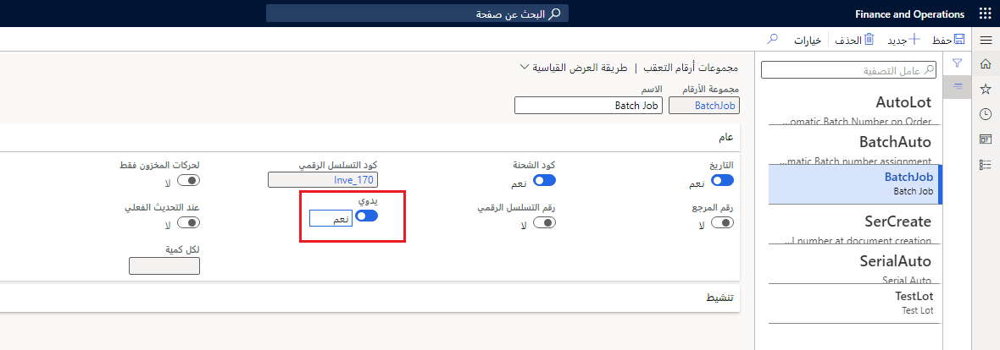
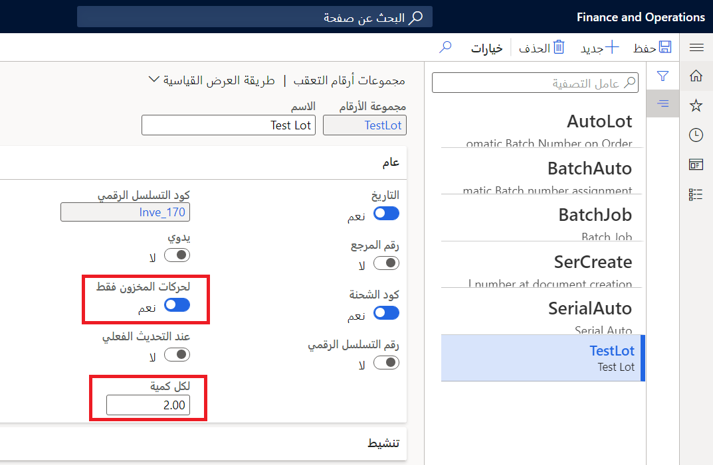
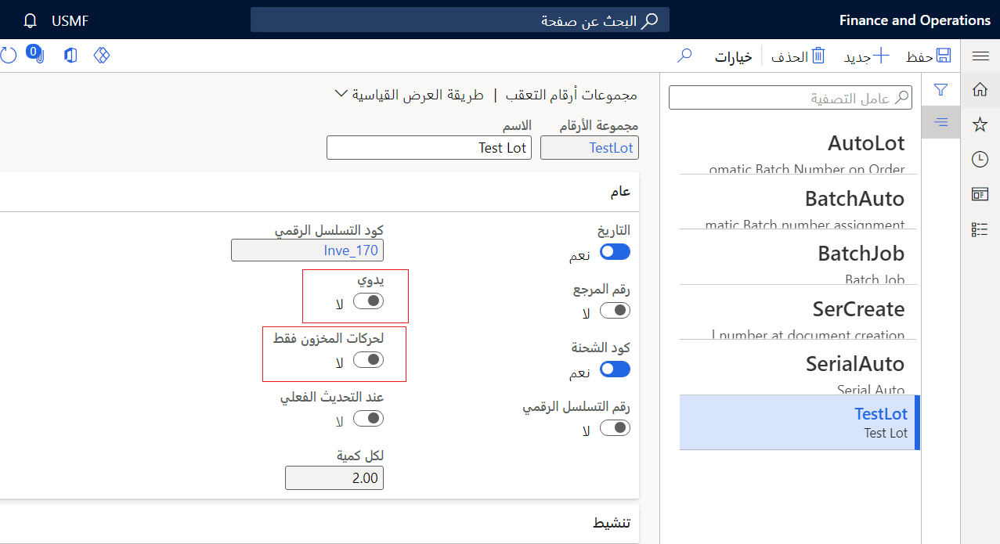
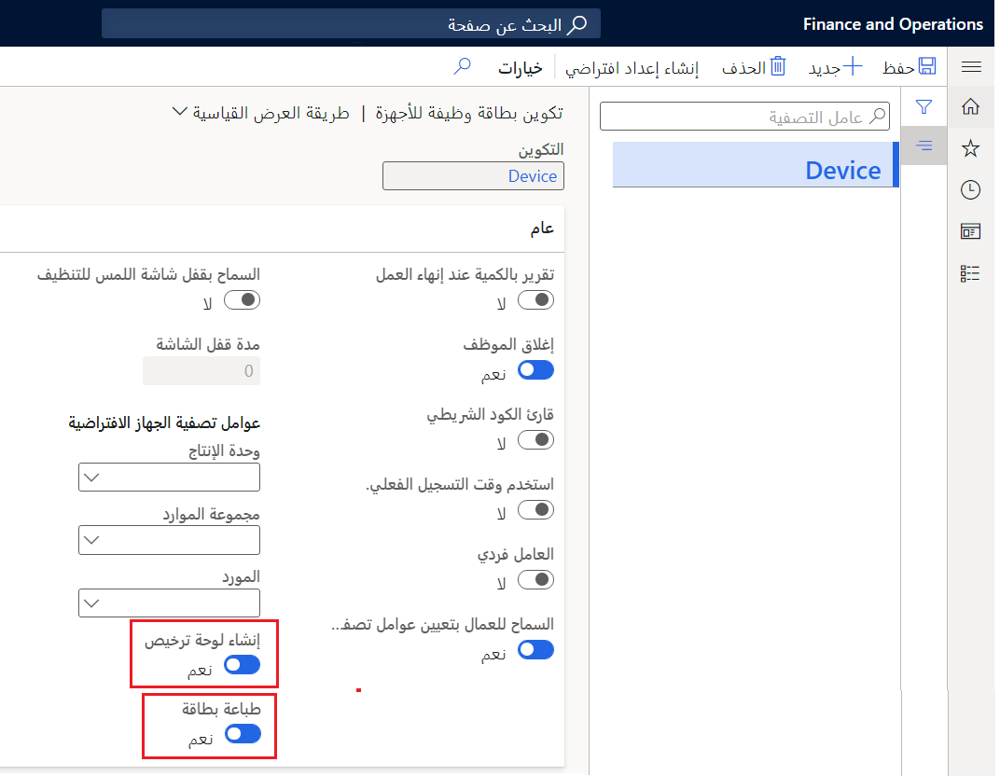

لتسجيل الكميات المكتملة لوظيفة إنتاج، يستخدم الموظفون صفحة **الإبلاغ عن التقدم** على كمبيوتر بطاقة الوظيفة. 

تشرح هذه الوحدة كيفية إعداد خيارات متنوعة لتحديد كيفية إبلاغ الموظفين عن هذه الصفحة على أنها منتهية وماذا سيحدث بعد ذلك. وتتضمن اختياراتهم ما يلي:

- التحكم في ما إذا كان يتم إضافة الكميات النهائية المُبلغ عنها إلى المخزون وكيفية ذلك.
- التحكم في ما إذا كان يتم إنشاء أرقام الدُفعات وتطبيقها عند إعداد التقارير كمنتهية وكيفية ذلك.
- التحكم في ما إذا كان يتم إنشاء الأرقام التسلسلية وتطبيقها عند إعداد التقارير كمنتهية وكيفية ذلك.
- التحكم في ما إذا كان يتم الإبلاغ عنه كمنته إلى لوحة ترخيص وكيفية ذلك.

## التحكم في إضافة الكميات النهائية إلى المخزون

اتبع هذه الإرشادات للتحقق من إضافة المبالغ المسجلة كمكتملة في العملية الأخيرة إلى المخزون.

1.  انتقل إلى **التحكم بالإنتاج > إعداد > تنفيذ التصنيع > الإعدادات الافتراضية لأمر الإنتاج**.

2.  في علامة التبويب **الإبلاغ عن الانتهاء**، قم بتعيين حقل **تحديث التقرير النهائي عبر الإنترنت** إلى إحدى القيم التالية:

    - **لا** – لن تتم إضافة أي كمية إلى المخزون عند الإبلاغ عن الكميات في العملية الأخيرة. لن تتغير حالة أمر الإنتاج أبداً.
    - **الحالة + الكمية** – ستتغير حالة أمر الإنتاج إلى تم الإبلاغ عنه كمنتهٍ، وسيتم الإبلاغ عن الكمية كمنتهية في المخزون.
    - **الكمية** – سيتم الإبلاغ عن الكمية كمنتهية في المخزون، ولكن لن تتغير حالة أمر الإنتاج أبداً.
    - **الحالة** – ستتغير حالة أمر الإنتاج فقط. لن تتم إضافة أي كميات إلى المخزون عند الإبلاغ عن الكميات في العملية الأخيرة.

> [!NOTE]
> لا يتم تعقب الكميات في المخزون إذا لم يتم تحديد العمليات المحددة على أنها منتهية كعملية أخيرة. ومع ذلك، يمكن استخدام هذه الكميات لرؤية التحسن. يمكن أيضاً تضمينها في القواعد للتحقق مما إذا كان بإمكان الموظفين بدء العملية التالية قبل الوصول إلى الحد الأدنى المحدد للكمية المسجلة في العملية السابقة. يمكنك تحديد هذه القواعد في علامة التبويب **التحقق من صحة الكمية** في صفحة **الإعدادات الافتراضية لأمر الإنتاج**.

## الإبلاغ عن الأصناف التي يتم التحكم فيها بواسطة الدُفعة كمنتهية

يدعم جهاز بطاقة الوظيفة ثلاثة سيناريوهات لإعداد التقارير حول عناصر الدُفعات. تشير هذه المواقف إلى العناصر التي تم تمكينها لعمليات المستودعات المتقدمة والأصناف غير الممكنة لعمليات المستودعات المتقدمة.

- **أرقام الدُفعات المعينة يدوياً** - يقوم العمال بإدخال رقم دفعة مخصص. قد يأتي رقم الدُفعة هذا من مصدر خارجي غير معروف للنظام.
- **أرقام الدُفعات المحددة مسبقاً** - يحدد العمال رقم دُفعة في قائمة أرقام الدُفعات التي ينشئها النظام تلقائياً قبل إصدار أمر الإنتاج لجهاز بطاقة العمل.
- **أرقام الدُفعات الثابتة** - لا يقوم العمال بإدخال رقم الدُفعة أو تحديده. بدلاً من ذلك، يقوم النظام تلقائياً بتعيين رقم دُفعة لأمر الإنتاج قبل إصداره.

## تكوين المنتجات التي تتطلب الإبلاغ عن أرقام الدُفعات

اتبع هذه الخطوات للسماح للمنتج بدعم أي من السيناريوهات المتاحة والتي يتم التحكم فيها بواسطة الدُفعات:

1.  انتقل إلى **إدارة معلومات المنتج > المنتجات > المنتجات الصادرة**.
2.  حدد المنتج المراد تكوينه.
3.  في علامة التبويب السريعة **إدارة المخزون**، في حقل **مجموعة أرقام الدفعات**، حدد مجموعة أرقام التعقب التي تم إعدادها لدعم السيناريو الخاص بك.

تصف الأقسام التالية كيفية إعداد مجموعات أرقام التعقب لدعم كل سيناريو من سيناريوهات إعداد تقارير أصناف الدفعات الثلاثة.

## إعداد مجموعة أرقام تعقب تتيح للعمال تعيين رقم دُفعة يدوياً

اتبع هذه الخطوات للسماح بأرقام الدُفعات المعينة يدوياً لإعداد مجموعة أرقام التعقب.

1.  انتقل إلى **إدارة المخزون> الإعداد> الأبعاد > مجموعات أرقام التعقب**.

2.  إنشاء أو تحديد مجموعة أرقام التعقب للإعداد.

3.  في علامة التبويب السريعة **عام**، قم بتعيين الخيار **يدوي** إلى **نعم**.
    
4.  قم بتعيين قيم أخرى حسب الحاجة.
5.  حدد مجموعة أرقام التعقب التي حددتها في الخطوة 2، كمجموعة أرقام الدُفعات للمنتجات الصادرة لهذا السيناريو.

في هذا السيناريو، حقل **رقم الدُفعة**، الذي توفره صفحة **الإبلاغ عن التقدم** على جهاز بطاقة الوظيفة، هو مربع نص حيث يمكن للعمال إدخال أي قيمة.

## قم بإعداد مجموعة أرقام التعقب التي توفر قائمة بأرقام الدُفعات المحددة مسبقاً.

اتبع هذه الخطوات لإعداد مجموعة أرقام التعقب وتوفير قائمة بأرقام الدُفعات المحددة مسبقاً.

1.  انتقل إلى **إدارة المخزون> الإعداد> الأبعاد > مجموعات أرقام التعقب**.
2.  إنشاء أو تحديد مجموعة أرقام التعقب للإعداد.
3.  في علامة التبويب السريعة **عام**، قم بتعيين خيار **لحركات المخزون فقط** إلى **نعم**.
4.  استخدم حقل **لكل كمية** لتقسيم أرقام الدُفعات لكل كمية، استناداً إلى القيمة التي تدخلها. على سبيل المثال، لديك أمر إنتاج لعشر قطع، وتم تعيين حقل **لكل كمية** إلى اثنتين (2.00). في هذه الحالة، يتم تعيين خمسة أرقام دُفعات لأمر الإنتاج عند إنشائه.
    
5.  قم بتعيين قيم أخرى حسب الحاجة.
6.  حدد مجموعة أرقام التعقب التي حددتها في الخطوة 2، كمجموعة أرقام الدُفعات للمنتجات الصادرة التي تريد استخدامها لهذا السيناريو.

في هذا السيناريو، حقل **رقم الدُفعة** الذي توفره صفحة **الإبلاغ عن التقدم** على جهاز بطاقة الوظيفة هو قائمة منسدلة حيث يجب على العمال تحديد قيمة محددة مسبقاً.

## إعداد مجموعة أرقام التعقب التي تقوم تلقائياً بتعيين أرقام الدُفعات

اتبع هذه الخطوات لإعداد مجموعة أرقام تعقب إذا كان يجب تعيين رقم دُفعة تلقائياً، دون إدخال العامل. 

1.  انتقل إلى **إدارة المخزون> الإعداد> الأبعاد > مجموعات أرقام التعقب**.
2.  إنشاء أو تحديد مجموعة أرقام التعقب للإعداد.
3.  في علامة التبويب السريعة **عام**، قم بتعيين خيار **لحركات المخزون فقط** إلى **لا**.
4.  قم بتعيين الخيار **يدوي** إلى **لا**.
    
5.  قم بتعيين قيم أخرى حسب الحاجة، ثم حدد مجموعة أرقام التعقب التي حددتها في الخطوة 2، كمجموعة أرقام الدُفعات للمنتجات الصادرة التي تريد استخدامها في هذا السيناريو.

في هذا السيناريو، حقل **رقم الدُفعة** الذي توفره صفحة **الإبلاغ عن التقدم** على جهاز بطاقة الوظيفة يُظهر قيمة. ومع ذلك، لا يمكن للعمال تحريره.

## الإبلاغ عن الأصناف التي يتم التحكم فيها بواسطة السلسلة كمنتهية

يدعم جهاز بطاقة الوظيفة ثلاثة سيناريوهات لإعداد التقارير حول العناصر التي يتم التحكم فيها بواسطة السلسلة. تنطبق هذه السيناريوهات على كل من العناصر التي تم تمكينها لعمليات المستودعات المتقدمة وعلى العناصر التي لم يتم تمكينها لعمليات المستودعات المتقدمة.

- **الأرقام التسلسلية المعينة يدوياً** - يقوم العمال بإدخال رقم تسلسلي مخصص. قد يأتي هذا الرقم التسلسلي من مصدر خارجي غير معروف للنظام.
- **الأرقام التسلسلية المحددة مسبقاً** - يحدد العمال رقم تسلسلياً في قائمة الأرقام التسلسلية التي ينشئها النظام تلقائياً قبل إصدار أمر الإنتاج لجهاز بطاقة الوظيفة.
- **الرقم التسلسلي الثابت** - لا يقوم العمال بإدخال رقم تسلسلي أو تحديده. بدلاً من ذلك، يقوم النظام تلقائياً بتعيين رقم تسلسلي لأمر الإنتاج قبل إصداره.

## تمكين الميزة على النظام الخاص بك
لتمكين أجهزة بطاقة الوظيفة الخاصة بك من قبول الرقم التسلسلي أثناء الإبلاغ عن الانتهاء، يجب عليك استخدام مساحة عمل **إدارة الميزات** لتشغيل الميزات التالية (في هذا الترتيب):

1.  تجربة مستخدم محسّنة لمربع حوار تقدم التقرير في "جهاز بطاقة الوظيفة".
2.  تمكين إدخال أرقام الدُفعات والأرقام التسلسلية أثناء الإبلاغ كمنتهية من جهاز بطاقة الوظيفة (معاينة).

## إعداد التقارير على أنها منتهية على لوحة ترخيص

اتبع هذه الخطوات للتحقق مما إذا كان بإمكان العمال إعادة استخدام لوحة ترخيص حالية أو إنشاء لوحة ترخيص جديدة عند الإبلاغ عن الكميات على أنها منتهية.

1.  انتقل إلى **التحكم في الإنتاج > الإعداد > تنفيذ التصنيع > تكوين بطاقة الوظيفة للأجهزة**.
2.  قم بتعيين الخيارات التالية لكل جهاز:
    - **إنشاء لوحة ترخيص** 
        - حدد **نعم** لإنشاء لوحة ترخيص جديدة لكل تقرير بمجرد الانتهاء. 
        - حدد **لا** إذا كان يجب استخدام لوحة ترخيص حالية لكل تقرير بمجرد الانتهاء.
    - **طباعة التسمية** 
        - حدد **نعم** إذا كان يجب على العامل طباعة تسمية لوحة ترخيص لكل تقرير بمجرد الانتهاء. 
        - حدد **لا** إذا لم تكن هناك حاجة إلى تسمية.

 
