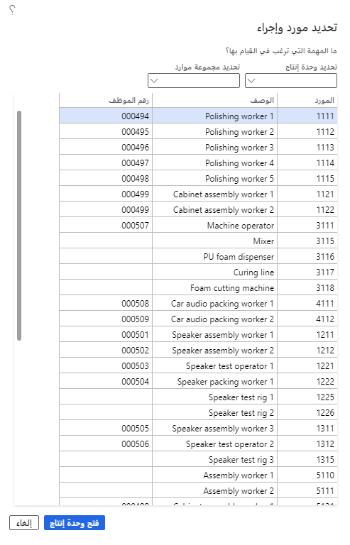
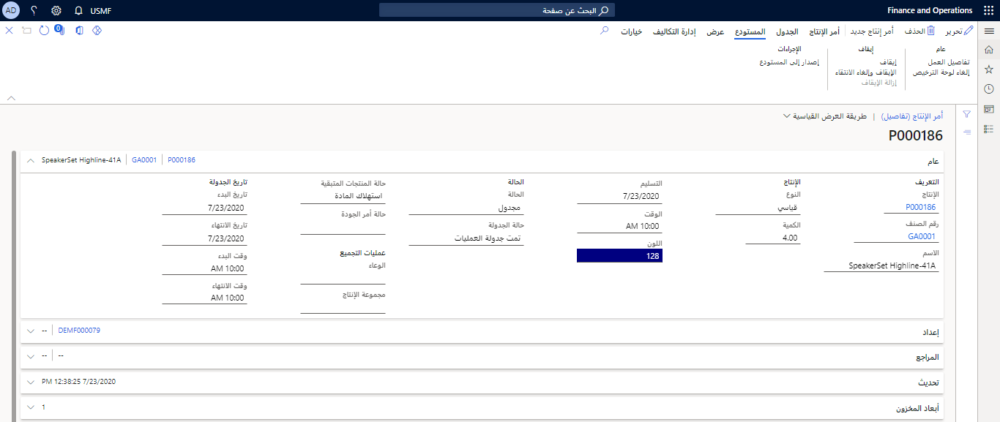
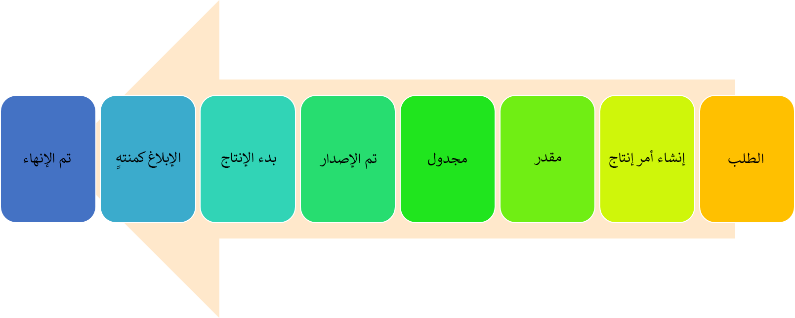

## ملاحظات الإنتاج 
عندما يقوم العمال بتسجيل الوقت واستهلاك الصنف في وظائف الإنتاج التي تم إعدادها لاستخدام الوقت والحضور، يتم ترحيل التسجيلات في أمر الإنتاج ذي الصلة.

يمكنك تحديث كمية العملية وملاحظات الحالة عندما يكمل العامل وظيفة إنتاج أو عندما تكون مهمة معالجة جارية. يساعد تقديم التعليقات بانتظام طوال عملية الإنتاج على تحسين إدارة المخزون والإنتاج.

في مجموعة حقل **الإبلاغ عن الانتهاء** في صفحة **معلمات الإنتاج**، يمكنك تحديد كيفية تحديث أمر الإنتاج عندما يتم الإبلاغ عن آخر وظيفة لأمر الإنتاج كمنتهية في التحكم في الإنتاج.

يتم فتح صفحة **التحكم بالإنتاج > تنفيذ التصنيع > الوحدة الطرفية لبطاقة الوظيفة** عادةً من عدة وحدات طرفية أو مواقع في جميع أنحاء طابق المتجر. تحتاج إلى تحديد تكوين ثم تحديد **موافق**.

في صفحة **تحديد مورد وإجراء**، حدد مجموعة الموارد التي تريد نقل العمليات (الوظائف) منها، ثم حدد **فتح وحدة الإنتاج**.

### استهلاك المواد والحجوزات في واجهة تنفيذ طابق الإنتاج

يمكن للشركات المصنعة الاستفادة من تجربة المستخدم الحديثة عند العمل مع أوامر الإنتاج والدُفعات حيث توجد اختلافات في استهلاك المواد الفعلي مقارنةً بالاستهلاك المخطط له. يمكن للعمال أيضاً إدارة حجوزات مجموعات المخزون والأرقام التسلسلية. يضمن ذلك دقة مستويات المخزون والتكلفة ويلبي متطلبات إمكانية تتبع المواد.

يمكن للعمال استخدام واجهة تنفيذ طابق الإنتاج لتسجيل استهلاك المواد وأرقام الدُفعات والأرقام التسلسلية.

تحتاج بعض الشركات المصنعة، وخاصة داخل صناعات العملية، إلى تسجيل مقدار المواد المستهلكة بشكل صريح لكل دفعة أو أمر إنتاج. على سبيل المثال، قد يستخدم العاملون مقياساً لوزن مقدار المواد المستهلكة عند العمل. لضمان إمكانية التتبع الكاملة للمواد،، تحتاج هذه المؤسسات أيضاً إلى تسجيل أرقام الدفعات التي تم استهلاكها عند إنتاج كل منتج.

لمزيد من المعلومات، راجع [كيفية استخدام العاملين لواجهة تنفيذ طابق الإنتاج](/dynamics365/supply-chain/production-control/production-floor-execution-use/?azure-portal=true)

## نظرة عامة على أوامر الإنتاج

يحتوي أمر الإنتاج على معلومات حول ما سيتم إنتاجه والكمية (المقدار) وتاريخ الانتهاء المخطط. يقوم النظام بتعيين حالة أمر لكل خطوة في دورة حياة الأمر. تُظهر الحالة مكان الصنف في عملية الإنتاج.

في الشركات التي يتم فيها الإنتاج داخلياً، يتم إنشاء أوامر الإنتاج بشكل متكرر من أجل:

-   تلبية طلب المبيعات عندما يكون المخزون غير كافٍ.

-   توفير قائمة مكونات الصنف (BOM) كتجميعات فرعية للأصناف الأخرى المطلوبة.

-   تلبية طلب الصنف النهائي المتوقع.

-   زيادة مخزون السلامة.

[.](../media/production-order.png#lightbox)

إذا تم التعاقد من الباطن على إنتاج أو جزء من الإنتاج وتم إصدار أصناف المكون وتقديمها إلى المورد، فيجب إنشاء صنف متعاقد عليه من الباطن كصنف قائمة مكونات الصنف (BOM). إذا كان المكون الذي ينتجه المورد عبارة عن قائمة مكونات صنف (BOM) فرعية، فيجب استخدام نوع بند المورد.
عندما يتم تقدير أمر الإنتاج الذي ينتج الصنف، تقوم Supply Chain Management تلقائياً بإنشاء أمر شراء مورّد لصنف المكون المُنتج.

إذا لم تتم جدولة القدرة الإنتاجية للمورد، فلا تقم بإرفاق المسار لقائمة مكونات الصنف (BOM) الفرعية. في حالة عدم إرفاق أي مسار، يتم أخذ وقت التسليم لقائمة مكونات الصنف (BOM) الفرعية من البيانات الأساسية الخاصة بالمنتجات الصادرة لأصناف المكون.

إذا كنت ترغب في جدولة القدرة الإنتاجية للمورد، فقم بإنشاء مسار لصنف المكون وحدد **المورد** باعتباره المورد في البنود المناسبة.

## نظرة عامة على معالجة أمر الإنتاج

يعد إنشاء أمر الإنتاج في الأساس طلباً لبدء تصنيع كمية الأصناف كما هو محدد في الأمر. يتم تضمين جميع المعلومات المرتبطة بالصنف الذي سيتم إنتاجه في أمر الإنتاج. تحتوي أوامر الإنتاج على قائمة بالمواد الخام من قائمة مكونات الصنف (BOM) والموارد التي سيتم استخدامها والمسارات والعمليات.

يمكن تعديل كل مكون من مكونات المعلومات في أمر الإنتاج ونسخه واستخدامه لتلبية متطلبات منشأة التصنيع. سواء كان الكيان القانوني ينتج أصنافاً يتم تصنيعها حسب الطلب، أو يتم تصنيعها للتخزين، أو تمت هندستها حسب الطلب، فإن وحدة التحكم في الإنتاج تمكّن منشأة التصنيع من تغيير أوامر الإنتاج بحيث يتم تبسيطها وفقاً لمتطلبات الإنتاج المحددة الخاصة بها.

يتبع إنتاج الأصناف دورة حياة إنتاجية متسلسلة. تعكس دورة الحياة الخطوات الفعلية التي يتم اتخاذها لتصنيع أحد الأصناف. وتبدأ بإنشاء أمر إنتاج، وتنتهي بصنف منتهٍ ومصنع جاهز للعميل.

## حالات أمر الإنتاج

تعكس الحالة في أمر الإنتاج الخطوة التسلسلية لدورة حياة الإنتاج. يمكن أن يكون لأمر الإنتاج الحالات التالية:

-   **تم الإنشاء** - حالة أمر الإنتاج عند إنشائه لأول مرة.

-   **تم التقدير** - حالة أمر الإنتاج بعد قيامك بإجراء تقدير المواد والتكلفة.

-   **تمت الجدولة** - الحالة بعد تشغيل العملية أو جدولة الوظيفة.

-   **تم الإصدار** - الحالة عند جدولة أوامر الإنتاج وإصدارها للإنتاج. تتوفر أوامر الإنتاج فقط بهذه الحالة أو حالة أعلى، مثل **تم البدء**، و **الإبلاغ عن الانتهاء**، و **منتهٍ** في نموذج **تسجيل الوظائف**.

-   **تم البدء** - حالة أمر الإنتاج عند بدء الإنتاج.

-   **الإبلاغ عن الانتهاء** - حالة أمر الإنتاج عند انتهاء الإنتاج.

-   **منتهٍ** - حالة أمر الإنتاج بعد تطبيق التكاليف النهائية، واكتمال الصنف، ولم يعد الأمر نشطاً.

## الوظائف

تُستخدم جدولة الوظائف لإنتاج جدول إجمالي للوظائف التي سيتم إجراؤها في الموارد في منشأة التصنيع أو في طابق المتجر. تعمل جدولة الوظائف على سرد جميع العمليات في الموارد في وظائفها المحددة. كما تقوم أيضاً بعمليات جدولة التواريخ والأوقات بالترتيب المحدد بواسطة مسار الإنتاج. كما ذكرنا سابقاً، يمكنك تشغيل جدولة الوظائف بمفردها أو اتباع جدولة العمليات.

يمكن لمشرف المتجر أو المدير إعادة ترتيب أولويات الوظائف في قائمة وظائف العامل. على سبيل المثال، ربما تمت ترقية إنتاج إلى أمر مستعجل يجب إكماله على الفور. وبالتالي، يجب أن يكون المشرف قادراً على إعادة ترتيب أولويات الوظائف للتأكد من أن جميع الوظائف ذات الصلة تحصل على الأولوية القصوى.

يمكن لمشرف المتجر أو المدير أيضاً تحديد أولويات الوظائف في قائمة وظائف العامل وتعيين الوظائف على أولوية عالية. هذا النهج مفيد إذا كنت تريد التأكد من أن العامل لا يغير تسلسل وظائف معينة في قائمة وظائفه.

سيتم وضع علامة على جميع الوظائف المتصلة بعملية معينة كأولوية عالية وسيتم نقلها إلى أعلى قائمة الوظائف. على وجه التحديد، إذا كانت العملية تتكون من ثلاث وظائف، وقمت بتحديد واحدة فقط من هذه الوظائف، فسيتم تلقائياً نقل جميع الوظائف الثلاث وتعيينها إلى أولوية عالية.

## الموارد

يتكون مورد العمليات من شخص أو جهاز واحد أو أكثر ذات إمكانات متماثلة والتي تعتبر وحدة واحدة لإدارة تخطيط متطلبات القدرة الإنتاجية والجدولة التفصيلية. بعد إنشاء مورد العمليات، يمكنك تعيينه إلى مجموعة موارد وعمليات إنتاج محددة.

عند إعادة تعيين الموارد لمجموعات موارد مختلفة، استخدم حقل **انتهاء الصلاحية** لتحديد متى يمكن جدولة المورد في الإنتاج. بهذه الطريقة، تقوم بمشاركة مورد عبر أكثر من موقع واحد.

يمكنك إنشاء موارد دون تعيينها لمجموعة موارد.
ومع ذلك، يجب تعيين مورد إلى مجموعة موارد قبل أن يمكن جدولتها لأداء العمل. يمكن تعيين مورد لمجموعة موارد واحدة فقط في كل مرة.

يتم تعيين وظائف الموارد أثناء عملية جدولة الوظيفة. جدولة الوظائف هي التخطيط التفصيلي للقدرة الإنتاجية وتفصل كل عملية إلى مهامها أو وظائفها الفردية.

## المستندات

في تنفيذ التصنيع، يمكنك عرض المستندات المرفقة بالوظائف. على سبيل المثال، يمكن أن تحتوي الملفات على تعليمات إنتاج أو رسم تخطيطي. يمكن للعمال عرض المستندات في صفحة **الوحدة الطرفية لبطاقة الوظيفة** عندما يبدأون الوظيفة أو يواصلون العمل في الوظائف.

يمكنك إرفاق مستندات أو ملفات بمنتج أو قائمة مكونات الصنف (BOM) أو إنتاج أو عملية. تحدد الإعدادات الموجودة في صفحة **مجموعات المستندات** ما إذا كان يجب على العمال قراءة التعليمات أو لا قبل بدء وظيفة محددة في صفحة **تسجيل الوظائف**.

## تكوين عمليات سير عمل الوقت والحضور

استخدام سير عمل الوقت والحضور في مؤسستك له مزايا عديدة:

-   **العمليات المتسقة** - يتيح لك نظام سير العمل تحديد عملية الموافقة على مستندات معينة. بشكل افتراضي، لا يمكن أن يكون لديك سوى جهة موافقة واحدة للتسجيلات. باستخدام عمليات سير عمل الوقت والحضور، يمكنك تضمين العديد من الموافقين أو تضمين عمليات الفحص لمواقف معينة. تساعد عمليات سير العمل في ضمان معالجة المستندات والموافقة عليها بطريقة متسقة وفعالة.

-   **رؤية العملية** - يتيح لك نظام سير العمل تعقب الحالة والمحفوظات ومقاييس الأداء لمثيل سير عمل معين. إذا لم يوافق المدير على التسجيل في الوقت المناسب، فيمكن تصعيده للآخرين أو يمكنك استخدام التقارير الافتراضية لتحليل هذه المعلومات. يساعدك هذا الأسلوب في تحديد ما إذا كان يجب إجراء تغييرات على سير العمل لتحسين الكفاءة أو لا.

-   **قائمة العمل المركزية** - يمكن لمشرفي المتجر ومديري الإنتاج عرض قائمة عمل مركزية لعرض مهام سير العمل والموافقات التي تم تعيينها لهم.

لمزيد من المعلومات حول كيفية إنشاء سير عمل، راجع [التعامل مع عمليات سير العمل في تطبيقات Finance and Operations](/learn/modules/create-use-workflows-finance-operations/?azure-portal=true).
