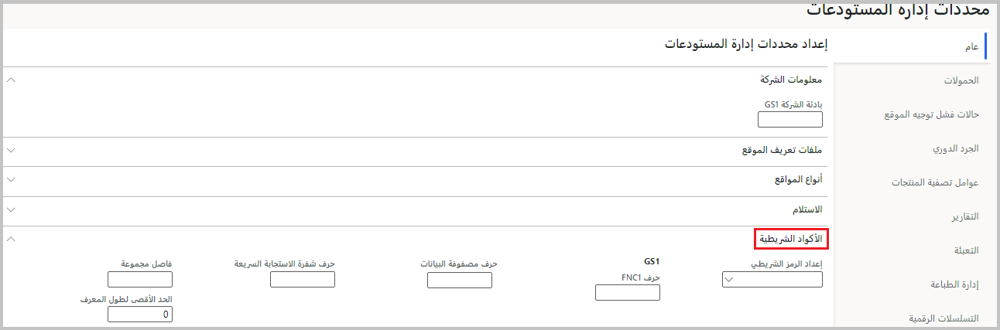

عندما يستخدم موظفو المستودعات ماسحاً ضوئياً لجهاز محمول لتسجيل حركة صنف أو بالتة أو حاوية، يجب عليهم تنفيذ مهام كثيرة بشكل متكرر. وقد تستلزم هذه المهام إجراء مسح ضوئي للرموز الشريطية، بالإضافة إلى إدخال البيانات يدوياً في الجهاز المحمول. تلتزم الرموز الشريطية بتنسيق خاص بالشركة، تقوم أنت بتطويره وإدارته باستخدام Dynamics 365 Supply Chain Management.

تنسيقات الرمز الشريطي GS1 وشفرة الاستجابة السريعة لبطاقات الشحن، التي يمكن استخدامها لتبادل البيانات بين الشركات. تسمح لك تنسيقات GS1 بوصف معنى البيانات باستخدام قائمة محددة مسبقاً من معرفات التطبيقات. ويصف معيار GS1 تنسيق البيانات وأنواع البيانات التي يمكنه ترميزها. بإمكان الرموز الشريطية بتنسيق GS1 أن تحتوي على عناصر بيانات كثيرة. وبالتالي، بإمكان مسح ضوئي لرمز شريطي واحد جمع بيانات المنتج مثل تاريخ الدُفعة وتاريخ انتهاء الصلاحية.

يعمل دعم GS1 في Supply Chain Management على تبسيط عملية المسح الضوئي في المستودعات حيث يتم تمييز البالتات والحاويات برموز بتنسيق GS1. بإمكان موظف المستودع الحصول على جميع معلوماته عن طريق إجراء مسح ضوئي لرمز شريطي GS1 مرة واحدة. تقلل الرموز الشريطية GS1 فترة الوقت التي يستغرقها إكمال المهام من خلال إزالة الحاجة إلى عمليات مسح ضوئي متعددة أو إدخال البيانات يدوياً. علاوةً على ذلك، فهي تساعد في تحسين الدقة.

يجب إنشاء قوائم معرفات التطبيقات وعناصر القائمة المقابلة لها على الأجهزة المحمولة بواسطة مدراء الخدمات اللوجستية. وبعد ذلك، يمكن تطبيق معرفات التطبيقات بشكل عمومي عبر المستودعات لنقلها وتعبئتها. ونتيجة لذلك، سيكون تصميم جميع بطاقات الشحن موحداً.

يشار إلى كل من الرموز الشريطية وشفرات الاستجابة السريعة باعتبارها رموزاً شريطية في هذه الوحدة، ما لم يُذكر عكس ذلك.

## تشغيل ميزة GS1
حتى تتمكن من استخدام هذه الميزة، يجب تشغيلها في نظامك. بإمكان المسؤولين استخدام إعدادات إدارة الميزات للتحقق من حالة الميزة وتشغيلها. في مساحة عمل **إدارة الميزات**، تكون هذه الميزة مدرجة على النحو التالي:

- **الوحدة النمطية** - إدارة المستودعات
- **اسم الميزة** - مسح الرموز الشريطية GS1 ضوئياً

## إعداد خيارات GS1 العمومية
توفر صفحة **معلمات إدارة المستودعات‬‏‫** إعدادات قليلة تنشئ خيارات GS1 العمومية.

لإعداد خيارات GS1 العمومية، اتبع الخطوات التالية.

1.  انتقل إلى **إدارة المستودعات > إعداد > معلمات إدارة المستودعات**.

    
 
2.  في قسم **الرموز الشريطية**، عيّن الحقول التالية:

    - **حرف FNC1** – أحرف يجب تفسيرها باعتبارها بادئة عند تحليل رمز شريطي.
    
    - **حرف مصفوفة بيانات‬** – أحرف يجب تفسيرها باعتبارها بادئة عند تحليل مصفوفة بيانات‬‏‎.
    
    - **شفرة الاستجابة السريعة** – أحرف يجب تفسيرها باعتبارها بادئة عند تحليل شفرة استجابة سريعة.
    
    - **فاصل المجموعة** – حرف يحدد أجزاء منفصلة من رمز شريطي أو شفرة استجابة سريعة.
    
    - **الحد الأقصى لطول المعرف** – الحد الأقصى لعدد الأحرف المسموح به لمعرف التطبيق.

## معرفات تطبيقات GS1
تسمح لك تنسيقات GS1 بوصف معنى البيانات باستخدام قائمة محددة مسبقاً من معرفات التطبيقات. يجب على مدراء الخدمات اللوجستية إنشاء قائمة بمعرفات التطبيقات وربطها بعناصر قائمة الجهاز المحمول. بعد ذلك، يمكن استخدام الهويات بطريقة عمومية عبر المستودعات للنقل والتعبئة. ونتيجة لذلك، ستكون جميع بطاقات الشحن موحدة.

يستخدم النظام البيانات، وتحديداً معرفات التطبيقات المعرّفة مسبقاً، لتحديد القواعد التي يجب تطبيقها على البيانات الممسوحة ضوئياً.

يقوم كل معرف تطبيق بإعلام النظام أن الأحرف التالية في الرمز الشريطي الممسوح ضوئياً هي أحرف مشفرة. وتحدد معرفات التطبيقات كيف يجب على النظام تفسير بيانات الرموز الشريطية وحفظها في النظام.

بإمكان مدراء الخدمات اللوجستية استخدام معرفات تطبيقات عالمية قياسية أو مخصصة.

### تحميل معرفات التطبيقات القياسية
للشروع في العمل بسرعة، يمكنك تحميل قائمة بمعرفات التطبيقات العالمية الشائعة. ويمكنك عندئذٍ توسيع القائمة أو تحريرها لاحقاً، كما هو مطلوب.

لتحميل معرفات التطبيقات القياسية، اتبع الخطوات التالية.

1.  انتقل إلى **إدارة المستودعات > إعداد > GS1 > معرفات تطبيقات GS1‬**.
2.  في جزء الإجراءات، حدد **إنشاء إعداد افتراضي**.

    
 
> [!WARNING]
> يحذف الأمر **إنشاء إعداد افتراضي** جميع معرفات التطبيقات المعرّفة حالياً ويستبدلها بالقائمة القياسية. ومع ذلك، بعد تحميل الإعداد الافتراضي، يمكنك تخصيص القائمة حسب الحاجة.

## إعداد معرفات التطبيقات المخصصة
إذا كانت شركتك تستخدم بعض معرفات التطبيقات أو كلها، فيمكنك إنشاء أكواد خاصة بك من البداية أو تخصيص المجموعة القياسية حسب الحاجة.

لإعداد معرفات تطبيقات خاصة بك بتنسيق GS1، اتبع هذه الخطوات.

1.  انتقل إلى **إدارة المستودعات > إعداد > GS1 > معرفات تطبيقات GS1‬**.

2.  اتبع إحدى الخطوات التالية:
    - **لإنشاء معرف جديد** - في جزء الإجراءات، حدد **جديد‏‎**.
    - **لتحرير معرف موجود** - حدد المعرف، ثم في جزء الإجراءات، حدد **تحرير‏‎**.

3.  عيّن الحقول التالية للمعرف الجديد أو المحدد:
    - **معرف التطبيق** – أدخل رمز التعريف لمعرف التطبيق. يكون هذا الرمز عادةً عدداً صحيحاً يتكون من رقمين، ولكن بإمكانه أن يكون أطول. بالنسبة للقيم العشرية، يشير الرقم الأخير إلى عدد المنازل العشرية. لمزيد من المعلومات، راجع وصف خانة الاختيار **عشري** لاحقاً في هذه القائمة.
    - **الوصف** – أدخل وصفاً قصيراً للمعرف.
    - **طول ثابت** – حدد خانة الاختيار هذه إذا كانت القيم التي تم مسحها ضوئياً باستخدام معرف التطبيق هذا تحتوي على عدد ثابت من الأحرف. إذا كان طول القيم متغيراً، فيمكنك إلغاء تحديد خانة الاختيار هذه. في هذه الحالة، عليك أن تشير إلى نهاية القيمة باستخدام حرف فاصل المجموعة المحدد في صفحة **معلمات إدارة المستودعات**.
    - **الطول** – أدخل الحد الأقصى لعدد الأحرف التي يمكن أن تظهر في القيم التي يتم مسحها ضوئياً باستخدام معرف التطبيق هذا. إذا كانت خانة الاختيار **طول ثابت** محددة، فمن المتوقع الحصول على هذا العدد من الأحرف بالضبط.
    - **النوع** – حدد نوع القيمة الممسوحة ضوئياً باستخدام معرف التطبيق هذا (**رقمي** أو **أبجدي رقمي** أو **تاريخ**). فيما يتعلق بالتواريخ، التنسيق المتوقع هو سنة/شهر/يوم (بدون مسافات أو واصلات).
    - **عشري** – حدد خانة الاختيار هذه إذا كانت القيمة تتضمن فاصلة عشرية ضمنية. إذا تم تحديد هذا المربع، فسيستخدم النظام الرقم الأخير من معرف التطبيق لتحديد عدد المنازل العشرية. على سبيل المثال، إذا كان معرف التطبيق **3205**، فسيتم تفسير الأرقام الخمسة إلى أقصى اليمين باعتبارها تأتي بعد الفاصلة العشرية.

## إنشاء إعداد GS1 عام
ينشئ مقياس GS1 مجموعة من التعيينات الشائعة. على سبيل المثال، يتم تعيين حقول الإدخال في تطبيقات الأجهزة المحمولة إلى معرف التطبيق، مما يحدد كيفية معالجة قيم الرموز الشريطية الممسوحة ضوئياً وحفظها. تنطبق هذه الإعدادات الافتراضية على جميع عمليات المسح الضوئي للقوائم على الأجهزة المحمولة. وبإمكان سياسة GS1 مرفقة بعنصر قائمة محدد تجاوزها لحقل واحد أو أكثر.

يقوم إعداد GS1 القياسي بإجراء مسح ضوئي لقيمة واحدة فقط في كل مرة. لتحميل قيم حقول متعددة من عملية مسح ضوئي واحدة، يجب إنشاء سياسة GS1 لكل عنصر قائمة.

### تحميل إعداد GS1 العام القياسي
تسمح لك صفحة **إعداد GS1 العام** بتحميل مجموعة قياسية من التعيينات بين حقول الجهاز المحمول ومعرفات التطبيقات القياسية التي تم إنشاؤها بواسطة الإعداد الافتراضي.

لإنشاء إعداد GS1 العام، انتقل إلى **إدارة المستودعات > إعداد > GS1 > إعداد GS1 العام**. بعد ذلك، حدد **إنشاء إعداد افتراضي** لتعيين معرف تطبيق مناسب بشكل تلقائي لكل حقل تستخدمه عادةً عناصر قائمة الجهاز المحمول.

 
> [!WARNING]
> في حال وجود إعداد GS1 عام، يقوم الأمر **إنشاء إعداد افتراضي** بحذفه وتحميل الإعداد القياسي.

### تخصيص إعداد GS1 العام القياسي
لتخصيص إعداد GS1 العام، اتبع الخطوات التالية.

1.  انتقل إلى **إدارة المستودعات > إعداد > GS1 > إعداد GS1 العام**.
2.  اتبع إحدى الخطوات التالية:
    - **لإنشاء تعيين جديد** - في جزء الإجراءات، حدد **جديد‏‎**.
    - **لتحرير تعيين موجود** - حدد التعيين، ثم في جزء الإجراءات، حدد **تحرير‏‎**.
3.  عيّن الحقول التالية للتعيين الجديد أو المحدد:
    - **الحقل** – حدد حقل الإدخال في تطبيق الأجهزة المحمولة الذي يجب تعيين القيمة الواردة إليه أو أدخل حقل الإدخال هذا. القيمة ليست الاسم المعروض الذي يراه العاملون. بدلاً من ذلك، هي اسم المفتاح الذي تم تعيينه إلى الحقل في الكود الأساسي. يوفر الإعداد الافتراضي مجموعة من الحقول التي من المحتمل أن تكون مفيدة وأسماء مفاتيح بديهية لكل حقل ووظائف مبرمجة متطابقة. ومع ذلك، من الممكن أن تحتاج إلى التحدث مع شركائك في التطوير للتأكد من إجراء التحديدات الصحيحة لعملية التنفيذ.
    - **معرف التطبيق** – حدد معرف التطبيق المطبق، كما هو محدد في الصفحة **معرفات تطبيقات GS1‬**. يحدد المعرف كيفية تفسير الرمز الشريطي وتخزينه كقيمة للحقل المسمى. بعد تحديد معرف تطبيق، يعرض حقل **الوصف** وصفاً له.

## إعداد سياسات GS1 يمكنك تعيينها إلى عناصر قائمة الجهاز المحمول
يسمح مقياس GS1 للعاملين بإجراء مسح ضوئي لرمز شريطي واحد وتحميل عدة قيم. يجب على مدراء الخدمات اللوجستية إنشاء سياسات GS1 ترشد النظام إلى كيفية قراءة الرموز الشريطية متعددة القيم. عندما يقوم العاملون بإجراء مسح ضوئي لرمز شريطي أثناء استخدام عنصر قائمة معين، يمكنك تخصيص كيفية تفسير الرمز الشريطي.

بدون سياسة GS1 مقترنة بعنصر قائمة، بإمكان النظام التقاط قيمة واحدة فقط. كما هو مذكور في تكوين GS1 العام، يتم تطبيق هذه القيمة على إدخال تطبيق الأجهزة المحمولة الذي يختاره العامل أثناء إجراء المسح الضوئي. إذا كان عنصر القائمة مقترناً بسياسة GS1، فإن النظام يواصل استخدام تكوين GS1 العام لترجمة قيمة الرمز الشريطي الأول إلى الحقل المحدد. ولكنه قد يلتقط عندئذٍ قيم حقول إضافية، على النحو المحدد في السياسة المطبقة.

### تحميل سياسات GS1 القياسية المحددة
يمكنك الشروع في العمل بسرعة عن طريق تحميل مجموعة من سياسات GS1. ويمكنك عندئذٍ توسيع السياسات أو تحريرها لاحقاً، كما هو مطلوب.

لتحميل معرفات التطبيقات القياسية، اتبع الخطوات التالية.

1.  انتقل إلى **إدارة المستودعات > إعداد > GS1 > سياسة GS1**.
2.  في جزء الإجراءات، حدد **إنشاء إعداد افتراضي**.

 
### إعداد سياسات GS1 مخصصة معينة
لإعداد سياسات GS1 وتخصيصها، اتبع الخطوات التالية.

1.  انتقل إلى **إدارة المستودعات > إعداد > GS1 > سياسة GS1**.
2.  اتبع إحدى الخطوات التالية:
    - **لإنشاء سياسة جديدة** - في جزء الإجراءات، حدد **جديد‏‎**.
    - **لتحرير سياسة موجودة** - حدد السياسة في جزء القائمة.

3.  على رأس السياسة الجديدة أو المحددة، عيّن الحقول التالية:
    - **اسم السياسة** – أدخل اسماً للسياسة.
    - **الوصف** – أدخل وصفاً قصيراً للسياسة.

4.  عيّن أسماء الحقول إلى معرفات التطبيقات المناسبة كما هو مطلوب للسياسة الحالية. استخدم الأزرار الموجودة على شريط الأدوات لإضافة الصفوف أو إزالتها حسب الحاجة. لكل صف، عيّن الحقول التالية:
    - **الحقل** – حدد حقل إدخال تطبيق الأجهزة المحمولة الذي يجب تعيين القيمة الواردة إليه أو أدخل حقل الإدخال هذا. القيمة ليست الاسم الذي يتم عرضه للعاملين. بدلاً من ذلك، هي اسم المفتاح الذي تم تعيينه إلى الحقل في التعليمات البرمجية الأساسية.‬ يوفر الإعداد الافتراضي مجموعة من الحقول التي من المحتمل أن تكون مفيدة ويتضمن أسماء مفاتيح بديهية لكل حقل ووظائف مبرمجة متطابقة. ومع ذلك، قد تحتاج إلى التحدث مع شركائك في التطوير للتأكد من إجراء التحديدات الصحيحة لعملية التنفيذ.
    -**معرف التطبيق** – حدد معرف التطبيق المطبق، كما هو محدد في الصفحة **معرفات تطبيقات GS1**. يحدد المعرف كيفية تفسير الرمز الشريطي وتخزينه كقيمة للحقل المسمى. بعد تحديد معرف تطبيق، يعرض حقل **الوصف** وصفاً له.
    - **الفرز** – يتضمن كل رمز شريطي متعدد القيم سلسلة من معرفات التطبيقات، كل واحد منها تتبعه قيمة. تحدد سياسة GS1 المطبقة معرف التطبيق الذي تم تعيينه إلى كل حقل في قاعدة بيانات. ومع ذلك، إذا كان أحد الرموز الشريطية يستخدم معرف التطبيق نفسه أكثر من مرة واحدة، فسيستخدم النظام الترتيب الذي تظهر به معرفات التطبيقات في الرمز لتعيينها إلى الحقول. يُستخدم هذا الحقل لتحديد الترتيب الذي تتم به معالجة الصفوف المطابقة عندما تشارك معرف تطبيق مع صف واحد أو أكثر من الصفوف الأخرى. ستتم معالجة الصف الذي يحتوي على قيمة الفرز الأدنى أولاً.

## تعيين سياسات GS1 إلى عناصر قائمة الجهاز المحمول

بشكل افتراضي، توفر جميع عناصر قائمة الجهاز المحمول حقول إدخال حيث يمكن للعاملين إجراء مسح ضوئي لقيمة واحدة، وفقاً لإعداد GS1 العام. ومع ذلك، إذا أردت تمكين العاملين من إجراء مسح ضوئي لأكثر من قيمة حقل واحدة في عملية مسح ضوئي واحدة لأي عنصر قائمة جهاز محمول، فيجب عليك تعيين سياسة GS1 باتباع هذه الخطوات.

1.  انتقل إلى **إدارة المستودعات > إعداد > جهاز محمول > عناصر قائمة الجهاز المحمول**.
2.  أنشئ عنصر قائمة أو افتحه.
3.  على علامة التبويب السريعة **عام**، عيّن حقل **سياسة GS1** إلى السياسة التي تنطبق على عنصر القائمة. 

 

> [!NOTE]
> راجع القسم **مثال عن إعداد GS1** في [الرموز الشريطية GS1 وشفرات الاستجابة السريعة‬](/dynamics365/supply-chain/warehousing/gs1-barcodes/?azure-portal=true) للحصول على مثال عن إعداد GS1 تستخدمه كمرجع.