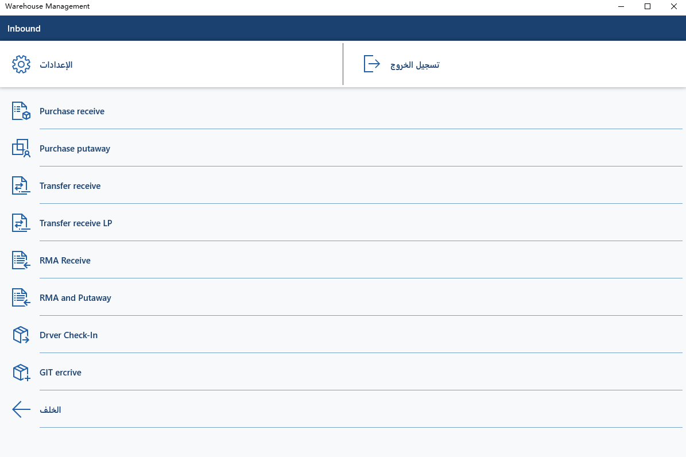

قبل إجراء أي من عمليات Warehouse management باستخدام جهاز محمول، يجب تكوينه لـ Dynamics 365 Supply Chain Management.

المجالات الخمسة الأساسية في الإعداد هي:

-    **فئات العمل** - تستخدم لتعريف أنواع أوامر العمل التي يمكن لجهاز المحمول معالجتها.

-    **قوائم الأجهزة** - تستخدم لتحديد الخيارات المتوفرة والتنقل لتلك الخيارات على كل جهاز.

-    **تخطيط الجهاز** - يسمح لك بتحديد معلومات مثل الخط واللون، وخريطة اختصارات لوحة المفاتيح، وتحديد تنسيق التاريخ لعرضها على الجهاز.

-    **مستخدمو الأجهزة** - يحدد الأشخاص أو العاملين الذين يمكنهم الوصول إلى الأجهزة المحمولة ومستوي الوصول المطلوب.

-    **إعدادات الطباعة** - تتيح لك التحكم في التخطيط، والطابعة، والقالب المراد استخدامه لطباعة التسميات.

## فئات العمل

يتم استخدام فئات العمل لتحديد أوامر العمل التي يمكن لجهاز المحمول معالجتها إذا كان صنف القائمة سيقوم بمعالجة العمل الموجود.

على سبيل المثال، قد يتضمن أمر العمل أوامر شراء أو عمليات التحويل والإيصالات أو التزويد أو أوامر الإرجاع. سيقوم صنف القائمة فقط بمعالجة العمل الخاص بنوع أمر العمل المحدد.

## قوائم الأجهزة

تحتوي القائمة على أصناف القائمة التي سيستخدمها العاملون في المستودع لتنفيذ عملهم. يمكنك إنشاء بنية القائمة الخاصة بالجهاز المحمول عن طريق إضافة أصناف القائمة والقوائم. عندما تقوم بإضافة قائمة، يتم تعيين أصناف القائمة الخاصة بها أيضاً.

يمكنك تكوين أصناف القائمة من أجل:

-   معالجة استعلام أو تنفيذ نشاط، مثل طباعة تسمية أو إنشاء لوحات ترخيص المستخدم أو بدء أمر إنتاج أو البحث بسرعة بين المعلومات الخاصة بالأصناف الموجودة في الموقع.

-   إنشاء العمل الذي سيتم تنفيذه من خلال عملية أخرى. على سبيل المثال، يمكن أن يؤدي استلام صنف لأمر شراء إلى إنشاء عمل استبعاد لعامل آخر.

-   تنفيذ العمل الذي تم إنشاؤه بواسطة عملية أخرى. وهذا يُعرف بالعمل الموجود. على سبيل المثال، تنفيذ عمل الاستبعاد الذي تم إنشاؤه عند استلام صنف لأمر شراء.

يتم تكوين أصناف القائمة التي تظهر على قوائم الجهاز المحمول الخاصة بالمستودع في صفحة **أصناف قائمة الجهاز المحمول**. نظراً لأنه يمكن وضع أصناف القائمة في قوائم مختلفة، فإنه من السهل تكوين بنية القائمة بحيث يتم عرض أنواع معينة فقط من العمل لمستخدمين بعينهم. 

## مستخدمو الأجهزة 

يتعين عليك إعداد حساب مستخدم لعامل مستودع للوصول إلى جهاز محمول. يتضمن هذا إعداد عامل كمستخدم عمل، وتحديد قوائم الأجهزة المحمولة التي يمكن للعامل الوصول إليها، وتحديد معلومات تسجيل الدخول الخاصة بهم.

يمكنك إنشاء العديد من مستخدمي العمل لكل عامل إذا كانوا بحاجة إلى الاطلاع والحصول على أذونات مختلفة في مواقع مختلفة.

 > [!VIDEO https://www.microsoft.com/videoplayer/embed/RE41Cjs]

## إعدادات الطباعة للتسميات

يمكن إعداد أصناف قائمة الجهاز المحمول التي تمكن العاملين من استخدام الجهاز المحمول الخاص بهم لطباعة التسميات أو إعادة طباعتها. الجزء المهم من عملية المستودع هو طباعة التسميات للأصناف التي يتم استلامها بحيث يمكن التعرف عليها باستخدام ماسح ضوئي للاستخدام في المستقبل.
يتم عادةً إجراء الطباعة عند إكمال العمل، مثل الانتقاء والاستلام.

## تثبيت Supply Chain Management وتكوينها - التخزين‬

**Supply Chain Management - التخزين** هو أحد التطبيقات المتوفرة على متجر Google play ومتجر Windows. يتم توفير هذا التطبيق كمكون مستقل، وهو ما يعني التوزيع الذاتي على الأجهزة التي يتم استخدامها لمهام المستودع.

لاستخدام التطبيق في بيئة Supply Chain Management، يجب تنزيل التطبيق على كل جهاز وتكوينه للاتصال بالبيئة الخاصة بك. 

## قم بإنشاء تطبيق خدمة الويب في Azure Active Directory

لتمكين التطبيق من التفاعل مع خادم Supply Chain Management المحدد، يجب تسجيل تطبيق خدمة ويب في Azure Active Directory (Azure AD) من Microsoft للمستأجر. لأسباب تتعلق بالأمان، نوصي بإنشاء تطبيق خدمة ويب لكل جهاز تستخدمه. لإنشاء تطبيق خدمة ويب في Azure AD، أكمل الخطوات التالية:

1.  في مستعرض الويب، انتقل إلى <https://portal.azure.com>.

2.  أدخل الاسم وكلمة المرور للمستخدم الذي لديه حق الوصول إلى اشتراك Azure.

3.  في مدخل Azure، في جزء التنقل الأيمن، حدد **Azure Active Directory**.

4.  تأكد من أن مثيل خدمة Active Directory هو نفسه الذي تستخدمه Supply Chain Management.

5.  في القائمة، حدد **تسجيلات التطبيقات**.

6.  في الجزء العلوي، حدد **تسجيل تطبيق جديد**. يبدأ تشغيل معالج إضافة التطبيق.

    

7.  أدخل اسماً للتطبيق وحدد **تطبيق ويب/API الويب**. أدخل **عنوان URL لتسجيل الدخول**، وهو عنوان URL الخاص بتطبيق الويب الخاص بك. عنوان URL هذا هو نفس عنوان URL الخاص بالتوزيع، ولكن يتم إضافة "oauth" إلى النهاية.

8.  حدد **إنشاء**.

9. حدد التطبيق الجديد في القائمة. 

10. تذكر **معرف التطبيق**؛ ستحتاجه لاحقاً. ستتم الإشارة إلى **معرف التطبيق** لاحقاً على أنه **معرف العميل**.

11. حدد **مفاتيح** في جزء الإعدادات. قم بإنشاء مفتاح عن طريق إدخال وصف المفتاح والمدة في **كلمات المرور** .

12. حدد **حفظ** وانسخ المفتاح. ستتم الإشارة إلى هذا المفتاح لاحقاً باعتباره **سر العميل**. 

## إنشاء حساب مستخدم وتكوينه في Supply Chain Management

يمكنك إنشاء حساب مستخدم لـ Supply Chain Management التي تتوافق مع بيانات اعتماد مستخدم التطبيق الذي يتم تخزينه. بعد ذلك، يمكنك إقران تطبيق Azure AD الخاص بك مع مستخدم التطبيق الذي يتم تخزينه.

لتمكين Supply Chain Management لاستخدام تطبيق Azure AD الخاص بك، أكمل خطوات التكوين التالية:

1.  في Supply Chain Management، انتقل إلى **> إدارة النظام > شائع > المستخدمون**.

2.  إنشاء مستخدم جديد.

3.  قم بتعيين مستخدم **جهاز محمول المستودع**. 

    

4.  في Supply Chain Management، انتقل إلى **إدارة النظام > إعداد > تطبيقات Azure Active Directory**.

5.  إنشاء سطر جديد.

6.  أدخل **معرف العميل** (الذي تم الحصول عليه في القسم الأخير)، وأعطه اسماً وحدد المستخدم الذي تم إنشاؤه مسبقاً. نوصي بوضع علامات على كافة الأجهزة بحيث يمكنك إزالة حق وصولهم بسهوله لـ Supply Chain Management من هذه الصفحة في حاله فقدهم. 

## تكوين التطبيق

يجب تكوين التطبيق على الجهاز للاتصال بخادم Supply Chain Management من خلال تطبيق Azure AD. للقيام بذلك، أكمل الخطوات التالية:

1.  في التطبيق، انتقل إلى إعدادات **اتصال**.

2.  قم بمسح حقل **وضع العرض التوضيحي**.

    

3.  أدخل المعلومات التالية:

    -   **معرف عميل Azure Active directory** - يتم الحصول على معرف العميل في الخطوة 11 في قسم إنشاء تطبيق خدمة ويب في Active directory.

    -   **سر عميل Azure Active directory** - يتم الحصول على سر العميل في الخطوة 13 في قسم إنشاء تطبيق خدمة ويب في Active directory.

    -   **مورد Azure Active directory** - يصور مورد دليل Azure AD عنوان URL لجذر Supply Chain Management. ملاحظة: لا تنهي هذا الحقل بحرف الخط المائل للأمام (/).

    -   **مستأجر Azure Active directory** - مستأجر دليل Azure AD المستخدم مع خادم Supply Chain Management: https:\//login.windows.net/your-AD-tenant-ID. على سبيل المثال: https:\//login.windows.net/contosooperations.onmicrosoft.com. لا تنهِ حقل **URL** بحرف الخط المائل للأمام (/).

    -   **الشركة** - إدخال الكيان القانوني في Supply Chain Management التي ترغب في إجراء اتصال التطبيق بها.

4.  حدد الزر **"رجوع"** الموجود في الركن العلوي الأيمن من التطبيق. سيقوم التطبيق الآن بالاتصال بخادم Finance and Operations الخاص بك وسيتم عرض شاشه تسجيل الدخول للعامل في المستودع. 

## التوزيع الجماعي لـ Warehouse mobile app

غالباً ما تكون هذه عملية معقدة لتوزيع إعدادات الاتصال على هؤلاء المستخدمين الذين سيستخدمون تطبيق المستودع. لاستخدام هذه العملية، يمكن توزيع هذه الإعدادات بشكل شامل للأفراد المتأثرين باستخدام أداة التوزيع مثل Microsoft Intune. بالإضافة إلى التوزيع، يمكن لهذه الأداة أيضاً أن تحتوي على الأجهزة المحمولة الخاصة بمستودع الخدمة. لمزيد من التفاصيل حول هذا انتقل إلى [التوزيع الجماعي باستخدام Microsoft Intune](/mem/intune/apps/apps-windows-10-app-deploy/?azure-portal=true)  

## مسح الرموز الشريطية ضوئياً باستخدام كاميرا في Supply Chain Management

في **إعدادات العرض** الخاصة بالتطبيق الذي يتم تخزينه، يمكنك تحديد ما إذا كان يجب استخدام الكاميرا لمسح الرموز الشريطية ضوئياً. إذا قمت بتمكين **استخدام الكاميرا كماسح ضوئي**، يمكنك استخدام الكاميرا على كل حقل إدخال تم تعيين وضع الإدخال المفضل له على **المسح الضوئي**.

للتحكم في ما إذا كان يجب أن يكون حقل الإدخال قابلاً للمسح الضوئي، في صفحة **أسماء حقول تطبيق المستودع** في Supply Chain Management، قم بتعيين **وضع الإدخال المفضل** على **المسح الضوئي**. عند تحديد هذا الخيار، يمكن استخدام الكاميرا للمسح الضوئي في تطبيق التخزين.

يتم دعم أكثر تنسيقات الرموز الشريطية شيوعاً، بما في ذلك الكود 128، الكود 39، الكود 93، EAN-8، EAN-13، UPC-E، UPC-A، وشفرات الاستجابة السريعة.

ستبدأ صفحة **الكاميرا** على كل صفحة حيث يكون لحقل الإدخال وضع إدخال مفضل يتم تعيينه على **المسح الضوئي** عندما تكون في صفحة **الكاميرا**. استخدم الخيارات التالية للتنقل خلال الصفحة:

-   حدد الزر **"رجوع"** للرجوع إلى **صفحة المهام والتفاصيل**.

-   حدد القلم في صفحة **المهمة والتفاصيل** للانتقال إلى الصفحة حيث يمكنك كتابة الإدخال يدوياً.

    

-   حدد الكاميرا في صفحة **المهمة والتفاصيل** للرجوع إلى صفحة **الكاميرا**.

    

في صفحة **الكاميرا**، عند تحديد زر **الكاميرا**، فإنه يظهر بشكل باهت أثناء محاولة تحديد الرمز الشريطي. في حالة عدم تعريف الرمز الشريطي خلال خمس ثوانٍ، سيؤدي ذلك إلى انتهاء مهلة العملية وسيصبح زر **الكاميرا** متاحاً مرة أخرى. سيمكنك عندئذ محاولة مسح أحد الرموز الشريطية ضوئياً مرة أخرى.

عندما توجه الكاميرا نحو رمز شريطي، حافظ على محاذاة الرمز الشريطي داخل الأقواس للحصول على أفضل النتائج. عند مسح الرمز الشريطي ضوئياً بنجاح، ستتم معالجة النتيجة، وسيتم نقلك إلى الخطوة التالية. إذا كانت الخطوة التالية تحتوي على حقل إدخال آخر مع تعيين وضع الإدخال المفضل على **المسح الضوئي**، فستبدأ صفحة **الكاميرا** مرة أخرى. إذا لم تكن الخطوة التالية حقل مسح ضوئي، فلن يتم بدء تشغيل صفحة **الكاميرا**.

## إزالة الوصول لجهاز

في حالة وجود جهاز مفقود أو مكسور، يجب إزالة إمكانية الوصول إلى Supply Chain Management الخاصة بالجهاز. تصف الخطوات التالية العملية المستحسنة لإزالة الوصول.

1.  في Supply Chain Management، انتقل إلى **نظام > إدارة > إعداد > Azure Active Directory > تطبيقات**.

2.  قم بحذف السطر المتوافق مع الجهاز الذي ترغب في إزالة صلاحية الوصول اليه. تذكر **معرف العميل** الذي يتم استخدامه للجهاز الذي تمت إزالته، ستحتاجه لاحقاً.

3.  سجل الدخول إلى مدخل Azure على [https://portal.azure.com](https://portal.azure.com/).

4.  حدد رمز **Active Directory** في القائمة اليمنى وتأكد من أنك في الدليل الصحيح.

5.  في القائمة، حدد **تسجيلات التطبيقات** ثم حدد التطبيق الذي ترغب في تكوينه. ستظهر صفحة **إعدادات** مع معلومات التكوين.

6.  تأكد من أن **معرف العميل** للتطبيق هو نفس الشكل كما في الخطوة 2 في هذا القسم.

7.  حدد الزر **حذف** في الجزء العلوي.

8.  حدد **موافق** في رسالة التأكيد.
