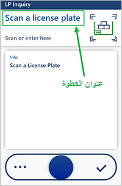
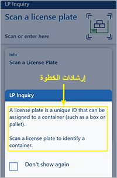
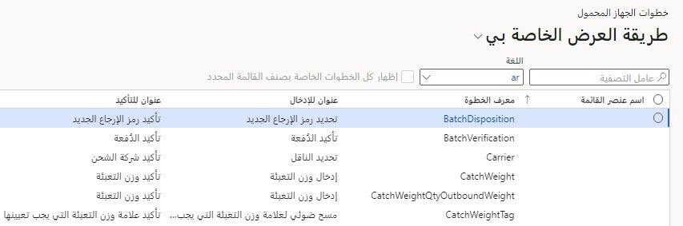
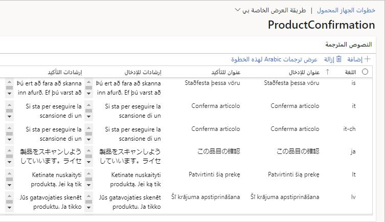

يستغرق إعداد موظفين جدد أو مؤقتين وقتاً طويلاً لأنهم بحاجة إلى إتقان مهارات جديدة. حتى العاملون في المستودعات من ذوي الخبرة يشعرون في بعض الأحيان بعدم الارتياح إزاء أداء وظائف جديدة لم يسبق لهم القيام بها. عندما يعمل العاملون عبر سير عمل، تسمح لهم ميزة عناوين وإرشادات الخطوة بالتركيز على المجالات الأكثر أهمية وتسرّع تعلمهم للوظيفة الجديدة.

بعض المزايا التي يمكن اكتسابها من خلال الاستفادة من هذه الميزة هي:

- **زيادة نشاط العاملين بسرعة من خلال السماح لهم باتباع إرشادات بسيطة لكل خطوة في المهمة** - تتضمن كل خطوة في سير عمل إرشادات تساعد العاملين في الخط الأمامي على فهم المهمة.

- **توفير إرشادات تتطابق مع عملياتك الخاصة** - أنشئ إرشادات تتطابق مع عمليات شركتك ومستودعك. يمكنك، على سبيل المثال، تخصيص المصطلحات وفقاً لموقعك الفعلي والاختصارات المحلية.

- **زيادة الإنتاجية من خلال تسليط الضوء على أهم الأجزاء في كل خطوة** - حدد الحقول والبيانات التي يجب تسليط الضوء عليها لكل مرحلة لمساعدة العاملين على تركيز انتباههم.

## تمكين ميزة إرشادات الخطوة في تطبيق Warehouse
يجب تمكين هذه الميزة في النظام قبل أن تتمكن من استخدامها. بإمكان المسؤولين التحقق من حالة هذه الميزة وتمكينها باستخدام إعدادات إدارة الميزات. في مساحة عمل **إدارة الميزات**، تم إدراج الميزة بالطريقة التالية:

- **الوحدة النمطية** - إدارة المستودعات
- **اسم الميزة** - إرشادات الخطوة في تطبيق Warehouse

## عناصر ميزة إرشادات الخطوة في تطبيق Warehouse
تتضمن ميزة إرشادات الخطوة في تطبيق Warehouse:

- الإطارات المتجانبة للخطوة
- إرشادات الخطوة
- تحميل نصوص الإعداد الافتراضي

### عناوين الخطوات
عنوان الخطوة هو شرح موجز لما يجب على العامل القيام به أثناء تنفيذ الخطوة. يظهر هذا العنوان بخط كبير في الجزء العلوي من الشاشة، كما هو موضح في لقطة الشاشة التالية.

 
### إرشادات الخطوة
إرشادات الخطوة هي وصف أكثر تفصيلاً للمهام التي يجب أن يؤديها العامل أثناء تنفيذ خطوة معينة. وهي تظهر في نافذة مربع حوار منبثق، كما يظهر في لقطة الشاشة التالية.

 

### تحميل نصوص الإعداد الافتراضي
عندما تقوم بتمكين وظيفة إرشادات الخطوة في بادئ الأمر لتطبيق Warehouse Management، سيكون نظامك خالياً من أسماء وإرشادات خطوات فريدة. ونتيجة لذلك، يجب أن تبدأ بتحميل التكوين الافتراضي. يتضمن التكوين الافتراضي نصاً لكل معرف خطوة متاح في كل لغة مدعومة. ستقوم الإجراءات أدناه بتحميل التكوين الافتراضي.

1.  انتقل إلى **إدارة المستودعات > إعداد > الجهاز المحمول > خطوات الجهاز المحمول**.
2.  في جزء الإجراءات، حدد **إنشاء إعداد افتراضي**. يتم ملء الصفحة بالخطوات القياسية.

## إرشادات لتخصيص الإطارات المتجانبة للخطوات
اتبع هذه الإرشادات لتوفير عناوين أو إرشادات مخصصة لخطوة بلغات متنوعة. 

1.  انتقل إلى **إدارة المستودعات > إعداد > الجهاز المحمول > خطوات الجهاز المحمول**.

    تسرد صفحة **خطوات الجهاز المحمول** كل خطوة متاحة لنظامك. يمكن مشاركة كل **معرف خطوة** بين أي عدد من عناصر قائمة الجهاز المحمول. إذا تمت مشاركة **معرف خطوة** بين عناصر قائمة متعددة، فسيظهر العنوان نفسه والإرشادات نفسها لجميع عناصر القائمة هذه. ومع ذلك، يمكنك إنشاء تجاوزات لتخصيص العنوان والإرشادات لعناصر قائمة محددة. 

    

    تتضمن صفحة **خطوات الجهاز المحمول** الأعمدة التالية:

    - **اسم عنصر القائمة** – تستخدم الصفوف التي يكون فيها هذا العمود فارغاً عنوان الخطوة الافتراضية وإرشاداتها التي تنطبق على جميع عناصر قائمة الجهاز المحمول التي لم يتم تحديد تجاوز لها. توجد لدى الصفوف حيث تم تعيين هذا العمود إلى اسم عنصر تجاوزات تنطبق فقط على عنصر القائمة المحدد فقط.

    - **معرف الخطوة** – المعرف الفريد للخطوة.

    - **عنوان للإدخال** – العنوان الذي يظهر عندما يطلب التطبيق معلومات جديده. تكون الحقول الموجودة في الصفحة عادةً فارغة (أي، ليس لديها قيم معينة مسبقاً).

    - **عنوان للتأكيد** – العنوان الذي يظهر عندما يطلب التطبيق تأكيداً لقيمة مخزنة بالفعل في النظام. تحتوي الحقول الموجودة في الصفحة عادةً على قيم معينة مسبقاً.

2.  ابحث عن تركيبة من القيمتين **معرف الخطوة** و **اسم عنصر القيمة** اللتين تريد تحريرهما، ثم حدد القيمة في عمود **معرف الخطوة**. تسرد الصفحة **تأكيد المنتج** التي تفتح جميع الترجمات المتوفرة للعنوان والإرشادات الخاصة بالخطوة المحددة.

    
 
3.  استخدم أحد الإجراءات التالية لتخصيص النص لأي لغة. يسمح لك الأسلوبان بتغيير المادة المكتوبة بلغة موجودة مسبقاً. ومع ذلك، فإن الخيار الأول فقط يسمح بإضافة لغات جديدة، بينما يسمح الخيار الثاني بعرض وتحرير جميع التجاوزات الخاصة بالقائمة الحالية للغة المحددة.

    - على شريط الأدوات، حدد **إضافة** لفتح مربع حوار حيث يمكنك إضافة نصوص أو تحريرها لأي لغة مدعومة. 
        1. عيّن **اللغة المرجعية** إلى اللغة التي تريد عرض قيمها. تظهر القيم في العمود الأيمن. 
        1. عيّن حقل **لغة الترجمات** إلى اللغة التي تريد إضافتها أو تخصيصها. 
        1. في العمود الأيسر، حرر قيم الحقول **عنوان للإدخال** و **إرشادات للإدخال** و **عنوان للتأكيد** و **إرشادات للتأكيد‏‎** وفقاً لاحتياجاتك. 
        1. حدد **موافق**.

    - في الصفحة، ابحث عن الصف حيث تم تعيين حقل **اللغة** إلى اللغة التي ترغب في تحريرها وحدده. 
        1. على شريط الأدوات، حدد **عرض ترجمات اللغة لهذه الخطوة** لفتح مربع حوار حيث يمكنك تحرير نصوص لجميع التجاوزات المتوفرة للغة المحددة. يتضمن مربع الحوار صفحة تحتوي على صفوف لكل من النصوص القياسية (حيث حقل **اسم عنصر القائمة** فارغ) ولكل نص تجاوز متوفر (حيث تم تعيين حقل **اسم عنصر القائمة** إلى اسم عنصر القائمة الذي ينطبق عليه التجاوز). 
        1. حرر قيم الحقول **عنوان للإدخال** و **إرشادات للإدخال** و **عنوان للتأكيد** و **إرشادات للتأكيد‏‎** وفقاً لاحتياجاتك. 
        1. حدد **موافق**.

4.  تابع العمل حتى يتم تحديد جميع العناوين والإرشادات المطلوبة لكل لغة مطلوبة.

## إضافة تجاوزات خاصة بالقائمة لمعرفات الخطوات
كما ذكرنا سابقاً، بإمكان كل **معرف خطوة** أن يكون لديه تعديلات خاصة بالقائمة غير محددة العدد. بالنسبة لعنصر قائمة معين، يمكنك استخدام هذه الميزة لتغيير الإرشادات وتعديلها. على سبيل المثال، إذا كانت مؤسستك تقدم بشكل عام معرفات عمل على الورق، فيمكنك أن تقترح بدء العاملين بالعمل عن طريق إجراء مسح ضوئي لمعرف العمل.

يمكن إضافة أي عدد من اللغات لكل تجاوز. في حال عدم وجود أي تجاوز لعنصر قائمة، يتم استخدام الرسائل العادية. ويتم استخدام النصوص القياسية للغة إذا لم يتم تعيين ترجمة تجاوز، حتى لعناصر القائمة حيث توجد تجاوزات لدى اللغات الأخرى.

لإنشاء تجاوز وتأكيده، اتبع الخطوات التالية.

1.  انتقل إلى **إدارة المستودعات > إعداد > الجهاز المحمول > خطوات الجهاز المحمول**.
2.  في الصفحة، ابحث عن الصف الذي تريد إنشاء تجاوز له وحدده.
3.  في جزء الإجراءات، حدد **إضافة تكوين الخطوة**.
4.  في مربع الحوار المنسدل **إضافة تكوين الخطوة**، عيّن حقل **عنصر القائمة** إلى عنصر قائمة الجهاز المحمول الذي ينطبق عليه التجاوز. 
5.  حدد **موافق**.

تعرض الصفحة التي تظهر جميع النصوص المتوفرة للتجاوز الجديد. بشكل مبدئي، يتم إنشاء لغة واحدة فقط. ما لم تقم بإضافة لغات إضافية هنا. ستواصل جميع اللغات الأخرى استخدام النصوص القياسية. يمكنك تحرير النصوص وإضافة لغات جديدة حسب الحاجة.

