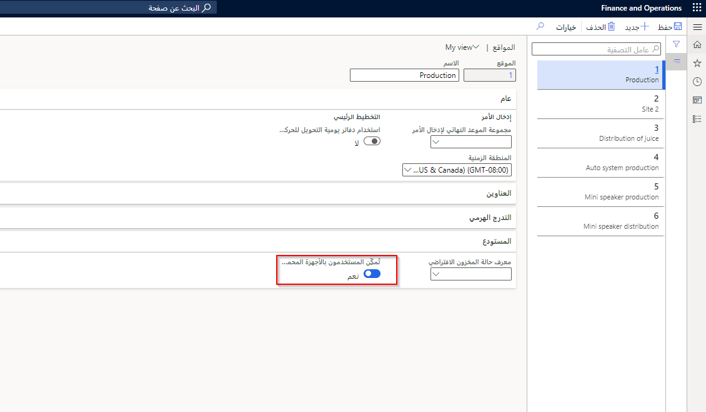

## عمليات استلام أوامر الشراء
 
يمكن تقسيم عملية استلام أمر الشراء إلى الخطوات التالية، بدءاً من التحضير حتى التحقق من الموقع في المستودع:

1.  تحضير أمر الشراء بواسطة الشخص المناسب وإرساله إلى المورد.

2.  إرشادك بالتسليم ووصوله إلى موقع مساحة الإرساء الخاصة بك.

3.  يقوم شخص المستودع بتسجيل الدخول إلى الجهاز المحمول.

4.  يمكن تخصيص القائمة لعاملين مختلفين.

    > [!div class="mx-imgBorder"]
    > 

5.  يتم الوصول إلى وظيفة **الاستلام** في الجهاز المحمول عن طريق تحديد **استلام الشراء**.
    > [!div class="mx-imgBorder"]
    > 

6.  يمكنك إما استخدام وظيفة **المسح** أو كتابة **PONUM** (رقم طلب الشراء).
7.  أدخل **الكمية** و **الوحدة** التي يتم استلامها.

7.  تم التحقق من صحة عملية الاستلام من خلال عرض صفحة **العمل** في Supply Chain Management.

7.  يمكنك الرجوع إلى مخزون الصنف لمعرفة ما إذا كان موجوداً في موقع الاستلام الافتراضي في المستودع (أم في أي مكان تم استلامه).

## استبعاد أمر الشراء

عادةً ما يتم التعامل مع مهام استبعاد أوامر الشراء من خلال العاملين في المستودع عن طريق جهاز محمول. بعد استلام أمر الشراء، قد يتم تعيين عامل آخر لاستبعاد الأصناف في موقع المخزون الخاص بها كما هو محدد في توجيه الموقع.

يمكن تقسيم عملية الاستبعاد إلى أربع خطوات أساسية:

1.  عمل مسح ضوئي لمعرف العمل أو لوحة الترخيص الخاصة بالشحنة المراد استبعادها.

2.  التحقق من الأصناف المراد استبعادها.

3.  اتبع مطالبات النظام:

    -   إذا كانت بتوجيه من النظام، فسيوجهك الجهاز المحمول إلى الموقع.

    -   إذا كانت بتوجيه من المستخدم، سيقوم العامل بتحديد موقع.

4.  يتم إجراء مسح ضوئي للتحقق من الموقع على الجهاز المحمول.

## مجموعات استبعاد أمر الشراء

توفر مجموعات الاستبعاد الكفاءة في العملية الواردة وذلك بالسماح للعاملين بتجميع أعمال الاستبعاد ضمن نظام مجموعة وانتقاء عدة لوحات ترخيص مرة واحدة، ثم استبعادها لاحقاً في المواقع المختلفة. 

وتتم العملية على النحو التالي:

1. انتقل إلى **Warehouse management > الإعداد > الجهاز المحمول > ملفات تعريف نظام المجموعة** وقم بإنشاء **نظام مجموعة الاستبعاد**

2. انتقل إلى **Warehouse management > الإعداد > أصناف قائمة الجهاز المحمول** وقم بإنشاء **نظام مجموعة الاستبعاد**، وتأكد من تحديد **معرف ملف تعريف نظام المجموعة** الذي تم إعداده في الخطوة 1.

2. استلام أمر الشراء كما هو موضح أعلاه على الجهاز المحمول.

3. على الجهاز المحمول، حدد **تعيين إلى نظام مجموعة الاستبعاد** وامسح أو أدخل معرفات العمل المتعددة.

4. على الجهاز المحمول، حدد **نظام مجموعة الاستبعاد** وامسح أو أدخل نظام المجموعة.

    -   إذا كانت بتوجيه من النظام، فسيوجهك الجهاز المحمول إلى الموقع.

    -   إذا كانت بتوجيه من المستخدم، سيقوم العامل بتحديد موقع.

## استبعاد أمر الشراء مع فحص الجودة

عند استلام أمر، فإن بعض المستودعات تتطلب فحصاً سريعاً للأصناف لتحديد ما إذا كانت بحالة مرضية أم لا، دون الحاجة إلى المرور بأمر الجودة الرسمي. يتيح خيار التحقق من الجودة هذا للعامل التحقق فعلياً من الصنف قبل استلام الصنف فعلياً واستبعاد الأصناف في موقع المخزون الخاص بها، كما هو محدد في توجيه الموقع. 

عند استلام أحد الأصناف، إذا لم يكن الصنف بحالة مرضية، فعندئذ يرفض العامل خطوة فحص الجودة على الجهاز المحمول ويتم إنشاء عنصر عمل جديد. 
 
وتتم العملية على النحو التالي:

1. في **Warehouse Management > الإعداد** قم بتكوين ما يلي:

    - في **المستودع > المواقع** قم بإنشاء **موقع فحص الجودة** حيث يقوم النظام بتوجيه العامل بوضع علامة إخفاق الفحص

    - في **العمل > فئات العمل** قم بإنشاء فئة عمل جديدة **QualChck**
    
    - في **العمل > قالب فحص الجودة** اختر **مطالبة المستخدم** و **إنشاء عمل فقط**

    - في **العمل > قالب العمل** اختر **نوع أمر العمل > الجودة في فحص الجودة** قم بإنشاء **انتقاء** و **وضع** في **تفاصيل قالب العمل** مع **معرف فئة العمل** الذي تم إعداده للتو 
    
    -  قم بإعداد **قالب عمل** لـ **نوع أمر العمل > أمر الشراء** مع **تفاصيل قالب العمل** مع **نوع العمل** الخاص بـ **الانتقاء** و **فحص الجودة** و **الوضع**

        
    
    

    - في **توجيهات الموقع** الخاصة بـ **نوع أمر العمل > الجودة في فحص الجودة** مع **نوع العمل > وضع**
    
    - في **الجهاز المحمول > عنصر قائمة الجهاز المحمول > استبعاد أمر الشراء** أضف **QualCheck** في علامة التبويب السريعة **فئات العمل**.
    

2. عمل مسح ضوئي لمعرف العمل أو لوحة الترخيص الخاصة بالشحنة المراد استبعادها.

3.  اتبع مطالبات النظام، حسب الإعداد في الخطوة 1:

    -    سيوجهك الجهاز المحمول لفحص الأصناف الموجودة في الشحنة.
    
    -   في حالة اجتياز فحص الجودة، سيقوم الجهاز بتوجيهك إلى موقع الاستبعاد.
    
    -   في حالة فشل فحص الجودة، يتم إغلاق عنصر العمل هذا وإنشاء عنصر عمل جديد لاتخاذ إجراء إضافي.
    

## استبعاد أمر الشراء مع أمر الجودة

من الممارسات الشائعة في العديد من الشركات هو تنفيذ فحوصات الجودة على الشحنات الواردة للمخزون. يتم إعداد العملية في الوحدة النمطية لإدارة المخزون في Supply Chain Management.

يمكن أن يكون إنشاء أمر جودة تلقائيًا عند استلام صنف جزءً من عملية الجودة. وهذا يعني أنه عند استلام صنف في المخزون، سيقوم النظام بإنشاء أمر جودة. بدلاً من استبعاد كافة العناصر كالمعتاد، سيتم نقل بعض أو كل العناصر (استناداً إلى حجم العينة التي تم إعدادها) إلى موقع مختلف للاختبار.

وتتم العملية على النحو التالي:

1.  يتم إنشاء عنصر قائمة **استبعاد أمر الجودة** وتوجيه الموقع وقالب العمل لدعم العملية.

2.  يتم استلام الشحنة.

3.  يتم إنشاء أمر الجودة.

4.  يتم بدء عملية أمر الجودة لنقل المنتج إلى الموقع المحدد لاختبار الجودة.

## سياسات العمل للعمل الوارد
تعمل هذه الميزة (الاختيارية) على تبسيط عملية الاستلام لعمال الاستلام في المستودعات. وهي تتيح استلام صنف أمر الشراء أو صنف التحميل، وتتيح لعملية الاستبعاد استلام البضائع دون إنشاء عمل. يمكن تمكين الميزة في مساحة عمل **إدارة الميزات**. 

وبدلاً من إنشاء العمل، تتيح العملية للعاملين تسجيل المخزون الفعلي الوارد مباشرة إلى الموقع في مساحة تخزين الاستلام الوارد. كما تضيف هذه الميزة أيضًا خيارات للاستلام في أي موقع في المستودع، مما يسمح بإعداد عناصر قائمة خاصة بالموقع في تطبيق المحمول لتضمين المواقع التي لا يتم التحكم فيها بلوحة الترخيص. لمزيد من المعلومات حول سياسات العمل، راجع [سياسات العمل](/dynamics365/supply-chain/warehousing/warehouse-work-policies/?azure-portal=true).

## مرتجعات أمر الشراء

تحتوي معظم المستودعات على عملية خاصة بمعالجة المخزون الذي يلزم إرجاعه. قد تتضمن هذه العملية موقعاً محدداً لاستقبال المخزون، والذي يعرف أحياناً بمستودع العزل. يمكن استخدام هذا الموقع في عمليات الإرجاع أو مع الأصناف التي تتطلب الفحص أو الأصناف التي تتطلب إجراءات غير متكررة.

في بعض الأحيان، يلزم إرجاع شيء تم شراؤه إلى المورد. يمكن القيام بذلك من خلال الجهاز المحمول باتباع الخطوات التالية:

1.  يتم إدخال أمر الإرجاع في Supply Chain Management.

2.  يتم إدخال الإرجاع أو فحصه باستخدام الجهاز المحمول لبدء العملية.

3.  يتم انتقاء الأصناف وإرسالها خلال العملية التي تم إعدادها في قالب العمل والجهاز المحمول.

4.  يتم شحن الأصناف باستخدام الجهاز المحمول لمعالجة الشحنة والتحميل الذي تم إنشاؤه.

## استلام الأصناف في مستودع مختلف عن المستودع المتوقع

قد تستلم أحمال عمل أو أصناف في مستودع يختلف عن المستودع الذي تم تحديده في المستند المصدر. عند استلام حمل العمل أو الصنف، فإنه يتم وضعه في المستودع الجديد، ثم يتم إنشاء كافة الأعمال المتعلقة بهذا المستودع الجديد. وهذا يعني أن كافة عمليات إدارة المخزون هي نفسها التي تتم في المستودع الذي كان من المتوقع استلام المخزون به، والتي تتضمن هياكل التعبئة وإشعار الشحن المتقدم.

لا تتغير المعلومات الموجودة في المستند المصدر لتعكس المستودع الجديد. يجب تعيين المستودع لنفس الموقع الذي تم تحديده في المستند المصدر. تدعم عمليات سير العمل الواردة على الجهاز المحمول الخاصة بالشراء والإرجاع عمليات إنشاء العمل التالية:

-   استلام لوحة الترخيص

-   استلام بند أمر الشراء

-   استلام بند أمر الشراء وإبعاده

-   استلام صنف أمر الشراء

-   استلام صنف أمر الشراء وإبعاده

-   استلام أمر الإرجاع

-   استلام أمر الإرجاع وإبعاده

-   استلام صنف حمل العمل واستلام صنف حمل العمل والاستبعاد

لتجنب الأخطاء، من المهم أن يقوم العامل الذي يتلقى حمل العمل أو الأصناف بالتأكد من تسجيل الدخول إلى المستودع الصحيح.

على سبيل المثال، إذا كان الموظف يعمل في المستودع 11 لكنه نسي أنه مسجل الدخول على جهازه المحمول في المستودع 21، سيتم تحديد موقع عناصر وحدة التحميل بالخطأ في المستودع 21.

لتمكين عمليات الاستلام في مستودع يختلف عن المستودع الذي تم إعداده في المستند المصدر، فأنت بحاجة إلى الانتقال إلى علامة التبويب السريعة **Warehouse management > الإعدادات > المستودع > المواقع > المستودع**.

يمكنك تمكين الخيار للسماح للمستخدمين الموجودين على الجهاز المحمول بالاستلام في مستودع آخر. 

## الاستلام بلوحة ترخيص‬ عن طريق تطبيق المستودع

يمكنك إعداد تطبيق المستودع لدعم استخدام عملية الاستلام بواسطة لوحة الترخيص لاستلام المخزون الفعلي. يمكن لهذه العملية تبسيط عملية استلام بلوحة الترخيص لموظف المستودع. 

## مطالبة العاملين بتأكيد المنتج أو الموقع أو الكمية عند انتقاء الأصناف

يمكنك إعداد تأكيدات الوظائف التي تُمكِّن العامل من استخدام جهاز محمول أثناء العمل في المستودع لتسجيل الموقع أو الكمية. وتضمن تأكيدات الوظائف أن الشخص موجود في الموقع المناسب أو يقوم بإدارة العدد الصحيح من الأصناف. 

يمكنك أيضًا تمكين Supply Chain Management للتحقق من صحة تسجيل العامل تلقائيًا. قد لا تحتاج إلى تأكيد الموقع أو الكمية إذا قمت بتمكين التأكيد التلقائي. 

غالباً ما يتم تضمين الأصناف والاختلافات بين المنتجات في تأكيدات الوظائف. وكذلك من خلال مسح الكود الشريطي، يمكنك تسجيل التأكيدات. يجب عليك إدخال معرف للمنتج أو متغير المنتج للتحقق من صحة المنتجات ومتغيرات المنتجات. يمكن أن يكون هذا المعرف معرف منتج، أو معرف بحث عن المنتج، أو معرفًا خارجيًا، أو GTIN، أو كودًا شريطيًا. بعد إدخال المعرف أو مسح الكود الشريطي ضوئيًا، يتم عرض أبعاد متغير المنتج على الجهاز المحمول.

## التقاط متغيرات المنتج وأبعاد التعقب في تطبيق التخزين أثناء استلام صنف حمل العمل

تتيح هذه الميزة لأحمال العمل التي تحتوي على متغيرات منتجات متعددة إمكانية أن تلتقط متغير منتج محدد (بدون استخدام الرمز الشريطي للمنتج) خلال عمليه استلام صنف حمل العمل. ويمكن أيضًا التقاط قيم أبعاد التعقب (مثل المجموعة والأرقام المسلسلة)، بشرط أن تكون معرفة مسبقاً في بند الأمر. وهذا يتيح أن يتم تسجيل كل صنف بواسطة موظف الاستلام بالمستودع وتدوين المتغيرات وأبعاد التعقب الخاصة باعتباره غير معبأة، بدلاً من تلقي إرشادات بتحديد موقع كل وحدة SKU معينة باتباع تسلسل سطر الأمر.

### إظهار صفحة ملخص الاستلام أو تخطيها
يمكنك استخدام ميزة **التحكم فيما إذا كان سيتم عرض صفحة ملخص الاستلام على الأجهزة المحمولة** للاستفادة من تدفق تفصيلي إضافي لتطبيق المستودع كجزء من عملية الاستلام بلوحة ترخيص.

يتم تشغيل هذه الميزة افتراضياً. بالنسبة لعناصر قائمة الجهاز المحمول لاستلام لوحة الترخيص أو استلام لوحة الترخيص ووضعها بعيداً، يوجد إعداد **عرض صفحة ملخص الاستلام‬‏‫**. يتضمن هذا الإعداد الخيارات التالية:

- **عرض ملخص تفصيلي** – أثناء الاستلام بلوحة ترخيص، يظهر للعمال صفحة إضافية تعرض معلومات ASN كاملة.
- **تخطي الملخص** – لن يتمكن العاملون من عرض معلومات ASN الكاملة. لن يتمكن عاملو المستودع أيضًا من تعيين كود التخلص أو إضافة استثناءات أثناء عملية الاستلام.

### منع استخدام ألواح الترخيص المشحونة لأمر النقل في المستودعات بخلاف المستودع الوجهة
لا يمكن استخدام عملية الاستلام بلوحة ترخيص إذا كانت معلومات ASN تحتوي على معرف لوحة ترخيص موجود بالفعل ويتضمن بيانات فعلية متوفرة في موقع مستودع خلاف موقع المستودع الذي حدث فيه تسجيل لوحة الترخيص.

بالنسبة لسيناريوهات أوامر النقل التي لا يتعقب فيها مستودع النقل بالطريق لوحات الترخيص (وبالتالي لا يتعقب المخزون الفعلي المتوفر لكل لوحة ترخيص)، يمكنك استخدام ميزة **منع استخدام ألواح الترخيص المشحونة لأمر النقل في المستودعات بخلاف المستودع الوجهة** لمنع التحديثات الفعلية للوحات الترخيص المنقولة بالطريق. يمكنك تمكين هذه الميزة في مساحة عمل **إدارة الميزات**.

لإدارة الوظيفة عند توفر هذه الميزة، اتبع الخطوات التالية.

1. انتقل إلى **إدارة المستودعات > إعداد > معلمات إدارة المستودعات**.
2. في **علامة التبويب عام**، في علامة التبويب السريعة **لوحات الترخيص** قم بتعيين حقل **سياسة لوحة الترخيص لمستودع البضاعة بالطريق** إلى إحدى القيم التالية:
    - **السماح بإعادة استخدام لوحة الترخيص غير المتعقبة** – يعمل النظام بنفس الطريقة التي يعمل بها عندما تكون ميزة **منع استخدام لوحات الترخيص المشحونة لأمر النقل في المستودعات بخلاف المستودع الوجهة** غير متاحة. وتعد هذه القيمة هي الإعداد الافتراضي عندما تقوم بتنشيط الميزة لأول مرة.
    - **منع إعادة استخدام لوحة الترخيص غير المتعقبة** – يتم السماح فقط بالتحديثات الفعلية المرتبطة بلوحة الترخيص المشحونة في المستودع الوجهة حتى يتم استلام أمر النقل.

 
    

## ‏‫تحديد موضع لوحة ترخيص الموقع

عندما يكون لديك موقع متعدد البالتات يحتوي على ألواح ترخيص متعددة، تضيف هذه الوظيفة رقماً تسلسلياً إلى **لوحة الترخيص** عند وضع كل لوحة ترخيص في موقع. وهذا يسمح للمستخدمين برؤية موضع كل لوحة ترخيص في **الموقع**. 

لتكوين وظيفة موضع لوحة الترخيص الخاصة بالموقع، اتبع الخطوات التالية:

1. انتقل إلى **Warehouse management -> الإعداد -> المستودع -> ملفات تعريف الموقع**، حدد الموقع، وقم بتبديل خياري **تمكين موضع لوحة الترخيص** و **عرض موضع لوحة الترخيص للجهاز المحمول** إلى **نعم**.
        
    - **تمكين موضع لوحة الترخيص** – تمكين وظيفة موضع لوحة الترخيص لملف تعريف الموقع.

    -   **عرض موضع لوحة الترخيص للجهاز المحمول** - هذا الأمر قابل للتحرير فقط عند تمكين الوظيفة ويتحكم في ما إذا كان من الضروري عرض الموضع للمستخدم على الجهاز المحمول عند إجراء تعديل على حركات التسوية وحركات الجرد الدوري.

    

2. قم بتحديث **Warehouse management > الإعداد > توجيهات المواقع** وفي المواقع التي تريد أن تعمل عليها هذه الوظيفة، قم بإضافة **إجراء توجيه الموقع** لـ **رقم التسلسل** 1 إلى موضع الانتقاء 1 كما هو موضح أدناه: 

3. ثم حدد **تحرير الاستعلام**
    
    - حدد علامة التبويب **الصلات** وقم بتوسيع علامات تبويب **المواقع، أبعاد المخزون** وتمييز **أبعاد المخزون** ثم حدد **إضافة صلة جدول** ثم قم بالتمرير لأسفل بالكامل إلى **لوحة الترخيص** وحدد علامة الاختيار **تحديد**.
    
    -  قم بتمييز **لوحة الترخيص** وحدد **إضافة جدول صلة > موضع لوحة الترخيص** وحدد علامة الاختيار **تحديد**. 
    
    -  حدد علامة التبويب **النطاق**.
    
    -  حدد زر **إضافة** وقم بإضافة الحقل **موضع لوحة الترخيص** مع **المعايير** **1**. 

        

        
