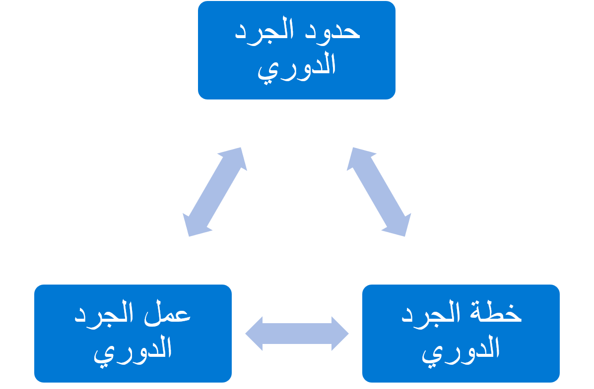
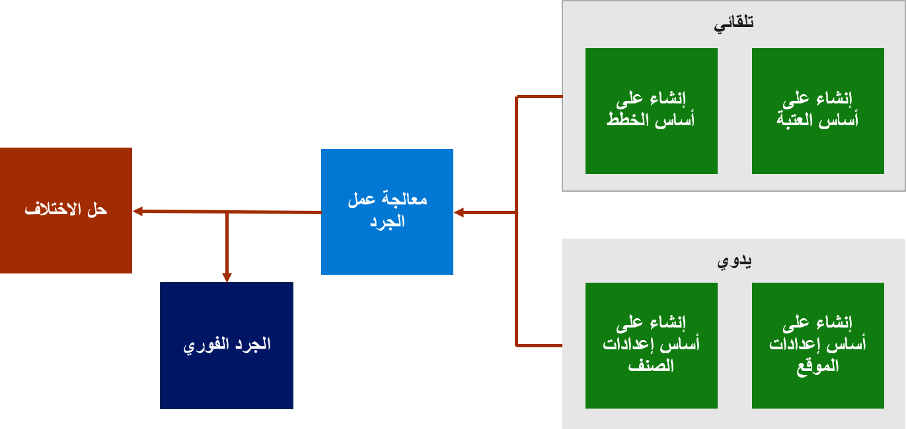

تشكّل عملية الجرد الدوري عملية من عمليات المستودع يمكنك استخدامها للتدقيق في أصناف المخزون المتاح. يشير حد الجرد الدوري إلى حد كمية أصناف المخزون أو نسبتها المئوية. يتم إنشاء عمل جرد دوري تلقائياً عند الوصول إلى الحد.

يتم إعداد خطة الجرد الدوري لإنشاء عمل جرد دوري على الفور أو بشكل دوري. وبعد إنشاء عمل الجرد الدوري، يجب استخدام جهاز محمول لمعالجة الجرد الدوري في موقع المستودع.

يمكن وصف عملية الجرد الدوري في ثلاث خطوات:

1.  **إنشاء عمل الجرد الدوري** - يمكن إنشاء عمل الجرد الدوري بشكل تلقائي استناداً إلى معلمات الحدود للأصناف أو باستخدام خطة جرد دوري. أو، استخدم معلمات المستودع أو الصنف في صفحة **عمل الجرد الدوري حسب الصنف‬** أو صفحة **عمل الجرد الدوري حسب الموقع** لإنشاء عمل الجرد الدوري يدوياً.

2.  **معالجة الجرد الدوري** - بعد إنشاء عمل الجرد الدوري، ستقوم بتنفيذ عمل جرد الدوري عن طريق جرد الأصناف في موقع المستودع، ثم استخدام جهاز محمول لإدخال النتيجة في Supply Chain Management. أو، يمكنك حساب الأصناف في موقع المستودع من دون إنشاء عمل جرد دوري. يُشار إلى هذه العملية باسم *الجرد الدوري الفوري*.

3.  **حل الاختلافات في القيمة المحسوبة** - بعد الجرد الدوري، ستكون الأصناف التي تتضمن اختلافات في قيمة المحسوبة‏‎ بحالة العمل **مراجعة معلقة** في صفحة **العمل بالكامل** . يمكنك حل هذه الاختلافات في الصفحة **عمل الجرد الدوري في انتظار المراجعة** .

## الإعداد العام

قبل بدء الجرد الدوري، عليك إعداد المعلمات التالية:

1.  **العاملون** - أنشئ حسابات مستخدمي العمل وعيّن قوائم الجهاز المحمول إلى معرف مستخدم العمل في وقت لاحق.

2.  **أوعية العمل** - أنشئ أوعية العمل لتنظيم عمل المستودع وفصله، استناداً إلى نوع العمل.

3.  **عناصر قائمة الجهاز المحمول** - أنشئ عناصر القائمة للجرد الدوري الذي يوجهه المستخدم والجرد الدوري الذي يوجهه النظام وتجميع الجرد الدوري والجرد الدوري الفوري في النظام باستخدام الصفحة **عناصر قائمة الجهاز المحمول** في النظام. يمكنك أيضاً إعداد القوائم.

4.  **إعدادات ملف تعريف الموقع** - حدّث ملف تعريف الموقع بتحديد الخيار **السماح بالجرد الدوري** على شاشة **ملفات تعريف الموقع**.

5.  **معلمات إدارة المستودعات‬** - على هذه الشاشة، ستقوم بإعداد المعلمات، بما فيها رمز نوع التسوية الافتراضي ومعرف فئة العمل وأولوية العمل.

## العاملون في الجرد الدوري

يجب أن يتم تكوين العاملين الذين سينفذون عمل الجرد الدوري أو يوافقون على عمليات الجرد الدوري التي تم تنفيذها بواسطة العاملين في المستودع أو يرفضونها في صفحة **مستخدمو العمل**. لا حاجة إلى إعداد خاص للمستخدمين لتنفيذ عمل الجرد الدوري؛ ومع ذلك، يوجد عدد كبير من المعلمات الإضافية للعاملين الذين سيوافقون على عمل الجرد الدوري أو يرفضونه.

## أوعية العمل 

يمكنك استخدام أوعية العمل لتنظيم العمل في مجموعات. على سبيل المثال، يمكنك إنشاء وعاء عمل لتصنيف العمل الذي يحدث في موقع مستودع محدد. بالنسبة إلى جميع أنواع العمل، باستثناء الجرد، يمكنك تعيين وعاء عمل إلى قالب عمل.

بالنسبة للجرد الدوري، يمكنك تعيين وعاء عمل إلى خطط الجرد الدوري. يمكنك تعيين وعاء عمل إلى حد الجرد الدوري وتنفيذ عمل جرد دوري حسب الموقع وبعض عمل الجرد الدوري حسب الصنف.

عند استخدام قوالب العمل لإنشاء العمل، يتم تعيين وعاء العمل تلقائياً للعمل. يمكنك أيضاً تعيين أوعية العمل إلى العمل يدوياً باستخدام الصفحة **توجيهات الموقع‬**.

بعد قيام عامل المستودع بتعريف عناصر القائمة التي سيتم استخدامها لتنفيذ العمل على جهاز محمول، سيقوم العامل عندئذٍ بمسح معرف وعاء العمل. بعد ذلك، يتم تعيين العمل المرتبط بمعرف وعاء العمل بشكل تلقائي إلى مستخدم العمل على الجهاز المحمول حتى إكمال العمل بكامله.

## الجرد الدوري الموجه

يُستخدم الجرد الدوري الموجه عندما تريد أن يقوم العامل بجرد أصناف معينة. عند تنفيذ الجرد الدوري، إذا تم حساب عدد غير صحيح من الأصناف، ستتم مطالبة العامل بجردها مرة أخرى.

الخطوات الأساسية التي تتكوّن منها عملية الجرد الدوري الموجه هي:

1.  إنشاء عمل جرد دوري.

2.  التحقق من إنشاء العمل.

3.  تنفيذ عملية جرد دوري.

4.  الموافقة على عمل الجرد الدوري.

5.  مراجعة عمل الجرد الدوري.

## الجرد الدوري الأعمى

يُستخدم الجرد الدوري الأعمى عندما تريد أن يقوم أحد العاملين بجرد الأصناف في أحد المواقع من دون توجيه فيما يتعلق بالأصناف التي يعمل على جردها. ويمكنك التحكم في نوع المعلومات التي يتم توفيرها على الجهاز المحمول والعدد أو الكمية التي يجب مسحها أو إدخالها أثناء عملية الجرد الدوري.

يشير الجرد الدوري الأعمى إلى المخزون الفعلي الذي يتم جرده من قِبل الموظفين الذين ينفذون عملية جرد عملي للمخزون من دون الوصول إلى الكميات المعروضة حالياً على أنظمة المخزون الإلكترونية أو الأنظمة الأخرى. تُستخدم عمليات الجرد الدوري الأعمى لتقييم سلامة أنظمة الجرد الآلي. يمكن اعتبار الجرد الدوري على أنه *أعمىً* عندما لا يشير إلى أي معلومات حول الصنف الجاري جرده. لن يكون العامل الذي يجري الجرد على علم برقم الصنف الذي من المفترض أن يتم جرده. يقوم العامل بمسح الموقع والرمز الشريطي فقط على الأصناف الموجودة في ذلك الموقع، ثم يُدخل العدد.

## الجرد الدوري الفوري

يُستخدم الجرد الدوري الفوري عندما يعثر العامل على فرق أثناء تنفيذ عمل آخر. بإمكان هذه الفروقات أن تكون عبارة عن كسور أو أصناف موضوعة في غير محلها أو حركات فعلية لم يتم تسجيلها مع حركة المخزون، من بين أشياء أخرى. لا تتطلب عمليات الجرد الفوري إنشاء عمل قبل تنفيذ الجرد. 

تشكّل عمليات الجرد الفوري طريقة سريعة لتسجيل مشاكل المخزون ومعالجتها عند اكتشافها في أرضية المستودع.

على سبيل المثال، يتم توجيه العامل لوضع الأصناف في مكان معين فارغ، وفقاً للنظام. ومع ذلك، يتبيّن للعامل عند وصوله أن الموقع أصبح ممتلئاً بصنف آخر. ويجري العامل عندئذٍ عملية جرد دوري فوري في الموقع لتحديث النظام.

عندما تستخدم تحكم لوحة الترخيص في المستودع، بإمكان الجرد الفوري أن يمنع حدوث الجرد الدوري أو أن يسمح بحدوثه، ثم ينشئ تحويلاً بدلاً من حركة بشكل تلقائي. لتمكين عمليات الجرد الفوري، عيّن الخيار **السماح بحركات لوحة الترخيص أثناء الجرد الدوري** إلى **نعم**.

## الحدود

يمكنك إنشاء عمل الجرد الدوري باستخدام الحدود. تنشئ حدود الجرد الدوري عمل الجرد الدوري تلقائياً عند الوصول إلى الحد.

بينما يقوم العاملون في المستودع بتنفيذ عمل الانتقاء في المستودع، وإذا تم بلوغ الحد، فسيؤدي ذلك إلى إنشاء عمل جرد دوري لذلك الموقع في المستودع بشكل تلقائي. يمكن تكوين كل حد باستخدام استعلامات الصنف والموقع، والتي يتم تقييمها أثناء إجراء عمل الانتقاء.

يتم إعداد خطة الجرد الدوري لإنشاء عمل جرد دوري على الفور أو بشكل دوري. يحتوي عمل الجرد، عند إنشائه، على معلومات حول الموقع الذي سيتم جرده كجزء من بند عمل الجرد. لن يكون المخزون المتاح المقترن بهذا الموقع محظوراً، وبالتالي سيكون متوفراً للحجز والمعالجة الصادرة على الرغم من وجود عمل جرد مفتوح.

### مثال

تم تعيين نوع الحد لحد ما إلى **نسبة مئوية** من 10. إذا كانت الكمية 3000، فسيتم إنشاء عمل الجرد الدوري على الفور عندما يصل المخزون إلى 300. أو يمكنك تعيين حد زمني مثل 7 أيام أو 14 يوماً قبل أن يصبح تنفيذ جرد دوري آخر ممكناً.

بإمكان أنواع الحدود أن تكون عملية فحص مجموعة مكوّنة من كمية ووحدة قياس، أو عملية فحص نسبة مئوية حجمية. إذا انخفض المخزون إلى أقل من هذا الحد أثناء تنفيذ عمل الانتقاء، وإذا كان تاريخ الجرد الأخير يقع خارج الأيام المحددة بين تعيين الحد، فسيتم إنشاء عمل الجرد الدوري. يمكنك تكوين إدارة المستودعات للتأكد من أن العاملين في المستودعات ينفّذون عمل الجرد الدوري فور الوصول إلى الحد. 

## إنشاء عمل جرد دوري تلقائياً

هناك طريقتان لجدولة الإنشاء المتكرر لعمل الجرد الدوري: 

-   **إعداد حدود الجرد الدوري** - الإشارة إلى حد كمية أصناف المخزون أو نسبتها المئوية. يتم إنشاء عمل جرد دوري تلقائياً عند الوصول إلى الحد.

    - ‏‫على سبيل المثال، هناك 60 صنفاً في موقع حيث الحد المسموح للجرد الدوري هو 40. أثناء حركة أمر مبيعات، يتم انتقاء 25 صنفاً من الموقع ويتم وضعها في موقع تقسيم مرحلي.‬ وبما أن عدد الأصناف الجديدة، وهو 35، أقل من كمية الحد المسموح، يتم إنشاء عمل الجرد الدوري تلقائياً للموقع.

-   **إعداد خطة جرد دوري** - إنشاء خطة الجرد الدوري إما على الفور أو بشكل دوري من خلال وظيفة دفعية. يحتوي بند عمل الجرد، عند إنشاء عمل الجرد الدوري، على معلومات حول الموقع الذي سيتم جرده. لن يكون المخزون المتاح المقترن بهذا الموقع محظوراً، وبالتالي سيكون متوفراً للحجز والمعالجة الصادرة على الرغم من وجود عمل جرد مفتوح.

    - على سبيل المثال، يتوفر أحد الأصناف في ثلاثة مواقع في المستودع، وتم تعيين الحد الأقصى لعدد عمليات الجرد الدوري إلى **2**. في هذه الحالة، عندما تقوم بتشغيل خطة الجرد الدوري، سيتم بإنشاء عمليتي جرد دوري للموقعين حيث يوجد الصنف. وكمثال آخر، يمكنك تعيين عدد الأيام بين عمليات الجرد الدوري إلى **5**. في هذه الحالة، يتم إنشاء عمل جرد دوري كل خمسة أيام. ومع ذلك، إذا تمت معالجة عمل الجرد الدوري في اليوم الثالث، فسيتم إنشاء عمل الجرد الدوري التالي بعد مرور خمسة أيام على معالجة آخر جرد دوري، في اليوم الثامن. 

لمعرفة المزيد حول الجرد الدوري التلقائي، يمكنك مشاهدة هذا الفيديو.

 > [!VIDEO https://www.microsoft.com/videoplayer/embed/RE41MFD]
