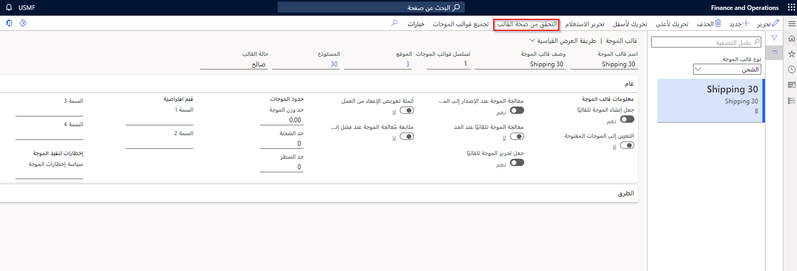
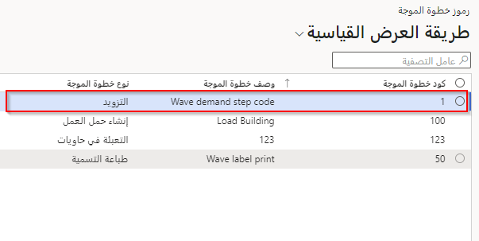
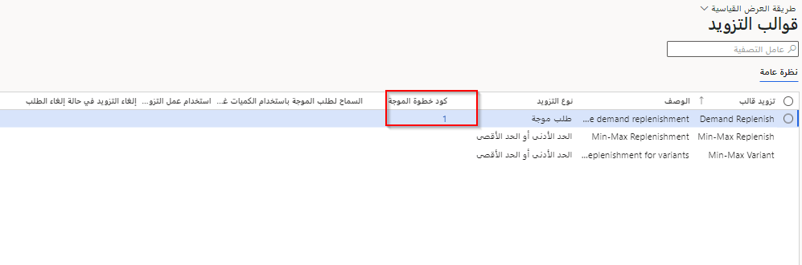
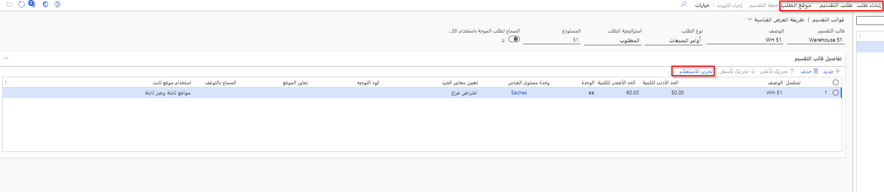
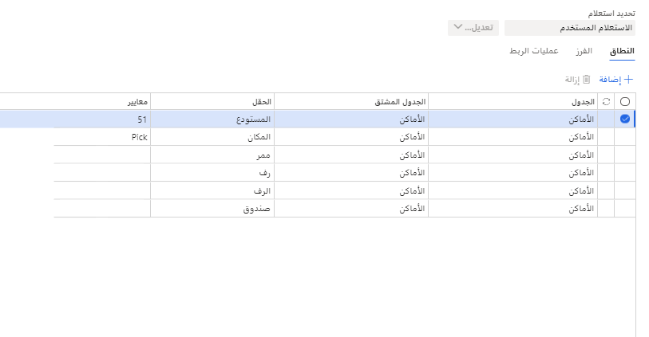
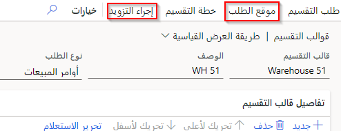

تساعدك أوامر النقل على معالجة الأصناف أثناء النقل بين المستودعات التي توجد في الشركة نفسها لكن في مواقع جغرافية مختلفة.
 
يمكنك استخدام صفحة **أمر النقل** لإدارة الأصناف قيد النقل.
لا تتوفّر الأصناف للاستخدام عندما تكون قيد النقل لأنها تكون مسجّلة تلقائياً في مخزن بضاعة بالطريق خلال فترة النقل. يمكنك شحن واستلام بنود الأوامر أو أجزاء من بنود الأوامر.

يمكن استخدام أوامر النقل حتى إذا كان مستودع واحد فقط مشترك في العملية لديه إدارة مستودعات نشطة في النظام. يمكن أن يستخدم المستودع بإدارة المستودعات النشطة جهازاً محمولاً لمعالجة الأمر.

## الإعداد

التكوينات التالية مطلوبة لاستخدام جهاز محمول لمعالجة أوامر النقل:

-   **مخزن بضاعة بالطريق** - يتم تسجيل الأصناف قيد النقل في مخزن بضاعة بالطريق تلقائياً.

-   **أصناف القائمة** - أصناف قائمة الجهاز المحمول ضرورية لكي يستخدم العاملون في المستودع الجهاز المحمول لاستلام أوامر النقل.

-   **قوالب العمل** - يمكنك إعداد قالب عمل واحد أو أكثر لتحديد كيفية إنشاء العمل لانتقاء المخزون وتسلمه لأوامر النقل.

-   **‏‫توجيهات الموقع‬** - تحدد توجيهات الموقع، إلى جانب قوالب العمل، كيفية تنفيذ العمل ومكان تنفيذه.

-   **‏قوالب الموجة‬** - تساعد قوالب الموجة في تحديد معايير تحدد العمل الذي يتم إنشاؤه لمستودع عند معالجة موجة.

-   **معالجة أوامر النقل** - بعد إكمال هذا التكوين، يمكنك معالجة أوامر النقل.

## قوالب الموجات

يمكنك استخدام قالب الموجة نفسه المستخدم لأوامر المبيعات لأوامر النقل. إذا كان قالب موجة جديد مطلوباً، تأكد من استخدام الزر **‏‫تحرير الاستعلام‬** لتصفية كل قالب موجة وفقاً لمعايير محددة يجب استخدامها للقالب المحدد.

## العملية

تتألف عملية أمر النقل من الخطوات التالية:

1.  إنشاء أوامر نقل. يعتبر هذا جزءاً من العمليات الصادرة.

2.  حجز الأصناف في أوامر النقل.

3.  إنشاء أحمال لأوامر النقل.

4.  إصدار أوامر النقل للمستودعات المقترنة بكل أمر.

5.  انتقاء الأصناف لكل أمر نقل.

6.  استلام أمر النقل في الوجهة. يعتبر هذا جزءاً من العمليات الواردة.

على الرغم من إمكانية تنفيذ الخطوتَين 5 و6 في عميل ويب Supply Chain Management، فباستخدام جهاز محمول، يمكنك تسهيل هذه المهام على عمال المستودعات.

## التزويد

تتوفّر استراتيجيات التزويد التالية:

-   **تزويد طلب الموجة** - تعمل هذه الاستراتيجية على إنشاء عمل للتزويد للأحمال أو الأوامر الصادرة إذا لم يكن المخزون متوفراً عند إنشاء الموجة للعمل. على سبيل المثال، يمكن إنشاء عمل التزويد إذا كانت الكمية المطلوبة لأمر المبيعات غير متاحة عند معالجة الموجة.

-   **الحد الأدنى/الأقصى للتزويد** - تستخدم هذه الاستراتيجية الحد الأدنى والحد الأقصى للتخزين لتحديد موعد ضرورة تزويد المواقع. تُعرِّف معايير الصنف والموقع المخزون الذي يتم تقييمه للتزويد. قوالب الحد الأدنى/الأقصى للتزويد هي الآلية الأساسية للمحافظة على أفضل مستويات لمواقع الانتقاء. للمساعدة في ضمان وجود ما يكفي من مخزون الانتقاء لاستيفاء طلب الموجة، يمكنك استخدام تزويد الطلب كعنصر مكمل بين دورات الحد الأدنى/الأقصى للتزويد.

-   **تزويد طلب الحمل** - تجمع هذه الاستراتيجية الطلب على عدة أحمال وتنشئ عمل تزويد مطلوب لتوفير مخزون لمواقع الانتقاء ذات الصلة. تساعد هذه الاستراتيجية في ضمان إمكانية انتقاء الأحمال التي تم إنشاؤها في المستودع بعد إصدارها.

-   **تزويد فوري** - تؤدي هذه الاستراتيجية إلى تزويد المخزون قبل تشغيل الموجة في حالة تعذّر التوزيع لبند توجيه موقع يتضمن قالب تزويد.

تؤدي الاستراتيجيات الأربعة جميعها إلى إنشاء عمل تزويد استناداً إلى قالب تزويد.

## تزويد طلب الموجة

يؤدي تزويد طلب الموجة إلى إنشاء عمل تزويد استناداً إلى الطلب، إذا كانت الكمية المطلوبة لأوامر الإنتاج أو بطاقات كانبان أو الأوامر الصادرة أو الأحمال غير متوفرة عند إنشاء موجة لعمل. يحتوي قالب التزويد على معلومات عن معايير الصنف، ووحدة القياس، والزيادة في الطلب، والموقع.

يتم استخدام توجيهات الموقع لتحديد الموقع الذي يجب تزويده. يمكنك ربط توجيهات الموقع بقالب التزويد باستخدام حقل **كود التوجيه**. في حالة عدم تعيين حقل **كود التوجيه**، تُستخدم الاستعلامات لتحديد توجيه الموقع المطلوب استخدامه. في حالة عدم تحديد كود التوجيه في قالب التزويد، وكان لتوجيه الموقع كود توجيه، سيتم تجاهل توجيه الموقع، حتى إذا كان الاستعلام في توجيه الموقع صحيحاً. تُستخدم توجيهات موقع الانتقاء لتحديد مكان الحصول على المخزون للتزويد.

بالإضافة إلى إنشاء قالب، عليك أيضاً تحديد بعض إعدادات التزويد في قالب الموجة. يجب أن يحتوي قالب الموجة على خطوة موجة للتزويد يتم تشغيلها فقط إذا لم يكن توزيع الصنف ناجحاً. تستخدم خطوة موجة التزويد هذه كود خطوة الموجة لتحديد قالب التزويد المطلوب استخدامه. بالإضافة إلى استخدام خطوة موجة للتزويد، عليك التأكد من تحديد **التزويد** في قسم **الطرق** من قالب الموجة.

تشتمل صفحة **قالب التزويد** على خانة الاختيار **السماح لطلب الموجة باستخدام الكميات غير المحجوزة**. حدد خانة الاختيار هذه إذا كان من المفترض أن يكون تزويد الطلب قادراً على خصم الكميات غير المحجوزة من العمل الذي يتم إنشاؤه من قالب التزويد المحدد. لتمكين قوالب تزويد الطلب من استخدام هذا المنطق، حدد خانة الاختيار هذه لكل قالب تزويد موجود. عند تشغيل تزويد الطلب في المستودع، سيخصم الطلب من عمل التزويد الحالي الذي يتضمن كميات غير محجوزة، إذا نشأ العمل من قوالب تزويد تم فيها تحديد خانة اختيار **‬‏‫السماح لطلب الموجة باستخدام الكميات غير المحجوزة‬‏‫**.

للقضاء على الأخطاء عند إدخال **أكواد خطوة الموجة** في قالب تزويد، يجب إعداد **أكواد خطوة الموجة** في الجدول أولاً. بهذه الطريقة يتم إدخال كود خطوة صالح في الحقل لقالب تزويد **طلب موجة**. 

تزويد الطلب مدعوم لأوامر المبيعات وأوامر النقل وأوامر الإنتاج وبطاقات كانبان.

## تقسيم المستودعات 

تقسيم المستودعات هو عملية يمكن فيها تزويد مواقع الانتقاء قبل إصدار الأوامر للمستودع. تنطوي العملية على إعداد **قالب تقسيم** سيحسب الطلب من الأوامر - المبيعات وعمليات النقل على سبيل المثال - وسيسمح بعد ذلك للمستخدمين بعملية **إجراء التزويد.** يتم إعداد القوالب لكل مستودع كما هو موضّح في لقطة الشاشة أدناه. 

في هذا المثال، لدينا قالب للمستودع 51. سيستعرض أوامر المبيعات المُعلقة. الاستراتيجية للأصناف المطلوبة، والخيارات الأخرى هي أصناف محجوزة أو تم إصدارها. في التفاصيل، يمكنك عرض الكميات المطلوب توفّرها في المناطق المعرّفة من خلال خيار **تحرير الاستعلام**، والذي يمكن من خلاله في لقطة الشاشة أدناه اختيار موقع محدد أو الاطّلاع فقط على جميع المواقع. في هذا المثال، سيدرس المستودع إجراء ذلك بحيث يمكنه تزويد الأصناف قبل إصدارها، ويُعد ذلك من الممارسات القيّمة في مستودع كثير النشاط. 

النتيجة النهائية لهذه العملية، بعد تشغيل **موقع الطلب**، هي تمكين خيار **إجراء التزويد** لإنشاء العمل لإعادة ملء موقع الانتقاء. 
     

## الحد الأدنى/الأقصى للتزويد

في الحد الأدنى/الأقصى للتزويد، يتم تزويد المخزون بحيث يكون بين الحدّين الأدنى والأقصى اللذين تم تعيينهما. عادةً ما تحدث هذه العملية مرة يومياً للمساعدة في ضمان ملء جميع مواقع الانتقاء إلى أقصى مستوى قبل بدء الانتقاء.

يتم تعيين الحدَين الأدنى والأقصى للكميات في قالب للتزويد.
يشبه عدداً كبيراً من الإعدادات الأخرى في القالب الإعدادات المتوفّرة في القوالب المستخدمة في "تزويد طلب الموجة". يجب أن يتضمن القالب بنداً واحداً لكل صنف وموقع. عند إجراء التزويد باستخدام وظيفة دفعية، يقيّم Finance and Operations ما إذا كان التزويد مطلوباً باستخدام تسلسل تنظيم البنود.

يتعذّر على استراتيجية الحد الأدنى/الأقصى للتزويد تزويد موقع فارغ ما لم يتم تعيين الموقع كموقع ثابت للصنف.
إذا كان الموقع الذي يلزم تزويده ليس موقعاً ثابتاً، لا يمكن أن يحدد النظام الصنف الذي يتعين تزويده. لذلك، مطلوب وجود كمية قليلة متاحة على الأقل قبل حدوث التزويد.

## تزويد طلب الحمل

يجمع تزويد طلب الحمل الطلب على أحمال متعددة ويُنشئ عمل التزويد المطلوب لإضافة مخزون إلى مواقع الانتقاء ذات الصلة. يشبه تزويد طلب الحمل تزويد طلب الموجة في الكثير من الجوانب. يتمثّل الفرق الرئيسي في كيفية ووقت إجراء تزويد طلب الحمل وتزويد طلب الموجة. ومثل الحد الأدنى/الأقصى للتزويد، يتم إجراء تزويد طلب الحمل باستخدام وظيفة دفعية. لإعداد الوظيفة الدُفعية، في **صفحة تزويد طلب الحمل**، حدد قالب التزويد المطلوب استخدامه، وقم بتعيين استعلام عامل تصفية لتحديد الأحمال المطلوب استخدامها لتحديد الطلب. يُعرّف استعلام الموقع المواقع التي سيتم خصم أي كمية متاحة منها لتلبية الطلب المجمّع للأحمال.

## التزويد الفوري

بدلاً من حساب إجمالي الطلب في نهاية عملية التوزيع وإجراء التزويد استناداً إلى الكمية الإجمالية المحتسبة، يمكنك تطبيق استراتيجية التزويد الفوري. عند استخدام هذه الاستراتيجية، يمكن تزويد المخزون فوراً بعد فشل بند توجيه الموقع. وبالتالي، يمكنك إعداد التزويد بحيث يقتصر على وحدات محددة ويستخدم كميات تم تعيينها لمواقع محددة.

## إعداد التزويد

لاستخدام عمليات التزويد، عليك إنشاء الكيانات التالية وتكوينها:

-   **قوالب التزويد** - يجب تعريف وحدات القياس للمخزون المطلوب تزويده.

-   **أنواع الطلب** - يجب إعداد أنواع الطلب لربط قالب تزويد بتوجيه موقع معيّن، ما يمكن أن يحسن الأداء عند إنشاء عمل للتزويد.

-   **المواقع الثابتة** - إذا كنت تريد تزويد مواقع فارغة، عليك استخدام مواقع ثابتة للأصناف. لن يتم تزويد المواقع التي لا تتضمن كمية لأحد الأصناف. يمكنك استخدام قالب التزويد لتحديد أنك تريد تزويد المواقع الثابتة الفارغة لأحد الأصناف أو تزويد المواقع الثابتة فقط.

-   **قوالب العمل** - يجب إعداد درجة عمل للتحكم في الأشخاص الذين يمكنهم إجراء عمل التزويد.

-   **توجيه الموقع** - يشير إلى أن هذه الأصناف سيتم انتقاؤها من وإلى المكان الذي سيتم تخزينها فيه.

-   **أصناف قائمة الجهاز المحمول** - عليك السماح للعمال بمعالجة عمل التزويد من الجهاز المحمول. 

## عملية التزويد

سيؤدي الحد الأدنى/الأقصى للتزويد في إدارة المستودعات إلى إنشاء وحدات عمل لإضافة مخزون مرة أخرى استناداً إلى معايير معرّفة جيداً. يُستخدم الحد الأدنى/الأقصى للتخزين في تحديد ما يحتاج إلى إضافة مخزون إليه وكمية هذا المخزون.
بعد تحديد هذه الإعدادات، يمكن إجراء التزويد يدوياً أو إعداده للإجراء تلقائياً في وظيفة دفعية.

سيؤدي التزويد المستند إلى الطلب إلى إنشاء عمل تزويد للأوامر الصادرة التي يتعذّر عليها العثور على مخزون خلال إنشاء العمل.

يمكنك إجراء التزويد إما يدوياً أو تلقائياً باستخدام وظيفة دفعية. على سبيل المثال، تكون جدولة تزويد المخزون مفيدة إذا كان التزويد مستنداً إلى الحدّين الأدنى/الأقصى للتخزين وتريد إعادة ملء مواقع الانتقاء في نهاية يوم العمل أو أسبوع العمل. بالنسبة إلى تزويد طلب الحمل، يكون ذلك مفيداً إذا تعذّر عليك تنفيذ حمل بسبب نقص المخزون في أحد المواقع.

