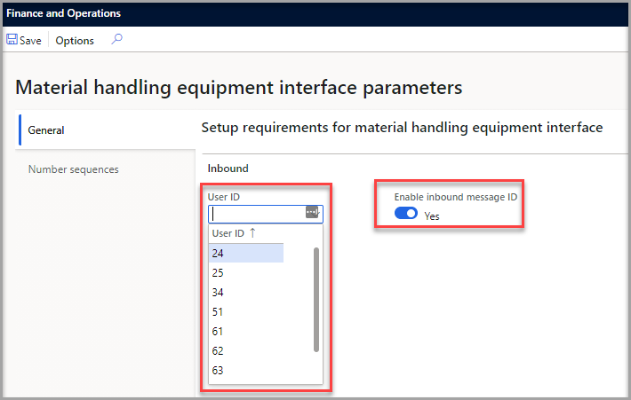
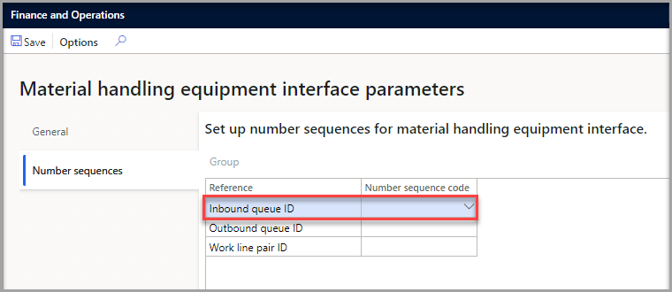
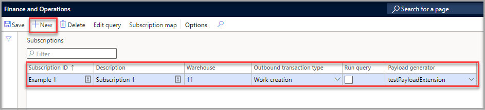

تربط واجهة معدات معالجة المواد (HMAX) أنظمة معالجة المواد المادية الخارجية (MH) بنظام إدارة المستودعات (WMS) المتقدم لإدارة Supply Chain Management. يتضمن إطار عمل التكامل هذا أدوات مدمجة تساعد الشركات على توسيع إطار عمل التشغيل التلقائي للمستودعات وتحسين الإنتاجية. تتكون الواجهة من قائمتي انتظار: الواردة والصادرة، كل منهما تنشئ أحداثاً تؤدي إلى إنشاء عمل في المستودع.

ينشئ WMS أحداثاً صادرة بناءً على خطوط العمل أثناء إنشائها وتنفيذها. يستطلع MH بشكل روتيني WMS للأحداث الجديدة ويرسل أحداثاً صادرة مثل إكمال السطر والانتقاء عند اكتمالها وفقاً لتعليمات العمل الخاصة بهم.

على سبيل المثال، عندما يقوم عامل مستودع بإنشاء عمل أو تنفيذه، يتم إجراء الأحداث الصادرة في قائمة الانتظار الصادرة. عندما تستطلع واجهة MH الآراء عن أي أحداث جديدة، فإنها تعالج الأحداث في قائمة الانتظار الصادرة. عندما يتصل جهاز MH بالخدمة، فإنه ينشئ أحداثاً واردة بناءً على الأحداث الصادرة التي تتم معالجتها. اعتماداً على نوع العمل الذي تم إنشاؤه، سيقوم معالج قائمة الانتظار بعد ذلك بتشغيل العمل الحالي أو تعديل العمل أو إنشاء عمل جديد. 

يمكن للمسؤول لديك تمكين ميزة HMAX ومفتاح التكوين باتباع الإرشادات الموجودة في [واجهة معدات معالجة المواد (MHAX)](/dynamics365/supply-chain/warehousing/mhax/?azure-portal=true).

عندما يتم تمكين الميزات، يجب تكوين معلمات محددة حتى تعمل الواجهة بشكل صحيح.

1.  انتقل إلى **واجهة معدات معالجة المواد > الإعداد > معلمات واجهة معدات معالجة المواد**.
2.  في علامة التبويب **عام**، قم بتعيين الحقول التالية:
    - **معرف المستخدم** – حدد عاملاً. سيقوم هذا العامل بتشغيل جميع عمليات العمل (عمليات الانتقاء والإيداع) التي تتم معالجتها من خلال قائمة الانتظار الواردة.
    - **تمكين معرف الرسالة الواردة** – عند التعيين إلى **نعم**، إذا تم استلام معرّف رسالة واردة مكررة، فسيتم رفض الرسالة، ويتم عرض رسالة خطأ تفيد بوجود الرسالة بالفعل. عند تعيينه إلى **لا**، يُسمح باستخدام معرّفات الرسائل الواردة المكررة.

     

3.  في علامة التبويب **التسلسلات الرقمية**، حدد التسلسلات الرقمية على مستوى النظام التي سيتم استخدامها لإنشاء معرفات فريدة لعناصر قائمة الانتظار الواردة وعناصر قائمة الانتظار الصادرة وأزواج خطوط العمل.
 
     

## الأحداث الصادرة
تسلسل الترقيم يحدد بشكل فريد الأحداث الصادرة. يحتوي كل حدث صادر أيضاً على حقل **الحالة** الذي يشير إلى ما إذا تم إرسال الحدث، مما يمنع إرسال الأحداث المكررة إلى نظام MH.

يتم إعداد الاشتراكات الصادرة لإخبار MHAX بكيفية إنشاء الأحداث. لإعداد الاشتراكات، اتبع الخطوات التالية:

1.  انتقل إلى **واجهة معدات معالجة المواد > الاشتراكات > الإعداد**. 
2.  حدد **جديد** في جزء الإجراءات.
3.  أدخل **معرف اشتراك** وهو اسم فريد يحدد الاشتراك.
4.  قم بإدخال **وصف** يصف الاشتراك.
5.  حدد **المستودع** الذي يجب تصفية الأحداث منه.
6.  أدخل **نوع حركة صادرة** يجب أن يحتوي عليه الاشتراك.
7.  حدد خانة الاختيار **تشغيل الاستعلام** إذا كان استعلام إضافي يحتاج إلى تشغيل الاشتراك.
    - **تشغيل استعلام** - كما هو الحال مع الوظائف الأخرى المتعلقة بالمستودع، يمكن تكوين استعلام للاشتراك في الاستعلام عن خطوط العمل لتحديد العمل الذي سيستخدمه الاشتراك.
    - **مخطط الاشتراك** - يربط جدول التعيين هذا الحقول من سطر العمل أو جداول الرأس إلى حقول البيانات العشرة التي تم تحديدها على أنها أحداث صادرة.
8.  حدد ملحق رمز (اختياري) **منشئ الحمولة** التي يمكنه إدخال معلومات إضافية في حقل **الحمولة** للحدث الصادر.

 

## الأحداث الواردة
اختيارياً، يمكن تحديد الأحداث الواردة بشكل فريد لمنع إرسال الأحداث المكررة إلى قائمة الانتظار الواردة. تم وصف هذه الميزة بمزيد من التفصيل في قسم المعلمات أعلاه. يجب أن يوفر نظام MH نوع الحركة الواردة مع ما يصل إلى 10 معلمات (البيانات من 01 إلى البيانات 10)، كل منها يحدد نوع الأحداث الواردة. 

لمزيد من المعلومات حول أحداث واردة محددة والمعلمات المطلوبة المقابلة لها، راجع [واجهة معدات معالجة المواد (MHAX)](/dynamics365/supply-chain/warehousing/mhax/?azure-portal=true).

 

