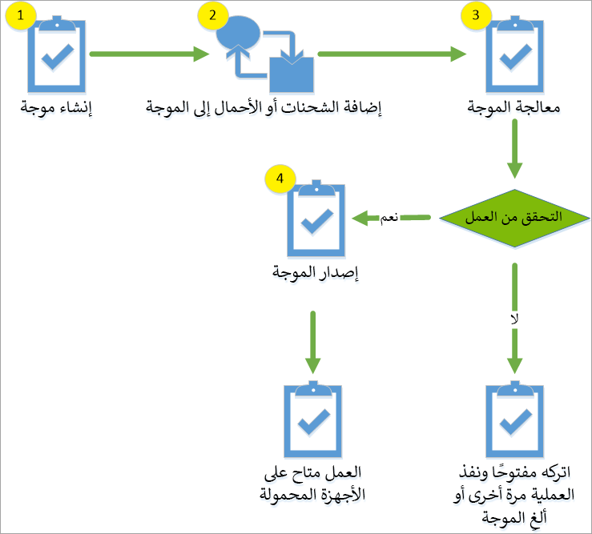
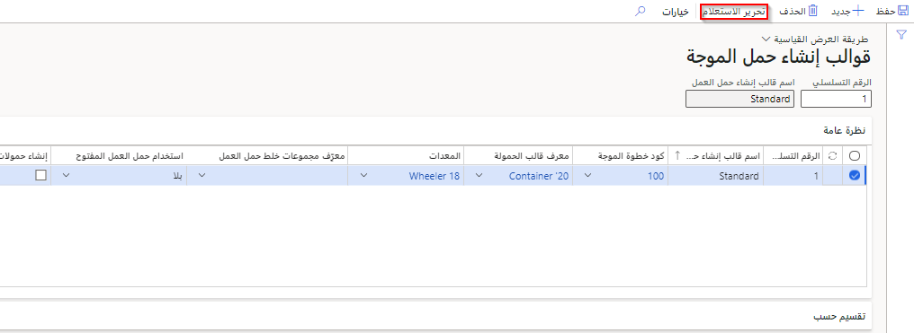
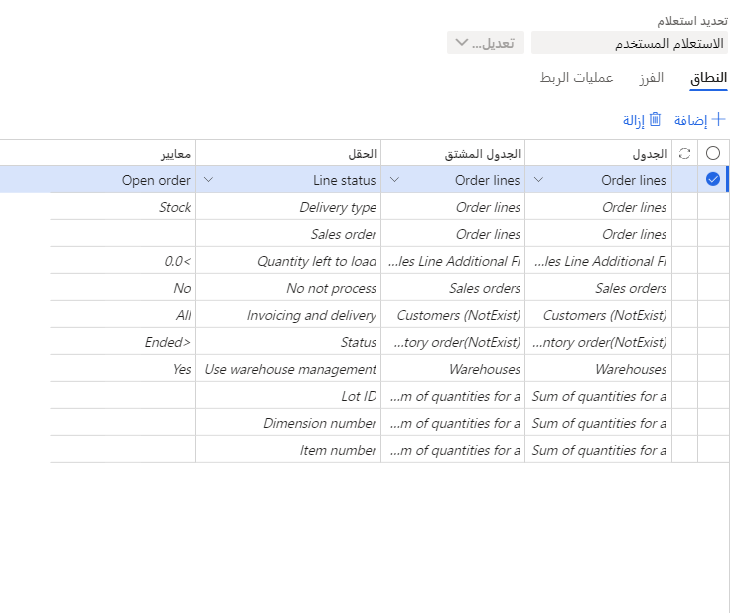
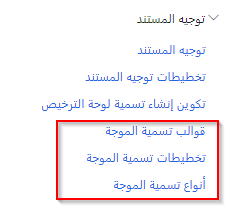
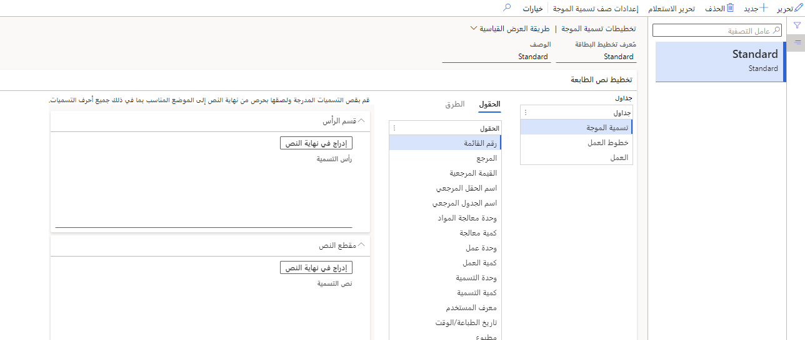
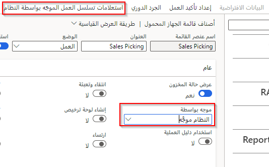
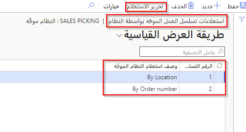
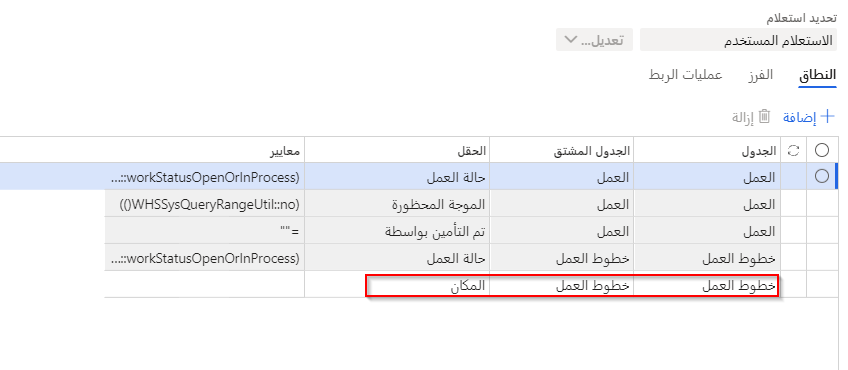
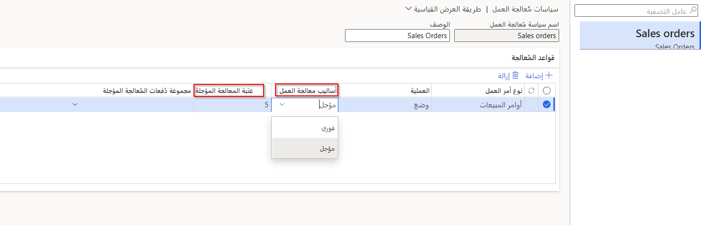

أهم مكونات تكوين المستودع هي قوالب العمل وتوجيهات الموقع وقوالب الموجة. تحدد قوالب العمل ما هو العمل الذي يتم تنفيذه وكيف يتم تنفيذ العمل. توجيهات الموقع عبارة عن قواعد تساعد في تحديد مواقع الانتقاء والوضع لحركة المخزون في المستودع. تحدد قوالب الموجة العمل الذي يمكن تجميعه معاً ومعالجته بنفس الطريقة.

## قوالب العمل 

تعرض قوالب العمل نشاطاً في المستودع مدمجاً في طريقة عرض واحدة ومجموعة من الجداول. عند إنشاء العمل، فإنه يبدأ بالحالة **مفتوح**، والتي يمكنك عرضها باستخدام صفحة **قوالب العمل**.

يكون العمل مفتوحاً عند بدء الحركة، ثم يتم إغلاقه فوراً عند اكتمال الحركة. ولذلك، يمكن استخدام العمل كمحفوظات حركات لأن المعلومات ذات الصلة مثل الصنف والموقع والكمية يتم تسجيلها في تعليمات العمل.

يمكنك استخدام عدة صفحات عمل مغلقة، مثل **عمل المبيعات المغلق** أو **عمل الشراء المغلق**، لمراجعة العمل الذي تم إغلاقه يدوياً أو تلقائياً.

شاهد هذا الفيديو لمعرفة المزيد حول قوالب العمل.

 > [!VIDEO https://www.microsoft.com/videoplayer/embed/RE41x38] 

## توجيهات الموقع

توجيهات الموقع مهمة للعمليات الواردة والصادرة. يرشد توجيه الموقع في العملية الصادرة إلى مكان اختيار الأصناف ومكان وضع تلك الأصناف ليتم شحنها باستخدام عملية الإيداع.

يمكنك استخدام عملية بسيطة من خطوتين حيث يتم انتقاء الأصناف من موقع داخل المستودع ثم شحنها باستخدام عملية الإيداع.
بدلاً من ذلك، يمكنك استخدام الانتقاء متعدد الخطوات لتقديم موقع تجهيز أو محطة تعبئة إضافية. لا يوجد حد لعدد الخطوات التي يمكنك استخدامها في توجيهات موقعك للعملية الصادرة؛ كحد أدنى، يجب عليك تضمين إجراء انتقاء واحد وإيداع واحد.

شاهد هذا الفيديو لمعرفة المزيد حول توجيهات الموقع.

 > [!VIDEO https://www.microsoft.com/videoplayer/embed/RE41Cjt]

## قوالب الموجات

تستخدم إدارة المستودعات انتقاء الموجات. *الموجة* هي مصطلح يُستخدم لوصف عملية لدعم إدارة عمل المستودع أو مركز التوزيع.

يمكنك استخدام صفحة **قوالب الموجات** لإنشاء وصيانة القوالب التي تتحكم في كيفية تشغيل الموجة، بما في ذلك معايير الإعداد وكيفية إنشاء الموجات وتشغيلها وإطلاقها. بالإضافة إلى ذلك، يمكنك إنشاء قوالب موجات متعددة، لكل منها خصائص مختلفة.

لفتح صفحة **قوالب الموجات**، انتقل إلى **إدارة المستودعات > الإعداد > الموجات > قوالب الموجات**.

انتقاء الموجات هو تطبيق لجدولة الفترات القصيرة التي يمكنك استخدامها لتعيين الأوامر في مجموعات (موجات) وإصدارها معاً لتنسيق العديد من الأنشطة المتوازية والمتسلسلة المطلوبة لإكمال العمل. تعتمد الأوامر الفردية في الموجة على المعايير المستخدمة لإجراء التحديد.

الأنواع الثلاثة لقوالب الموجات المتوفرة هي:

- الشحن
- الإنتاج
- كانبان

يتضمن قالب الموجة حمل العمل حسب الوظيفة، مثل إنشاء أحمال العمل، وتخصيص العمل، وإنشاء العمل، والتزويد، والتعبئة في الحاويات. يساعد النموذج في تزويد الإدارة بالمعلومات اللازمة لحساب متطلبات الموظفين وتعيين الموظفين حسب الوظيفة، مع توقع أن العمل في كل وظيفة، داخل كل موجة، يمكن أن يبدأ ويكتمل في الوقت نفسه تقريباً.

فيما يلي عنصرا التخطيط الأساسيان ومزايا انتقاء الموجات:

-   لتنظيم تسلسل الأوامر والتعيين للموجات التي تتوافق مع التوجيه والتحميل وأوقات المغادرة المخططة لمركبات الشحن أو متطلبات الإنتاج، وما إلى ذلك. الهدف هو تقليل المساحة المطلوبة لمعالجة إرساء الشحن لتجميع الأوامر وحمل العمل.

-   لتعيين فريق عمل لكل موجة ووظيفة داخل الموجة، مع توقع اكتمال كل العمل المعين لكل موجة خلال فترة الموجة. يوفر هذا العنصر للإدارة القدرة على مراقبة الأداء وإدارته على مدار اليوم، والاستجابة في الوقت المناسب للمشكلات التي تحدث، واستخدام الموظفين بشكل أكثر فعاليةً طوال الوردية.

عندما تقوم بإنشاء قالب موجة لأول مرة، يتم إنشاء الأساليب الأساسية المطلوبة كخطوات لهذا القالب تظهر في الشبكة السفلية اليسرى. تظهر أساليب معالجة الموجات الإضافية على الشبكة اليمنى السفلية ويمكن إضافتها يدوياً إلى قالب الموجة باستخدام أزرار الأسهم.

وبعض خطوات الموجة الأساسية، مثل التعبئة في الحاويات والتزويد، اختيارية، ويجب إضافتها يدوياً إلى قالب الموجة. يمكن أيضاً تحديد خطوات موجة التعبئة في الحاويات على أنها قابلة للتكرار في **إدارة المستودعات > الإعداد > الموجات > أساليب معالجة الموجات**. يسمح هذا باستدعاء الأسلوب عدة مرات في قالب موجة واحد.

تحتوي خطوات الموجة المضافة أيضاً على حقل جديد يُسمى **رمز خطوة الموجة**، الذي يُستخدم بشكل عام للمساعدة في تمرير المعلومات إلى الأسلوب الذي يتم استدعاؤه.
يتم استخدام خطوات الموجات من خلال التزويد والتعبئة في الحاويات، وهذه مواضيع تمت مناقشتها في وحدة سابقة.

عندما تقوم بإعداد قالب موجة، حدد ما يلي:

-   الموقع والمستودع اللذان سيقوم القالب بإنشاء عمل لهما.

-   التسلسل الذي تتم فيه مطابقة القوالب مع البنود الصادرة في أوامر المبيعات، وأوامر الإنتاج، ووحدات كانبان. عند إصدار بند في أمر المبيعات أو أمر الإنتاج أو كانبان إلى المستودع أو الإنتاج، يطبق النظام قالب الموجة الأول الذي يلبي البند المعايير الخاصة به.

-   أساليب الموجات التي تنفذ الإجراءات التي تم إنشاؤها بواسطة القالب، مثل إنشاء أو توزيع العمل لكل نوع من أنواع قوالب الموجات. يُشار إلى هذه الإجراءات أيضاً باسم خطوات الموجات.

-   يمكن إضافة التعبئة في الحاويات إلى سلسلة من أساليب الموجات لتحديد التعبئة في الحاويات للبنود التي تتم معالجتها في قالب موجة.

ضع في اعتبارك الإعدادات التالية التي تمثل القرارات الاستراتيجية لمعالجة الموجات:

-   إذا تم استخدام القالب لشحن أصناف أوامر المبيعات وأوامر التحويل أو تم استخدامه لنقل الأصناف إلى الإنتاج لأوامر الإنتاج أو وحدات كانبان.

-   إذا تمت معالجة موجة يدوياً أو تلقائياً، على النحو التالي:

    -   **المعالجة اليدوية** - يُضاف البند إلى موجة ويتم حجز المخزون. ومع ذلك، يجب عليك تحديد **العملية** في صفحة قائمة **جميع الموجات** لإنشاء عمل الانتقاء للأمر.

    -   **المعالجة التلقائية** - يمكنك تلقائياً تنفيذ معالجة الموجات كلياً أو جزئياً. إذا قمت تلقائياً بتنفيذ معالجة الموجة بالكامل، فسيتم إنشاء موجة تتضمن البند من أمر المبيعات عند إنشاء أمر مبيعات. يتم خصم الأصناف من المخزون المتاح ويتم إنشاء عمل الانتقاء. إذا قمت تلقائياً بتنفيذ معالجة الموجات جزئياً، فيمكنك تحديد القيم التي ستؤدي إلى معالجة الموجات. 

        - على سبيل المثال، يمكنك تحديد أقصى وزن للشحنات التي ستشغل معالجة الموجات عندما يصل الوزن الإجمالي للبنود في الموجة إلى القيمة.

        - إذا قمت بتعيين الشحنات إلى موجة مفتوحة. على سبيل المثال، إذا وعدت العملاء بأن الأمر الذي تم تقديمه بحلول الساعة 12:00 مساءً سيتم شحنه في غضون 24 ساعة، فيمكنك إعداد قالب الموجة لتعيين بنود الأمر تلقائياً إلى موجة مفتوحة حتى الساعة 12:00 مساءً.
        وفي ذلك الوقت، تتم معالجة الموجة تلقائياً. 

عند معالجة الموجة، يعتمد عمل الانتقاء الذي تم إنشاؤه على قالب العمل وتوجيه الموقع المحدد للمستودع. يحدد قالب العمل كيفية إنشاء عمل الانتقاء، ويحدد توجيه الموقع مواقع الانتقاء والإيداع.

استناداً إلى إعداد قالب الموجة، يمكن أن تكون عملية الموجة تلقائية أو يدوية، والتي يتم تحديدها من خلال عدة خصائص:

-   **التنفيذ التلقائي لإنشاء الموجات** - الإشارة إلى أنه يتم إنشاء الموجات تلقائياً للشحنات أثناء الإصدار إلى عملية المستودع. يمكن استخدام معايير الاستعلام لتحديد الشحنات التي سيتم تطبيقها على قالب الموجة هذا.

-   **تعيين إلى موجات مفتوحة** - الإشارة إلى أنه سيتم تعيين الشحنات إلى الموجات المفتوحة أثناء عملية الإصدار إلى المستودع. يمكن استخدام معايير الاستعلام لتحديد الشحنات المعينة لموجات هذا القالب.

-   **معالجة الموجة عند الإصدار إلى المستودع** - الإشارة إلى أن الموجات التي تم إنشاؤها أثناء عملية الإصدار إلى المستودع يتم تشغيلها تلقائياً لإنشاء العمل.

-   **معالجة الموجة تلقائياً عند الحد** - الإشارة إلى أن الموجات يتم تشغيلها تلقائياً عند الوصول إلى حد محدد.

-   **التنفيذ التلقائي لإصدار الموجة** - الإشارة إلى أن الموجات يتم إصدارها تلقائياً بعد تشغيلها. عند تحديد هذا الخيار، لا يتم إنشاء العمل ويتم إكمال الموجة تلقائياً، مما يؤدي بشكل أساسي إلى تجاوز معالجة الأجهزة المحمولة.

-   **التنفيذ التلقائي لإصدار عمل التزويد** - عند تحديد هذا وإنشاء عمل التزويد المستند إلى الطلب، سيتم إصدار عمل التزويد تلقائياً.

-   **تسلسل قالب الموجة** - يحدد رقم التسلسل هذا الترتيب الذي يتم تحديد قالب الموجة فيه عند إنشاء الموجات وتعيين الشحنات إلى الموجات الموجودة. إذا كانت الشحنة لا تتوافق مع معايير الاستعلام الخاصة بقالب الموجة، فسيحاول النظام مرة أخرى باستخدام قالب الموجة التالي في التسلسل.

تقوم معالجة الموجة اليدوية بإنشاء موجة يدوياً ومعالجتها وإصدارها لإنشاء عمل انتقاء لحمل عمل أو شحنة أو أمر إنتاج أو أمر كانبان. 

يمكنك إنشاء موجات لأوامر المبيعات وأوامر الإنتاج وأوامر كانبان على النحو التالي:

-   **أوامر المبيعات** - استخدم موجات الشحن لتضمين البنود من أوامر المبيعات. عند إصدار أمر مبيعات إلى المستودع، يمكن تضمين بنود أمر المبيعات في الموجة.

-   **أوامر الإنتاج** - استخدم موجات الإنتاج لتضمين البنود من قائمة مكونات الصنف (BOM) للمنتج.

-   **أوامر كانبان** - تتضمن موجات كانبان بنود قائمة الانتقاء من أوامر كانبان. 

بالنسبة لأوامر المبيعات وأوامر كانبان، يجب حجز المخزون قبل إصدار الأمر إلى المستودع. وبخلاف ذلك، لا يمكن معالجة الأصناف أو بنود التخصيص ضمن موجة. ومع ذلك، تكون أوامر الإنتاج أكثر مرونةً قليلاً. بالنسبة لأوامر الإنتاج، يمكنك تحديد ما يلي:

-   السماح بإصدار أوامر الإنتاج إلى المستودع، على الرغم من أنه لا يمكن حجز جميع المواد. إذا قمت بتحديد هذا الخيار، فيجب تكرار الإصدار إلى عملية المستودع يدوياً عند توفر المواد الإضافية. على سبيل المثال، يكون هذا الخيار مفيداً إذا كانت لديك المواد التي تحتاج إليها لبدء الإنتاج ويمكنك الانتظار حتى تصبح المواد الإضافية متاحة.

-   المطالبة بحجز جميع المواد قبل التمكن من إصدار أمر ما إلى المستودع.

يمكنك تحديد القيمة الافتراضية في حقل **الإصدار إلى مستودع** في **معلمات التحكم في الإنتاج**. ومع ذلك، يمكنك تغيير الإعداد لأمر إنتاج محدد في أي وقت. 

## جدولة إنشاء العمل أثناء الموجة 
تعمل الميزة الاختيارية **جدولة إنشاء العمل أثناء الموجة** على تحسين معالجة الأمر الصادر باستخدام المعالجة المتوازية لإنشاء عمل عبر الكيانات القانونية. 

عند تمكين الميزات التالية في مساحة العمل **إدارة الميزات**، يتم استبدال عملية موجة **إنشاء العمل** بقوالب موجات **جدولة إنشاء العمل**. ستتغير العملية لإنشاء العمل المخطط له تلقائياً عند الوصول إلى عتبة محددة مسبقاً، وعند هذه النقطة يتم تطبيق المعالجة غير المتزامنة لإنشاء العمل بشكل أسرع، وزيادة الإنتاجية، والإنتاجية. 

يجب تمكين ثلاث ميزات في مساحة عمل **إدارة الميزات** لاستخدام وظيفة **إنشاء العمل المجدول أثناء الموجة**. 

1. **حظر العمل على مستوى المؤسسة**  - مطلوب لكل من التكوين اليدوي والتلقائي لإنشاء العمل المجدول. 
2. **جدولة إنشاء العمل**  - مطلوب لكل من التكوين اليدوي والتلقائي لإنشاء العمل المجدول. 
3. **طريقة الموجة "جدولة إنشاء العمل" على مستوى المؤسسة (اختياري)**  - مطلوب للتكوين التلقائي لإنشاء العمل المجدول. هذا اختياري إذا كنت ستستخدم التكوين اليدوي فقط. 
 
راجع [جدولة إنشاء العمل أثناء الموجة](/dynamics365/supply-chain/warehousing/configure-wave-schedule-work-creation/?azure-portal=true) للتعرف على كيفية تكوين إنشاء العمل المجدول تلقائياً ويدوياً.

## إنشاء حمل عمل متقدم أثناء موجة

استناداً إلى أي معايير قد يتم إعدادها في **قالب موجة**، يمكن تعيين شحنة إما لموجة تلبي المعايير أو لإنشاء موجة جديدة إذا لزم الأمر. إذا كنت في موقف، على سبيل المثال، يتم الاحتياج فيه إلى حمل عمل لشركة نقل معينة، فإن هذه الميزة، عند دمجها مع إدارة النقل، ستلبي هذه الحاجة. 

في لقطات الشاشة أدناه، يمكنك الرجوع إلى الصفحة لإنشاء هذه الميزة في **إدارة المستودعات > الإعداد > حمل العمل > قوالب إنشاء أحمال عمل الموجات**:

## طباعة تسمية الموجة

هناك عدد من الأشياء التي يمكنك القيام بها عندما يتعلق الأمر بطباعة تسميات لموجاتك. تُستخدم هذه التسميات لدعم نقل الكراتين إلى إحدى الشحنات. قد يواجه العملاء، مثل تجار التجزئة، مشكلات الامتثال التي تفرض تخطيط ومحتوى التسميات لكل كرتونة. 

توضح لقطة الشاشة أدناه خيارات القائمة لطباعة تسميات الموجات الموجودة في **إدارة المستودعات > الإعداد > توجيه المستند**:

من خلال استخدام **تخطيطات تسميات الموجات**، يمكنك تصميم طريقة تنسيق التسمية:

وفيما يلي بعض المهام الرئيسية التي يمكن تحقيقها من خلال طباعة تسميات الموجات:

- يمكن تسمية الكراتين بـ 1 من 44، 2 من 44، إلخ.

- يمكن طباعة بوليصة الشحن على التسمية

- إعادة طباعة التسميات

- إلغاء تسمية

## استعلامات تسلسل العمل الموجّه بواسطة النظام

في حالة تحديد **الموجّه بواسطة النظام** لانتقاء المبيعات، فإن هناك أيضاً خيار لفرز وتصفية عمل الانتقاء للمستخدم. يكون هذا مفيداً عند الحاجة إلى معايير إضافية للتحكم في عمليات انتقاء المستودعات. على سبيل المثال، يمكن أن يكون هذا وقت الشحن أو منطقة الانتقاء أو ملف تعريف الموقع. 

يسمح إنشاء الاستعلام بتسلسل الأولويات كما هو موضح في لقطات الشاشة أدناه.

## المُعالجة المؤجلة

تسمح وظيفة معالجة الإيداع المؤجل لعمال المستودعات بتأجيل عمليات الإيداع لأعمال المستودع أثناء استمرارهم في أداء عمل المستودعات الأخرى. إذا كان لدى العامل العديد من بنود العمل التي يتعين القيام بها، فإن هذه المعالجة المؤجلة تكون مفيدة ودع العمل يُعالج بشكل غير متزامن. وهذا أيضاً له قيمة إذا كانت هناك زيادات غير مخطط لها في وقت المعالجة، مما قد يؤثر على إنتاجية العامل. 

لاستخدام هذه الميزة، هناك صفحة في **إدارة المستودعات‬ > الإعداد > العمل > سياسات معالجة العمل** . في المثال أدناه، يوجد نوع أمر عمل وعملية **إيداع**. يمكن تعيين اختيار **أسلوب معالجة العمل** إلى **فوري**، ويشبه هذا السلوك عند عدم استخدام أي سياسات. من خلال استخدام **مؤجلة**، يتم استخدام إطار عمل الدُفعة.

يعني **حد المعالجة المؤجلة** عند **5** أن هذا العمل الذي يحتوي على أقل من 5 بنود حمل عمل لن يستخدم المعالجة المؤجلة. إذا تم إدخال 0، فهذا يعني أنه لا يوجد حد معين ويتم دائماً استخدام المعالجة المؤجلة. 

## الحجز الملتزم بالأمر استناداً إلى لوحات الترخيص

تتيح هذه الميزة دمج Supply Chain Management مع الأنظمة الخارجية، مثل خدمة تخطيط تحسين حمل العمل الخارجي. لتحسين التوافق بين الأنظمة، تضيف الميزة أيضاً مرونة جديدة إلى سياسات حجز المخزون، مما يجعل من الممكن إنشاء حجوزات ملتزمة بالأمر للوحات ترخيص معينة (بدلاً من مستوى المستودع فقط).

لحجز لوحة ترخيص معينة باستخدام هذه الميزة، يجب عليك استخدام واجهة بروتوكول البيانات المفتوحة (OData) الخاصة بها. يهدف هذا بشكل أساسي إلى دعم التكامل مع الأنظمة الخارجية، على الرغم من أنه يمكنك أيضاً التفاعل مع الواجهة يدوياً باستخدام وظيفة Excel الإضافية.

في المستودع، يساعد النظام في الحفاظ على عملية انتقاء محسّنة للوحات الترخيص. يقوم العمال بفحص لوحة ترخيص واحدة، ويحدد تطبيق المستودع على الفور أمر العمل المطلوب وعمليات الانتقاء ذات الصلة. يسمح النظام أيضاً للعمال باختيار عدة بنود لأمر العمل مرة واحدة من نفس لوحة الترخيص، لذا على سبيل المثال، يمكنهم التسجيل وشحن منصة نقالة كاملة تحتوي على وحدات SKU متعددة بمسح واحد فقط.

لتمكين هذه الوظيفة، يجب على المسؤولين تعيين بُعد مخزون لوحة الترخيص إلى **السماح بالحجز عند الطلب** ضمن التدرج الهرمي للحجز ذي الصلة. لإتاحة الوظيفة للعمال، أضف صنف قائمة جهاز محمول يستخدم عملية **المعالجة باستخدام لوحة الترخيص**.

### مراجعة ومعالجة عمل المستودع الذي يحتوي على أرقام دُفعات ملتزمة بأمر

1. في علامة التبويب السريعة **بنود أمر المبيعات**، حدد **المستودع > تفاصيل العمل**.

    يحتوي العمل الذي يعالج عملية الانتقاء لكميات الدُفعات الملتزمة ببند أمر المبيعات على الخصائص التالية:

    - لإنشاء العمل، يستخدم النظام قوالب العمل وليس توجيهات الموقع. سيتم تطبيق جميع الإعدادات القياسية التي تم تحديدها لقوالب العمل، مثل الحد الأقصى لعدد بنود الانتقاء أو وحدة قياس معينة، لتحديد متى يجب إنشاء عمل جديد. ومع ذلك، لا يتم النظر في القواعد المرتبطة بتوجيهات الموقع لتحديد مواقع الانتقاء، لأن الحجز الملتزم بالأمر يحدد بالفعل جميع أبعاد المخزون. تتضمن أبعاد المخزون هذه الأبعاد على مستوى تخزين المستودع. لذلك، يرث العمل تلك الأبعاد دون الحاجة إلى الرجوع إلى توجيهات الموقع.

    - لا يظهر رقم الدُفعة في بند الانتقاء (كما هو الحال بالنسبة لبند العمل الذي تم إنشاؤه لصنف يحتوي على تدرج هرمي لحجز مقترن "الدفعة أعلاه [موقع]".) وبدلاً من ذلك، يتم عرض رقم الدُفعة "من" وجميع أبعاد التخزين الأخرى في حركة مخزون عمل بند العمل المُشار إليها من حركات المخزون المقترنة.

    - بعد إنشاء العمل، تتم إزالة حركة مخزون الصنف حيث تم تعيين حقل **المرجع** إلى **الحجز الملتزم بالأمر**. تحتفظ حركة المخزون حيث تم تعيين حقل **المرجع** إلى **العمل** الآن بالحجز الفعلي في جميع أبعاد مخزون الكمية.

        يمكن أن تواصل عمليات المستودع معالجة تنفيذ العمل بالطريقة المعتادة. ومع ذلك، إن الإرشادات الموجودة على الجهاز المحمول سترشد العامل إلى اختيار رقم دُفعة محدد. في بيئات المستودعات حيث يتم التحكم في المواقع من خلال لوحات الترخيص، بعد وصول العامل إلى موقع يخزن فيه الدُفعة نفسها على لوحات ترخيص متعددة، يمكنه الاختيار من أي لوحة ترخيص غير محجوزة بالفعل (على سبيل المثال، من خلال حجز ملتزم بالأمر آخر أو عمل ناشئ عن حجز من هذا النوع.)

        إذا تبين أنه من غير العملي الاختيار من الموقع المحدد في بند العمل، فيمكن لعمال المستودعات استخدام أحد الإجراءات التالية لإعادة توجيه انتقاء الدُفعة المحددة من موقع أكثر ملاءمةً:

        - إجراء **اجتياز الموقع** القياسي على جهاز محمول (شريطة تمكين إعداد **السماح باجتياز موقع الانتقاء** لعامل المستودع).
        - إجراء **تغيير الموقع** في صفحة **تفاصيل قائمة العمل**.

2. على الجهاز المحمول، قم بإنهاء انتقاء العمل وإيداعه.

    يتم الآن انتقاء كمية رقم الدُفعة لبند أمر المبيعات وإيداعه في موقع **باب الدفع**. في هذه المرحلة، يكون هذا جاهزاً للتحميل على الشاحنة وإرساله إلى عنوان العميل.

