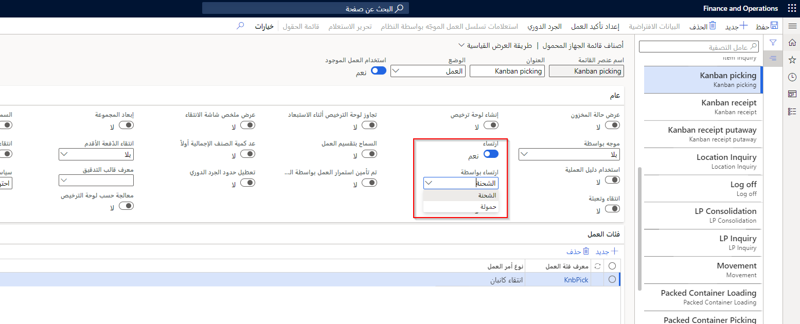
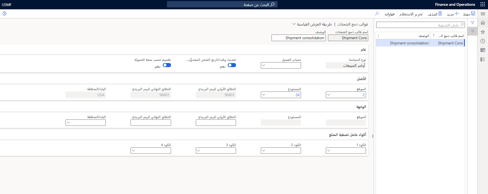
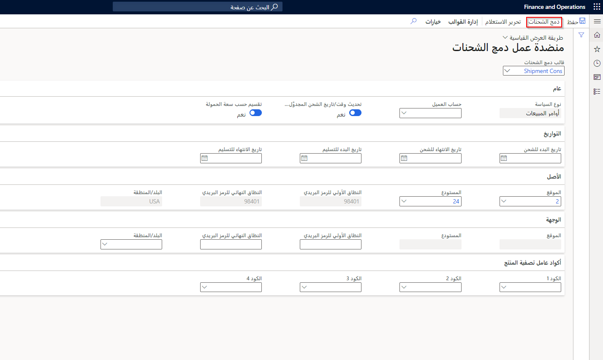

يعد انتقاء أمر المبيعات عملية ضرورية لأي عمل باستخدام جهاز محمول أو عميل الويب. بغض النظر عن الخيارات المختلفة المتوفرة، فإن عملية انتقاء أمر المبيعات هي نفس الشيء:

1. يتم إنشاء أمر المبيعات وإدخاله فِي النظام.
1. تم تأكيد الأمر فِي النظام.
1. في مرحلة ما، يكون الأمر جاهزاً بعد ذلك لإصداره للانتقاء. يمكن أن يكون هذا فِي نفس اليوم أو فِي أي وقت.

## التجهيز لانتقاء أوامر المبيعات

يمكنك تكوين قالب العمل لتخطي خطوة التجهيز باستخدام زوج انتقاء وإيداع واحد فقط.

في عمليات المستودعات الأكثر تعقيداً، يمكنك استخدام عمليات تجهيز متعددة. على سبيل المثال، يمكن أن تكون عمليات التجهيز المتعددة مفيدة بعد انتقاء الأصناف من المستودع وتتطلب عملية تعبئة معقدة لأصناف الاختتام بالفقاعات للشحن.

بعد اختتام الأصناف بالفقاعات، يتم تجهيزها عند باب الرصيف للتحميل. باستخدام هذا المثال، يمكنك إنشاء ثلاثة أزواج انتقاء وإيداع لتتبع حركة الصنف من خلال الخطوات المختلفة:

-   يقوم زوج الانتقاء والإيداع الأول بنقل الصنف خارج موقع الانتقاء وإلى موقع التعبئة.

-   يقوم زوج الانتقاء والإيداع الثاني بنقل الصنف خارج موقع التعبئة وإلى موقع التحميل.

-   يقوم زوج الانتقاء والإيداع الأخير بنقل الصنف من مواقع التحميل وإلى شاحنة أو خارج المستودع الخاص بك.

تحتاج إلَى تكوين قالب عمل باستخدام أزواج الانتقاء والإيداع الصحيحة، وإنشاء توجيهات الموقع للإشارة إلَى أنه يجب وضع الأصناف فِي مواقع التعبئة والتحميل، على التوالي. سيتم بعد ذلك ربط توجيهات الموقع هذه بقالب العمل للإشارة إلَى المكان الذي يجب وضع الأصناف فيه. عند تكوين أصناف القائمة لانتقاء أمر المبيعات، تتوفر بعض الخيارات الإضافية لمساعدتك فِي إدارة عملية التجهيز.

*الارتساء* هو مفهوم يسمح للمستخدم بتجاوز موقع التجهيز أو التحميل؛ سيتم توجيه جميع عمليات الإيداع المفتوحة اللاحقة إلَى موقع التجهيز الجديد أو موقع التحميل. 

يمكنك العثور على خيار **الارتساء** فِي صفحة **أصناف قائمة الأجهزة المحمولة‬**. في حالة تعيين شريط تمرير **الارتساء** إلَى **نعم**، ثم يمكن للمستخدم تحديد الإرساء حسب الشحنة أو حمل العمل.
إذا كان الإرساء حسب الشحنة، فسيتم تغيير عمليات الإيداع المفتوحة اللاحقة لنفس الشحنة أو حمل العمل إلَى الموقع الجديد لتلك الشحنة.
إذا كان الإرساء حسب حمل العمل، فسيتم تغيير عمليات الإيداع المفتوحة اللاحقة إلَى الموقع الجديد لتلك الحمولة.

## انتقاء أوامر المبيعات باستخدام الجهاز المحمول

يمكن إجراء انتقاء أمر المبيعات باستخدام الجهاز المحمول بعد إصدار الأمر إلَى المستودع وإنشاء العمل. سيُمكّن هذا أي مستخدم لديه الأذونات المناسبة من استخدام القائمة فِي الجهاز للوصول إلَى خيارات الانتقاء.

ضع فِي اعتبارك الخطوات التالية لعملية الانتقاء:

1.  إنشاء أمر المبيعات.

2.  تأكيد أمر المبيعات.

3.  الإصدار لمستودع وإنشاء العمل.

4.  انتقاء أمر المبيعات.

فائدة أخرى لاستخدام تطبيق Warehouse Management للأجهزة المحمولة هي أنه يمكن للعامل إيقاف مهمة يعمل عليها حالياً، لمعالجة مسألة أكثر إلحاحاً. لا تُفقد أي معلومات عند إيقاف مهمة مؤقتاً، ويمكن إرجاعها فِي أي وقت لإكمالها.

على سبيل المثال، إذا ظهر عامل فِي موقع محدد كجزء من عملية انتقاء المبيعات ووجد أن العنصر المحدد غير موجود، فلن يتم التخلي عن المهمة ببساطة. يسمح تطبيق الأجهزة المحمولة لعامل المستودع بإيقاف المهمة التي كانوا يعملون عليها حالياً لبدء مهمة ثانوية، مثل تشغيل تدفق استعلام عن العناصر لمعرفة ما إذا كان هناك موقع آخر يحتوي على الصنف. هذا يقلل من أي أوجه قصور يمكن أن يسببها عامل آخر يحتمل أن يقوم بالمهمة ويعيد تشغيل نفس عملية الانتقاء. عند تحديد موقع وتجديد الصنف، يمكن استئناف المهمة الأصلية لعملية انتقاء المبيعات، ولن يتم فقد أي معلومات. 

## نظرة عامة عَلى بند انتقاء العمل
تعمل ميزة **نظرة عامة عَلى بند الانتقاء** عَلى تمكين عمال المستودعات من عرض والاختيار من قائمة بجميع بنود العمل المتعلقة بمهمتهم الحالية. تساعد هذه القدرة العمال على تحسين تسلسل الانتقاء. 

توفر الميزة خيارات تحل محل الزر **تخطي** القياسي الذي يتيح للعمال التنقل عبر الخطوط واحدًا تلو الآخر، بترتيب ثابت. لإعداد هذه الميزة وتكوينها، راجع [إعداد عنصر قائمة جهاز محمول لتوفير نظرة عامة عَلى بند انتقاء](/dynamics365/supply-chain/warehousing/pick-line-overview/?azure-portal=true).

## سياسات دمج الشحنات

تسمح ميزة سياسة دمج الشحنات بالتكوين المرن للدمج الآلي للشحنة فِي وقت إصدار الدُفعة لأوامر المبيعات أو التحويل. يمكن تحديد السياسات فِي صفحة **إدارة المستودعات > الإعداد > إصدار إلَى المستودع > سياسات دمج الشحنات**. تحتوي السياسات على استعلامات لتحديد مدى قابليتها للتطبيق ومجموعة قابلة للتعديل من الحقول التي تقود قرار تجميع خطوط التحميل على مستوى الشحن تلقائياً عند الإصدار إلَى المستودع. عند إعداد سياسة جديدة، يمكنك تشغيل تبديل **الدمج مع الشحنات المفتوحة** للسماح بدمج الشحنات الجديدة مع الشحنة المفتوحة الموجودة بالفعل. بالإضافة إلَى ذلك، خيار إنشاء الإعداد الافتراضي.

يمكن العثور على خيار تحديد الشحنة المدمجة حسب نوع سياسة أوامر المبيعات أو أوامر التحويل، أو العميل والموقع، على **إدارة المستودعات > الإعداد > إصدار إلَى المستودع > قوالب دمج الشحنات**.

عند إصدار أوامر المبيعات والتحويل إلَى المستودع، يتم إصدارها وتصبح متاحة للدمج. في **إدارة المستودعات > الشحنات > جميع الشحنات** هناك خيار لدمج الشحنات عن طريق تحديد دمج الشحنات.

يمكن أيضاً إدارة الشحنات يدوياً فِي **إدارة المستودعات > إصدار إلَى المستودع > منضدة عمل دمج الشحنات‬**. حدد القالب الذي تم إعداده مسبقاً، ثم حدد **دمج الشحنات**.

## الرسوم المرئية لأحمال العمل الصادرة

توفر ميزة **الرسوم المرئية لحمل العمل الصادر‬** عرضًا مرئيًا قابلاً للتخصيص لأحمال العمل الصادرة فِي المستودع، بحيث يمكن مراقبة التقدم فِي عمل الانتقاء وعرضه عَلى شاشات أداء المستودع.

يمكنك إنشاء مخططات مخصصة لأحمال العمل تراقب تقدم العمل الحالي والعمل المتبقي. يمكنك إنشاء عروض متعددة، وتصفية البيانات للتركيز عَلى العناصر الأكثر أهميةً، وإعداد التحديث التلقائي حسب الحاجة. 

لمعرفة المزيد حول كيفية إعداد الرسوم المرئية لأحمال العمل الصادرة، راجع [الرسوم المرئية لأحمال العمل الصادرة](/dynamics365/supply-chain/warehousing/outbound-workload-visualization/?azure-portal=true).

