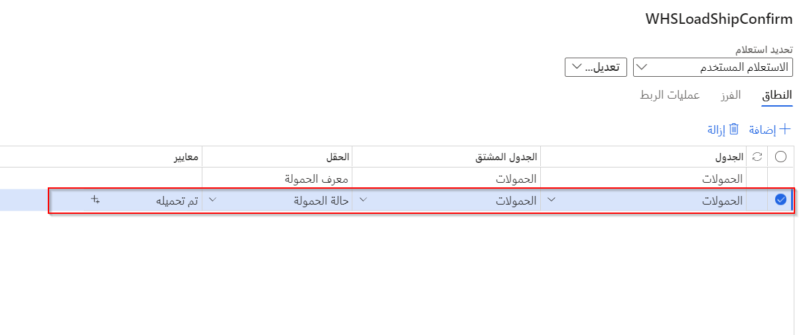
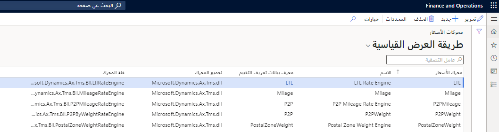

تبدأ العملية الصادرة في إدارة المستودعات عندما يتم اختيار بنود أوامر البيع أو النقل، وإنشاء أوامر الإخراج والشحنات.

## تأكيد الشحنات الصادرة من وظائف الدُفعات
يمكنك إعداد وظائف دُفعات لأحمال العمل الجاهزة للشحن التي تؤكد الشحنات الصادرة تلقائياً. يقوم النظام بتشغيل عملية تقوم بتحديث شحنات أوامر التحويل لبنود أحمال العمل المتعلقة بأوامر التحويل. ومع ذلك، لتحديث التكاليف الصادرة المرتبطة بأوامر المبيعات، يجب على المشغل تشغيل تحديث قسيمة تعبئة المبيعات يدوياً من حمل العمل.

#### تمكين ميزة تأكيد الشحنات الصادرة من الوظائف الدُفعية
لاستخدام هذه الميزة، اطلب إضافتها إلى نظامك. يمكن للمسؤولين استخدام مساحة عمل إدارة الميزات للتحقق من حالة الميزة وتمكينها كما هو مطلوب. تظهر الميزة كما يلي:

- **الوحدة** - إدارة المستودعات
- **اسم الميزة** - تمكين تأكيد الشحنات الصادرة من الوظائف الدُفعية

### معالجة الشحنات الصادرة
عند تمكين ميزة **تأكيد الشحنات الصادرة من الوظائف الدُفعية‬**، استخدم الخطوات التالية لإعداد وظيفة دفعية مجدولة لتشغيل تأكيد الشحن الصادر لأحمال العمل الجاهزة للشحن:

1.  انتقل إلى **إدارة المستودعات > المهام الدورية > معالجة الشحنات الصادرة**.
2.  عندئذٍ يتم فتح مربع الحوار **تأكيد الشحنة**. في علامة التبويب السريعة **السجلات المراد تضمينها**، حدد **عامل التصفية**.
3.  يتم فتح مربع الحوار محرر الاستعلام. في علامة التبويب **النطاق**، أضف صفاً بالقيم التالية:
    - **الجدول** - تحميل
    - **الجدول المشتق** - تحميل
    - **الحقل** - حالة التحميل
    - **المعايير** - تم التحميل

      

4.  حدد **موافق** للرجوع إلى مربع الحوار **تأكيد الشحنة**.
5.  في علامة التبويب السريعة **تشغيل في الخلفية**، قم بتعيين **معالجة الدُفعات‬** إلى **نعم**.
6.  في علامة التبويب السريعة **تشغيل في الخلفية**، حدد **تكرار**.
7.  يتم فتح مربع الحوار **تحديد التكرار**. قم بتعيين جدول التشغيل حسب الحاجة لعملك.
8.  حدد **موافق** للرجوع إلى مربع الحوار **تأكيد الشحنة**.
9.  حدد **موافق** في **تأكيد الشحنة** لإضافة الوظيفة الدُفعية إلى قائمة انتظار الدُفعات.

## القوائم وأصناف القائمة الصادرة

لاستخدام الوظائف الصادرة في الجهاز المحمول، يجب أولاً إنشاء أصناف القائمة والقوائم. استخدم الإجراء التالي لتكوين تلك الأصناف في صفحة **أصناف القائمة**.

1. تحديد وضع العمل
1. استخدام العمل الموجود
1. الموجّه بواسطة المستخدم/الموجّه بواسطة النظام
1. فئة العمل

## شحن طرد صغير (SPS)
عند شحن أوامر المبيعات الفردية عبر شركات الشحن التجارية، تتوفر ميزة لشحن الطرود الصغيرة (SPS). عند تمكين Supply Chain management، يمكنها أن تتفاعل مباشرةً مع شركات الشحن من خلال واجهات برامج التطبيقات (APIs). العمل مع شركة الشحن الخاصة بك لإنشاء محركات أسعار؛ ثم عندما تكون جاهزاً للشحن، ترسل Supply Chain Management التفاصيل إلى شركة النقل، وستتلقى ملصق شحن وسعراً ورقم تتبع من شركة النقل. يُضاف سعر الشحن بعد ذلك إلى أمر المبيعات كتكلفة ويمكن طباعة الملصق باستخدام لغة برمجة Zebra ‏(ZPL).

### تمكين SPS
لتمكين SPS، انتقل إلى مساحة عمل **إدارة الميزات** وقم بتمكينها على النحو التالي. لمزيد من المعلومات حول إدارة الميزات، راجع [نظرة عامة على إدارة الميزات](/dynamics365/fin-ops-core/fin-ops/get-started/feature-management/feature-management-overview/?azure-portal=true).
- **الوحدة** - إدارة النقل
- **اسم الميزة** - شحن الطرود الصغيرة

### محركات الأسعار
لاختبار وظيفة SPS، يجب عليك تنزيل محركات أسعار العرض التوضيحي من GitHub. لتحميل محركات أسعار العرض التوضيحي التي قدمتها Microsoft، اتبع الخطوات التالية:

1.  على GitHub، قم بتنزيل [مكتبة الارتباط الديناميكي (DLL) لمحرك أسعار العرض التوضيحي](https://github.com/microsoft/Dynamics-365-FastTrack-Implementation-Assets/tree/master/SCM/SPS/?azure-portal=true).
2.  على خادم Supply Chain Management، احفظ ملف DLL في مجلد **\AOSService\PackagesLocalDirectory\ApplicationSuite\bin**.

لمزيد من المعلومات حول نشر محركات الأسعار، راجع [إنشاء محرك جديد لإدارة النقل](/dynamics365/supply-chain/transportation/create-new-transportation-management-engine/?azure-portal=true) و[محركات إدارة النقل](/dynamicsax-2012/appuser-itpro/set-up-transportation-management-engines/?azure-portal=true).

بعد إنشاء محركات الأسعار ونشرها، ستحتاج إلى تكوينها. لتكوين محرك الأسعار، اتبع الخطوات التالية:

1.  انتقل إلى **إدارة النقل > إعداد > محركات > محرك أسعار**.
2.  في جزء "الإجراءات"، حدد **جديد** لإضافة صف إلى الشبكة.
3.  في الصف الجديد، قم بتعيين الحقول التالية:
    - **محرك التقييم** – أدخل اسماً فريداً لمحرك الأسعار.
    - **الاسم** – أدخل وصفاً مختصراً لمحرك الأسعار. 
    - **معرف بيانات التقييم** – حدد الأساس الذي يجب استخدامه لحساب سعرك. على سبيل المثال، قد يتم حساب السعر الخاص بك على أساس المسافة. 
    - **تجميع المحرك** - أدخل اسم ملف حزمة DLL التي قمت بنشرها. إذا كنت تستخدم محرك أسعار العرض التوضيحي، فأدخل **TMSSmallParcelShippingEngine.dll**.
    - **فئة المحرك** – أدخل اسم الفئة التي تم إنشاؤها لمحرك الأسعار الخاص بك. إذا كنت تستخدم محرك أسعار العرض التوضيحي، فأدخل **TMSSmallParcelShippingEngine.SmallParcelShippingRateEngine**.

    
 
4. بعد ذلك، يجب عليك إعداد شركات النقل وسياسات تعبئة الحاويات وملفات تعريف التعبئة والعميل لاستخدام ناقل SPS. راجع [شحن الطرود الصغيرة](/dynamics365/supply-chain/warehousing/small-parcel-shipping/?azure-portal=true) لسيناريو يوضح كيفية تكوين الوظائف الإضافية ويتحقق من صحة العملية باستخدام أمر مبيعات.

