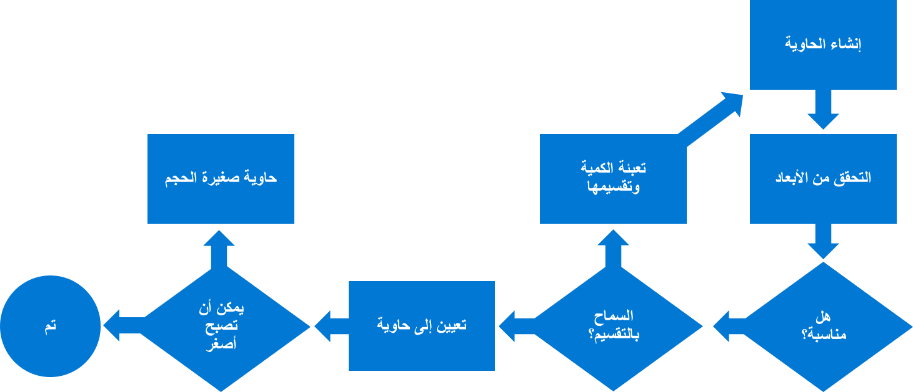
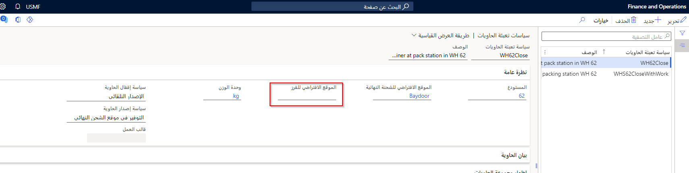

## إعداد التعبئة اليدوية

تمثل الحاويات الهيكل المادي الذي يتم فيه تعبئة المنتجات أثناء الشحن، ويمكنك تتبع معلومات الحاوية في النظام. يمكن أن يكون هذا مفيداً أثناء تخطيط النقل، خاصةً عندما يتم حساب رسوم الشحن بناءً على الحاويات.

في Supply Chain Management، يمكنك الاطلاع على عدد الحاويات المستخدمة في الشحنة وأنواع الحاويات المستخدمة والأبعاد الفعلية، مثل الحجم والوزن الإجمالي، قبل الشحن.

يمكنك استخدام أنواع الحاويات لإنشاء أوصاف للحاويات، بما في ذلك القيم القصوى لأبعاد الحجم الفعلي وسعة الوزن. عندما تتم معالجة موجة حاويات، يتم إنشاء الحاويات بناءً على معلومات نوع الحاوية.

توفر Supply Chain Management عملية تعبئة تسمح لك بالتحقق من صحة المنتجات وتعبئتها في حاويات.

في هذه العملية، يقوم عمال المستودعات باختيار المنتجات من مواقع التخزين ونقلها إلى محطة التعبئة، حيث يقومون بفحص كميات الأصناف وأنواعها ثم تخصيصها للحاويات المناسبة. عندما تكون الحاوية معبأة بالكامل، يمكنهم إغلاقها ونقلها إلى المساحات الخارجية. في هذه المرحلة، تكون المنتجات جاهزة للشحن.

## إنشاء ملف تعريف الموقع للتعبئة اليدوية

لإنشاء ملف تعريف موقع للتعبئة اليدوية، انتقل إلى **إدارة المستودعات > الإعداد > ملفات تعريف مواقع المستودعات** وأنشئ سجلاً جديداً بنوع الموقع المراد تعبئته.

يمكنك اختيار السماح بتتبع لوحات الترخيص في محطة التعبئة، والحصول على مخزون سلبي، والاختيار من بين الاصناف المختلطة، واختيار الأصناف ذات حالات المخزون المختلطة. يمكنك أيضاً اختيار القدرة على تنفيذ الجرد الدوري. وبدلاً من ذلك، يمكنك تمكين **التحقق من الرقم** للتحقق من معرفات الموقع والتأكد من مطابقتها مع تلك الموجودة في قائمة الانتقاء أو قوائم الإيصالات. يمكنك أيضاً ربط ملف تعريف التعبئة بمستخدم.

توفر علامة التبويب السريعة **خلط أبعاد المنتج المسموح بها** خيار تخزين أبعاد مختلفة لصنف ما في المستودع، معبأة في صندوق للتعبئة، ومعبأة في صندوق به المزيد من نفسه للتعبئة المتداخلة.

## عملية التعبئة اليدوية

تبدأ عملية التعبئة اليدوية بأمر، مثل أوامر البيع أو التحويل. يتم بعد ذلك إنشاء العمل من خلال موجة تحتوي على محطة التعبئة كموقع وضع. يجب أن تكون توجيهات الموقع وقوالب العمل قد تم إعدادها بالفعل للأصناف المراد نقلها إلى موقع التعبئة عند اكتمال عمل الانتقاء. بعد ذلك، يستخدم عامل المستودع جهازاً محمولاً لاختيار العناصر ونقلها إلى موقع التعبئة.

بعد أن تكون الأصناف في موقع الحزمة، يمكن للمستخدمين فتح صفحة **التعبئة** وإنشاء حاوية، وتعبئة الأصناف، وإغلاق الحاوية، ووزن وطباعة المستندات، إذا لزم الأمر. تستمر هذه الدورة لكل شحنة.

عندما تقوم بتعبئة متغيرات المنتج مثل الحجم أو اللون أو العناصر التي يتم التحكم فيها بشكل تسلسلي أو الأصناف الخاضعة للتحكم في الدُفعة، يعرض النظام مربع حوار حيث يمكنك تحديد أبعاد المنتج. أثناء تعبئة الأصناف، يتم تحديث حقلي **الكمية المعبأة** و **الكمية المتبقية** في بنود الأصناف. عندما تتم تعبئة البند بالكامل، ستتم إزالته من علامة التبويب **فتح البنود**. ومع ذلك، لا يزال بإمكانك عرضها في علامة التبويب **جميع البنود**.

في كل إجراء تعبئة، تتحقق Supply Chain Management من الوزن الإجمالي للصنف داخل الحاوية مقابل الوزن الأقصى المسموح به للحاوية. يتم تحديد هذه الأوزان للحاوية في نوع الحاوية.
إذا تجاوز الصنف حد الوزن، فسيمنع النظام تعبئته في الحاوية وسيظهر خطأ. ومع ذلك، لا تتحقق Supply Chain Management من صحة الأبعاد المادية الأخرى مثل الحجم والعرض والارتفاع والطول، مما يمنح عمال المستودعات المرونة أثناء التعبئة لضبط هذه الأبعاد على المنتج.

على سبيل المثال، قد يكون عامل التعبئة قادراً على ضغط الأصناف في الحاوية، على الرغم من أن الحجم يتجاوز القيمة الاسمية.

في أي وقت أثناء التعبئة، يمكنك عرض جميع الحاويات التي تم إنشاؤها للشحنة وتعديلها عن طريق تحديد زر **الحاويات المتوفرة** في صفحة **التعبئة**. عندئذ يتم عرض صفحة **الحاويات**، حيث يمكنك تنفيذ الإجراءات التالية:

-   اضبط كمية الصنف في إحدى الحاويات. سيتم تحديث الأصناف غير المعبأة في صفحة **لتعبئة** حتى تتم تعبئتها مرة أخرى.

-   احذف الحاويات الفارغة.

-   أعد فتح الحاويات المغلقة.

-   قم بإلغاء البيان.

## إعداد التعبئة في حاويات 

تنشئ التعبئة في الحاويات التلقائية الحاويات وأعمال الانتقاء للشحنات عند معالجة الموجة. لإعداد التعبئة في الحاويات، يجب عليك أولاً إنشاء أنواع الحاويات، والتي تحدد الخصائص المادية للحاويات. يمكنك استخدام أنواع الحاويات لتعبئة أصناف المخزون في أنواع معينة من أحجام العبوات، مثل الصناديق أو المنصات.

بعد ذلك، تحتاج إلى إنشاء مجموعات حاويات لها نفس نوع الحاوية مثل أعضائها. على سبيل المثال، يمكن أن تتضمن مجموعة الحاويات أنواع حاويات لها أبعاد حجم متشابهة. 

تحدد المجموعة التسلسل الذي تتم فيه تعبئة الحاويات ونسبة تعبئة كل حاوية.

تحتاج أيضاً إلى إنشاء قوالب إنشاء الحاوية التي تحدد قواعد النقل بالحاويات، على سبيل المثال، قواعد خلط المخزون واستراتيجيات التعبئة الأخرى. يجب عليك إنشاء واحد أو أكثر من قوالب الموجات لإنشاء أعمال الانتقاء للحاويات.

لا يمكن استخدام أنواع الحاويات المستخدمة في التعبئة اليدوية للتعبئة بالحاويات. إذا كنت تستخدم كلتا العمليتين، فيجب عليك إعداد نوع حاوية واحد لاستخدامه في التعبئة اليدوية وآخر للتعبئة التلقائية في الحاويات.

## عملية التعبئة في الحاويات

عندما تقوم بإصدار أمر المبيعات إلى المستودع، بناءً على إعداد قالب الموجة، يجب أن تقوم هذه الخطوة بإنشاء الموجة ومعالجتها ثم تحريرها. 

يُظهر الرسم التخطيطي التالي معايير الاستعلام.

عند معالجة الموجة، تقوم التعبئة في الحاويات بتنفيذ الخطوات التالية:

1.  تم تحديد قالب إنشاء الحاوية مع رمز خطوة موجة مطابق في قالب الموجة.

2.  يتم التحقق من معايير الاستعلام الخاصة بالقالب لبند التوزيع الحالي. إذا تم الوفاء بالمعايير، يبدأ النظام في معالجة القالب لإنشاء حاويات لبند التوزيع.

3.  عندما يتحقق النظام من الأبعاد المادية، مثل الطول والعرض والارتفاع لصنف واحد، يتم فحص أعلى وحدة له أولاً مقابل الحد الأقصى للقيم المسموح بها والتي تم تعيينها في نوع الحاوية.

4.  إذا كان الطول والعرض والارتفاع يفي بالمتطلبات، يقوم النظام بعد ذلك بفحص وزن وحجم جميع الأصناف الموجودة في خط التخصيص مقابل الحد الأقصى للوزن والحجم المسموح به للحاوية. يأخذ النظام أيضاً في الاعتبار النسبة المئوية لاستخدام الحاوية التي تم تعيينها في مجموعة الحاويات.

5.  في حالة تعيين خيار **هل يُسمح بالتقسيم؟** في قالب إنشاء الحاوية إلى **نعم**، يمكنك تقسيم الأصناف إلى عدة حاويات.

6.  سيستمر النظام في محاولة تقليص الحجم إلى حاويات أصغر محددة في مجموعة الحاويات. عندما يفشل نوع الحاوية في تقليص حجمه، فإنه سيتوقف عن محاولة تقليص الحجم أكثر من ذلك. لذلك، يجب ترتيب أنواع الحاويات في المجموعة حسب الحجم.

7.  إذا تم الوفاء بمعايير الاستعلام، ولكن فشل قالب إنشاء الحاوية في حزم بند التوزيع (على سبيل المثال، بسبب عدم الوفاء بالبعد)، فسيظل البند معيناً للحاوية.
    ومع ذلك، سيتم تمكين حقل **الحاوية بها أخطاء** للحاوية التي تم إنشاؤها، مما يشير إلى فشل عملية التعبئة في الحاويات. ستتلقى أيضاً خطأً في النظام.

8.  استمر في نفس العملية في بند التوزيع التالي حتى لا يكون هناك المزيد من الأصناف المراد تعبئتها.
 
## الفرز الصادر

يوفر إنشاء المنصة النقالة القدرة على فرز الحاويات المعبأة إلى منصة نقالة بعد معالجتها في محطة التعبئة وإنشاء تدرج هرمي للتعبئة. يتم بعد ذلك نقل المنصات النقالة إلى موقع مرحلي باستخدام أمر عمل يلتقط جميع الحاويات المعبأة. بعد أن يقوم المستخدم بتعيين المعايير لكل منصة نقالة وجهة، سيتم توجيه جميع الحاويات المعبأة اللاحقة إلى المنصة النقالة المطابقة. عندما تكون المنصة النقالة ممتلئة، يتم إغلاق موضع المنصة النقالة ويتم نقلها إلى وحدة واحدة.

من أجل إعداد الفرز الصادر، يجب تحديد ما يلي:

- قالب فرز صادر في **إدارة المستودعات والمحاسبة > الإعداد > التعبئة** 

- تم تحديد سياسة التعبئة في الحاويات في **الحاويات > سياسة التعبئة في الحاويات** مع **الموقع الافتراضي للفرز**.

    

- تعيين موضع الفرز الصادر ضمن **التعبئة والتعبئة في الحاويات**
